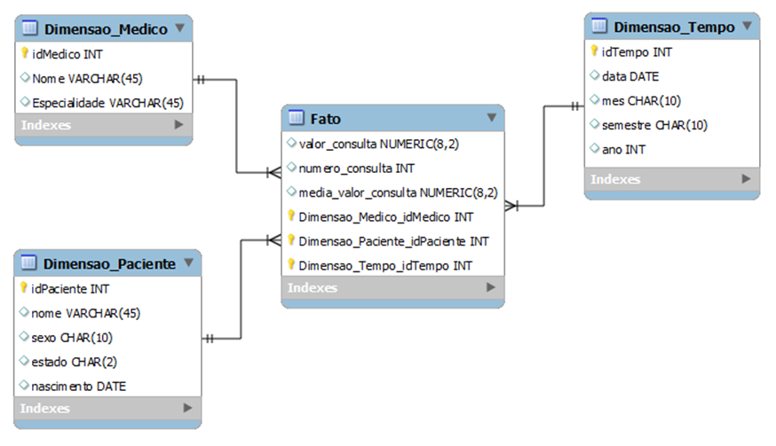
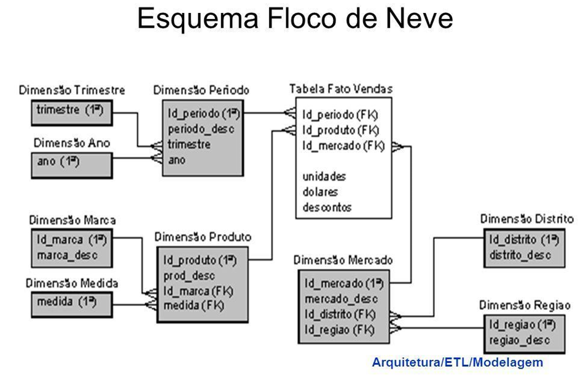
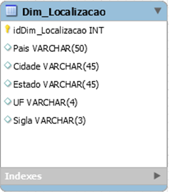
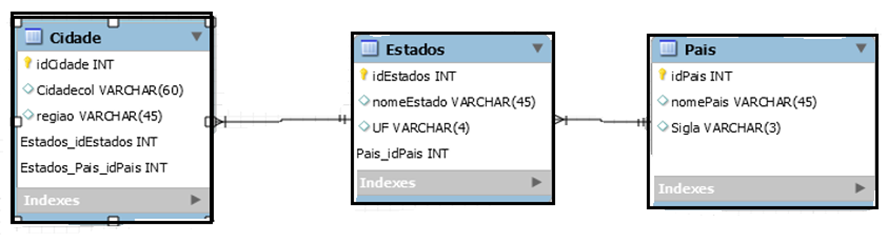
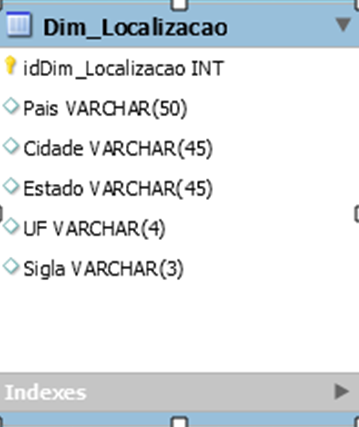
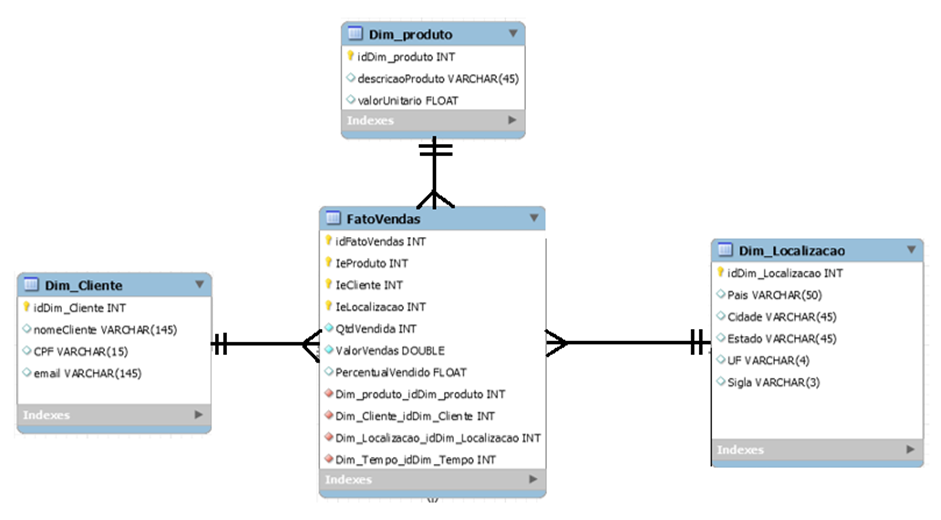
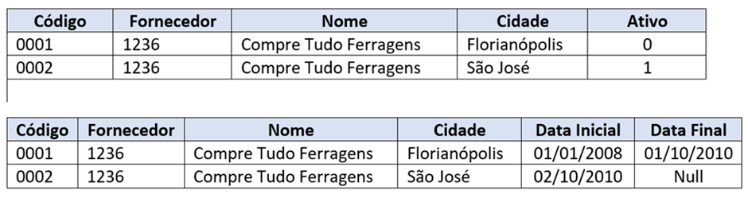
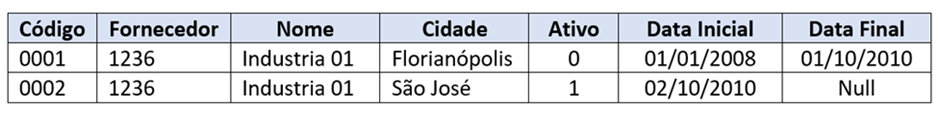

# Modelagem de Dados para Data Warehouse

1) Modelagem de Dados Multidimensional

A modelagem multidimensional é utilizada para simplificar o modelo de dados relacional em um modelo mais simples e enxuto, baseado em poucos relacionamentos com tabelas dimensões e tabelas fatos.

Para que isso aconteça é necessário realizar um processo de desnormalização dos dados. Esse processo tem como objetivo simplificar as tabelas em uma só dimensão, que será relacionada diretamente a uma nova tabela fato, como por exemplo, uma situação com a seguinte estrutura de dados:

Uma tabela chamada País está associada a uma tabela chamada Estados, que por sua vez está relacionada com a tabela Cidade e assim, sucessivamente, formando dois ou mais relacionamentos. Nesse caso, ficamos responsáveis por desnormalizar estes dados e colocar todas as informações em uma só dimensão chamada de Dim_Localização. Esta nova tabela conterá todos os dados existentes nas outras 3 antigas e ficará responsável por se organizar em um só relacionamento com a tabela fato.

Para que isso aconteça é necessário escolher entre alguns modelos, tais como: Modelo Estrela de Ralph Kimball e o Modelo Floco de Neve do Imon. Tais arquiteturas serão detalhadas logo em seguida neste material.

## Modelo Estrela (Star)

O esquema estrela ou star foi criado por Ralph Kimball e é considerado um dos esquemas mais utilizados no mercado para construção de base de dados do tipo Data Warehouse. Durante este processo é importante destacar que as tabelas ficam distribuídas de forma igualitária como tabelas dimensões e tabelas fatos, e o relacionamento só pode acontecer entre as tabelas dimensões e as tabelas fatos, não existe relacionamento direto entre uma tabela dimensão e uma outra tabela dimensão, os relacionamentos só podem existir de tabelas dimensões para tabelas fatos diretamente.

A Figura 1 apresenta a estrutura geral de um esquema estrela:

Uma das características do esquema estrela é a aplicação da desnormalização dos dados de forma intensa, para garantir que as novas tabelas dimensões criadas, possam ser utilizadas e relacionadas diretamente com a tabela fato. Este processo visa garantir apenas uma junção de dados diretamente entre as tabelas dimensões e/ou tabelas fatos diretamente.

Com o modelo estrela é possível também realizar as associações entre tabelas fatos com outras tabelas fatos, formando assim uma constelação de tabelas baseadas no esquema estrela.

Segue o exemplo de uma aplicação de Data Warehouse para uma clínica "Policlínica":

Neste modelo foram criados da seguinte forma: primeiro criamos uma tabela Dim_Médico onde ficam as informações sobre os médicos que estão realizando as operações, depois identificamos também uma dimensão chamada paciente e uma outra dimensão chamada Dim_Tempo. Durante o processo, as chaves primárias são compartilhadas pela tabela fato_atendimento, que possui uma chave candidata e construída especificamente para fazer o atendimento dos pedidos de prontuário eletrônico.

## Modelo Floco de Neve (Snow Flake)

O modelo floco de neve é uma variação do modelo estrela e tem como características principal a possibilidade de existir alguns relacionamentos entre tabelas dimensões entre si.

Este processo ajuda no sentido de modelos mais normalizados de dados, porém prejudica no sentido da performance dos dados. Também é importante otimizar as consultas e eliminar as dependências e isso muitas vezes não é tão fácil de fazer do dia para a noite.

O esquema floco de neve é uma variação do esquema estrela, no qual todas as tabelas de dimensão são normalizadas na terceira forma normal (3FN), ou seja, são retirados das tabelas os campos que são funcionalmente dependentes de outros campos que não são chaves. Recomenda-se utilizar o esquema floco de neve apenas quando a linha de dimensão ficar muito longa e começar a ser relevante do ponto de vista de armazenamento.

Já a performance das consultas realizadas pelos usuários tende a diminuir devido ao aumento de junções, e essa sim pode ser crucial para o sucesso do ambiente, visto que os usuários esperam retornos cada vez mais rápidos.

Uma das observações mais importantes sobre o esquema floco de neve, está relacionado a performance das consultas, que tendem a serem mais lentas para grande volumes de dados históricos. Durante esse processo é recomendado utilizar o esquema Estrela, porém, se seu Data Warehouse é pequeno e não tem a possibilidade de crescimento maior durante o ano inteiro, nesse caso, é possível adotar o esquema snowflake.

## Tabelas dimensões e Tabelas fato

Neste tópico, vamos destacar as características de tabelas dimensões e tabelas fato. Estas características são importantes para realizar o processo de desnormalização, pois em grande parte das ações as tabelas dimensões são formadas pelo processo de desnormalização dos dados.

#### Tabelas dimensões

Como vimos anteriormente, as tabelas dimensões são fundamentais para o desenvolvimento de soluções analíticas dentro do processo de Business Inteligence e do próprio Data Warehouse, pois durante o processo de modelagem de dados elas devem trazer as principais características sobre os dados, visto que vão servir de fonte de dados para muitas das ações relacionadas ao modelo multidimensional.

Logo de cara, além dos campos tradicionais baseados nas regras de negócio, também será necessário acrescentar alguns novos campos, tais como: data_inicio e data_fim do processo, e também às vezes um campo de flag tipo booleano para realizar o fim dos dados histórico na base.

Cada dimensão é definida com uma única chave primária. Essa chave é a base da integridade referencial no relacionamento com a tabela fatos. Uma tabela de dimensão é composta também de atributos, os melhores atributos são textuais e distintos, e devem consistir em palavras reais, evitando-se o uso de códigos e abreviações. Esses atributos descrevem as linhas na tabela de dimensão. A figura 5 mostra um exemplo de tabelas Cidade, Estados e País. No processo de desnormalização é necessário transformar os dados em uma única dimensão chamada Dim_Localização.

Quando implementamos o processo de transformação das tabelas Cidade, Estados e País em uma única tabela.

Nesse caso, é importante relatar que a Dim_Localização carrega todas as informações dos dados de País, Cidade, Estado, UF e siglas das unidades das federações.

Este processo visa, principalmente, garantir o número pequeno de junções e consultas a outras tabelas. Será necessário unificar todas as tabelas em um só lugar e garantir o processo de busca e localização direta das informações.

O Modelo dimensional é bastante utilizado durante o tempo e garante performance durante o processo de modelagem de dados.

#### Tabelas fatos

Tabelas fatos são as tabelas que recebem todos os relacionamentos das outras tabelas dimensões. Uma das principais características das tabelas fatos é possuir apenas as chaves estrangeiras e alguns campos numéricos baseados nas tabelas dimensões, como: qtd_vendas, perc_producao, qtd_unidades, valor_vendas, valor_total.

#### Modelagem Avançada tipo 2 e tipo 6

Slowly Changing Dimension, são os grupos de dados que se alteram em ciclos de tempo maiores e de maneira irregular. Por exemplo, um cliente muda de cidade e passa a realizar compras com outro representante da empresa em sua nova região.

As Slowly Changing Dimension são diferenciadas em dois tipos ou níveis principais: o tipo 2 e o tipo 6.

- Tipo 2: envolve o registro de informações históricas, guardando uma linha para cada versão dos registros, fazendo o uso das chaves substitutivas (surrogate keys).

- Tipo 6: utiliza as duas metodologias do tipo 2 combinadas - coluna de data inicial e um campo booleano que determina se o registro está ativo ou não.

