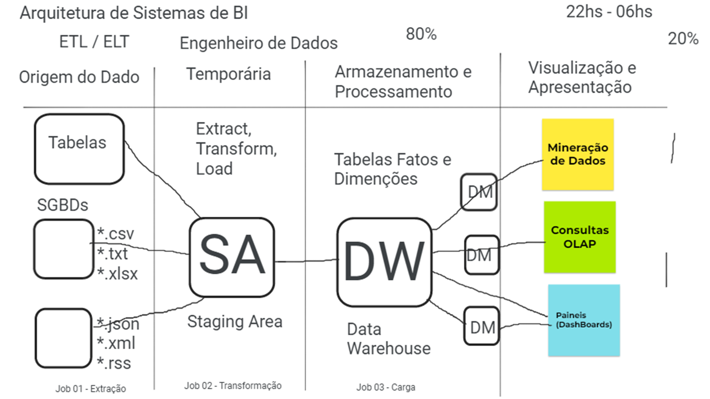
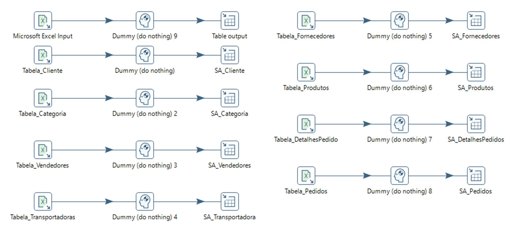
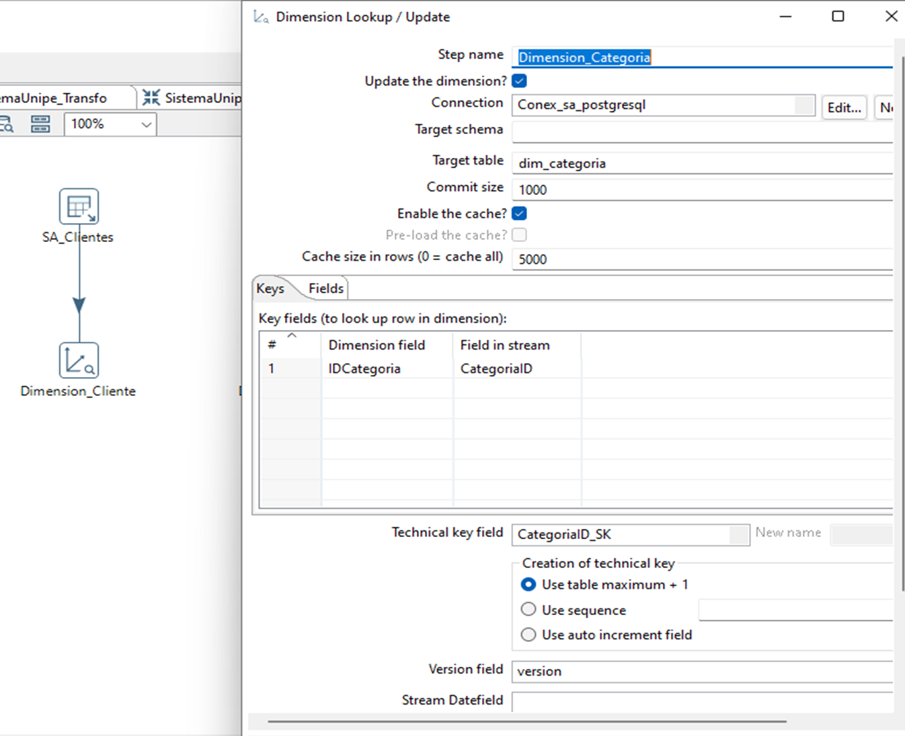
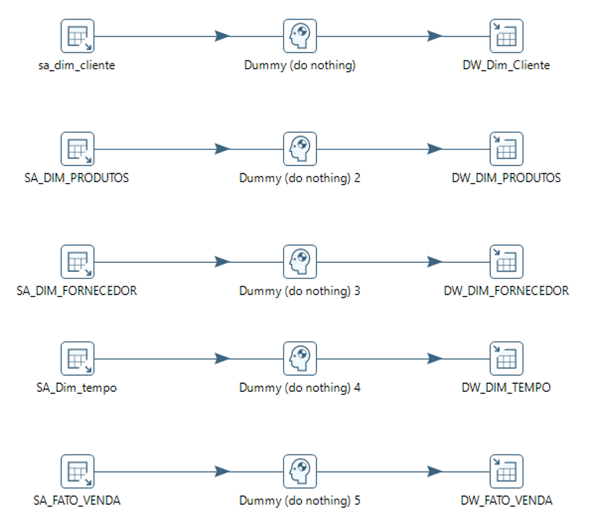
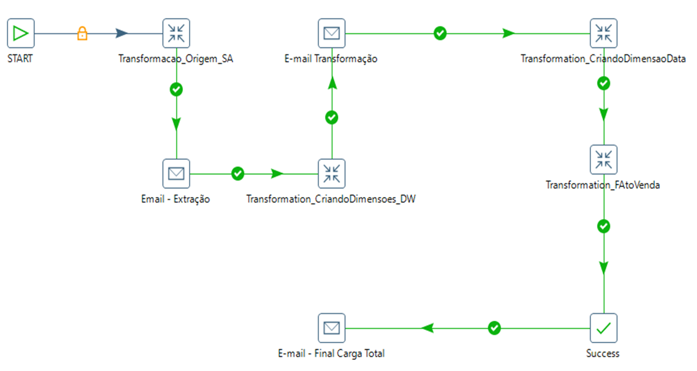
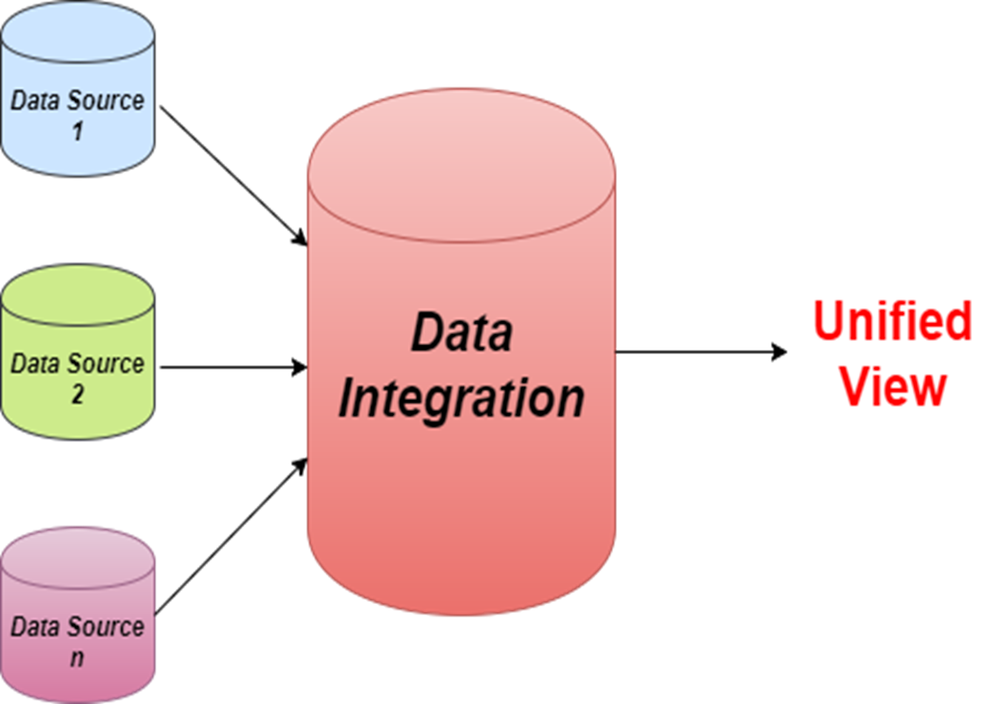

# Arquiteturas de Soluções para Data Warehouse

1) Arquitetura básica de Data Warehouse

## Data Warehouse

O termo Data Warehouse quer dizer armazém de dados, pois é um repositório de dados integrado orientado a assunto e não tem características de volatilidade, ou seja, os dados não são perdidos ao longo do tempo.

## Orientados por assunto

Geralmente, trabalhamos orientado a assunto dentro do Data Warehouse, isso é feito baseado no modelo de dados multidimensional, como por exemplo, DW de Logística, DW de sistemas de Vendas e DW de Administração.

## Integrado

Existe uma necessidade natural de integração de dados de um Data Warehouse. A coleta de dados e integração deles em dados em uma Staging Area e, posteriormente, garantindo a integração completa no Data Warehouse é natural e faz parte das arquiteturas de soluções baseadas em DW.

## Não volátil

Quando falamos de dados não voláteis, significa que em um Data Warehouse não é mais possível alterar os dados, nem mesmo deletar os dados. É uma característica natural em bancos de dados com Data Warehouse.

Durante esse processo, as informações são carregadas através de Jobs de ETL em Staging Area e, posteriormente, armazenados no modelo estrela ou floco de neve no Data Warehouse.

## Elementos básicos de uma Arquitetura de Data Warehouse

## Fonte de dados

Quando selecionamos as fontes de dados, é possível identificar as origens baseadas em dados estruturados de tabelas de bancos de dados relacionais e/ou arquivos e planilhas existentes nas empresas.

## Datastage e/ou Stage Area

A Stage Area é uma área de trabalho intermediária, que tem a função principal de armazenar os dados, temporariamente, para realizar as transformações, entre as quais: limpeza, agregação, combinação e duplicação de informação, visando preparar para o uso no Data Warehouse.

## Data Mart

O Data Mart nada mais é do que um DW menor orientado a assuntos de forma mais agregada, tendo uma visão de negócio classificado para atender à um conjunto menor de tabelas e atributos, visando praticamente atender o negócio de forma mais específica e simples, voltado para a necessidade de várias visões.

## Data Mining

Quando falamos em Data Mining, quer dizer mineração de dados, pois é a necessidade de trabalhar com grandes massas de dados onde existem muitas correlações entre os dados que não são perceptíveis facilmente.

2) Soluções com ETL e Transformações

## Extração, Transformação e Carga de Dados

O coração de uma aplicação de Data Warehouse é a parte de automação do processo de ETL (Extração, Transformação e Carga). Estas soluções têm como objetivo automatizar o fluxo de dados da origem até chegar no DW. Durante este processo, é importante salientar que 80% do esforço na construção de uma solução de Data Warehouse passa pelo processo de ETL.

## Extração de Dados

Uma das primeiras etapas do processo de ETL é a etapa de extração dos dados. Isso acontece durante a captura dos dados de origem e cópia dos mesmos para uma base de dados intermediária chamada de SA (Stage Area).

O processo de extração de dados acontece da seguinte forma: os arquivos estão no formato *.xls e *xlsx, pois são planilhas do excel com dados de clientes, produtos, pedidos, categorias, vendedores e fornecedores.

Utilizando os componentes de entrada, estes dados são copiados através de Table Inputs, logo em seguida, são copiados por dummy e transferidos para componentes do tipo Table Output. Neste caso, a saída será gravada em um banco de dados relacional do tipo MySQL.

## Transformação de Dados

Na segunda etapa, é possível transformar as tabelas originais que estão na Staging Area em tabelas dimensões. Estas tabelas vão ser transformadas através de componentes específicos do Pentaho, entre eles estão: Dimension Lookup e Combination Lookup.

Através dessa imagem é possível ver as características da criação da dimensão categoria com dados de data de início e fim, juntamente com limite de extração dos dados relacionados.

Esse processo é bastante útil, pois agiliza a construção das tabelas dimensão durante o fluxo de transformação dos dados, isso é feito para todas as tabelas dimensões do modelo estrela identificados nesse problema negócio.

3) Rotinas de Jobs e Automação de processos

Para executar as operações é necessário a criação de rotinas de Jobs que automatizam o processo de extração, transformação e carga de dados.

Antes de comentarmos como será realizado o processo, é importante concluir o mesmo através da etapa de Carga de Dados no DW.

Nesse passo, é importante reforçar que todas as tabelas dimensões e fatos foram geradas inicialmente dentro da própria SA (Staging Area), e durante esse processo as dimensões e fatos são geradas de forma mais rápida, inicialmente no próprio banco local.

Conforme a figura 4, copiamos as tabelas do modelo dimensional da SA para o DW, esse procedimento é feito através de uma cópia direta das tabelas geradas de um lugar para o outro.

Lembrando que o DW é um novo banco de dados relacional criado para armazenar um grande volume de dados históricos.

Após o término, os dados estarão prontos para serem consumidos pelas ferramentas OLAP, ferramentas de análise de dados do tipo: Qlik Sense, Power BI e técnicas de uso de mineração de dados.

## Automação do processo com Jobs

O uso de Jobs em processo de automação de rotinas ETL são bastante usados no dia a dia, garantindo assim, que os fluxos de transformação de carga de dados possam ser executados de forma mais livre e contínua. Esse procedimento é importante e define de forma simples a execução , invlusive com o envio de e-mail com as informações em cada etapa do processo.

Nessa etapa é possível visualizar todos os fluxos de execução, desde a carga dos dados de origem, passando pelas transformações na Staging Area e, posteriormente, gravando os dados finais no DW, lembrando que, cada etapa, será enviado um e-mail para o responsável pelas execuções.

Essas tecnologias de integração de dados são discutidas na figura 6.

A visão unificada das bases de dados é significativa para trabalhar com a federação de dados e vários bancos de dados locais e remotos. O uso de IA em projetos remotos é fundamental.
