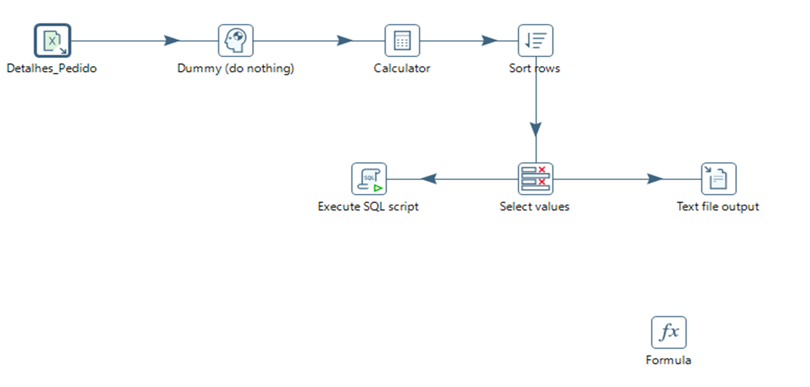
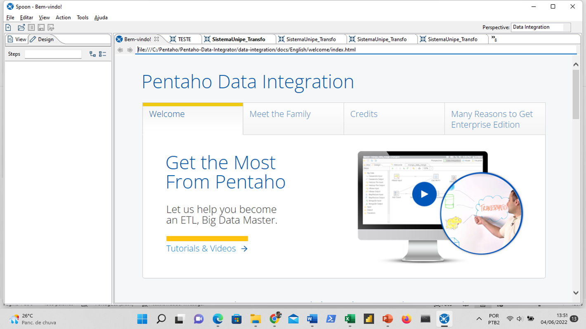
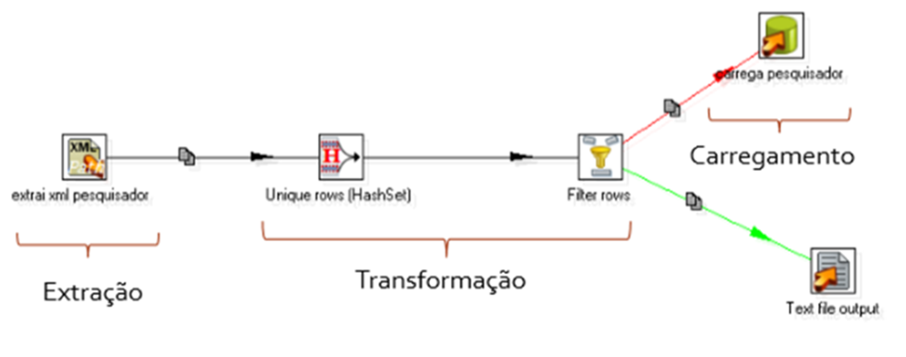
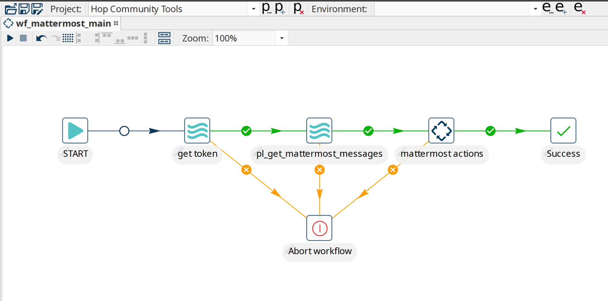
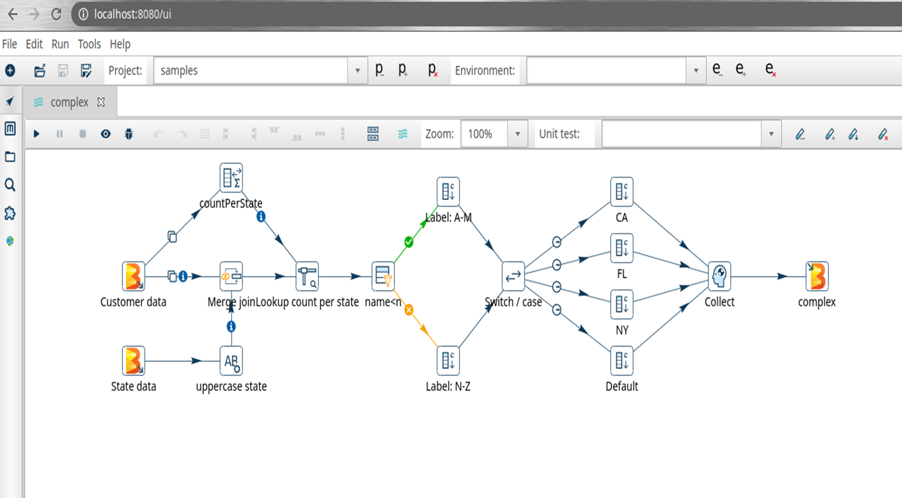
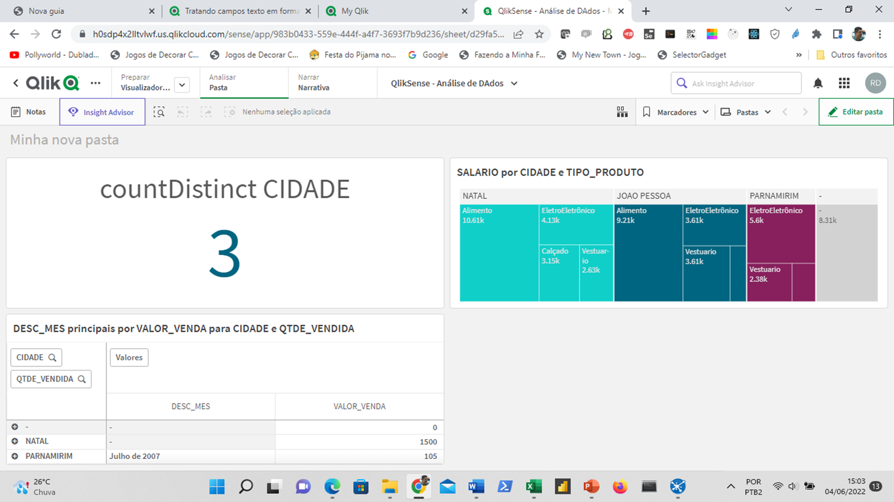
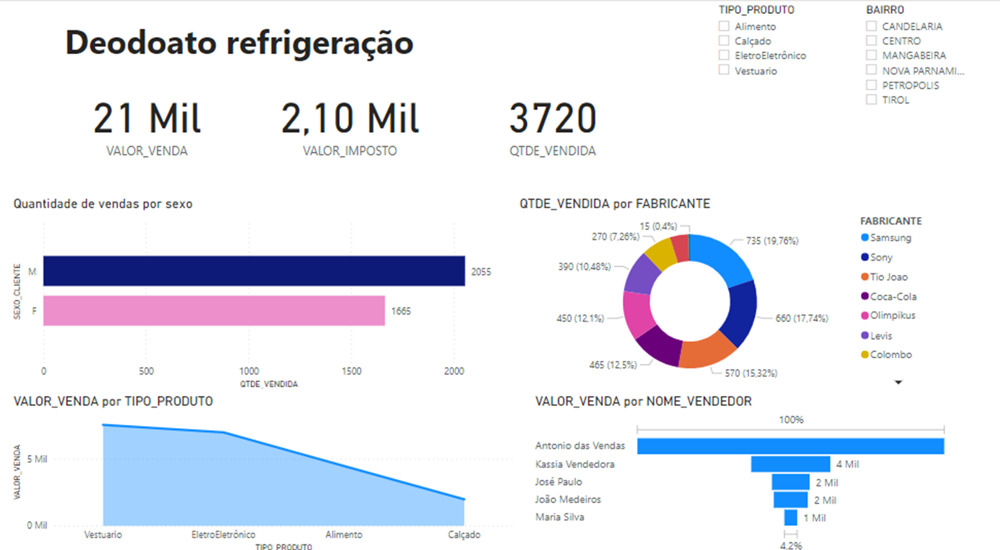
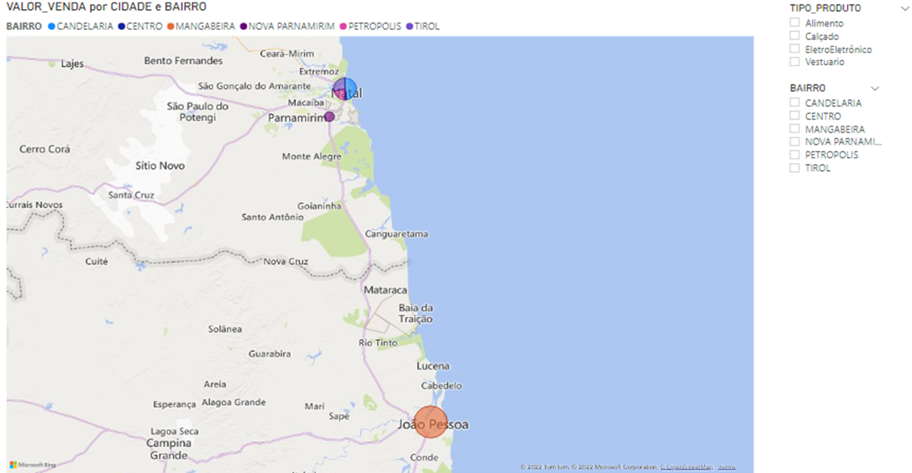

# Processos e Ferramentas Envolvidas para Data Warehouse

## Processo de coleta de dados

O processo de coleta de dados é importante de ser definido logo no começo do projeto, visando identificar quais os tipos serão coletados e suas estratégias de execução, como por exemplo: se os dados são estruturados, não estruturados e/ou semiestruturados.

A extração de dados está relacionada diretamente ao pipeline de dados, que são fluxos onde a entrada de um dado é processada e enviada para outro processo.

1) **Data Engineering:** Este fato é responsável pela coleta, limpeza, conformidade, compartilhamento e transformação de dados com a ingestão da informação.

2) **Data Preparation:** Nesta etapa é possível realizar efeitos e transformações sobre os dados, além de reparar as informações com novas regras de negócio e qualificação de dados.

3) **Analytics:** Nesta última etapa é possível visualizar os dados, agregados e prontos para serem consumidos através de ferramentas de data discovery.

## Pré-processamento das informações

O pré-processamento de dados é responsável pela execução das rotinas de limpeza, validação, transformação e remoção de erros e organização.

Para garantir estas transformações e pré-processamento de dados, vamos ilustrar uma ação:

Neste exemplo foi coletado dados de uma tabela chamada: detalhes do pedido, em seguida adicionamos o componente calculator para realizar o cálculo do campo de pedido com juros, depois utilizamos o componente Sort rows para ordenar os dados e com o Select Values para selecionar os campos de saída. Estes campos serão exibidos no final no componente Text file output. Este processo de pré-processamento de dados é comum nas rotinas ETL.

### Ferramentas de ETL: Pentaho, Apache Hop

Neste tópico, vamos trabalhar com as principais ferramentas de ETL/ELT existentes no mercado, o Pentago Data Integrator e o Apache Hop são ferramentas bastante semelhantes e têm como adoção e rápido aprendizado por profissionais que já utilizam uma e/ou outra.

### O Pentaho Data Integrator

Esta ferramenta é bastante utilizada pela comunidade em geral, pois existe uma versão comunitária e Open Source.

As principais características da ferramenta estão relacionadas diretamente aos processos de extração de dados, transformação de dados, carga de dados e processos baseados em especificações de execuções de tarefas em dados aplicados, incluindo também os módulos de Big Data, Estatísticas, Data Warehouse, Cryptography, BA Server, Experimental, entre outras.

Estes componentes são aplicados e podem ser executados em diversos ambientes para extrair informações, transformar dados e por fim, carregá-los.

### O Apache Hop

É uma plataforma aberta destinada a criação de estruturas de ingestão de dados, tratamento de dados e fluxos de dados em diversas plataformas, como bancos de dados relacionais, arquivos, bancos de dados NoSQL e dados na nuvem.

#### Características

- Base de dados: carga de grandes bases de dados, independente de plataforma on-premise ou cloud.

- Data Warehouse: possui componentes ou plugins que facilitam a construção de projetos de Data Warehouse, como Dimensões, controle de versionamento, criação de chaves artificiais, etc...

- Integração: permite a integração e construção de projetos para populares bases heterogêneas, persistência em diversos bancos de dados.

- Tratamento de dados: A perfilização é o tratamento de dados de forma personalizada.

A interface dos componentes é bem parecida com os componentes do Pentaho, inclusive com nomenclaturas bem parecidas, componentes de entrada (input), componentes de saída (output), transformações de dados, merge e integrações.

Entre os fluxos de operações disponíveis está o conector com várias fontes de dados, incluindo banco de dados relacionais e não relacionais do tipo MongoDB, MySQL, Postgres, entre outros...

Os fluxos de Jobs podem ser iniciados através do sistema operacional e/ou em ferramentas de agendamento online, facilitando assim as estruturas de execução de dados, principalmente os processos produtivos de ações profissionais das empresas, em ambientes de homologação e produção.

## Ferramentas Qlik Sense e Power BI

Quando é preciso apresentar os dados para os gestores tomarem decisão é necessário desenvolver um projeto utilizando uma ferramenta data discovery, descoberta de dados quando se trata de soluções que envolvem BI.

Entre as principais ferramentas que existem no mercado podemos destacar essas duas, o Qlik Sense e o Power BI, ambas são soluções bastante utilizadas no mercado e que podem ser classificadas como bem maduras e confiáveis.

### O Qlik Sense

O Qlik Sense possui características de ferramenta de Data Discovery baseadas em dados locais e/ou em nuvem. Possui diversos conectores, inclusive para ferramentas atuais e em cloud como Presto DB, Rest APIs, MySQL, Postgres, etc.

#### Tecnologia Associativa

O Qlik Sense tem uma tecnologia exclusiva baseada no modelo associativo, com uma solução automatizada para identificação dos dados e associação baseada em chaves primárias e secundárias baseadas nos nomes e tipos de dados idênticos.

#### Soluções de Inteligência Artificial com Qlik Sense

O Qlik Sense usa IA com análises de dados gerados por IA, além de criação de visões automatizadas e o uso de Machine Learning com análises preditivas.

### Microsoft Power BI

O Power BI é uma das ferramentas líderes do mercado voltado para o desenvolvimento de soluções de Business Intelligence e Analytics. Atualmente, é considerada uma das mais fáceis de aprender e de usar.

Uma das vantagens dessa solução é que possui uma versão desktop e uma versão web, onde é possível desenvolver as mesmas análises em tempo real. Para acessar o ambiente de nuvem da Azure, é necessário possuir uma conta permissão de uso.

Além de painéis de gráficos, KPIs, relatórios dinâmicos, relatórios estatísticos e mapas, é possível adicionar outros componentes não instalados de forma padrão. Todos os componentes e plugins adicionais existentes são desenvolvidos por uma comunidade bem ativa.

Diversos conectores e fontes de dados são possíveis de incorporar ao Power BI, temos entre eles: conectores para Bancos de Dados Relacionais (JDBC e ODBC), plataformas de nuvem Youtube, Google Analytics etc.

Outra característica bem interessante do Power BI é a integração com Google Maps na construção de Mapas  e objetos de geolocalição, basta possuir na sua base de dados informações sobre:

- Latitude e longitude

- Países, Estados, Cidades, Bairro etc...

A geolocaliazação é feita automaticamente, incluindo um raio de até 10 metros de circunferência de localização deles.
