# Práticas com Microsoft Power BI

## Apresentação da Ferramenta Power BI

O Microsoft Power BI é uma das ferramentas de data Discovery mais conhecidas do mercado. Ela possui diversas funcionalidades, além de ser considerada uma das melhores ferramentas.

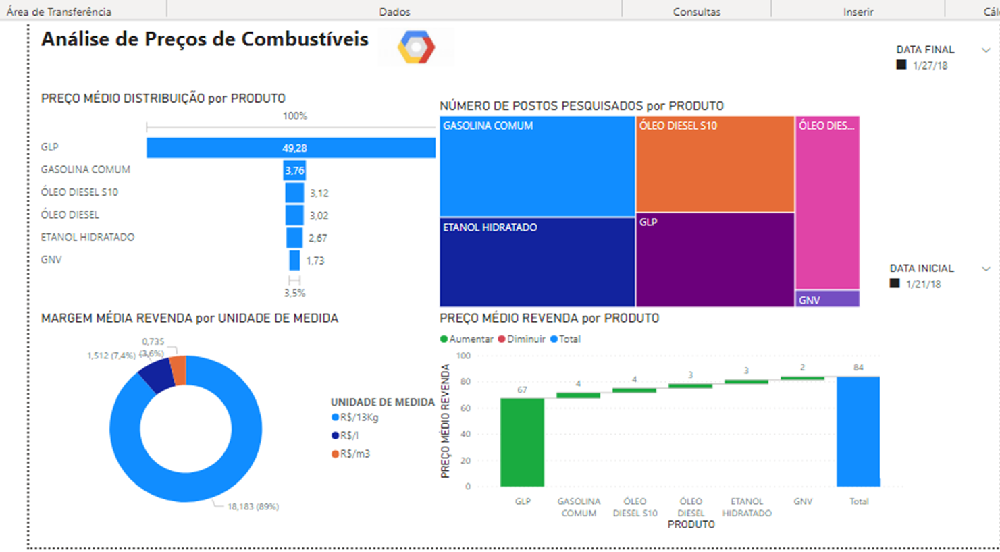

A interface da ferramenta é composta por painéis de visualização de componentes gráficos e outros tipos, além de campos de visualização de tabelas e dados. Na parte central da tela fica localizado a área de desenho dos gráficos e relatórios da aplicação, nela é possível apresentar diversas formas de análise de dados, já na parte lateral esquerda são visualizados 03 ícones com as informações sobre os gráficos e relatórios visão inicial, depois área de tabelas e campos com informações sobre os registros. Por fim, a área de modelagem de dados com o diagrama ER, tabelas e seus relacionamentos baseados no auto relacionamento.

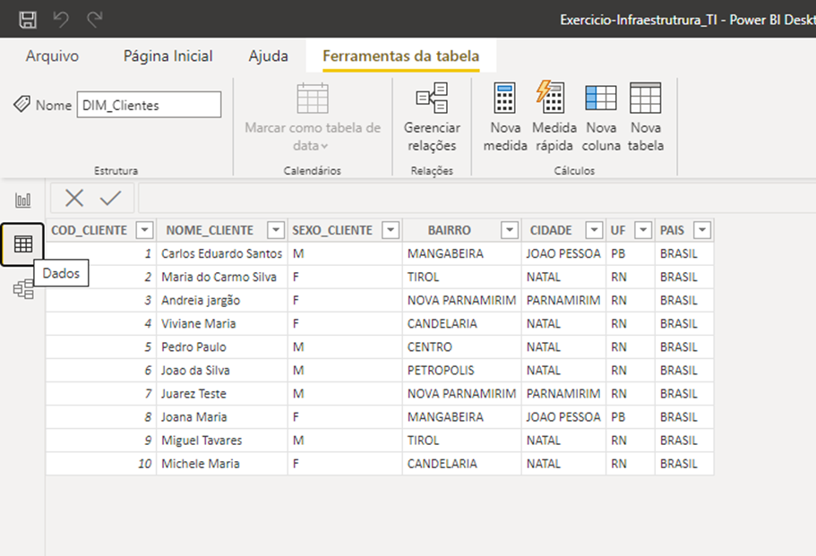

Nessa visão, é possível realizar algumas transformações sobre os dados existentes nas bases de dados, entre elas: Gerenciar relações, criar novas medidas, criar nova coluna, criar uma nova tabela e criar medida rápida. Estes recursos são importantes para manipular os dados, definir e construir diversas transformações sobre eles.

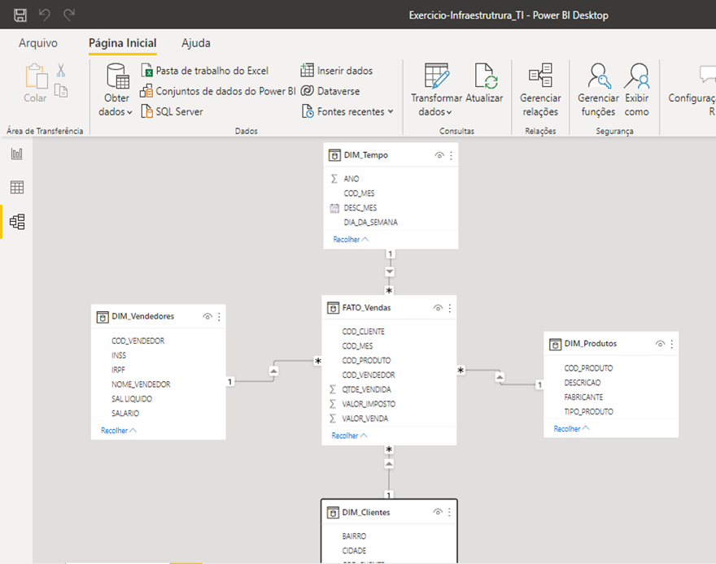

Este módulo é responsável por apresentar os dados em forma de diagrama de banco de dados, nela é parecida com valores específicos: Tabelas, relacionamento do tipo: 1… N, N…n, etc. Como também são vistos os principais campos e nomes das tabelas no formato dimensional com tabelas fatos e dimensões

## Coleta de dados, estruturados, não estruturados

O Microsoft Power BI possui diversos conectores para diversas fontes de dados relacionais, não relacionais, não estruturados, tais como: SGBD Mysql, Postgresql, Oracle, arquivos CSV, arquivos TXT entre outros.

Além disso, é possível realizar a coleta de dados não estruturados. Dados estruturados são classificados de forma mais simples e direta pela ferramenta, a quantidade de conectores e fontes de dados existente no Power bi é uma coisa bem interessante, saindo do ponto de vista de 10 a mais de 30 conectores dos mais diversos possíveis, entre os quais posso citar: Bancos de Dados Relacionais, Power Platform integrações, Azure modelos de bancos em nuvem, serviços online, inclusive com conectores para fontes de dados diversas online com captura baseadas em stream de dados e/ou quase real time.

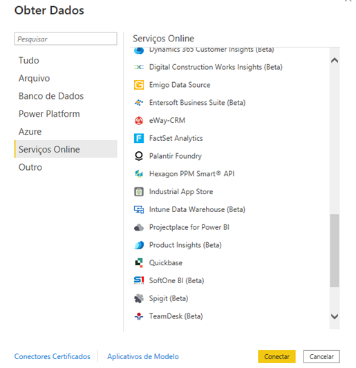

Neste caso, utilizamos os dados estruturados baseados em uma Planilha do Excel chamada: DwMilLinhas.xlsx. Esta planilha é composta com Dim_Cliente, Dim_produto, Dim_vendedor, Dim_tempo, Fato_Venda.

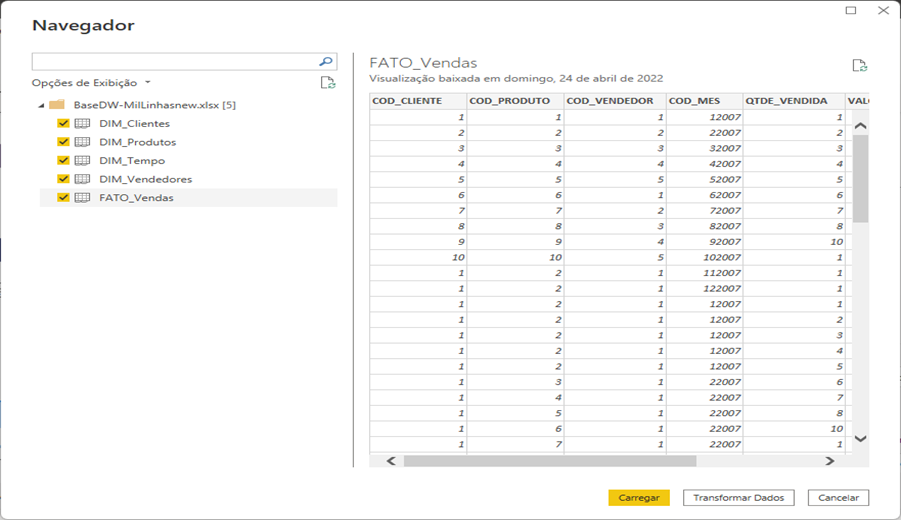

Nesta etapa, é possível selecionar não apenas 1 ou mais tabelas existentes no arquivo. Isso é necessário, principalmente, por conta dos relacionamentos baseados no modelo Estrela do DW.

## Transformação de dados e integração / Gráficos e KPIs

Existe um componente bastante utilizado para trabalhar com serviços REST API e APIs públicas baseadas, nós utilizamos a consulta VIA CEP.

Nessa consulta, foram pesquisadas as informações sobre o logradouro que tem a palavra Domingos, na localidade de Porto Alegre no Rio Grande do Sul.

Durante a execução, é possível verificar que essa API é utilizada não apenas por uma, mas sim, por várias aplicações no mercado por ser um serviço público de API REST.

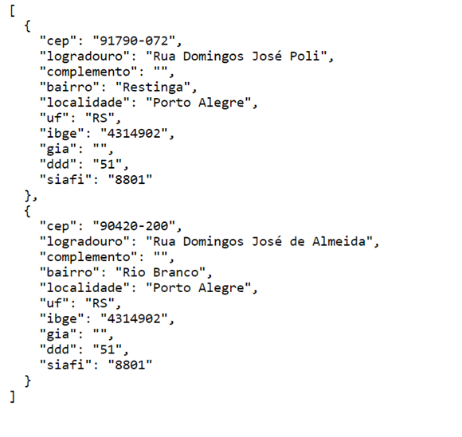

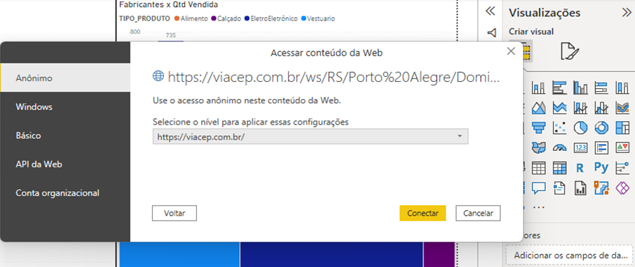

Para representar melhor as informações registradas no serviço REST API do Via Cep, o Power BI cria uma String de conexão que ficará responsável por conectar a fonte de origem da informação e, posteriormente, selecionar os dados dentro da ferramenta.

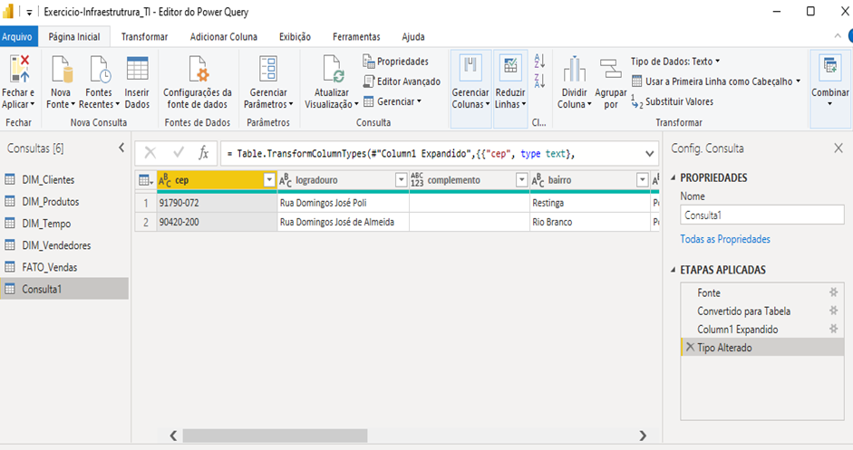

Utilizando os dados retornados na Figura 7, é possível verificar a parte de transformação dos dados através do Power Query Editor de Dados do Power BI, com ele é possível criar colunas, como também descrever as operações e validações dos tipos de dados de cada valor, como por exemplo, é possível transformar uma coluna do tipo String em Inteiro e vice-versa. Esse processo é muito importante e faz parte do tratamento de dados da solução.

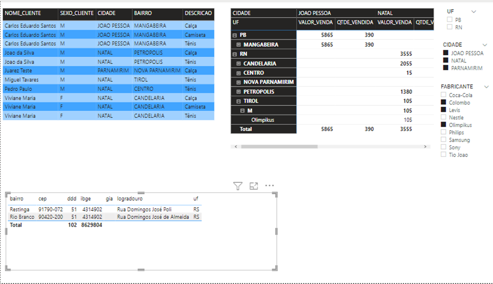

A nova estrutura de dados é adicionada ao projeto com o nome de Consulta1 e por ela é possível expandir os campos conforme mostra a figura 8. Vejam que são exibidos campos com o sinal de Somatório ao lado, isso quer dizer que estes campos são métricas e podem ser utilizados como funções de agregação, tais como: Soma, Count, Média, Max, Min, etc.

Os outros campos são informações categóricas e/ou objetos que podem ser exibidos juntos com as métricas em um relatório, gráfico e outro objeto qualquer.

## Construção de Mapas e Tabelas Estáticas e Dinâmicas

A visualização de dados fundamentada em georreferência é uma das técnicas mais utilizadas no mercado baseado em objetos do tipo: Mapas e afins.

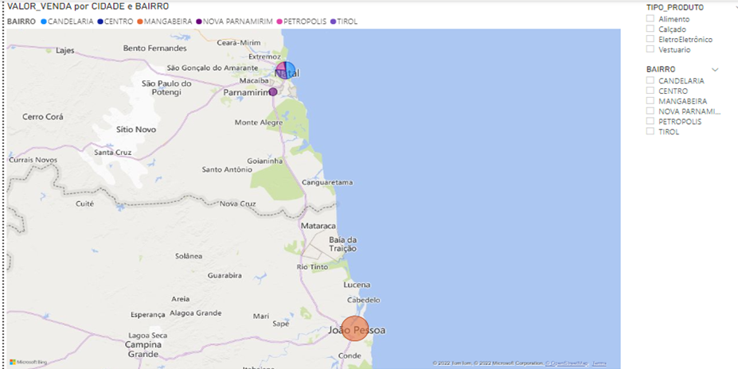

A figura 9 apresenta um mapa com informações sobre os estados, cidades e bairros. Isso é possível graças ao componente de Mapa do Power BI que identifica os pontos e traça uma rota de origem até o destino de forma automática.

Outros componentes bastantes utilizados são os relatórios estáticos e dinâmicos.

A partir desses relatórios é possível representar as informações através de Tabelas Estáticas e Dinâmicas. Os exemplos serão descritos abaixo para melhor identificação.

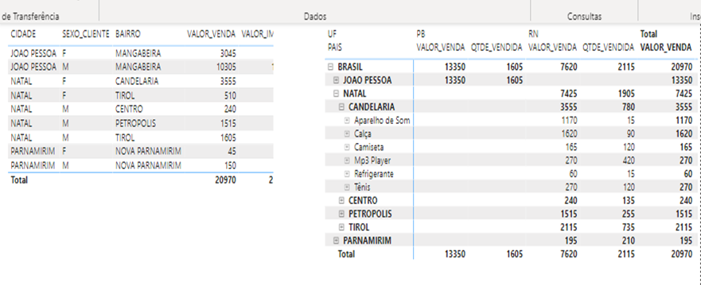

As Tabelas estáticas são construídas baseadas nos campos categóricos e numéricos do meu dataset. Estas informações são publicadas no formato de grid estático e variam de acordo com a seleção dos filtros nos objetos desta página.

Já os relatórios dinâmicos funcionam como uma lista drop down e ou roll up. É possível trabalhar com eles de cima para baixo e/ou de baixo para cima. Vejam que é necessário selecionar primeiro o país, depois os estados, cidades, bairros e etc., até chegar na granularidade desejada da informação.

## Publicação de painéis em ambientes de nuvem

O Microsoft Power BI possui uma versão de desenvolvimento baseado em SaaS, software como serviço em nuvem. Ele fica hospedado na Cloud (Microsoft Azure) e é disponibilizado para colaboradores que têm uma conta específica para desenvolvimento e publicações de painéis da Cloud.

O procedimento é bem simples, basta desenvolver o painel com todas as abas necessárias e depois de pronto -> Selecione o botão (Publicar) na parte superior direita do Power BI.

Será necessário informar o e-mail cadastrado na plataforma e depois digitar a senha de acesso. Feito isso aparecerá o seu Workspace (Selecione) e depois veja o resultado da operação.

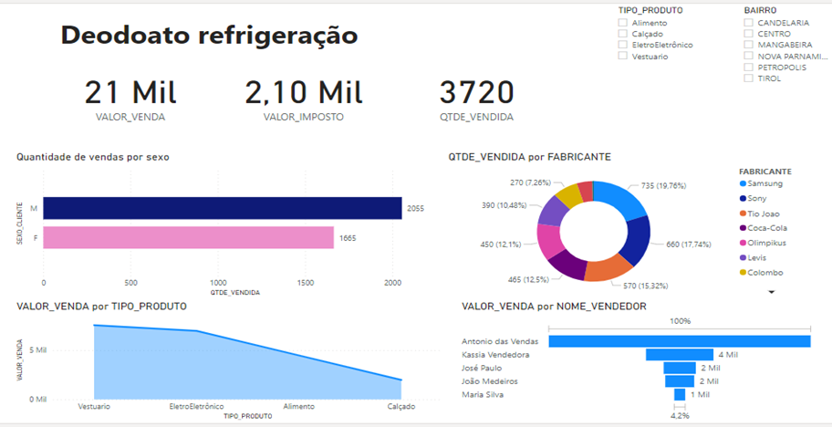

Pronto! O painel foi publicado na plataforma de nuvem da Azure (Microsoft) e está disponível para visualização através de navegadores da Internet e dispositivos móveis em geral.

Este processo de deploy (publicação) das aplicações de análise de dados é feito de forma rápida e eficiente para diversos tipos de empresa e organizações, visando distribuir de forma igualitária para o maior número de pessoas.
