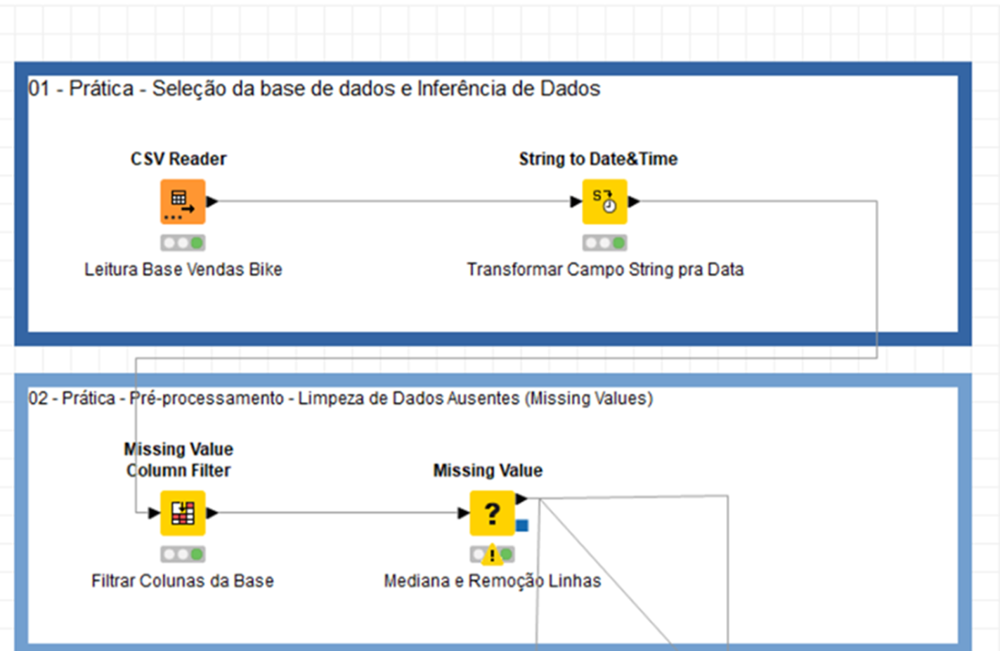

# Conceitos de Mineração de Dados

## O que é Mineração de Dados

Atualmente, é um termo bastante utilizado, principalmente, pelo crescimento de aplicações e sistemas que usam modelos de Machine Learning. A mineração de dados consiste no método de descoberta da informação associada em grandes conjuntos de dados. A mineração de dados usa análise estatística e matemática para derivar padrões com modelos de Machine Learning e tendências que existem sobre os dados.

Estes recursos são bastante utilizados pelas aplicações que usam sistemas com Inteligência Artificial, Machine Learning e Deep Learning.

### Qual a importância da Mineração de Dados?

Nos dias atuais, é considerada fundamental nos sistemas de informação web e mobile. nenhuma aplicação que se preze, atualmente, não tem um processo de análise descritiva e/ou analítica incorporada em sua solução.

O termo acesso a dados produzidos em escalas nos últimos anos vem crescendo de forma permanente e não-estruturados, e compõem mais de 85% dos dados. Porém, mais dados não significa melhor informação.

### A mineração de dados permite que você:

- Colete os dados importantes tanto estruturados como não-estruturados;

- Faça um pré-processamento dos dados, organizando e limpando os dados;

- Faça um bom uso dessas informações e analise os seus resultados;

- Defina o formato dos dados e agregação da informação para tomada de decisão.

Entre as técnicas mais utilizadas na mineração de dados, estão descritas a seguir de forma simples e objetiva: Análise descritiva, análise prévia, análise de outliers ou detecção de desvios, visualização de dados, descobrimento de padrões e regras de associação e classificação.

## As etapas da mineração de dados

A mineração de dados tem como objetivo oferecer informações legítimas sobre as pessoas, objetos e organizações para tomada de decisão. Por conta disso, é importante evidenciar a extração e a análise de dados deve passar por algumas etapas essenciais, que falaremos a seguir:

### Definição do problema de negócio.

É importante identificar, definir o problema de negócio e ser resolvido de forma rápida e simples, ou seja, sobre qual tema será realizada a pesquisa. Também é importante entender o que o negócio pretende fazer com base nas informações obtidas, por exemplo, aumentar as vendas em um e-commerce. Dessa forma, será possível definir quais as possibilidades de coleta desses registros.

### Preparação dos dados.

Esta etapa é fundamental no processo de mineração de dados, pois envolve selecionar os dados e fontes de origem. Basicamente coletar os dados e realizar a limpeza, transformação e agrupamento de informações, conforme a necessidade de negócio alinhada aos objetos da modelagem.

### Seleção do Algoritmo de Machine Learning.

Na fase do processo, selecionamos os algoritmos baseados nos modelos se o problema de negócio for resolvido com um problema de regressão, ou problema de classificação. E/ou se o problema for de agrupamento, selecionamos algoritmos diferentes para cada tipo de problema a ser resolvido. É importante ter uma experiência na seleção dos modelos e dos algoritmos selecionados, por exemplo: se o problema for de classificação é possível selecionar algoritmos do tipo: Árvore de Decisão, Random Forest, KNN, SVM, Naive Bayes, entre outros.

### Treinamento do Modelo de Machine Learning.

Nessa etapa, a base de dados é separada em 02 partes: 70% da base foi selecionada de forma aleatória e serão utilizados para o treinamento do modelo de Machine Learning, os outros 30% da base serão utilizados para fazer os testes e validações do modelo. Nesse momento, é necessário fazer também uma validação cruzada para validar os pontos no universo de dados da base de teste, visando generalizar ao máximo os resultados da predição dos modelos.

### Por fim, a etapa de Testes e Avaliação de Modelos.

Etapa responsável por realizar as operações baseadas em testes e validações dos modelos. Se o problema foi de classificação é possível utilizar métricas do tipo:

- Acurácia é conhecida também como o percentual de acertos em relação ao todo.

- Precisão é o grau de variação gerado por diferentes medições. Dessa forma, quanto mais for preciso um processo, menor será a variação entre os valores obtidos. Além dessas métricas existem outras também como curva roc e matriz de confusão, que são bastante utilizadas para avaliação dos modelos de Machine Learning.

## Ferramentas e Soluções de Mineração de Dados

Atualmente, existem diversas ferramentas e soluções para realizar o processo de mineração de dados, desde as que possuem um certo conhecimento de programação e as que não usam nenhuma linha de código. Vamos mostrar algumas dessas soluções:

A primeira solução apresentada será o Orange.

O Orange é uma excelente ferramenta de mineração de dados totalmente open source de fácil instalação e configuração. Baseada no modelo Drag and Drop é possível arrastar os componentes para a área de trabalho, e através dela criar as etapas de coleta, pré-processamento de dados, seleção dos algoritmos, treinamento e validação.

A segunda solução será o Knime

O KNIME é uma verdadeira solução de Plataforma integrada de Analytics. Ele possui mais de 500 componentes de análise, Big Data, Machine Learning, Data Warehouse, entre outros. Seu ponto forte é a usabilidade e a comunidade que é bastante atuante no desenvolvimento de novos e modernos componentes de software.

A característica principal é trabalhar com as tecnologias mais quentes de mercado incluindo: keras com tensor flow, python integrado com componentes R, Big Data Hadoop, HDFS, Spark e PySpark, entre outros.

A terceira solução / ferramenta Rapidminer.

O RapidMiner é uma ferramenta comercial que tem como objetivo realizar a mineração de dados, através de ferramentas gráficas e desenhos simples.

O RapidMiner é uma plataforma bem objetiva que transforma dados brutos em informação estratégica para tomada de decisão mais eficiente.

## Aprendizado de Máquina

O aprendizado de máquina é uma técnica bastante utilizada no mercado para reconhecimento de padrões, visão computacional e definições de medidas de estatísticas de análise e processamento de dados.

Além do uso de técnicas de estatística e matemática, que servem para definir novos padrões sobre os dados e as aplicações técnicas baseadas em dados, uma das técnicas mais aplicadas no mercado é o uso de fotos, vídeos e imagens para definir padrões.

É uma forma de construir modelos predefinidos de dados baseados em ML (Modelos) e, posteriormente, usar essas informações para tomada de decisão baseadas em dados.

## Modelos Supervisionados e Não Supervisionados

Atualmente, os modelos de aprendizado de máquina são bastante conhecidos e podem ser caracterizados em supervisionados onde existe a necessidade de um especialista de negócio para auxiliar no processo de rotulagem dos dados e definição da classe alvo.

Modelos não supervisionados que não precisam de um especialista de negócio, através das features de seleção é possível identificar alguns clusters de dados classificados de forma automática pelos algoritmos não supervisionados.

Existem dois métodos de aprendizado muito utilizados. São eles:

- Aprendizado supervisionado: consiste em exemplos rotulados. O algoritmo de aprendizagem recebe um conjunto de entradas junto com as saídas corretas correspondentes, e o algoritmo aprende comparando a saída real com as saídas corretas para encontrar erros. Em seguida, ele modifica o modelo de acordo.

- Aprendizado não supervisionado: basicamente é usado contra dados que não possuem rótulos históricos, ou seja, o sistema não sabe a “resposta certa”. O algoritmo deve descobrir o que está sendo mostrado e o objetivo é explorar os dados e assim encontrar alguma estrutura neles. O aprendizado não supervisionado funciona bem em dados transacionais.

- Aprendizado por reforço: essa opção é muitas vezes usada para a robótica, jogos e navegação. Com o aprendizado por reforço, o algoritmo descobre por meio de tentativa e erro quais ações geram as melhores recompensas.

Portanto, o Machine Learning ou Aprendizado de Máquina é um método de análise de dados que automatiza o desenvolvimento de modelos analíticos, por meio de algoritmos que aprendem interativamente a partir de dados, permitindo assim que os computadores encontrem insights ocultos sem serem explicitamente programados para procurar algo específico!

## Práticas com a ferramenta KNime

Conforme explicado nos capítulos anteriores é possível fazer análises simples e bem complexas com a ferramentas de Analytics KNIME. Ela possui diversos componentes que podem nos ajudar na elaboração e tomada de decisão.

A tela principal da ferramenta é composta por elementos e componentes de Node Repository. Nele é possível selecionar e escolher os componentes necessários para fazer as análises mais específicas e de acordo com a necessidade de negócio.

Na parte esquerda existe o KNIME Explorer onde são apresentados todos os projetos abertos e disponíveis para serem visualizados e ou explorados.

Na parte central da tela fica o ambiente de desenvolvimento dos fluxos de dados e orquestração dos componentes visuais da plataforma.

Isso é necessário em virtude do arranjo de dados e seleção dos modelos.

Estes recursos são fundamentais para execução das tarefas e tornam a ferramenta uma excelente solução para o desenvolvimento de Machine Learning para não programadores.

