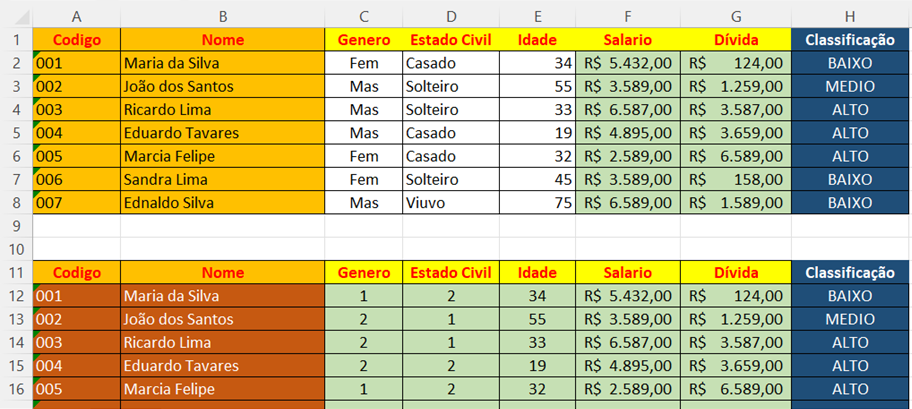
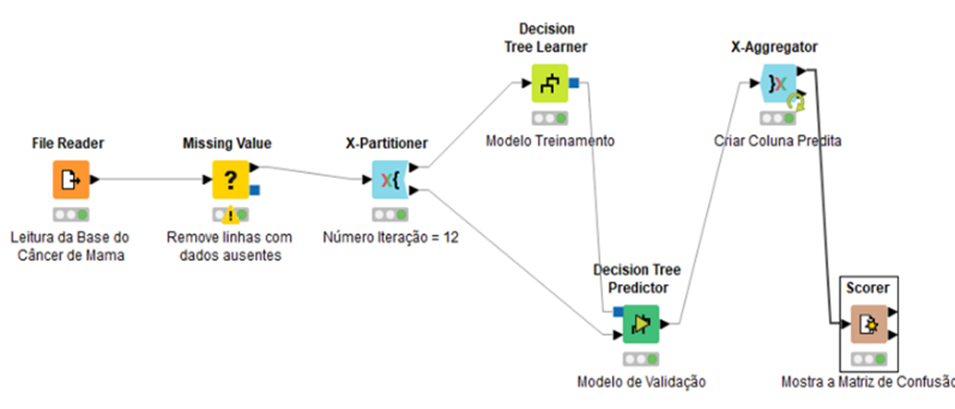
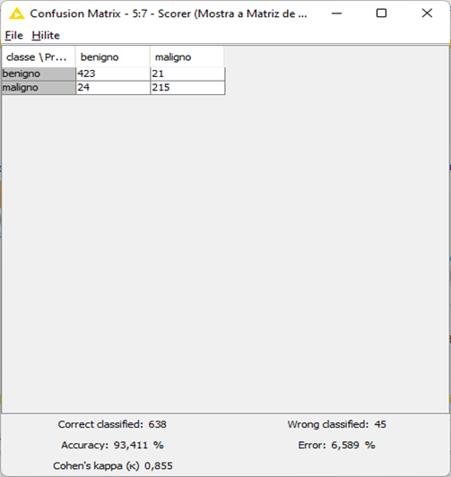
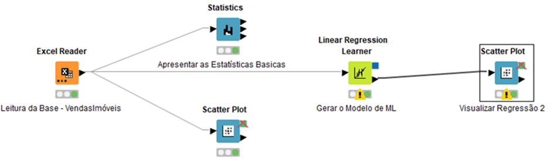

# Aplicabilidade da Mineração de Dados

## Modelos supervisionados

O aprendizado de máquina é definido por modelos supervisionados de dados, que por sua vez, é responsável por resolver problemas de negócios aplicados a problemas de Classificação e Regressão.

Os problemas de Classificação são os mais práticos e aplicados no dia a dia das empresas. Precisamos rotular uma base de dados classificando a informação de acordo com as regras de negócio.

Já os problemas de Regressão são aplicados a valores monetários e especificados de acordo com valores médios de vendas, por exemplo, calcular o preço de um carro baseado em valores iniciais, calcular a previsão de vendas no mês, ano e por período etc.

## Explicando Modelos de Classificação

**Modelos de classificação:** são normalmente utilizados por ML. Nos últimos anos vem crescendo como uma subárea de estudos da ciência de dados. O seu propósito é identificar características sobre os dados, de modo a associar conjunto de dados sob a mesma categoria.

Neste exemplo é possível identificar os campos de seleção (Feature Selection) que são gênero, estado civil, idade, salário e dívida. Enquanto o Target ou alvo a ser classificado é a coluna Classificação com os seguintes itens:

- Risco Baixo, Risco Médio e Risco Alto de acordo com as opções identificadas na planilha em questão.

O Algoritmo de Classificação irá começar a generalizar de acordo com os dados existentes e tentar, posteriormente, predizer qual será o risco do crédito de um novo cliente em questão.

## Práticas de Classificação com o KNime

Utilizando o KNIME, iremos construir um fluxo de dados para construção de um modelo supervisionado de dados baseado em problemas de Classificação com algoritmo Decision Tree (Árvore de Decisão).

O problema a ser identificado é fazer um modelo de Machine learning que irá predizer se a pessoa tem ou não probabilidade de pegar o câncer de mama.

O problema de negócio a ser investigado é o seguinte: esta base de dados possui informações sobre características de pessoas que têm e não têm câncer de mama.

Depois iremos utilizar o componente Missing Value para remover as linhas com dados ausentes e ou nulos.

Na sequência, utilizaremos o componente: X-Partitioner para dividir a base de dados em 70% para Treinamento e 30% para validação e avaliação do modelo.

O próximo componente Decision Tree Learner é responsável por fazer o treinamento do modelo e, posteriormente, será utilizado em conjunto com o Decision Tree Preditor que tentará fazer os testes e validação do modelo com os outros 30% da base.

Na sequência, utilizaremos o componente X-Aggregator para criar a nova coluna com valores de precisão do modelo em questão.

Por fim, vamos selecionar o Scorer para apresentar as métricas de validação do modelo, entre elas: a Acurácia, Precisão, Curva Roc, Matriz de Confusão.

Como resultado da avaliação do modelo de Machine learning em questão é possível identificar os valores de Verdadeiro Positivo e Verdadeiro Negativo que são bem próximos entre si.

Quanto aos Falsos Negativos de 21 amostras e Falsos Positivos com 24 exemplos, serve para identificar logo de cara o nível de precisão do modelo.

Outras métricas importantes são: Acurácia de 93,41% e com taxa de erro de 6,58, considerada uma excelente amostra. E consequentemente um valor muito próximo do ideal.

## Explicando modelos de regressão

Quando citamos problemas que envolvem valores numéricos em relação a outros valores numéricos, dando o nome de Regressão, isso acontece em virtude da necessidade de encontrar valores preditores e pesquisas baseadas nos valores que vão ser comparados.

## Práticas de regressão com KNime

Utilizando a ferramenta KNIME é possível reproduzir um cenário para criação de um modelo de regressão, baseado no preço de vendas de produtos e serviços da Loja X.

Neste exemplo, foram utilizadas as práticas com os componentes do tipo: Excel Reader. Este componente serve para carregar os dados existentes em uma planilha.

Os componentes do tipo Statistics, servem para validar o conjunto de valores da estatística descritiva do tipo: max, min, média, mediana, desvio padrão, etc.

Já o scatter plot, serve para validar e visualizar os dados baseado em valores que representam dados crescentes diante da regressão linear.

Enquanto isso, o componente: Linear Regression Learner é responsável pela criação do Modelo de Machine Learning, que irá fazer a predição baseado nos valores iniciais para prever o preço de vendas dos produtos.

Por fim, o Scatter plot irá mostrar os gráficos com as informações já preditas dos modelos.
