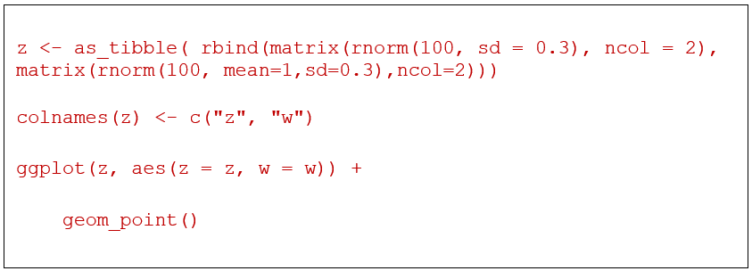
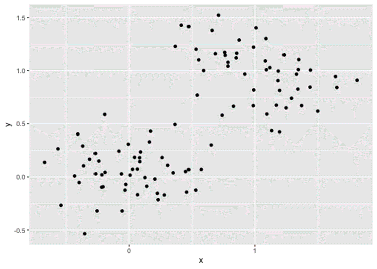
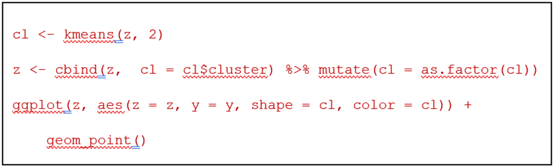
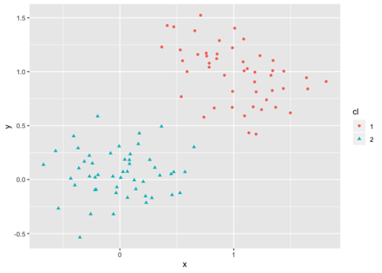
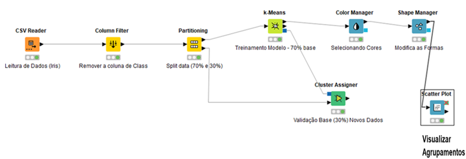
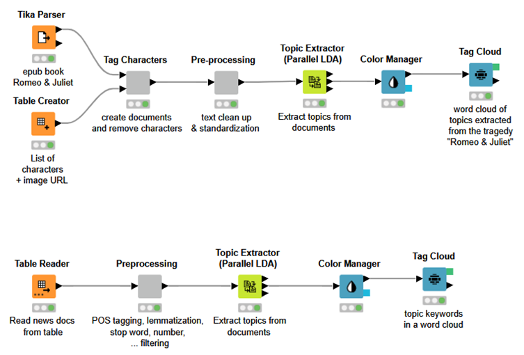

# Mineração de Dados não convencionais

## Modelos não supervisionados

O aprendizado de máquina não supervisionado é baseado em dados que não possuem um rótulo clássico no final da análise.

Na grande maioria das vezes não podemos definir os rótulos de dados, e sempre que possível temos que agrupar as informações em grupos de dados, para melhor conhecer as informações contidas nos dados.

Durante este processo, os modelos são criados de acordo com as ações para identificar agrupamentos de dados, tais como: bolinhas azul, bolinhas vermelhas e bolinhas verdes. De acordo com os dados apresentados podemos identificar tipos de dados importantes.

## Explicando modelos de Clusterização

Veja como ficam os dados gerados pela Linguagem R. Estes dados são representados mediante ações em bancos de dados e Clusterização pela linguagem R:

Se aplicarmos um dos algoritmos mais conhecidos para clusterização, o k-means, o resultado ficaria da seguinte forma:

Código escrito na linguagem R.

## Clusterização com KNime

Atualmente, o uso combinado de técnicas de agrupamento de dados vem sendo usado em diversas soluções. Entre elas:

- Detecção de Fraudes;
- Classificação de grupos de clientes e serviços;
- Classificação de grupos de textos e frases em redes sociais etc.

O KNIME possui diversos componentes que ajudam na construção desses modelos, incluindo detecção de anomalias e outras ações.

Neste exemplo é possível identificar o uso de vários componentes interessantes dentro do KNIME. Entre eles, temos o Column Filter, que tem como característica selecionar colunas específicas do projeto. Outro componente muito importante é o Partitioning que faz a separação da base em 70% para Treino e 30% para Teste. Como Algoritmo de Machine Learning selecionamos o K-Means que irá gerar o modelo de Clusterização e, posteriormente, com o componente Cluster Assigner, iremos validar o modelo em si.

Como últimas opções selecionamos os componentes Color Manager para modificar as cores dos grupos: Azul, Verde e Vermelho. Na sequência selecionamos o componente Shape Manager, responsável pela seleção das formas geométricas existentes. Por fim, usamos o Scatter Plot para mostrar os gráficos com os grupos de elementos.

Estes componentes juntos são importantes para identificação e validação dos modelos de Machine Learning em questão.

## Seleção de Campos e redução das dimensões

A escolha dos melhores campos para seleção dos modelos de Machine learning é uma das partes mais importantes existentes. Por isso, deixamos esta etapa como uma nova categoria aplicada a Machine learning chamada: Engenharia de Features. Este processo pode ser melhor selecionado e aplicado graças às técnicas que envolvem redução da dimensionalidade. Entre elas, podemos citar: LDA e o PCA.

LDA – Análise Discriminante Linear é uma técnica estatística que utiliza características de classificação, redução da dimensionalidade e visualização de dados.

PCA - A Análise de Componentes Principais (ACP) ou Principal Component Analysis (PCA) é um procedimento matemático que utiliza uma transformação ortogonal (ortogonalização de vetores) para converter um conjunto de observações de variáveis, possivelmente correlacionadas num conjunto de valores de variáveis linearmente não correlacionadas, chamadas de componentes principais. O número de componentes principais é sempre menor ou igual ao número de variáveis originais. Eles são garantidamente independentes apenas se os dados forem normalmente distribuídos (conjuntamente). O PCA é sensível à escala relativa das variáveis originais.

Este tópico apresenta um e-book do livro Romeu & Julieta, e através dos componentes de seleção de tags de caracteres é possível pré-classificar as palavras e depois padronizar os termos com um pré-processamento. Utilizando o termo de Paralelismo do LDA foi possível extrair os tópicos do documento inteiro e, posteriormente, apresentar como uma nuvem de palavras mais relevantes.

A prática de seleção dos campos e informações relevantes está sendo mostrada na figura acima. Os componentes estão relacionados diretamente à extração de texto não estruturado e, no final, a apresentação de um Mapa de Palavras com as mais relevantes.
