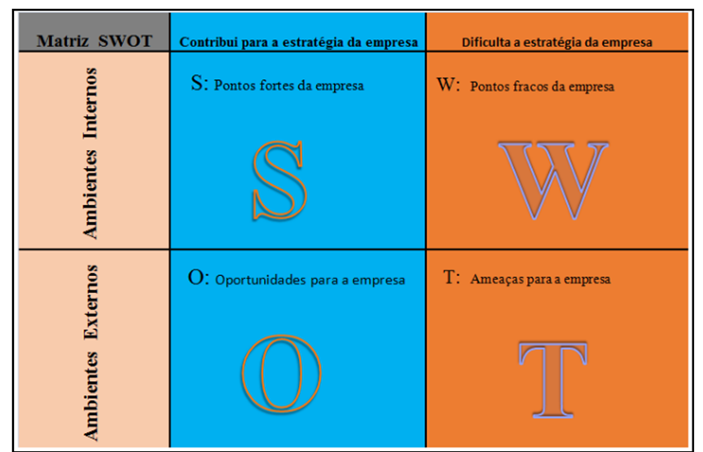
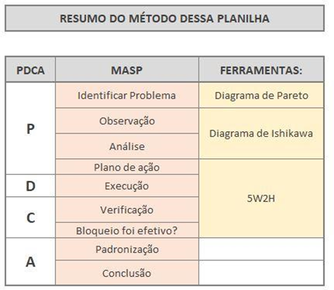

# Inteligência Competitiva com BI

## Conceitos SWOT Business Intelligence

Nos últimos anos, o ambiente corporativo está evoluindo de forma acelerada. Entre as novidades existentes no mercado, podemos considerar o SWOT como uma técnica básica de Business, pois identifica seus pontos fortes e pontos fracos, como também as suas oportunidades e ameaças.

O uso das técnicas de análise de SWOT auxilia as organizações a definir melhor as oportunidades e fraquezas existentes e, posteriormente, esses resultados podem ser integrados a ambientes analíticos baseados em Business Intelligence com dados distribuídos dentro de um Data Warehouse e/ou Data Lake. Esse processo de desnormalização e distribuição dos dados de forma única está crescendo internamente nas empresas de pequeno e médio porte.

Como dito anteriormente, as categorias de Análise de Dados baseados em SWOT tem como característica identificar seus pontos fortes e fracos. São pontos que podemos controlar.

Diante das ações, os dados das categorias internas são:

- Desempenho Atual: verificar os KPIs e indicadores em dashboards para listar valores que você domina e conhece bem.

- Pesquisas de Clientes: é importante procurar o seu cliente sobre a sua melhor habilidade de performance da solução de trabalho.

- Pesquisas de Funcionário: é essencial que conheça seus colaboradores, e faça perguntas sobre as melhores habilidades e experiências dos funcionários.

- Informações financeiras: é importante fazer um inventário dos recursos da organização, detalhando esses recursos, valores, ativos da organização, e o orçamento. Vejam como está o status atual da organização.

A seguir segue o quadro com a representação da Matriz de SWOT:

## PDCA aplicado Business Intelligence

O processo de PDCA é importante para definir objetivos e métricas de soluções baseadas nas características da organização e seus métodos. Estamos falando de métodos práticos e dinâmicos, que em conjunto com outras técnicas aplicadas ao mercado são característicos nos modelos de negócio e Business Intelligence.

É uma ferramenta baseada na repetição, aplicada sucessivamente nos processos, buscando a melhoria contínua para garantir o alcance das metas necessárias à sobrevivência de uma organização. Pode ser utilizada em qualquer ramo de atividade para alcançar um nível de gestão melhor a cada dia. Seu principal objetivo é tornar os processos da gestão de uma empresa mais ágeis, claros e objetivos. Segundo Vieira Filho, "esse método é largamente utilizado na busca da melhoria contínua tão necessária para o sucesso dos negócios.”

Quando falamos em PDCA já pensamos em implementar esse processo através de outras técnicas da administração, tais como: Diagrama de Pareto, Diagrama Yshikawa, 5W2H, entre outros.

## BSC aplicado ao Business Intelligence

Desde os anos 90, o processo Balanced Scorecard é uma técnica da administração bastante utilizada nas organizações para se obter sucesso. Nesse método, é importante trabalhar os aspectos baseados em etapas e consultas aos dados. O foco são os indicadores financeiros e contábeis, em conjunto com o planejamento e definição de estratégias muito mais abrangentes dentro da empresa.

Com o BSC é possível aproveitar os principais indicadores financeiros da organização e utilizá-los para traçar novas estratégias de negócios, juntamente com indicadores contábeis aplicados pelas organizações.

Para Kaplan e Norton (2004), a gestão estratégica de uma organização demonstra como a organização pretende criar valor para seus acionistas, funcionários, clientes e cidadãos. Ela representa um processo contínuo lógico que movimenta toda a organização, desde a declaração da missão até o trabalho executado pelos empregados de linha. Sua implantação parte do princípio de que não envolve decisões futuras, mas sim a futuridade das decisões atuais (RATNASINGHAM, 2009).

Com efeito, o que interessa ao administrador ou aos profissionais da área de gestão são os efeitos que suas decisões atuais terão em um futuro previsível. As consequências e efeitos futuros desejados são as molas propulsoras do ato de decidir o agora (DRUCKER, 2003).

Mintzberg e Quinn (2006), no intuito de representar a gestão estratégica em um conceito mais abrangente, conceitua ela em cinco diferentes perspectivas: plano, padrão, posição, perspectiva e truque. O plano representa as ações conscientemente articuladas, a fim de lidar com uma determinada situação; o padrão dispõe sobre a consistência no comportamento ao longo dos anos, sempre inspirado em algo extraído de seu passado; a posição está voltada para o nicho de mercado pretendido pela empresa, possibilitando um retorno econômico superior aos demais concorrentes; a perspectiva simboliza a maneira natural da organização em fazer as coisas; por fim, o truque representa a habilidade própria de superar os concorrentes (HUANG, 2009).
