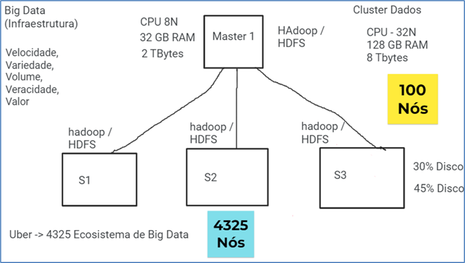
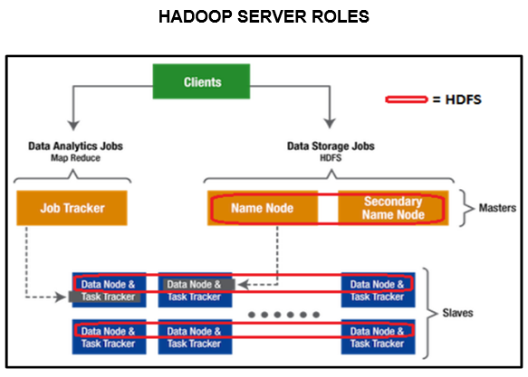
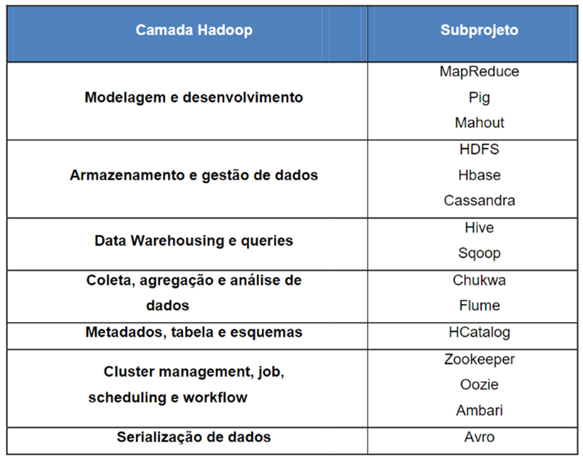

# Fundamentos de Big Data

## Conceito de Big Data e os 5 Vs

No mundo atual, a conectividade transforma radicalmente as experiências de uso de dispositivos e sistemas com os quais estávamos acostumados, mas que até a última década comportavam-se de maneira completamente distinta. A cena de uma pessoa sentada em frente a um computador, mandando mensagens por aplicativos diversos em seu smartphone, enquanto assiste uma série no Netflix e conversa pelo Whatsapp com um amigo do outro lado do mundo, não está mais tão distante da nossa realidade.

Quando pensamos que, aproximadamente, 15% das pessoas que habitam esse planeta estão no Facebook, e que ao segmentarmos para os oriundos do “Baby Boom” esse número saltou para 72%, vemos que não é mais possível pensar como antigamente. O volume de informações geradas pela sociedade é assustador:

- O twitter gera por dia 12 terabytes de tuites.

- Medidores inteligentes de energia realizam 350 bilhões de medições por ano.

- O Google estima que a cada dois dias, sejam gerados cerca de 5 exabytes de informação – isso é o que a humanidade gerou em toda a sua história até 2003.

Geralmente, o Big Data é caracterizado pelos chamados Três V’s:

- Volume: Quantidade de dados na escala de TeraBytes, PetaBytes, ExaBytes e ZetaBytes.

- Variedade: Capacidade de lidar com dados estruturados de banco de dados relacionais e arquivos txt, csv. Além disso, existem os dados semi-estruturados como XML, HTML, RSS. Por fim, os dados não estruturados que são conhecidos como: fotos, vídeos, QR-code, RF-ID, filmes, som, etc.

- Velocidade: Este termo se aplica à velocidade em que estes dados são gerados no mundo, por exemplo, o instagram publica em menos de 1 minuto mais de 900 mil fotos.

Além dessas dimensões, há outras duas utilizadas por alguns autores, que julgo serem muitíssimo pertinentes:

- Veracidade: Capacidade de cruzamento de dados com bases de dados reais públicas e/ou privadas. Durante esse processo, eles são compartilhados e integrados para validar tais informações de forma simples e direta pelos órgãos envolvidos de análise e controle.

- Valor: Como falamos, os dados são categorizados visando definir ações para agregar valor aos negócios das organizações. As análises são feitas através de ferramentas de data discovery e mineração de dados.

## Características do ambiente distribuído Hadoop

O ambiente distribuído do Hadoop é um Cluster de máquinas interligadas que compartilham recursos de hardware e software ao mesmo tempo. Geralmente é formado por um nó Master (principal) e 1 ou vários nós secundários que podem ser em torno de 50, 100, 1000 nós secundários com diferentes configurações de software e ou hardware ao mesmo tempo.

A falta de compreensão do que é o Big Data, seus potenciais e limitações podem gerar riscos para o negócio. Um investimento excessivo nas tecnologias sem uma preparação para empresa é jogar dinheiro fora.

Por outro lado, não há ainda um consenso em relação às tecnologias fundamentais que sustentam o Big Data e, principalmente, de como sair do conceitual e partir para soluções que agreguem valor para as empresas.

De uma maneira geral, as tecnologias relacionadas com o Big Data podem ser analisadas sob dois pontos de vista: aquelas envolvidas com o analytics, nas quais se destacam o Hadoop e o MapReduce; e as de infraestrutura, com destaque para os bancos de dados NoSQL (Not Only SQL) do tipo: Cassandra, MongoDB, Elastic Search, Neo4J.

A tecnologia para resolver esses problemas de forma otimizada ainda tem um longo caminho a percorrer para conseguir tratar rapidamente os imensos volumes de dados do Big Data. Para conseguir lidar com as questões de Volume, Variedade e velocidade do Big Data, surgem novos modelos, como os bancos de dados desenhados para tratar imensos volumes de dados não estruturados. Os bancos NoSQL dividem-se da seguinte forma:

- Modelos de sistemas colunares: Google Big Table.

- Modelo Key/Value: Amazon DynamoDB.

- Modelo “document database”: IBM Lotus Notes e MongoDB.

- Modelo baseado em grafos: Neo4j.

### Apache Hadoop

O Hadoop é conhecido como “o coração open source do Big Data”. Criado pelo Yahoo em 2005, inspirado pelo Google File System, GFS e no paradigma de programação MapReduce, que essencialmente divide o trabalho em tarefas como um mapeador (mapper) e um resumidor (reducer), que manipulam dados distribuídos em um cluster de servidores usados de forma massivamente paralela.

Cada vez mais empresas que precisam tratar volumes de dados não estruturados o utilizam, tendo desenvolvido um ecossistema ao seu redor.

O que é o Hadoop? Na prática, é a combinação de dois projetos separados: o Hadoop MapReduce (HMR), que é um framework para processamento paralelo, e o Hadoop Distributed File System (HDFS). O HMR é um spinoff do MapReduce, software que o Google utiliza para acelerar as pesquisas em sua máquina de busca.

O HDFS é um sistema otimizado de arquivos distribuídos para atuar com dados não estruturados. Por fim, há o Hadoop Common, um conjunto de bibliotecas e utilitários que suportam os projetos Hadoop.

O HDFS é o sistema de armazenamento de dados do Hadoop. Como na maioria dos sistemas de arquivos, os dados são divididos em blocos distribuídos em diversos servidores. A primeira característica marcante do HDFS é justamente o tamanho desses blocos, 64 megabytes contra 4 a 32 kbytes da maioria dos bancos de dados comuns.

A distribuição dos blocos de dados nos diversos servidores, acelera substancialmente o processamento dos dados, uma vez que no lugar de uma pesquisa sequencial a busca ocorre em paralelo.

Outra característica marcante é o uso de servidores e discos de baixo custo, valendo-se do fato de o MTBF (Mean Time Between Failure) dos equipamentos do cluster não ser muito alto. O próprio Hadoop garante a disponibilidade do acesso. Para isso, cada bloco é copiado em dois outros lugares diferentes, de modo que se um ou dois servidores falharem, o terceiro garantirá a disponibilidade dos dados.

## Aplicações voltadas para o Big Data Analytics

Quando falamos em Big Data Analytics, nada mais é do que o uso das técnicas de Business Intelligence dentro de um ambiente de Big Data com Data Lake e sistema distribuído Hadoop, HDFS, Hive, entre outras tecnologias que fazem parte deste modelo.

O uso cada vez mais intensificado das ferramentas e tecnologias de Big Data Analytics vem avançando e sendo aplicado no dia a dia das empresas.

Quando iniciamos um projeto voltado para o Big Data Analytics, precisamos preparar um conjunto de fontes de dados de origem, estruturados, não estruturados dentro de uma modelo de Data Lake baseado em ambiente de Cluster com vários nós integrados.

Além disso, precisamos de ferramentas de orquestração de dados que fazem o processo de ETL / ELT, algumas delas são: Apache Hop, Apache AirFlow, Apache Flume, Apache Ni-FI. Por fim, as ferramentas de visualização de dados tais como: Microsoft Power BI, Qlik Sense, Tableau, Google Data Studio, entre outras.

## Ambientes e Ferramentas do Ecossistema Hadoop

Entre as soluções que fazem parte do Ecossistema de Big Data com Hadoop, estão as seguintes, conforme tabela abaixo:

Estas soluções são ferramentas aplicadas ao ecossistema de Big Data. São soluções bem maduras e aplicadas no dia a dia das organizações. Durante este período, tive a oportunidade de trabalhar com várias delas e são bastante recomendadas.

Nas camadas de Armazenamento e Data Warehousing são aplicadas ferramentas bem específicas e que são trabalhadas, tais como: HDFS, HBase e Cassandra na parte de guardar dados, e o Hive e Scoop são aplicadas diretamente a Armazéns de dados.
