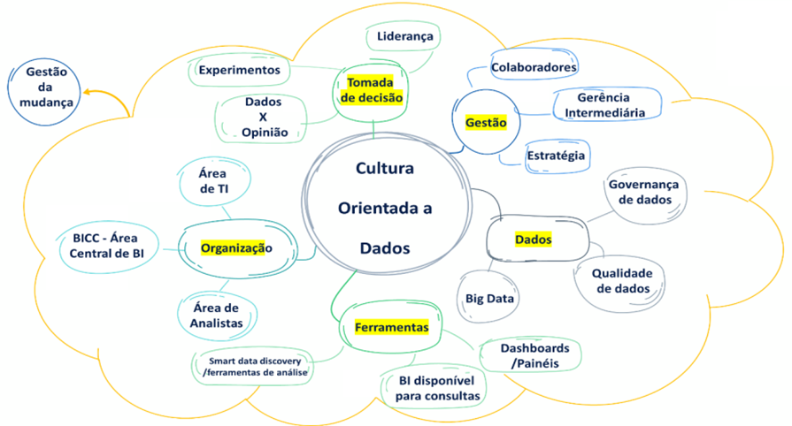

# Cultura Data Driven e Governança de Dados

## Cultura orientado a dados

As possibilidades de inovação estão cada vez mais rápidas, disruptivas e permitem a fusão dos mundos digital, físico e biológico. As tecnologias como a Inteligência Artificial, impressão 3D, drones e outras, estão cada vez mais presentes e se incorporam à vida das pessoas. Na área da saúde, temos o exemplo do crescimento acelerado da medicina de precisão (NICHOLAS DAVIS; KLAUS SCHWAB, 2019).

A disponibilidade de dados gerados pelas diversas fontes possíveis, possibilitam combinações diversas, gerando informações que podem se tornar ativos valiosos de uma organização. Alguns autores compartilham a crença de que a evolução das inovações nas organizações tem como ponto em comum, a gestão desse conhecimento gerado em seus campos de atuação (CARLOMAGNO; SCHERER, 2016; FLEURY; OLIVEIRA JUNIOR, 2001; OLIVEIRA, 2004).

Em setembro de 2015, o Fórum Econômico Mundial publicou um relatório com 21 pontos de inflexão esperados para 2025, que correspondem à expectativa de chegada de mudanças tecnológicas à sociedade e que contribuirão para uma hiper conexão e uma transformação digital. Estes pontos foram identificados através de uma pesquisa realizada pelo Conselho da Agenda Global do Fórum, com a participação de mais de 800 executivos e especialistas do setor de TIC (WORLD ECONOMIC FORUM, 2015).

## Como transformar Dados em Resultados

Baseados nesses conceitos, Berndtsson et al. (2018) conduziram uma pesquisa com modelos de maturidade em sistemas de análise e BI, na qual foram investigados fatores que uma organização deveria considerar na adoção de tais sistemas de inteligência analítica para se tornar uma organização orientada a dados.

1. Gestão: este fator diz respeito ao envolvimento da alta gestão no desenvolvimento de uma estratégia para o estabelecimento da cultura orientada a dados. Watson (2016) relata que sem o envolvimento do gestor máximo para apresentar a estratégia desejada, as iniciativas ficam concentradas em silos, seja por receio da atuação de novos profissionais no processo ou por falta de visão estratégica. Além disso, é um desafio para os gerentes intermediários e demais empregados, se não entenderem o propósito e que suas contribuições são determinantes para a implantação.

2. Dados: a enorme massa de dados gerada pelas organizações precisa estar suportada por uma governança de dados forte (ALHASSAN; SAMMON; DALY, 2016) e o acesso a dados de boa qualidade (HEINRICH et al., 2018), são obrigatórios no processo de inteligência analítica. Apesar de existirem diversos tipos de dados, com frequência, forma e volume massivo, Big Data não é mandatório para todas as organizações orientadas a dados.

3. Ferramentas: para a implantação de inteligência analítica e cultura orientada a dados é necessário que as organizações providenciem um conjunto de ferramentas de análises aos seus empregados. Inicialmente, eles podem usar qualquer ferramenta, desenvolver painéis de acordo com suas tarefas cotidianas, os Self-service BIs, onde acontecerá o primeiro contato com a possibilidade de análises descritivas, por conta própria e vai alavancar o uso das ferramentas (ALPAR; SCHULZ, 2016). O próximo passo é a introdução de ferramentas de mineração de dados, que permitirá aos usuários realizarem análises preditivas. Nesta etapa, os usuários precisam ser treinados em outras ferramentas complementares, que os habilitam a utilizar algoritmos e ferramentas mais amigáveis de mineração de dados, de programação e estatística e teorias que suportam a etapa de análises preditivas.

4. Organização: apesar da maioria das organizações terem áreas de TIC e ferramentas similares a Central de BI, que geram relatórios padrão com determinada frequência ou a qualquer outra solicitação de informação, é imprescindível que essas áreas sejam atualizadas para atenderem a área de inteligência analítica. É preciso incorporar com grande ênfase à aprendizagem e à experimentação. De acordo com Schüritz, Brand, Satzger, e Bischhoffshausen (2017), algumas organizações tratam essas novas competências necessárias como parte extensora de suas áreas de BI, ao passo que outras decidem criar áreas de inteligência analítica em áreas separadas. Independentemente da decisão, a área de TIC precisa mudar o foco e facilitar o acesso aos dados por todos os empregados, de modo que suas ideias possam ser testadas com qualidade de dados garantida, e quem sabe gerarem novos insights. O estudo feito por Ross; Beath; e Quaadgras (2013), sugere que um acompanhamento contínuo é a chave do sucesso para construir competências em Big Data.

5. Processos de Decisão: esses serão os sinalizadores sobre o avanço da cultura orientada a dados. Se os outros fatores habilitadores estiverem de fato ocorrendo, os empregados irão desenvolver um processo de decisão, onde o ambiente de teste e aprendizagem faz parte da norma e o aprendizado por lições aprendidas deve ser valorizado. Não importa a origem do insight, desde que ele tenha sido gerado adequadamente. O foco na melhoria constante e todos os achados devem ser incentivados, mesmo que sejam considerados triviais. Por fim, os líderes devem incentivar o uso das análises em detrimento do seu poder de decidir por instintos.

## Governança de Dados e o Papel da LGPD

### O que é a Governança?

Etimologicamente, a palavra governança significa o ato de governar-se, entretanto restringir a palavra apenas ao seu significado oficial, sem contar as suas origens e as atuais interpretações, não seria o mais correto a se fazer.

A palavra governança deriva do verbo grego kubernaein [kubernáo], que metaforicamente significa dirigir e, nos últimos anos, está cada vez mais sendo atribuída à gestão pública e ao meio corporativo.

Na gestão pública, conforme o Decreto n. 9.203, de 22 de novembro de 2017, em seu art. 2.o , I, é definida como:

Governança pública – conjunto de mecanismos de liderança, estratégia e controle postos em prática para avaliar, direcionar e monitorar a gestão, com vistas à condução de políticas públicas e à prestação de serviços de interesse da sociedade; […]

Dessa forma, é possível compreender que a governança está presente nas formas de avaliação, direção e monitoramentos contínuos da gestão, com o intuito de potencializar suas estruturas e atender aos objetivos da instituição.

### A Lei Geral de Proteção a Dados

A lei geral de proteção a dados está ligada diretamente aos benefícios da privacidade de usuários e suas restrições, mediante sistemas de informação e aplicações em diversas organizações.

As características delimitadas aos ambientes relacionados a LGPD são implementadas durante todas as organizações no dia a dia.

Do mesmo modo, construir áreas relacionadas a permissão de usuários e liberação dos dados para realizar suas operações relacionadas a campos sensíveis e mascarados como CPF, Nome, Data de Nascimento, entre outros.

### Práticas de mercado governança de dados

A falta de uma definição mais concreta de metas e objetivos de governança de dados. Além disso, duas das metas mais preocupantes, atualmente, são: metas vagas e expectativas desalinhadas com os objetivos da organização. Por isso, é crucial que todos os envolvidos na iniciativa saibam claramente os objetivos desde o início.

**Metas comuns**

Quando uma empresa opta por implementar um programa de governança de dados, geralmente apoia uma ou mais das seguintes metas:

- Melhorar a eficiência de processos críticos que foram prejudicados por dados de baixa qualidade.

- Cumprir um ou mais regulamentos ou adaptar as práticas de dados existentes para cumprir de forma mais eficiente e confiável.

- Usar dados precisos e confiáveis para informar cada decisão dentro de ou entre as unidades de negócios ou processos.

- Melhorar a segurança dos dados e reduzir o risco compreendendo melhor onde estão os dados sensíveis, como se movimentam e quem tem acesso a eles.

- Aproveitar a análise de big data para capturar, verificar e certificar os dados que estão espalhados por toda a empresa, garantindo que sejam confiáveis e estejam disponíveis para obter insights analíticos aprimorados.
