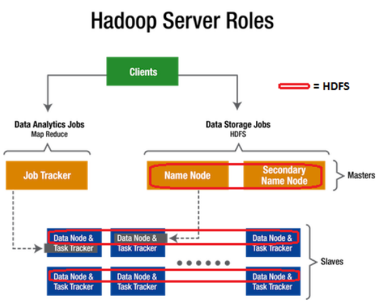

# Sistemas distribuídos e o Hadoop

## Ambientes distribuídos e plataformas de Big Data

A tecnologia ainda tem muito a evoluir, especialmente em relação à facilidade de manuseio de dados não estruturados e às novas formas de visualização de dados. Ferramentas como Inteligência Artificial, usada para auxiliar na análise de grandes volumes de dados. Na aprendizagem de máquinas aprende-se com dados, e quanto mais dados mais se aprende, logo os volumes de dados de Big Data potencializam sensivelmente o seu valor.

Big Data vai demandar novas funções e habilidades, mas no cenário perfeito chegaremos ao “do-it-yourself analytics”, ou seja, um modelo em que pessoas com pouca ou nenhuma formação serão capazes de realizar suas análises. Na prática, todo ramo do conhecimento humano vai ser intensivo em dados. As previsões realizadas através de Big Data não têm nada a ver com futurologia. A partir de imensos volumes de dados são realizadas análises de padrões e correlações para produzir informações valiosíssimas em todos os setores da sociedade humana, governos, empresas etc. Analisar dados é fundamental, mas Big Data envolve outras etapas e não apenas análise e modelagem dos dados. A primeira fase de um processo de Big Data é a coleta de dados. São dados oriundos de sistemas transacionais, redes sociais, sensores, câmeras de segurança etc., com volumes e variedades impressionantes.

Big Data demanda uma grande capacidade computacional. Um ambiente de cloud Computing em geral é o mais adequado para essa demanda. Grandes volumes de dados só podem ser processados por meio de paralelismo com tecnologias como o Hadoop e o MapReduce. A privacidade é outro tema central em Big Data. Vários setores são altamente regulamentados, tais como saúde e financeiro. As preocupações com a pegada digital devem ser cada vez mais levadas em conta. Com Big Data podemos gerar grande valor pela transformação da informação em algo disponível para todos. A segmentação mais refinada dos clientes possibilita a oferta de produtos mais adequados a cada perfil, bem como o desenvolvimento das próximas gerações de produtos de maneira mais eficiente. Os riscos nas tomadas de decisão são reduzidos ao tomá-las baseando-se em fatos, ao invés da intuição.

## O uso de Big Data nas empresas

O Big Data afetará todos os setores da economia em maior ou menor grau. As empresas que começarem a utilizá-lo mais cedo, especialmente aquelas que conseguirem criar uma cultura organizacional que favoreça o aproveitamento contínuo das oportunidades criadas de forma criativa, terão uma vantagem competitiva sustentável. A tecnologia está disponível para empresas de todos os tamanhos, o diferencial está na sofisticação e maturidade na gestão da empresa. Você não precisa de grandes servidores na sua empresa para poder utilizar soluções de Big Data.

## Tecnologias para Big Data - Infraestrutura e plataformas

A falta de compreensão do que é o Big Data, seus potenciais e limitações podem gerar riscos para o negócio. Um investimento excessivo nas tecnologias sem uma preparação para empresa é jogar dinheiro fora. Por outro lado, não há ainda um consenso em relação às tecnologias fundamentais que sustentam o Big Data e, principalmente, de como sair do conceitual e partir para soluções que agreguem valor para as empresas. De uma maneira geral, as tecnologias relacionadas com o Big Data podem ser analisadas sob dois pontos de vista: aquelas envolvidas com o analytics, nas quais se destacam o Hadoop e o MapReduce; e as de infraestrutura, com destaque para os bancos de dados NoSQL (Not Only SQL). Todas essas tecnologias buscam resolver o problema do tratamento das quantidades gigantescas de dados, que não conseguiam ser endereçados pelas tecnologias tradicionais. A tecnologia para resolver esses problemas de forma otimizada ainda tem um longo caminho a percorrer para conseguir tratar rapidamente os imensos volumes de dados do Big Data. Para conseguir lidar com as questões de Volume, Variedade e velocidade do Big Data, surgem novos modelos, como os bancos de dados desenhados para tratar imensos volumes de dados não estruturados. Os bancos NoSQL dividem-se segundo o modelo adotado da seguinte forma:

- Modelos de sistemas colunares: Google Big Table.

- Modelo Key/Value: Amazon DynamoDB.

- Modelo “document database”: IBM Lotus Notes e MongoDB.

- Modelo baseado em grafos: Neo4j.

A decisão do tipo de banco de dados a ser utilizado está intimamente relacionada com as necessidades específicas de cada projeto. É bom lembrar também que é possível desenhar soluções que utilizam mais de um desses modelos. Uma vez definida a infraestrutura de base, é necessário ter atenção aos componentes de analytics, afinal de contas é essa etapa que transforma os dados em algo de valor para o negócio. O Big Data Analytics não significa os tradicionais sistemas de BI que já existem. O stream processing permite tratamento em tempo real dos dados à medida que são criados. As tecnologias de visualização estão evoluindo constantemente, criando modelos inovadores para visualizar diferentes tipos de dados.

## Apache Hadoop

O Hadoop é conhecido como “o coração open source do Big Data”. Criado pelo Yahoo em 2005, inspirado pelo Google File System, GFS e no paradigma de programação MapReduce, que essencialmente divide o trabalho em tarefas como um mapeador (mapper) e um resumidor (reducer), que manipulam dados distribuídos em um cluster de servidores usados de forma massivamente paralela. Cada vez mais empresas que precisam tratar volumes de dados não estruturados o utilizam, tendo desenvolvido um ecossistema ao seu redor. O que é o Hadoop? Na prática, é a combinação de dois projetos separados: o Hadoop MapReduce (HMR), que é um framework para processamento paralelo, e o Hadoop Distributed File System (HDFS). O HMR é um spinoff do MapReduce, software que o Google usa para acelerar as pesquisas em sua máquina de busca. O HDFS é um sistema otimizado de arquivos distribuídos para atuar com dados não estruturados. Por fim, há o Hadoop Common, um conjunto de bibliotecas e utilitários que suportam os projetos Hadoop.

O HDFS é o sistema de armazenamento de dados do Hadoop. Como na maioria dos sistemas de arquivos, os dados são divididos em blocos distribuídos em diversos servidores. A primeira característica marcante do HDFS é justamente o tamanho desses blocos, 64 megabytes contra 4 à 32 kbytes da maioria dos bancos de dados comuns. A distribuição dos blocos de dados nos diversos servidores acelera substancialmente o processamento dos dados, uma vez que no lugar de uma pesquisa sequencial a busca ocorre em paralelo. Outra característica marcante é o uso de servidores e discos de baixo custo, valendo-se do fato de o MTBF (Mean Time Between Failure) dos equipamentos do cluster não ser muito alto. O próprio Hadoop garante a disponibilidade do acesso. Para isso, cada bloco é copiado em dois outros lugares diferentes, de modo que se um ou dois servidores falharem o terceiro garantirá a disponibilidade dos dados.

Um servidor especial chamado NameNode fica responsável pela lógica de mapeamento dos blocos. Para ter o desempenho otimizado, toda a informação do NameNode é mantida em memória. Porém, por ser o responsável por todo o mapeamento, ele se torna um SPOF (Single Point Of Failure), deixando todo o sistema a mercê de uma falha sua. Por esse motivo, esse servidor costuma ser um servidor de alta disponibilidade com uma sólida estratégia de backup e restauração, já que a perda do NameNode significa a perda de todos os dados armazenados.

As versões mais recentes do Hadoop já implementam um BackupNode que ocupa o lugar do NameNode em caso de falha. O MapReduce é a alma do Hadoop, seu paradigma de programação possibilita a escalabilidade massivamente paralela em centenas ou milhares de servidores.

As duas tarefas implementadas pelo paradigma são o mapeamento dos dados e o resumo dos dados.

A tarefa de mapeamento acessa um conjunto de dados e os converte em outro conjunto, no qual os elementos individuais são quebrados em tuplas (chave / valor). A tarefa de resumo pega o resultado do mapeamento e combina as tuplas em um grupo menor para obter o resultado.
