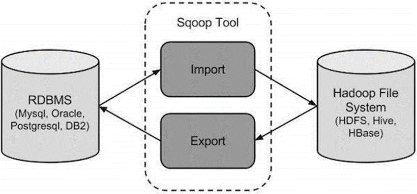
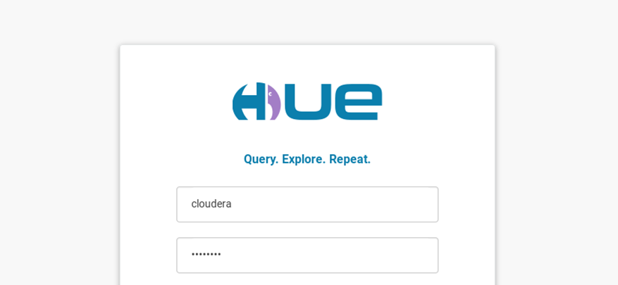
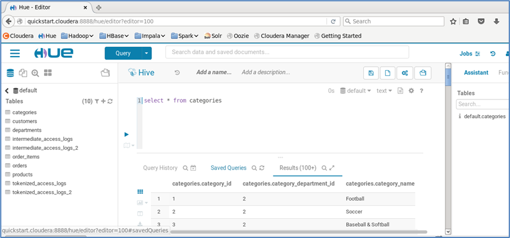
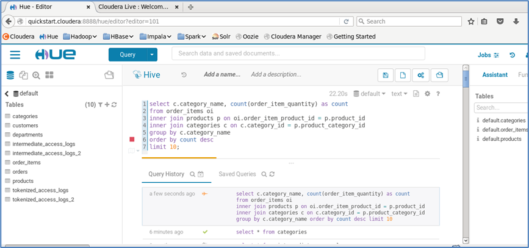
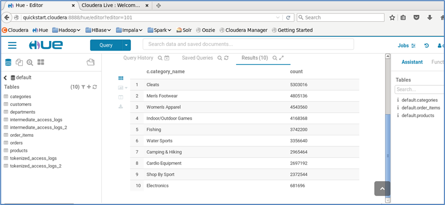
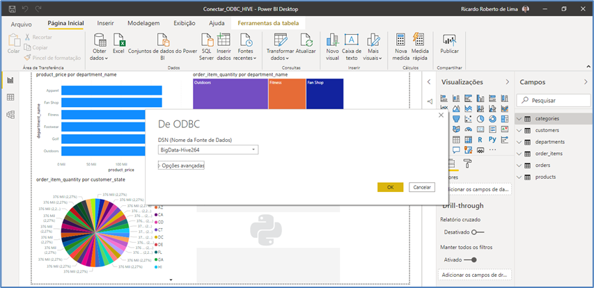
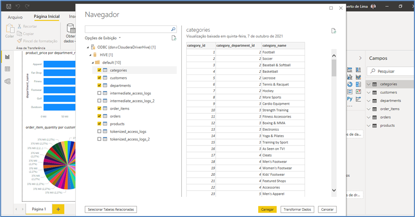
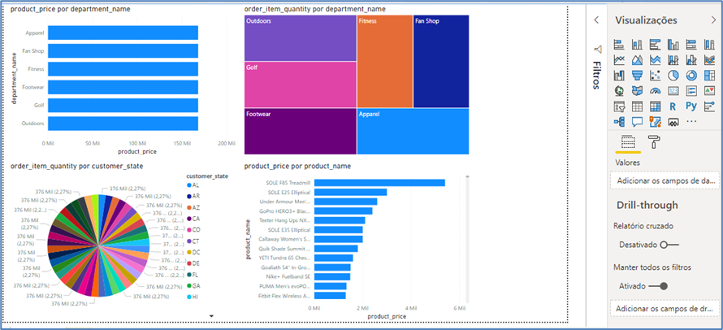

# Ferramentas de Big Data - Cloudera

## Ferramenta de Ingestão de Dados Apache Sqoop

Com o passar dos anos, vem evoluindo de forma natural as ferramentas do Ecossistema de Big Data, entre elas as ferramentas de Ingestão de dados estruturados, semiestruturados e não-estruturados vem crescendo de forma natural e hoje em dia estamos trabalhando com diversas soluções entre elas podemos citar:

- Apache Sqoop – Ingestão de dados banco de dados relacionais em plataformas de Big Data;

- Apache NIFI – Ingestão de dados relacionais e não relacionais em Data Lakes;

- Apache Flume – Ingestão de dados em plataformas de Big Data e NoSQL.

Sqoop é uma ferramenta projetada para transferir dados entre o Hadoop e servidores de banco de dados relacionais. Ele é usado para importar dados de bancos de dados relacionais, como MySQL, Oracle para Hadoop HDFS e exportar do sistema de arquivos Hadoop para bancos de dados relacionais. Este é um breve tutorial que explica como usar o Sqoop no ecossistema Hadoop.

Através dela é possível transferir uma ou todas as tabelas de uma vez só de um banco de dados relacional para o ecossistema de big data tanto para o HDFS como também para o HIVE ao mesmo tempo.

Para isso é necessário apenas configurar os ambientes de origem e destino, além de definir os parâmetros de execução. Para trabalhar com a referida ferramenta é necessário configurar o ambiente dentro de um Cluster Hadoop e ferramentas de execução.

É necessário ter um conhecimento básico do Core Java, conceitos de banco de dados de SQL, sistema de arquivos Hadoop e qualquer um dos tipos de sistema operacional Linux.

O sistema de gerenciamento de aplicativos tradicional, ou seja, a interação de aplicativos com banco de dados relacional utilizando RDBMS, é uma das fontes geradoras de Big Data. Esse Big Data, gerado pelo RDBMS, é armazenado em Servidores de Banco de Dados Relacionais na estrutura do banco de dados relacional.

Quando os armazenamentos e analisadores de Big Data como MapReduce, Hive, HBase, Cassandra, Pig, etc. do ecossistema Hadoop entraram em cena, eles precisaram de uma ferramenta para interagir com os servidores de banco de dados relacionais para importar e exportar o Big Data que neles residia.

Aqui, o Sqoop ocupa um lugar no ecossistema do Hadoop para fornecer interação viável entre o servidor de banco de dados relacional e o HDFS do Hadoop.

### Sqoop: “SQL para Hadoop e Hadoop para SQL”

Sqoop é uma ferramenta projetada para transferir dados entre o Hadoop e servidores de banco de dados relacionais. Ele é usado para importar dados de bancos de dados relacionais, como MySQL, Oracle para Hadoop HDFS e exportar do sistema de arquivos Hadoop para bancos de dados relacionais. É fornecido pela Apache Software Foundation.

### Como funciona o Sqoop?

### Importação Sqoop

A ferramenta de importação importa tabelas individuais de RDBMS para HDFS. Cada linha em uma tabela é tratada como um registro no HDFS. Todos os registros são armazenados como dados de texto em arquivos de texto ou como dados binários em arquivos Avro e Sequence.

### Exportação Sqoop

A ferramenta de exportação exporta um conjunto de arquivos do HDFS de volta para um RDBMS. Os arquivos fornecidos como entrada para o Sqoop contêm registros, que são chamados de linhas na tabela. Esses são lidos e analisados ​​em um conjunto de registros e delimitados com delimitador especificado pelo usuário.

## Análise de Dados com Apache Hive e SQL e Análise de Dados Hue

O Apache Hive funciona como um grande repositório de dados estruturados dentro do Ecossistema de ferramentas de Big Data, através dele é possível transformar os dados em tabelas relacionais e utilizar uma linguagem parecido com a SQL padrão Ansi para manipular os dados.

Também conhecido como o grande Data Warehouse do Big Data, o Hive possui diversas arquiteturas que podem servir de repositório de informação relacional, garantindo assim o uso organizado e distribuído de dados que estão no HDFS e podem ser transferidos de forma simples e objetiva.

Além disso, o Apache Hive serve de interface para diversas plataformas de análise e processamento de dados massivos, isso ajuda o analista, cientista e engenheiro de dados no seu dia a dia.

Depois de entrar no ambiente é possível acessar uma área onde os dados estarão disponíveis para manipulação, isso acontece quando selecionamos o item – Query – Editor – Hive.

Logo em seguida será apresentados todas as estruturas de dados armazenadas no seu repositório central, isso é importante para identificar quais são as fontes de dados necessárias para execução no momento.

Durante este processo as tabelas ficam disponíveis, inclusive dados estruturados e não estruturados, fazem parte também desse processo.

Utilizando o ambiente integrado do Hue é possível utilizar o HIVE e realizar algumas consultas interativas com a linguagem SQL, nesse exemplo estamos consultando os dados da tabela categories.

Nesse exemplo estamos exibindo a lista com todos os produtos organizados por categoria e agrupados pela quantidade de pedidos realizados por Categoria de Produto existente no sistema. O resultado demonstra bem a execução da referida rotina com a linguagem SQL.

## Data Lake integração de dados com Power BI

Quando utilizamos o Data Lake com o Apache Hive é possível gerenciar e realizar as operações aplicadas a dados com o Apache Hadoop e ferramentas de Data Discovery, entre elas podemos citar o Microsoft Power BI, uma das ferramentas já citadas anteriormente no nosso curso.

Através do Driver ODBC para Hive é possível estabelecer uma conexão com o driver de origem do hadoop e coletar os dados existentes no data lake.

A integração desses dados é feita através de conectores para os mais diversos tipos de dados existentes, além dos driver ODBC é possível integrar também com conectores JDBC e dessa formar associar os dados existentes no Data Lake com as ferramentas de data discovery, nesse sentido basta copiar os driver em formato de arquivos *.jar para o diretório lib da aplicação e utilizar os referidos dados.

Durante esse trabalho é possível integrar os dados do Data Lake com as ferramentas de data discovery de forma rápida e prática, nesse caso: utilizamos os gráficos de barras e pizza, além de um TreeMap, essas representações são bastante utilizadas para representar informações estatísticas e agrupamento de informações. Durante a produção do material, podemos utilizar diversos tipos de dados formas de representação.
