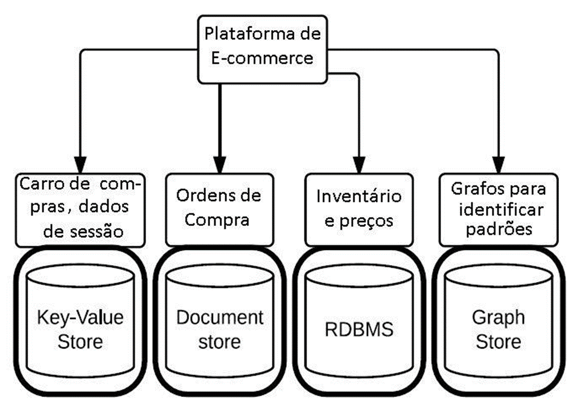
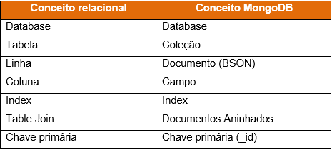
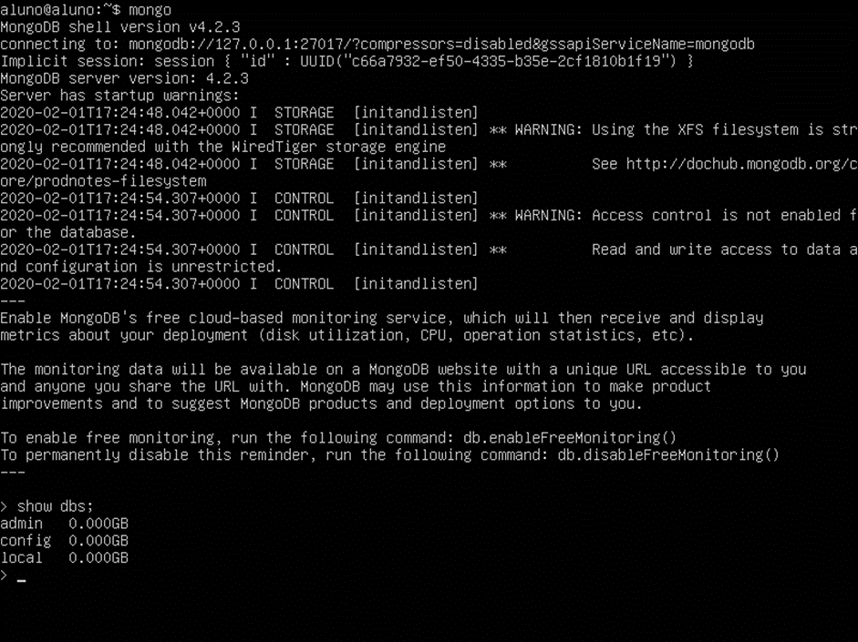
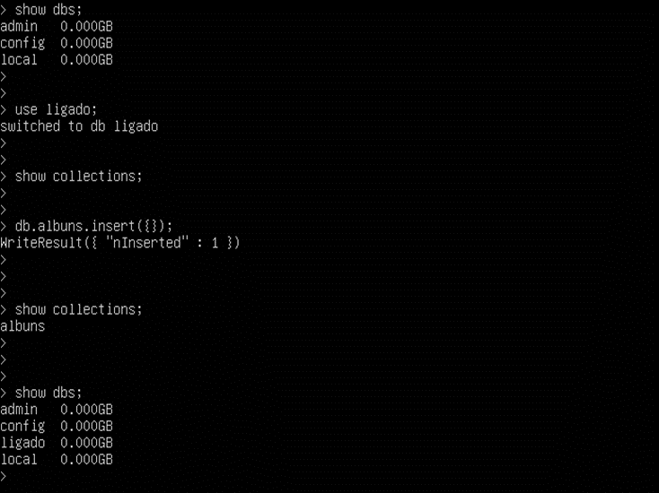
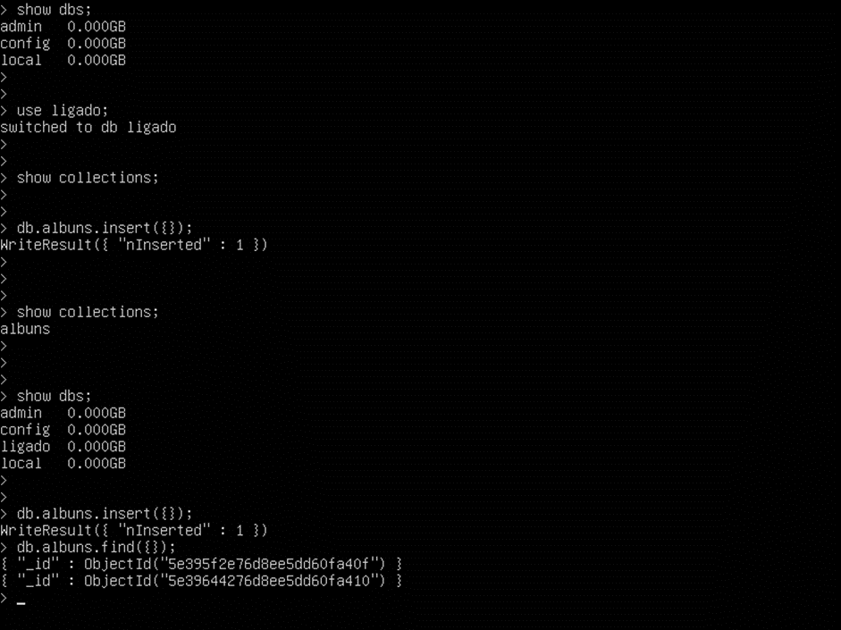
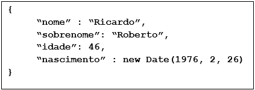
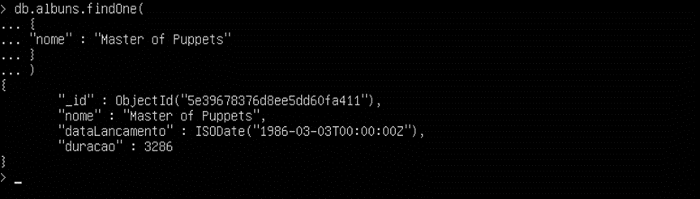
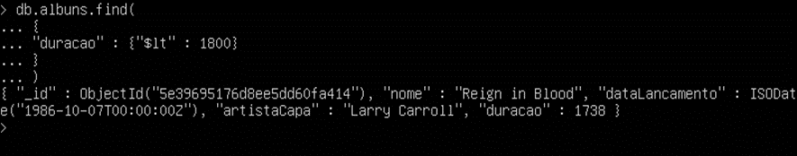

# Banco de Dados NoSQL - MongoDB

## Conceitos de Persistência Poliglota e NoSQL

Faz aproximadamente 20 anos, no mundo da computação empresarial, que temos visto muitas coisas mudarem. Entre essas mudanças, podemos citar as diversas plataformas e ambientes operacionais.

- Linguagens de programação;
- Arquiteturas de Hardware e Software;
- Plataformas;
- Processos;
- Nesse período, algo tem sido constante: O uso de bancos de dados relacionais.

Com o passar dos anos, as ferramentas do Ecossistema de Big Data vem evoluindo de forma natural. Entre elas, podemos citar as ferramentas de ingestão de dados estruturados, semiestruturados e não-estruturados. Hoje em dia, estamos trabalhando com diversas soluções.

**Atualmente, há um novo desafiante: NoSQL!**

- Criado a partir da necessidade de manipulação de volumes maiores de dados (BIG DATA);

- Facilita a distribuição e manutenção de dados em Clusters (conjunto de computadores interconectados que funcionam como se fosse um só sistema);

- Foco no desempenho, escalabilidade e disponibilidade de dados, mesmo afetando de forma momentânea sua consistência;

- Seu significado não possui uma única definição:

- Bancos de dados sem esquema?

- Bancos de dados para clusters?

- Bancos de dados sem SQL?

- Bancos de dados “Not Only SQL”?

**Bancos NoSQL vieram substituir os tradicionais bancos de dados relacionais? Pelo menos, por enquanto, não.**

- Atualmente, bancos relacionais não são mais os únicos a serem utilizados em aplicações.

- Dependendo dos dados a serem persistidos, aplicativos tendem a utilizar múltiplas tecnologias para o gerenciamento de dados.

- Logo, arquitetos precisam estar familiarizados com essas tecnologias e serem capazes de avaliar quais tipos podem utilizar para cada tipo de necessidade.

**Por que bancos NoSQL são tão interessantes assim?**

- Aumentam a produtividade no desenvolvimento de aplicativos;
  - É mais fácil mapear dados para esse tipo de banco;
  - Menos código a ser escrito;

- Permitem o processamento de grandes quantidades de dados;
  - É muito custoso o processamento no modelo relacional (projetado para execução em uma única máquina);
  - NoSQL permite o particionamento dos dados em muitas máquinas menores e mais baratas.

## Danco de Dados de Texto - Documentos

Nesse tipo de banco, cada registro (documento) fica armazenado em uma coleção específica sem esquema explícito;

São fortemente orientados a agregados com uma certa estrutura básica nos conjuntos de atributos;

- Estruturas JSON ou XML são normalmente utilizados na definição dos agregados;

Consultas podem ser submetidas baseadas nos atributos e/ou índices dos agregados;

É possível recuperar parte do agregado ou todo o agregado.

Quando usar o MongoDB?

No gerenciamento de sistemas;
Em aplicações mobile;
Na visualização de dados;
Entre outros;
Não devemos utilizá-lo em sistemas que demandam muitos relacionamentos entre agregados e transações.

Estudo de caso: MongoDB

Documentos em um formato similar ao JSON, chamado BSON;
Um dos bancos NoSQL mais usados no mundo;
Seu ambiente interativo e suas consultas são escritas em JavaScript;
Distribuição gratuita para Linux, Mac e Windows.

Nesse tipo de banco, cada registro (documento) fica armazenado em uma coleção específica sem esquema explícito; São fortemente orientados a agregados com uma certa estrutura básica nos conjuntos de atributos;

Estruturas JSON ou XML são normalmente utilizados na definição dos agregados;
Consultas podem ser submetidas baseadas nos atributos e/ou índices dos agregados; É possível recuperar parte do agregado ou todo o agregado. **Banco de dados de Texto – Documentos**

