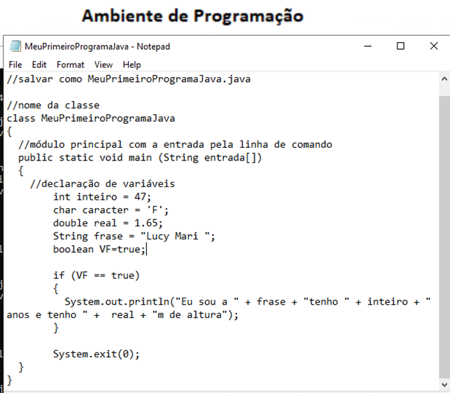
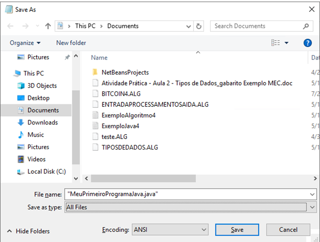
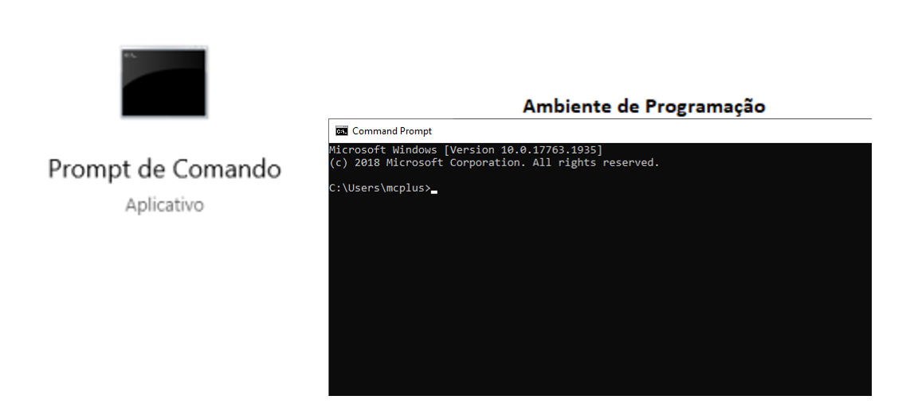
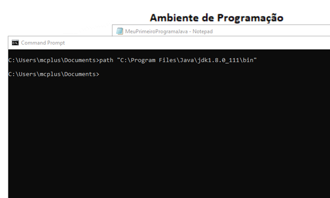
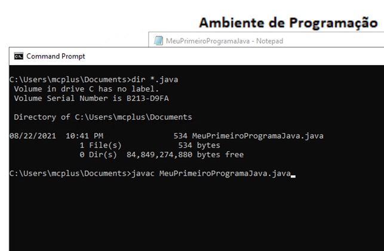
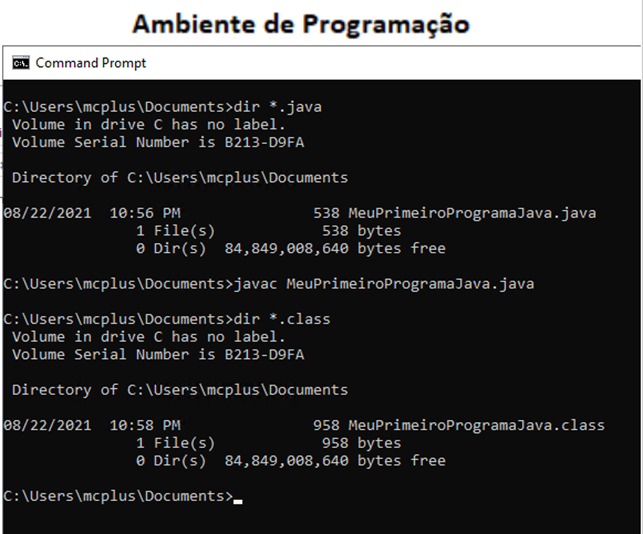
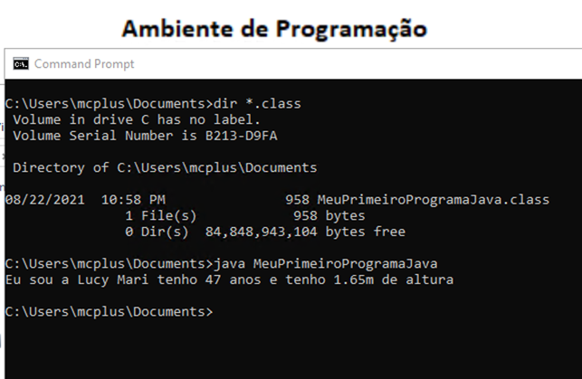
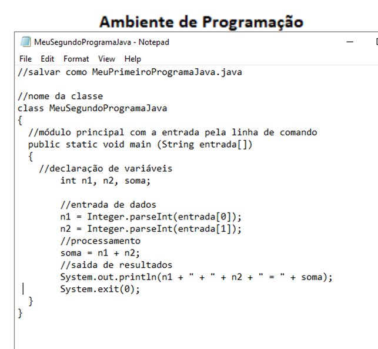
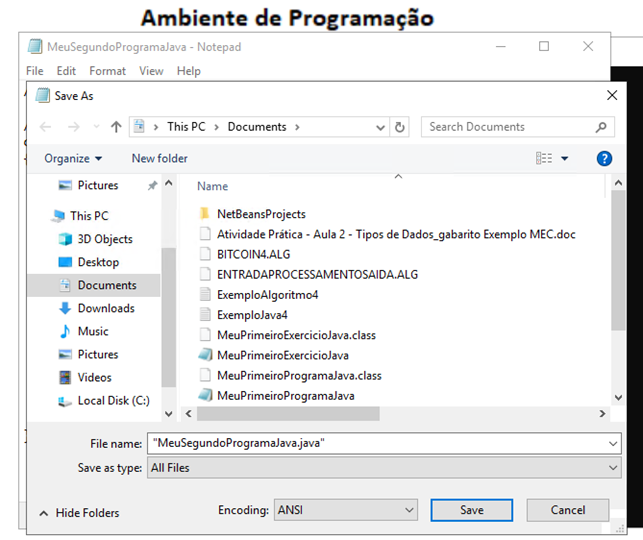
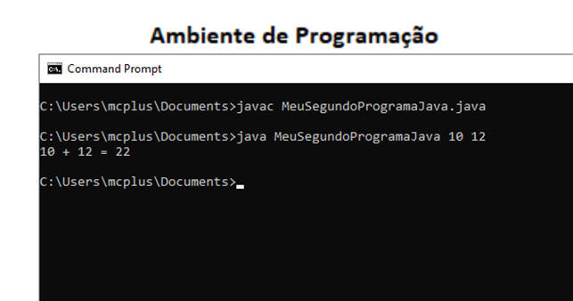

# Visão Geral da Linguagem Java

<!--toc:start-->

- [Visão Geral da Linguagem Java](#visão-geral-da-linguagem-java)
  - [Ambiente Java](#ambiente-java) - [Java Development Kit - JDK (Kit de Desenvolvimento Java)](#java-development-kit-jdk-kit-de-desenvolvimento-java) - [Interpretador e Compilador](#interpretador-e-compilador) - [Java Runtime Environment - JRE](#java-runtime-environment-jre) - [Java Virtual Machine - JVM](#java-virtual-machine-jvm) - [Meu primeiro programa Java](#meu-primeiro-programa-java) - [Exemplo prático](#exemplo-prático)
  <!--toc:end-->

## Ambiente Java

Java é uma linguagem de programação e plataforma computacional lançada pela primeira vez pela Sun Microsystems em 1995. Existem muitas aplicações e sites que não funcionam, a menos que tenha o Java instalado no computador. O Java é rápido, seguro e confiável. É utilizada de notebooks a datacenters, consoles de jogos a supercomputadores científicos e telefones celulares a Internet. Além disso, a linguagem de programação que tem sua própria estrutura, regras de sintaxe e paradigma de programação. Deriva da linguagem C, portanto suas regras de sintaxe assemelham-se às regras do C (PUGA e RISSETI, 2016).

Uma pergunta muito comum entre alunos e iniciantes em programação é "O que é necessário para programar em Java?". O primeiro passo é configurar seu espaço de trabalho, sendo assim, baixar e instalar o JDK - Java Runtime Environment e posteriormente você pode utilizar uma IDE, ou até mesmo o bloco de notas, ou o Notepad++, e o prompt de comando (terminal). Nesta disciplina, o bloco de notas e o prompt de comando serão utilizados para as atividades práticas. Abaixo será descrito, resumidamente, alguns componentes que envolvem a programação Java e o JDK.

### Java Development Kit - JDK (Kit de Desenvolvimento Java)

O JDK é um conjunto de bibliotecas de desenvolvimento de software em linguagem de programação Java. Também estão presentes neste kit o compilador, o interpretador e o JRE - Java Runtime Environment (PUGA e RISSETI, 2016).

#### Interpretador e Compilador

Segundo Ribeiro (2016), "A tradução da linguagem de alto nível em linguagem de máquina pode ser feita de duas maneiras básicas: compilação ou interpretação. No processo de tradução entre a linguagem de alto nível e a linguagem de máquina, o compilador pode encontrar erros de sintaxe; então irá gerar mensagens de erros para que o programador possa corrigi-los. O programa executável somente será gerado quando não houver mais erros de compilação. A compilação é usada somente em linguagens de programação como C, C++ e FORTRAN

A outra maneira é traduzir linha por linha do programa em linguagem de alto nível para linguagem de máquina, executando uma linha por vez. Neste caso usamos um interpretador. Note que o programa precisa do interpretador para executar, pois as ações ocorrem dentro do ambiente do interpretador. Se houver dados, estes são processados pela execução desta linha no ambiente do interpretador. Se não houver erros, o interpretador lê a próxima linha do programa-fonte e repete o processo até que todas as linhas sejam lidas e o programa chegue ao seu final. Linguagens como Python, Java\* e JavaScript são interpretadas"

- "_Java é uma linguagem compilada e interpretada. O compilador Java, chamado javac, compila o código-fonte do Java para um código de nível intermediário chamado código de bytes (bytecode). Esses códigos de bytes não são diretamente executáveis em qualquer plataforma de hardware existente; mas esses códigos são interpretados pelo interpretador Java, o qual pode operar por si mesmo ou como parte de um navegador Web._" (IDE, 2021)

#### Java Runtime Environment - JRE

O Java Runtime Environment (também conhecido como ambiente de execução Java) inclui a JVM, bibliotecas de códigos e componentes necessários para executar programas que são escritos na linguagem Java. Está disponível em várias plataformas e está incluído no JDK (PUGA e RISSETI, 2016).

#### Java Virtual Machine - JVM

A JVM permite que a linguagem Java seja independente do sistema operacional. O programa desenvolvido nesta linguagem pode ser executado e utilizado no Windows, Linux, MacOS ou em outros sistemas operacionais (CÓRDOVA et. Al., 2018).

### Meu primeiro programa Java

Para escrever o programa utilize o bloco de notas e para executar utilize o prompt de comando. Vamos salvar o programa Java com o nome MeuPrimeiroProgramaJava.java.

Neste programa, criamos uma classe chamada MeuPrimeiroProgramaJava e dentro da classe o procedimento main com a variável entrada como parâmetro para entrada de dados pelo prompt de comando.

O Java é case sensitive, isso significa que o Java difere letras maiúsculas das minúsculas. É no void main que o programa Java é executado.

Este programa está declarando as variáveis inteiro do tipo int recebendo o valor 47, caracter do tipo char recebendo o valor 'F', real do tipo double recebendo o valor 1.65, frase do tipo String recebendo o valor "Lucy Mari" e VF do tipo boolean recebendo true.

Na linguagem Java, os tipos de dados int, char, double, boolean são tipos primitivos do Java e escritos com letra minúscula. String é um tipo criado, faz parte da biblioteca do Java e, por isso, iniciando sua escrita com letra maiúscula.

O programa verifica se a variável VF tem o valor true. No Java, para a atribuição utiliza-se o símbolo `=` e para comparação utiliza-se o símbolo `==`.

Se o valor de VF é true, ou seja, verdadeiro, o programa imprime uma informação. Utilizamos true e false como valores verdadeiro e falso para as variáveis booleanas no Java.

Utilizamos `System.out.print` ou `System.out.println` (este último, pula uma linha após a impressão) como método do Java para saída de resultados, onde a informação será apresentada, para o usuário, via prompt de comando.

Após escrever o programa Java, vá em File -> Save as. Escreva "MeuPrimeiroProgramaJava.java", com essas aspas duplas, e selecione files. Caso você decida desenvolver o programa Java no NotePad++, vá em File -> Save as. Escreva apenas MeuPrimeiroProgramaJava em FileName e escolha, em save as type, Java source file.

Abra o prompt de comando e verifique em qual pasta você salvou seu arquivo .java. Você pode salvar na pastar users\mcplus\documents, caso queira.

No mesmo local onde você salvou seu programa Java, você deve indicar o caminho de onde está o compilável e o executável do Java, para isso, escreva na linha de comando: `path "C:\Program Files\Java\jdk1.8.0\bin"`.

Caso você esteja desenvolvendo no seu ambiente de programação, você precisa verificar qual o endereço onde está a pasta bin do seu programa Java e realizar o comando do path para configurar o endereço do compilável e do executável do Java.

Para verificar se seu programa Java está no mesmo diretório que você configurou o caminho do seu executável e compilável, você pode digitar dir\*.java na linha de comando do prompt de comando. E você vai ver a lista dos programas Java neste diretório.

Agora você já consegue compilar seu programa Java, basta digitar javac, que é o compilador Java e, seguido por um espaço, o nome do seu programa Java, neste caso, MeuPrimeiroProgramaJava.java.

Se acontecer de aparecer uma lista de erros de compilação, basta voltar ao programa Java e ir resolvendo os erros de compilação. Quando inexistir erros de compilação, significa que o arquivo .class do Java foi criado.

É o arquivo .class que deve ser executado. Neste exemplo, após a compilação, foi criado o arquivo MeuPrimeiroProgramaJava.class. Para verificar se este arquivo foi criado, basta digitar dir \*.class.

Agora que você já verificou que o arquivo .class foi gerado pela compilação do programa Java, você pode usar o comando java MeuPrimeiroProgramaJava (sem a extensão .class) para executar o programa Java.

E, ao executá-lo, na mesma janela do prompt de comando, aparece o resultado do programa com a mensagem "Eu sou a Lucy Mari tenho 47 anos e tenho 1.65m de altura."

#### Exemplo prático

Para este exemplo prático, vamos criar um programa Java que realiza a entrada de dois números inteiros pela linha do prompt de comando que são armazenados no vetor de entrada[]. E mostra a saída de resultados pelo prompt de comando.

Este programa Java foi salvo como MeuSegundoProgramaJava.java.

No prompt de comando, o programa Java foi compilado com o comando javac MeuSegundoProgramaJava.java e, posteriormente, executado com o comando java MeuSegundoProgramaJava 10 12.

Perceba, neste caso, que os valores 10 e 12, o usuário digitou na linha do prompt de comando no momento da execução do programa Java. São os valores de entrada para o programa.

Neste caso, o valor "10" foi armazenado em entrada[0] e o valor "12" foi armazenado em entrada[1] no programa Java.

