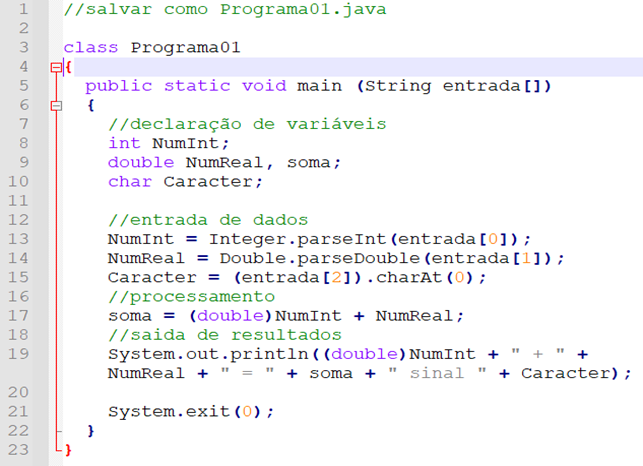
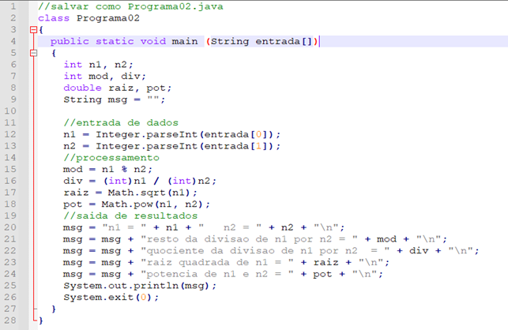
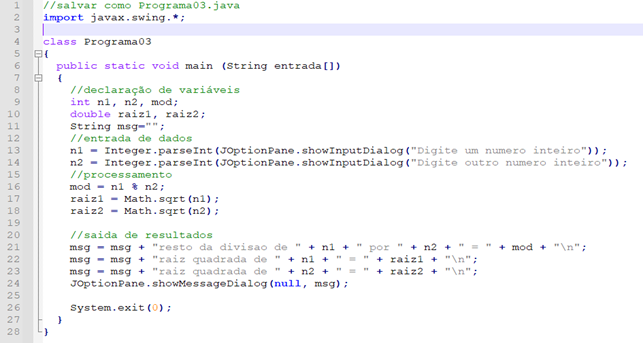

<!--toc:start-->

- [Introdução a linguagem Java](#introdução-a-linguagem-java)
- [Introdução a linguagens](#introdução-a-linguagens)
  - [Linguagem de máquina](#linguagem-de-máquina)
  - [Linguagem de montagem](#linguagem-de-montagem)
- [Linguagem de programação](#linguagem-de-programação)
  - [Java](#java)
  - [Linguagem de marcação](#linguagem-de-marcação)
  - [Exemplo](#exemplo) - [Exemplo com operações matemáticas](#exemplo-com-operações-matemáticas) - [Exemplo com a biblioteca Swing](#exemplo-com-a-biblioteca-swing)
  <!--toc:end-->

# Introdução a linguagem Java

## Introdução a linguagens

Neste módulo serão apresentados alguns tipos de linguagens computacionais.

### Linguagem de máquina

O computador necessita de ações específicas para fazer o processamento dos dados. Essas ações devem ser entendidas pelo computador através de uma linguagem de máquina. Esta linguagem é composta somente por números, representados de forma binária, que equivalem às operações e operandos usados no processamento do programa. A linguagem de máquina é complexa para o entendimento humano, então para auxiliar o desenvolvimento de um programa foi proposto outro tipo de linguagem representada por comandos, que reproduz tarefas executadas pelo computador, a linguagem de montagem (assembly). Entretanto, a linguagem de montagem continuou sendo um desafio para o desenvolvimento de softwares pela sua complexidade, menor que a linguagem de máquina, mas ainda assim complexa. Além disso, programas desenvolvidos nesta linguagem são específicos, porém não funcionam em outros processadores diferentes (RIBEIRO, 2019).

### Linguagem de montagem

Uma linguagem de montagem pura é a linguagem onde cada comando traduz exatamente uma instrução de máquina. _Assembly_ ou linguagem de montagem é uma notação mais legível do que a de linguagem de máquina. O código de máquina torna-se legível pela substituição dos valores brutos por símbolos chamados mnemônicos, mas ainda assim mais complexo que outras linguagens (RIBEIRO, 2019). Seu objetivo é gerar códigos que se comunicam com os dispositivos computacionais, como microprocessadores e microcontroladores.

### Linguagem de programação

A linguagem de programação é formal e permite que um programador escreva um conjunto de instruções para criação de programas que manipulam o comportamento físico e lógico de uma máquina. É a comunicação entre o hardware (máquina) e o programador. Seu funcionamento é feito através de uma série de instruções, palavras-chaves, regras semânticas, sintáticas e símbolos (RIBEIRO, 2019).

Abaixo, exemplos de linguagens de programação:

- Java
- JavaScript
- Python
- C
- C++
- C#
- PHP

### Java

"O Java é uma tecnologia usada para desenvolver aplicações que tornam a Web mais divertida e útil. O Java não é a mesma coisa que o JavaScript, que é uma tecnologia simples usada para criar páginas Web" (JAVA, 2021). Em 2020, a linguagem Java completou 25 anos de existência. É uma linguagem considerada moderna e orientada a objetos, que se adaptou à internet e aos dispositivos móveis. Além disso, tem tudo que uma linguagem de programação permite, incluindo toda a estrutura estudada em algoritmos nesta disciplina.

### Linguagem de marcação

A linguagem de marcação é uma linguagem que anota o texto para que o computador possa manipulá-lo. É de fácil entendimento porque as anotações são escritas de forma a distingui-las do próprio texto (marcações), com o objetivo de estruturar o texto e dar significado (semântica) para que um navegador possa exibi-lo (COMER, 2016).

Algumas características de uma linguagem de marcação:

- Utilizadas para definir formatos, maneiras de exibição e padrões dentro de um documento. Exemplo: HTML

- Não possuem qualquer estrutura de controle como as linguagens de programação tradicionais (por exemplo, comandos condicionais ou de repetição).

### Exemplo

Para exemplificar uma introdução à linguagem Java, vamos desenvolver um programa Java que declara variáveis, recebe informações pela linha de comando, calcula a adição de dois números e mostra essas informações pela linha de comando.



Perceba que utilizamos como entrada de dados o vetor entrada nas posições 0, 1 e 2. Nas linhas 13, 14 e 15 do programa.

Convertemos a entrada[0] para inteiro com o método `Integer.parseInt()`, a entrada[1] para real com o método `Double.parseDouble()` e a entrada[2] para char com o método `CharAt(0)`.

Como a variável soma e o valor de NumReal são reais, antes de realizar a adição, convertemos o conteúdo inteiro da variável NumInt para double na linha 17 do programa.

Mostramos o resultado do cálculo, passando a mensagem por parâmetro no método `System.out.println` que mostra a mensagem para o usuário pelo prompt de comando.

```java
// salvar como Programa01.java

class Programa01 {
  public static void main(String entrada[]) {
    // declaração de variáveis

    int NumInt;
    double NumReal, soma;
    char Caracter;

    // entrada de dados

    NumInt = Integer.parseInt(entrada[0]);
    NumReal = Double.parseDouble(entrada[1]);
    Caracter = (entrada[2]).charAt(0);

    // processamento

    soma = (double)NumInt + NumReal;

    // saída de resultados

    System.out.println((double)NumInt + "+" + NumReal + "=" + soma +     "sinal" + Caracter);

    System.exit(0);
  }
}
```

#### Exemplo com operações matemáticas

Vamos desenvolver um programa Java que declara variáveis, recebe dois números pela linha de comando, calcula o resto da divisão de dois números, o quociente da divisão de dois números, a raiz quadrada do primeiro número e a potência do primeiro número pelo segundo número e mostra essas informações pelo prompt de comando.



Neste programa, você pode perceber que, na linguagem Java, o resto da divisão de dois números inteiros é feita pelo operador `%`, a raiz quadrada, utilizamos o método `Math.sqrt()` e a potência, utilizamos o método `Math.pow()`. Veja as linhas 16 a 18 no programa Java.

Perceba que no Java, podemos utilizar o operador `/` para realizar o cálculo de divisão de dois números reais para ter o resultado da divisão, ou para realizar o cálculo de determinar o quociente (sem o resto) da divisão de dois número inteiros.

Veja que na linha 17, utilizamos `(int)` antes das variáveis, para garantir que elas são variáveis inteiras.

Neste programa, utilizou-se uma variável msg para concatenar as mensagens para serem exibidas para o usuário, observe as linhas 21 a 25 do programa. Esse é um recurso utilizado pela autora, apenas para que o código fique mais limpo e mais fácil de ser entendido.

```java
// salvar como Programa02.java

class Programa02 {
  public static void main(String entrada[]) {
    int n1, n2;
    int mod, div;
    double raiz, pot;
    String msg = "";

    // entrada de dados

    n1 = Integer.parseInt(entrada[0]);
    n2 = Integer.parseInt(entrada[1]);

    // processamento

    mod = n1 % n2;
    div = (int)n1 + (int)n2;
    raiz = Math.sqrt(n1);
    pot = Math.pow(n1, n2);

    // saída de resultados

    msg = msg + "n1 = " + n1 + " ne = " + n2 + “\n”;
    msg = msg + "resto da divisao de n1 por n2 = " + mod + “\n”;
    msg = msg + "quociente da divisao de n1 por n2 = " + div + “\n”;
    msg = msg + "raiz qudrada de n1 = " + raiz + “\n”;
    msg = msg + "potencia de n1 por n2 = " + pot + “\n”;
    System.out.println(msg);

    System.exit(0);
  }
}
```

#### Exemplo com a biblioteca Swing

Vamos desenvolver um programa Java que declara variáveis, recebe dois números inteiros usando interface com usuário, calcula o resto da divisão dos dois números, a raiz quadrada do primeiro e do segundo números e mostra essas informações.



Perceba que, neste exemplo, importamos a biblioteca `javax.swing.*` com o comando `import` na linha 2 do programa.

Perceba que a entrada de dados para este programa Java, é feita usando o método `JOptionPane.showInputDialog()` que está definido na biblioteca `javax.swing.*`. E a saída de dados foi realizada com o método `JOptionPane.showMessageDialog()`.

É uma forma de se realizar a interação humano-computador com uma interface mais amigável.
