# Conceitos iniciais

Neste módulo serão apresentadas a Sintaxe e a Semântica no contexto da programação, como também os comandos e operações das estruturas de decisão e repetição da linguagem de programação Java. Detalhes sobre esses comandos já foram vistos no decorrer desta disciplina, mas na forma de pseudocódigo (algoritmo).

## Sintaxe e Semântica

Para projetar um programa, seu ciclo de vida começa através de modelos, especificações e por fim o código. Estes modelos e especificações servem para entender e documentar o que um usuário pretende resolver com o programa. Além disso, esta prática facilita muito transformar as ideias em passos, e posteriormente em um algoritmo. Por fim, ser codificado em um programa na forma de uma determinada linguagem de programação.

Sendo assim, os termos sintaxe e semântica fazem parte deste contexto onde os códigos dos programas precisam de uma boa forma (sintaxe) e um bom conteúdo (semântica).

A sintaxe geralmente refere-se à forma de escrever código fonte (palavras reservadas, comandos, recursos diversos). Pode-se dizer que, é o conjunto de regras que devem ser seguidas para a escrita de um algoritmo ou um programa e tem uma relação direta com a forma (semântica) de como essas regras são descritas (RIBEIRO, 2019).

A semântica é o estudo do significado das coisas (do conteúdo das "formas"). No contexto de programação, refere-se ao significado dos modelos, ao nível de entendimento como: clareza, objetividade, detalhamento, coesão, entre outros (FERREIRA, 1999).

As particularidades da linguagem de programação Java, segundo PUGA e RISSETI (2016):

- Case Sensitive: Letras maiúsculas se diferenciam das minúsculas. Ex: nome é diferente de NOME ou Nome.

- Como em algoritmos há também as palavras reservadas. Que são comandos ou ações e escritas em inglês.

- Comentários podem ser feitos através dos símbolos: `/* o que estiver aqui não é executado /` ou `// o que estiver na mesma linha não é executado`. Servem apenas para informar e organizar o código do programa, o código-fonte.

- Como uma boa prática de programação, abre chaves {temos comandos} e fecha chaves para blocos de comandos. Linhas de comandos são terminadas com `;`.

## Comandos e Operadores

Os comandos e operadores foram apresentados em algoritmos de forma detalhada, nesta seção será mostrado sua equivalência na linguagem de programação Java. Os comandos são as instruções que remetem às ações a serem executadas pelo programa, tais como: comandos de entrada e saída de dados, estruturas de repetição, comandos de decisão, entre outros. Os operadores são utilizados para executar cálculos numéricos e relacionar expressões, são eles: Operadores Aritméticos, Relacionais e Lógicos (PUGA e RISSETI, 2016). Abaixo, exemplos e equivalências de Operadores e Comandos.

**Operadores Aritméticos**

- `+` - Adição ou Concatenação. Exemplo: 5 + 2 (=7), "Algo" + "ritmo" (=Algoritmo)

- `+=` - Adição. Exemplo: numero += 2 (numero = numero + 2)

- `-` - Subtração. Exemplo: 5 - 2 (=3)

- `-=` - Subtração. Exemplo: numero -= 2 (numero = numero - 2)

- `*` - Multiplicação. Exemplo: 5 \* 2 (=10)

- `*=` - Multiplicação. Exemplo: numero _2 (numero = numero_ 2)

- `/` - Divisão. Exemplo de inteiros: 5 / 2 (=2). Exemplo de reais: 5.0 / 2.0 (=2.5)

- `/=` - Divisão. Exemplo: numero /= 2 (numero = numero / 2)

- `%` - Resto da Divisão. Exemplo: 5 % 2 (=1)

**Operadores Relacionais**

- `==` - Igual. Exemplo: idade == 20

- `!=` - Diferente. Exemplo: idade == 20

- `<` - Menor que. Exemplo: idade < 20

- `>` - Maior que. Exemplo: idade > 20

- `<=` - Menor ou igual. Exemplo: idade <= 20

- `>=` - Maior ou igual. Exemplo: idade >= 20

**Operadores Lógicos**

- `&&` - E (AND). Exemplo: (idade > 20) && (idade < 50)

- `||` - OU (OR). Exemplo: (idade > 20) || (idade < 50)

- `!` - Negação. Exemplo: !(idade == 20)

## Estruturas de Decisão

Temos três tipos de estruturas de decisão, a estrutura de decisão simples, a estrutura de decisão composta e a estrutura de decisão encadeada.

Uma estrutura de decisão é utilizada quando apenas uma parte do programa deve ser executado de acordo com uma condição. A parte a ser executada é a que satisfaz determinada condição.

Na estrutura de decisão simples, se a condição for verdadeira, os comandos são executados, caso contrário, nada se faz. Temos a seguinte estrutura:

```java
if(condicao) {
  <comandos>;
}
```

Na estrutura de decisão composta, se a condição for verdadeira, os comandos são executados, caso contrário, outros comandos são executados. Temos a seguinte estrutura:

```java
if(condicao) {
  <comandos>;
} else {
  <outros comandos>;
}
```

Na estrutura de decisão encadeada, uma estrutura de decisão simples ou composta faz parte dos comandos a serem executados. Temos a seguinte estrutura:

```java
if(condicao) {
  <comandos>;

  if(outraCondicao) {
    <outros comandos>;
  }

} else {
  <mais comandos>;
}
```

Outra estrutura de decisão, que denominamos de estrutura de múltipla escolha, você decide por uma das opções e os comandos daquela opção são executados. Neste caso, a estrutura é apresentada da seguinte forma:

```java
switch(variavel) {
  case "valor01":
    <comandos>;
    break;
  case "valor02":
    <comandos>;
    break;
  case "valor03":
    <comandos>;
    break;
  default:
    <comandos default>;
}
```

Vamos ver um exemplo por meio do desenvolvimento de um programa Java que declara variáveis, recebe uma opção e um número inteiro, calcula se o número é par ou ímpar, positivo ou não positivo e apresenta apenas a opção selecionada. Por fim, apresentar as informações.

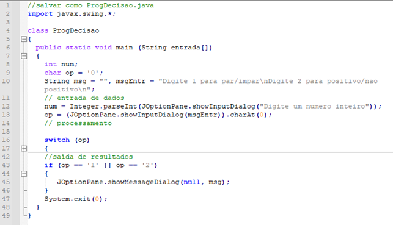

Temos uma estrutura de decisão simples da linha 43 à linha 46 do programa. Se o valor da variável op for "1" ou se for "2", então o conteúdo de msg é apresentado, senão nada acontece.

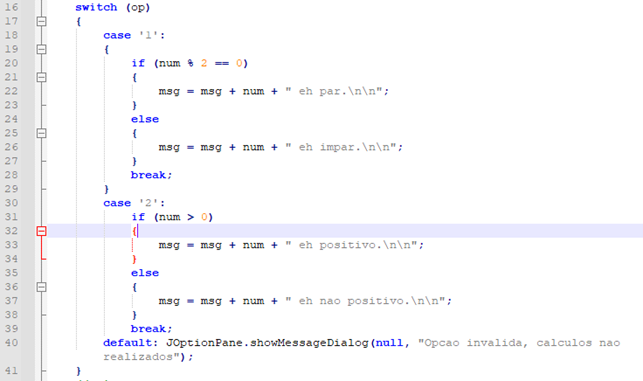

Temos uma estrutura de decisão composta da linha 20 à 29 e da linha 31 à linha 38 do programa. No primeiro case, se o valor de num for par, concatena a mensagem como sendo par, caso contrário, concatena a mensagem como ímpar. No segundo case, se o valor de num for positivo, concatena a mensagem como sendo positivo, caso contrário, concatena a mensagem como sendo não positivo.

Temos também a estrutura de múltipla escolha do switch/case da linha 16 à 40 que avalia o conteúdo do valor op. Caso for "1" realiza os comandos dentro deste case. Caso for "2" realiza os comandos dentro deste case. Caso nenhum dos cases for executado, então o default é executado apresentando a mensagem de opção inválida.

```java
// salvar como ProgDecisao.java

class ProgDecisao {

  public static void main(String entrada[]) {
    int num;
    char op = "0";
    String msg = "", msgEntr = "Digite 1 para par/ímpar\nDigite 2 para positivo/não positivo\n";

    // entrada de dados
    num = Integer.parseInt(JOption.showInputDialog("Digite um número inteiro"));
    op = (JOption.showInputDialog(msgEntr)).charAt(0);

    // processamento
    switch(op) {
      case "1":
        if(num % 2 == 0) {
          msg = msg + num + "é par.\n\n";
        } else {
          msg = msg + num + "é ímpar.\n\n";
        }

        break;
      case "2":
        if(num > 0) {
          msg = msg + num + "é positivo.\n\n";
        } else {
          msg = msg + num + "é negativo.\n\n";
        }

        break;
      default:
        JOptionPane.showMessageDialog(null, "Opção inválida, cálculos não realizados.");
    }

    // saída de resultados
    if(op == "1" || op == "2") {
      JOptionPane.showMessageDialog(null, msg);
    }

    System.exit(0);
  }
}
```

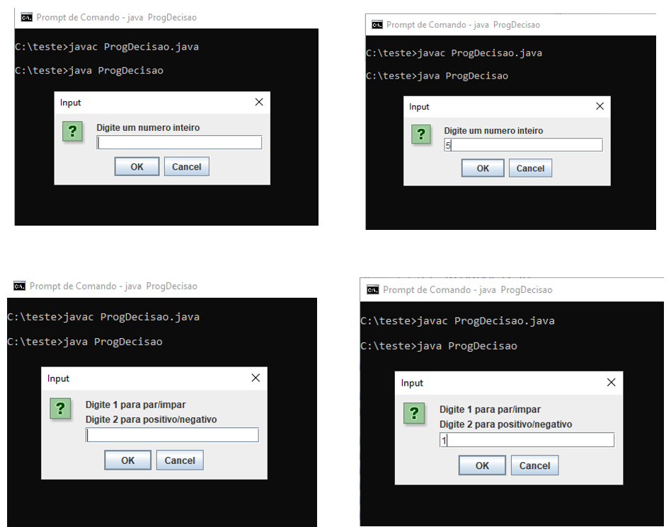
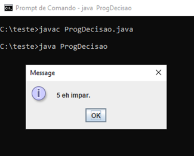
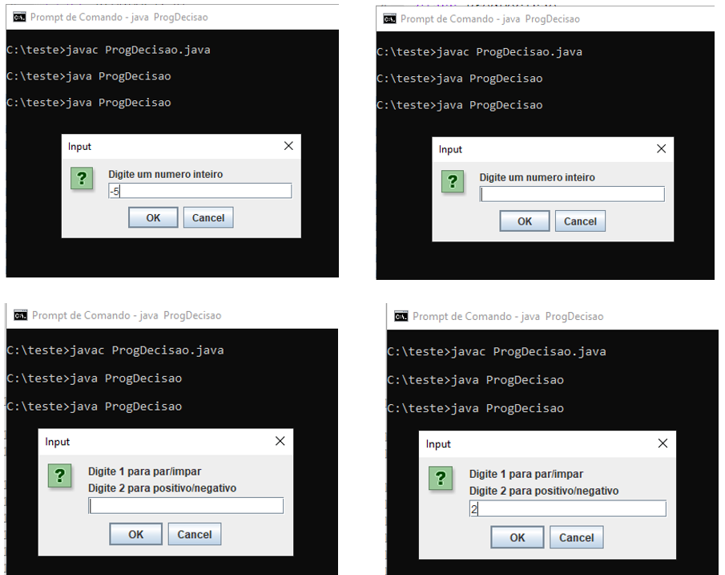
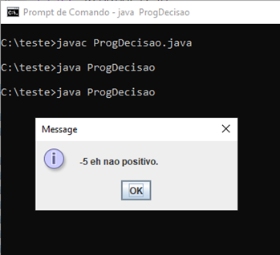

## Estruturas de Repetição

Temos três tipos de estrutura de repetição, a estrutura de repetição `for`, a estrutura de repetição `while` e a estrutura de repetição `do/while`.

Utilizamos uma estrutura de repetição quando precisamos repetir por diversas vezes um mesmo conjunto de comandos.

Numa estrutura de repetição é importante você garantir quando se inicia a repetição, a condição de parada e o comando de continuação da repetição.

Para a estrutura de repetição `for` no Java, temos a seguinte estrutura:

```java
for(<comando inicial>;<comando de parada>;<comando de continuação>) {
  <comandos que serão executados em repetição>;
}
```

Para a estrutura de repetição `while` no Java, temos a seguinte estrutura:

```java
<condição inicial>;

while(<condição de parada>) {
  <comandos que serão executados em repetição>;
  <comandos de continuação>;
}
```

Para a estrutura de repetição `do/while` no Java, temos a seguinte estrutura:

```java
<condição inicial>;

do {
  <comandos que serão executados em repetição>;
  <condição de continuação>;
} while(<condição de parada>)
```

Para exemplificar, vamos fazer um programa Java que declara variáveis e receba um número para calcular a Tabuada por alguma dessas estruturas de repetição, mostrando o resultado da Tabuada.

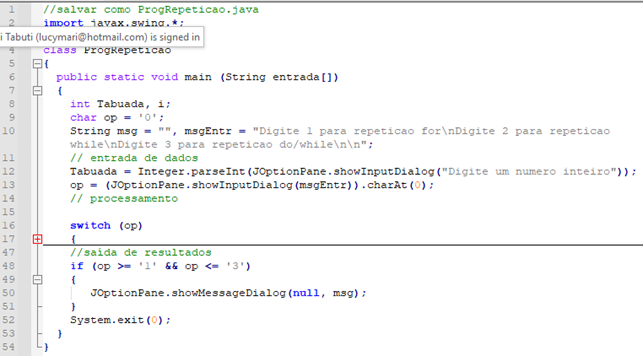
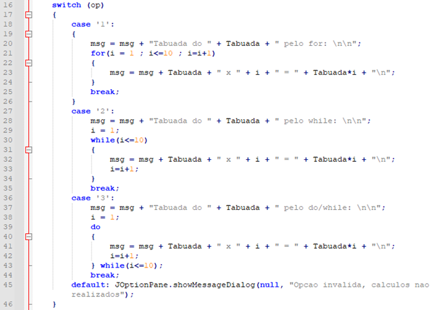

Da linha 21 à 24, a estrutura de repetição `for` está sendo utilizada para o cálculo da Tabuada, iniciando em 1, terminando em 10 e incrementando de um a um a variável i.

Da linha 29 à 34, a estrutura de repetição `while` está sendo utilizada para o cálculo da Tabuada, iniciando em 1, terminando em 10 e incrementando de um a um a variável i.

Da linha 38 à 43, a estrutura de repetição `do/while` está sendo utilizada para o cálculo da Tabuada, iniciando em 1, terminando em 10 e incrementando de um a um a variável i.

```java
// salvar como ProgRepeticao

import javax.swing.*;

class ProgRepeticao {

  public static void main(String entrada[]) {
    int tabuada, i;
    char op = "0";
    String msg = "", msgEntr = "Digite 1 para repetição for\nDigite 2 para repetição while\nDigite 3 para repetição do/while\n\n";

    // entrada de dados
    tabuada = Integer.parseInt(JOptionPane.showInputDialog("Digite um número inteiro"));
    op = (JOptionPane.showInputDialog(msgEntr)).charAt(0);

    // processamento
    switch(op) {
      case "1":
        msg = msg + "Tabuada do " + tabuada + " pelo for: \n\n";

        for(i = 1; i<= 10; i = i + 1) {
          msg = msg + tabuada + " x " + i + " = " + (tabuada * i) + "\n";
        }

        break;
      case "2":
        msg = msg + "Tabuada do " + tabuada + " pelo while: \n\n";
        i = 1;

        while(i <= 10) {
          msg = msg + tabuada + " x " + i + " = " + (tabuada * i) + "\n";
          i = i + 1;
        }

        break;
      case "3":
        msg = msg + "Tabuada do " + tabuada + " pelo do/while: \n\n";
        i = 1;

        do {
          msg = msg + tabuada + " x " + i + " = " + (tabuada * i) + "\n";
          i = i + 1;
        } while(i <= 10);

        break;
      default:
        JOptionPane.showMessageDialog(null, "Opção inválida, cálculos não realizados.");
    }

    // saída de resultados
    if(op >= "1" && op <= "3") {
      JOptionPane.showMessageDialog(null, msg);
    }

    System.exit(0);
  }
}
```

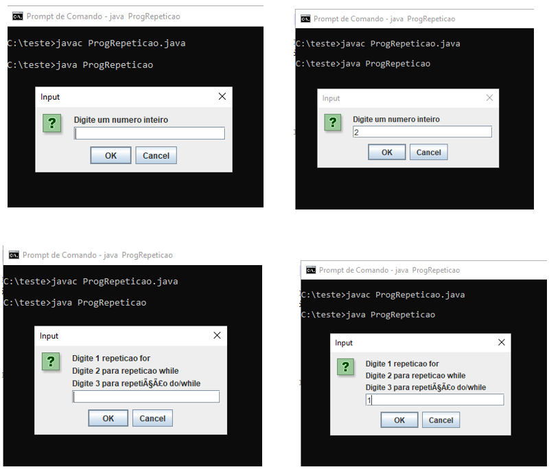
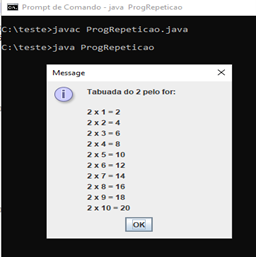
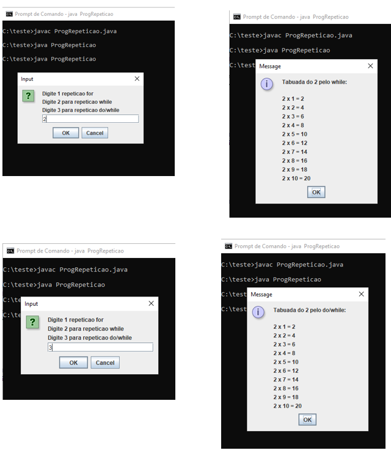
