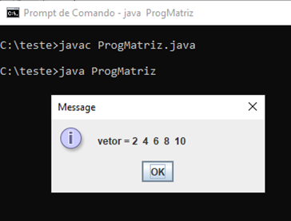
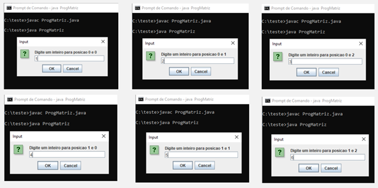
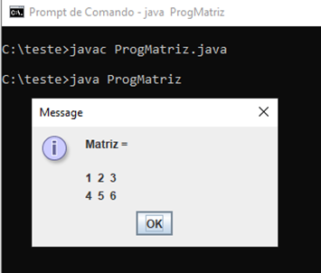
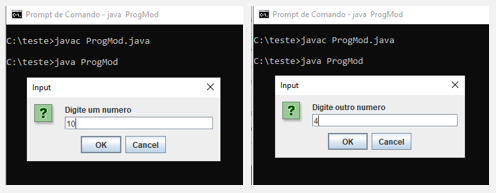
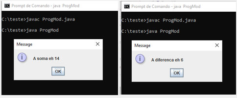
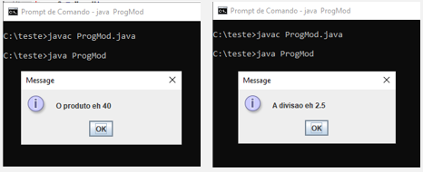

# Módulos e Matrizes

## Matrizes

As matrizes são um conjunto de informações do mesmo tipo. A matriz mais usual é a matriz de uma dimensão que é conhecida como vetor ou array. Você pode desenvolver matrizes de várias dimensões, porém, quanto mais dimensões, amais complicado de entender a organização dos dados.

Vamos exemplificar o uso de matrizes por meio do desenvolvimento de um programa Java que declara um vetor unidimensional de 5 posições e uma matriz de dimensões 2x3 (duas linhas e 3 colunas), colocando informações nessas matrizes e apresentando os resultados.

```java
class ProgMatriz {

  public static void main(String entrada[]) {
    int vetor[] = {2, 4, 6, 8, 10};
    int matriz[][] = new int [2][3];
    String msg = "vetor = ";

    // vetor
    for (int i = 0; i < vetor.length; i++) {
      msg = msg + vetor[i] + " ";
    }
    JOptionPane.showMessageDialog(null, msg);

    msg = "Matriz = \n\n";

    for(int i = 0; i < matriz.length; i++) {
      for(int j = 0; i < matriz[0].length; j++) {
        matriz[i][j] = Integer.parseInt(JOptionPane.showInputDialog("Digite um inteiro para a posição " + i + " e " + j));
        msg = msg + matriz[i][j] + " ";
      }
    }

    JOptionPane.showMessageDialog(null, msg);
    System.exit(0)
  }
}
```

Na linha 8, criamos a matriz vetor[] de uma única dimensão, já colocando os valores {2, 4, 6, 8, 10} na inicialização do vetor. Na linha 9, criamos um vetor de duas dimensões.

Na linha 15, o vetor[i] é acessado e cada uma das suas informações são concatenadas em msg. Ao final da repetição de acesso do vetor, essa mensagem é apresentada.

Nas linhas de 20 até 28, a matriz[i][j] recebe informações digitadas pelo usuário e suas informações são acessadas e concatenadas em msg que ao final da repetição encadeada do `for`, o conteúdo de msg é apresentada.





## Modularização

A modularização serve para dividir um programa maior em pequenas tarefas para serem executadas quando chamadas. Os módulos no Java são chamados de métodos e temos quatro tipos de métodos no Java.

Temos o método procedimento sem parâmetro que não recebe argumentos e não retorna valores. O método procedimento com parâmetro recebe argumentos e não retorna valores.

Temos a função sem parâmetro que não recebe argumentos e retorna algum valor. O método função com parâmetro recebe argumentos e retorna valor.

Vamos exemplificar desenvolvendo um programa que, utilizando os métodos função e procedimento, calcula a soma, o produto, a diferença e o resultado da divisão de dois números inteiros, mostrando os resultados.

```java
public static void soma() {
  int n1, n2;
  n1 = Integer. parseInt(JOptionPane.showInputDialog("Digite um número: "));
  n2 = Integer.parseInt(JOptionPane.showInputDialog("Digite outro número: "));

  JOptionPane.showMessageDialog(null, "A soma é " + (n1 + n2));
}

public static void subtracao(int x, int y) {
  int s;
  s = x - y;

  JOptionPane.showMessageDialog(null, "A diferença é: " + s);
}

public static int produto() {
  int n1, n2;
  n1 = Integer. parseInt(JOptionPane.showInputDialog("Digite um número: "));
  n2 = Integer.parseInt(JOptionPane.showInputDialog("Digite outro número: "));

  return (n1 * n2);
}

public static double divisao(int x, int y) {
  double d;
  d = (double)x / (double)y;

  return d;
}
```

Da linha 6 à linha 13, temos um procedimento soma() sem argumentos como parâmetros e sem retorno de valores.

Da linha 15 à 22, temos um procedimento subtração(int x, int y) com os argumentos x e y no parâmetro e sem retorno de valores.

Da linha 24 à 31, temos uma função produto() sem argumentos como parâmetros e com retorno do resultado de n1 \* n2.

Da linha 33 à linha 40, temos uma função divisão(int x, int y) com os argumentos x e y no parâmetro e com retorno do valor da variável d.

```java
public static void main(String entrada[]) {
  int n1, n2, s;
  double r;

  soma();

  n1 = Integer. parseInt(JOptionPane.showInputDialog("Digite um número: "));
  n2 = Integer.parseInt(JOptionPane.showInputDialog("Digite outro número: "));
  subtracao(n1, n2);

  s = produto();
  JOptionPane.showMessageDialog(null, "O produto é: " + s);

  r = divisao(n1, n2);
  JOptionPane.showMessageDialog(null, "A divisão é: " + r);

  System.exit(0);
}
```

Na linha 46, temos a chamada do método procedimento sem argumentos no parâmetro soma() e sem retorno de valores.

Na linha 49, temos a chamada do método procedimento com argumentos n1 e n2 no parÂmetro subtração(n1, n2) e sem retorno de valores.

Na linha 50, temos a chamada do método função sem argumentos no parâmetro s = produto() e com retorno do conteúdo da variável s.

Na linha 52, temos a chamada do método função com argumentos n1 e n2 no parâmetro r = divisão(n1, n2) e com retorno do conteúdo da variável r.




