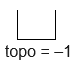
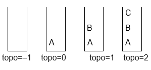
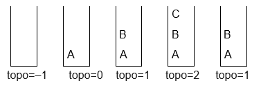

# Entendendo Pilha

A Pilha é uma estrutura que pode armazenar dados de diferentes tipos. Ela pode ser utilizada em compiladores para decodificar expressões aritméticas, calcular endereços de retorno de chamadas, armazenar variáveis locais de procedimentos e parâmetros, em sistemas operacionais e na máquina virtual Java. Podemos usá-las também na resolução de algoritmos de pesquisas e apoio à decisão de melhor caminho dentre várias possibilidades. Pilha é uma estrutura de dados muito simples; um recurso frequente na ciência da computação para a programação.

## Definição e Elementos da Pilha

Pilha é uma estrutura de dados que é utilizada quando você está programando e necessita de uma forma de lista linear. Ou seja, é quando um elemento está atrás do outro e assim sucessivamente.

Uma propriedade fundamental é que o acesso à Pilha acontece apenas por uma extremidade, que é chamada de topo, onde os elementos são inseridos, removidos ou observados. Esse processo - em que o último a entrar é o primeiro a sair - é chamado de LIFO (_last in, first out_).

Vamos demonstrar o funcionamento de uma Pilha de letras.

Inicialmente, esta pilha está vazia, ou seja, seu topo é igual a -1, conforme mostra a figura abaixo:

Vamos então empilhar a letra A na pilha, em seguida empilhar a letra B e depois a letra C, conforme a sequência abaixo. Perceba que o topo muda a cada letra que é empilhada:

Se quisermos desempilhar um elemento, só é possível pelo que está no topo. Veja a figura abaixo:

## Aplicações da Pilha

Para exemplificar, imagine as bandejas de uma lanchonete. Normalmente, elas estão empilhadas uma em cima da outra. Quando alguém vai pegar a bandeja, pega sempre a que está em cima, ou seja, a que está no topo.

Se uma pessoa for devolver a bandeja, ela a coloca por cima da pilha, ou seja, no topo. Pode acontecer da pilha estar vazia, isso significa que não tem mais bandejas e, por isso, não é possível retirar mais. Tem também a possibilidade de você só conseguir colocar uma bandeja no topo da pilha, se ainda tiver mais espaço para isso.

Quando desenvolvemos um algoritmo ou programa, muitas vezes precisamos estruturar as informações dos diferentes tipos de dados que podemos utilizar. Para isso, podemos fazer uso da estrutura de dados chamada Pilha para dispor as informações no programa inserindo, removendo e consultando-as.

Outro exemplo do uso de pilhas são os navegadores da Internet, que guardam os endereços visitados recentemente. Sempre que o usuário acessa um site, seu endereço é guardado numa pilha e quando o usuário resolve pressionar o botão de voltar, retorna-se ao endereço que tinha sido empilhado por último.

Neste capítulo veremos como e quando trabalhar com Pilhas, bem como inserir, remover, consultar e manipular dados nesta estrutura.

## Operações da Pilha

Para o funcionamento da Pilha, são necessárias algumas operações para sua manipulação. As operações de manipulação da Pilha são:

- empilhar - a operação de empilhar é a operação que insere um elemento na pilha pelo topo.

- desempilhar - a operação de desempilhar remove um elemento da pilha a partir do topo.

- pilha vazia - a operação verifica se a pilha está vazia. É muito utilizada para saber se há elementos nela.

- pilha cheia - a operação verifica se a pilha está cheia. É muito utilizada para saber se há espaço nela.

- elemento do topo - a operação mostra o elemento que está no topo da pilha. Não o remove, apenas mostra.

- mostrar pilha - a operação exibe todos os elementos que a pilha possui.

## Pilhas no Java

Na linguagem Java, já existe uma biblioteca com as operações de Pilha já definidas e desenvolvidas para uso. Estas operações estão na classe `java.util.Stack;`

As operações de Pilha disponíveis como métodos na biblioteca pela classe `java.util.Stack;` são o `push(obj)`, `pop()` e o `peek()`. O método `push(obj)` refere-se a operação de empilhar uma informação, neste caso, um objeto na Pilha.

O método `pop()` refere-se à operação de desempilhar uma informação que está no topo da Pilha. O método `peek()` refere-se às operações que retornam o topo de uma pilha, o seu tamanho e verifica-se ela está vazia ou não.

Tanto o método `pop()` quando o método `peek()` verificam, por meio do `StackEmptyException`, a exceção se a pilha está vazia, quando os métodos são chamados.

Mesmo sabendo que temos essa facilidade de ter uma biblioteca na linguagem Java, para a manipulação das operações com Pilha, nosso objetivo aqui é desenvolver essa biblioteca com os recursos básicos da linguagem Java.

Isso significa que vamos desenvolver cada método das operações que envolvem Pilha no Java e exemplificam suas aplicações.

A biblioteca será a classe Pilha, com os atributos de tamanho, topo e vetor que vão representá-la. Haverá também um construtor `Pilha(int tam)` para quando a Pilha for construída e executada.

Os métodos da classe Pilha serão:

- public boolean pilhaVazia()

- public boolean pilhaCheia()

- public void empilhar(<tipo> elemento)

- public <tipo> desempilhar()

- public <tipo> elementoTopo()

- public void mostrarPilha()
