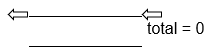
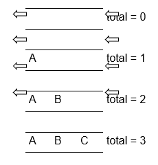
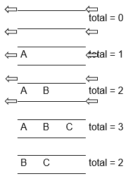

# Entendendo Fila

A fila é uma estrutura que pode armazenar dados de diferentes tipos. Ela pode ser utilizada em várias situações, como nas filas de impressão, onde vários usuários enviam seus documentos para serem impressos, considerando a prioridade de cada um. Também pode ser utilizada nos processos que esperam para serem executados pelo computador que possui apenas um processador. Além disso, também pode aparecer no tratamento do fluxo de transporte de dados nas redes de computadores. É uma estrutura muito simples e frequentemente utilizada na ciência da computação para a programação.

## Definição de Elementos da Fila

Fila é uma estrutura de dados que é utilizada quando você está programando e necessita de uma forma de lista linear. Ou seja, é quando um elemento está atras do outro e assim sucessivamente.

Uma propriedade fundamental é que o acesso à Fila acontece por suas duas extremidades, que são chamadas de início e fim. Os elementos são inseridos pelo fim e observados e removidos pelo início dela. Esse processo - de acesso apenas pelo topo, onde o primeiro a entrar é o primeiro a sair, é chamado de FIFO (first in, first out).

Vamos demonstrar o funcionamento de uma Fila de letras.

Inicialmente, esta fila está vazia, ou seja, o total de elementos na fila é igual a 0, conforme mostra a figura abaixo:

Vamos então enfileirar a letra A na fila, em seguida a letra B e depois a letra C, conforme a sequência abaixo. Perceba que o total de elementos na fila muda a cada letra que é enfileirada.

Se quisermos desenfileirar um elemento da fila, só podemos desenfileirar o primeiro elemento da fila, veja a figura abaixo:

## Aplicações da Fila

Para exemplificar, imagine uma fila de um supermercado que cabem apenas 10 pessoas. Normalmente, as pessoas estão enfileiradas umas atrás das outras. Quando a próxima pessoa é chamada, será atendida aquela que está no início da fila. Se alguma pessoa quiser entrar na fila do supermercado, ela precisa entrar no final. A fila pode estar vazia se não houver pessoas para serem atendidas. Se ela já estiver com 10 pessoas, já estará cheia e ninguém mais entrará nela.

Quando desenvolvemos um algoritmo ou programa, muitas vezes precisamos estruturar as informações dos diferentes tipos de dados que podemos utilizar. Para isso, podemos fazer uso da estrutura de dados chamada Fila para dispor as informações no programa inserindo, removendo e consultando-as.

Outro exemplo de uso de filas são os algoritmos de tratamento de fluxo de transporte de dados em redes de computadores para armazenar pacotes que chegam pela rede, mas que ainda não puderam ser processados.

Neste capítulo veremos como e quando trabalhar com Filas, bem como inserir, remover, consultar e manipular dados nesta estrutura.

## Operações da Fila

Para o funcionamento da Fila, são necessárias algumas operações para a sua manipulação. As operações de manipulação da Fila são:

- **enfileirar:** a operação que insere um elemento pelo fim da fila;

- **desenfileirar:** a operação que remove um elemento pelo início da fila;

- **fila vazia:** a operação verifica se a fila está vazia. É muito utilizada para saber se há elementos nela;

- **fila cheia:** a operação verifica se a fila está cheia. É muito utilizada para saber se há espaço nessa;

- **elemento do início:** a operação mostra o elemento que está no início da fila. Não o remove, apenas mostra;

- **mostrar fila:** a operação exibe todos os elementos que a fila possui;

## Filas em Java

Na linguagem Java, já existe uma biblioteca com as operações de Fila já definidas e desenvolvidas para uso. Estas operações estão na classe java.util.Queue.

As operações de Fila disponíveis como métodos na biblioteca java.util.Queue são o add(obj), remove(obj), element() e o peek(). O método add(obj) refere-se à operação de enfileirar uma informação, neste caso, um obj na Fila.

O método remove() refere-se à operação de desenfileirar uma informação que está no início da Fila. O método peek() refere-se às operações que retornam o início de uma Fila, o seu tamanho e verifica se a Fila está vazia ou não.

Tanto o método remove() quanto os métodos elemento() e peek() verificam, por meio do NoSuchElementException, a exceção se a fila está vazia, quando os métodos são chamados.

Mesmo sabendo que temos essa facilidade de ter uma biblioteca na linguagem Java, para a manipulação das operações com Fila, nosso objetivo aqui é desenvolver essa biblioteca com os recursos básicos da linguagem Java.

Os métodos da classe Fila serão:

- public boolean filaVazia()

- public boolean filaCheia()

- public void enfileirar(<tipo> elemento)

- publico <tipo> desenfileirar()

- public <tipo> elementoInicio()

- public void mostrarFila()

**Referência Bibliográfica**

PUGA, S.; RISSETTI, G. **Lógica de Programação e Estruturas de Dados, com aplicações em Java.** São Paulo. Editora Pearson. 3ª. Edição. 2016.

FORBELLONE, A.L.V.; EBERSPACHER, H.F. **Lógica de Programação: a construção de algoritmos e estruturas de dados.** 3ª Edição. São Paulo. Prentice Hall. 2005.
