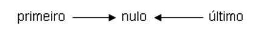
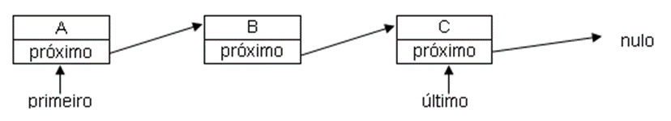
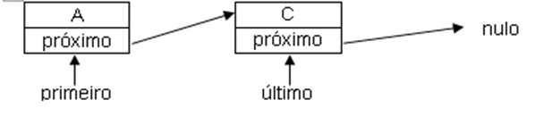

# Entendendo os Elementos da Lista Ligada

Será apresentado a seguir a definição de lista ligada, seus exemplos e representações, vem como as operações de manipulação dela.

## Definição de Lista Ligada

Ao desenvolver algoritmos ou um programa estruturado, muitas vezes precisamos organizar e estruturar diferentes tipos de dados que são passíveis de utilização no programa ou algoritmo.

Neste caso, podemos utilizar a estrutura de dados chamada Lista Ligada, onde as informações podem ser inseridas, removidas e consultadas para realizar determinada operação.

Comparada a outras estruturas de dados, como vetores, matrizes, filas e pilhas, a Lista Ligada tem uma vantagem, que está relacionada à memória utilizada. Nas outras estruturas de dados, é preciso alocar a quantidade de memória do tamanho de cada uma delas.

Na Lista Ligada, a alocação de memória é realizada a penas quando a informação é inserida. Ou seja, não há necessidade de alocar memória ociosa, isto é, que não está sendo utilizada.

A Lista Ligada é uma estrutura de dados que se dispõe em forma linear, onde um elemento está seguido de outro e segue dessa forma para todos os elementos da lista.

Numa lista ligada, as informações estão organizadas de forma que cada informação tem uma ligação com o próximo elemento. Isso significa que os elementos não estão armazenados sequencialmente na memória e sim na ordem dos endereços que eles ocupam na memória.

Os elementos são armazenados de forma lógica na Lista Ligada. Ela pode ser utilizada também para representar pilhas e filas.

## Elementos da Lista Ligada

Falando do funcionamento da lista ligada, conforme suas representações de inserção e remoção de elementos, é possível verificar e pensar em algumas operações a serem definidas.

- **Inserir no início:** é uma operação que insere um elemento no início da Lista Ligada, independente da quantidade de elementos que tenha a estrutura.

- **Inserir no final:** é uma operação que insere um elemento no final da Lista Ligada, independente da quantidade de elementos que tenha a estrutura.

- **Inserir no meio:** é uma operação que insere um elemento no meio da Lista Ligada, na posição indicada, independente da quantidade de elementos que tenha a estrutura.

- **Lista vazia:** é uma operação que verifica se a Lista Ligada está vazia e retorna verdadeiro se estiver e falso se não estiver vazia.

- **Elemento do início:** é uma operação da lista ligada que mostra, sem remover, o elemento que está no início da estrutura.

- **Elemento do final:** é uma operação da lista ligada que mostra, sem remover, o elemento que está no final da estrutura.

- **Remover:** é uma operação da Lista Ligada que remove um elemento que está nela, seja no início, no meio ou no final.

- **Contar nós:** é uma operação da Lista Ligada que verifica quantos elementos existem nela e retorna essa informação.

- **Mostrar lista:** é uma operação da lista ligada que mostra todos os elementos que estão na estrutura.

- **Buscar:** é uma operação da lista ligada que verifica se determinado elemento pertence à estrutura, retornando esta informação.

- **Destruir:** é uma operação que elimina todos os elementos da Lisa Ligada, destruindo-a totalmente.

## Representações da Lista Ligada

Vamos exemplificar o funcionamento da Lista Ligada com uma representação com letras como informações.

Logo que você começa a construção da lista ligada, ela está vazia, isso significa que não existem elementos nela. Neste caso, o primeiro e o último elementos da lista ligada estão apontando para nulo. Veja a figura:

Podemos inserir nesta Lista Ligada a letra A, em seguida, a letra B e por último, a letra C, conforme a figura apresentada na sequência.

Perceba que o tamanho da lista ligada muda a cada letra que é inserida. Temos o tamanho 1 quando está inserida apenas a letra A. O tamanho 2 quando estão inseridas as letras A e B e, enfim, o tamanho 3, quando estão inseridas as letras A, B e C.

É possível remover qualquer elemento, independente da posição em que estiver. Pode estar no início, no final e mesmo lá no meio da lista ligada.

Por exemplo, vamos remover a letra B e ver como fica a lista ligada.

## Exemplificando Aplicações da Lista Ligada

Para exemplificar a utilização da Lista Ligada, imagine uma fila de banco nos dias de hoje.

Existe uma senha numérica sequencialmente organizada que os clientes vão pegando conforme vão chegando.

Assim que os clientes estão com a senha, eles podem se sentar nas cadeiras de forma aleatória, não existe uma fila física entre as cadeiras.

Quando o painel do banco chama a próxima senha, o clientes que está com o número correspondente levanta da cadeira e segue para o caixa para ser atendido.

Os clientes não se sentam na cadeira em forma de fila. Conforme o cliente é chamado, todos permanecem onde estão sentados, a fila não se move fisicamente como acontece numa fila de supermercado.

A lista ligada pode estar vazia e sempre é possível inserir um novo elemento nela, ela não fica cheia.

**Referência Bibliográfica**

CORMEN, T. H.; LEISERSON, C. E.; RIVEST, R. L.;STEIN, C. **Algoritmos Teoria e Prática.** Editora Cammpus. 3a Edição. 2012.

GOODRICH, M. T.; TAMASSIA, R. **Estruturas de Dados & Algoritmos em Java.** Editora Grupo A: Bookman, 5a Edição. 2013.
