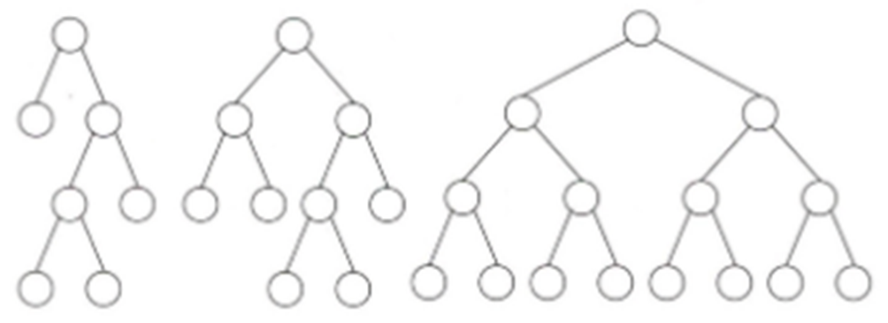
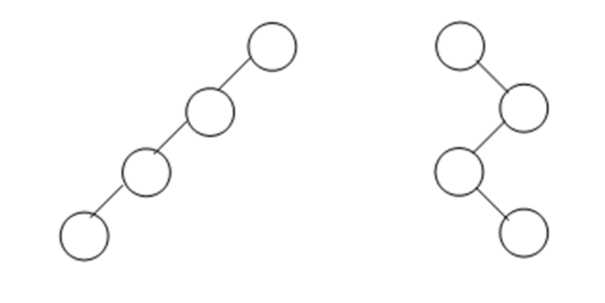
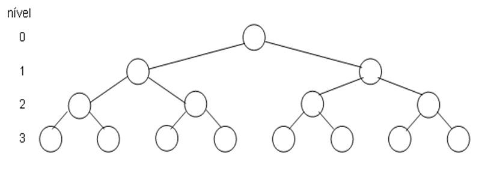

# Entendendo Árvores

São apresentadas, a seguir, a definição de árvores, elementos de uma árvore, definição de árvore binária e árvores binárias de busca.

## Definição e Elementos

Quando estamos desenvolvendo um programa ou um algoritmo, muitas vezes, precisamos de uma forma para estruturar as informações de diferentes tipos de dados. A estrutura de dados chamada árvore é uma estrutura de dados que pode ser armazenada com diferentes tipos de dados.

Nas estruturas de dados que utilizam o conceito de árvore, pode-se realizar operações de inserção, remoção e consulta das informações.

As estruturas de dados com árvores podem ser desenvolvidas com o uso de listas ligadas e também da recursão.

As estruturas de árvores são bastante utilizadas quando se precisa acessar as informações de forma direta ou sequencial de maneira eficiente.

Ao trabalhar com algoritmos de manipulação de utilizam os conceitos de árvores, é possível realizar operações como inserções, remoções e utilizar memórias primárias e secundárias em suas manipulações.

Quando estamos falando em árvores, há diferentes formas de manipular as informações em árvores e há diferentes tipos de árvores, como as árvores binárias, as árvores rubro negras, as árvores B, as árvores AVL, entre outras.

A estrutura de árvore é uma estrutura de dados bidimensional e não é linear, como são as estruturas de vetor, pilha e fila.

As estruturas de árvores são compostas por dois elementos, que são os nós, onde são armazenadas as informações e os arcos, que ligam os nós onde ficam os elementos.

As estruturas de árvores são representadas de cima para baixo, onde o nó mais em cima é chamado de raiz e os nós mais baixos são chamados de folhas.

As estruturas de árvores possuem nós com nomes específicos, como: raiz, folhas, pais e filhos. Todos estes elementos possuem suas funcionalidades.

Podemos dizer que, de modo geral, uma árvore possui as seguintes características:

- **nó raiz:** É o primeiro nó da árvore que fica acima de qualquer outro nó. Todos os outros nós são descendentes deste nó. Existe comente um nó raiz em qualquer estrutura de árvore;

- **nó folha:** É o último nó da árvore, por isso, ele não possui descendentes. Pode existir mais de um nó folha na árvore;

- **nó interior:** É o nó que está no interior da árvore. Este nó possui descendentes e ascendentes e não pode ser nó raiz e nem o nó folha;

- **trajetória:** É o número de nós que possui entre um nó e outro;

- **grau do nó:** É o número de descendentes que um nó possui. Também pode ser definido como o número de subárvores que um nó possui;

- **altura da árvore:** É o número máximo de níveis que pode ter o nó da árvore;

- **altura do nó:** É o número máximo de níveis que pode ter os descendentes deste nó;

Para exemplificar a árvore, pode-se pensar nos diretórios e arquivos de computadores. Os arquivos que criamos num computador podem ser armazenados dentro de um diretório. Este diretório, por sua vez, pode armazenar outros diretórios que podem ser chamados de subdiretórios.

Esses diretórios também podem armazenar outros arquivos e subdiretórios e assim por diante de forma recursiva. O primeiro diretório que criamos é o que chamamos de nó raiz e os últimos arquivos que armazenamos no último subdiretório que criamos é o que chamamos de nós folhas.

## Características

Uma árvore binária possui grau zero, um ou dois. Isso significa que uma árvore binária possui zero, um ou dois filhos.

Numa árvore binária, um nó pode ter até dois filhos. Por isso, é chamado de binário, esta árvore pode ter zero, um ou no máximo dois filhos.

Numa árvore binária, a profundidade de um nó é a distância que existe deste nó até a raiz. Cada nó tem a sua profundidade. A maior das profundidades é a do nó raiz.

Numa árvore binária, o nível é o conjunto de nós com a mesma profundidade. Uma árvore binária pode ter vários níveis.

A raiz de uma árvore binária tem nível zero, seus filhos estão no nível 1 e assim por diante até o nível em que se encontram as últimas folhas, que estarão no último nível da árvore binária.

Uma propriedade fundamental de qualquer árvore binária é que existe um único caminho de sua raiz para qualquer nó, seja um nó interno ou uma folha.

A altura de uma árvore binária é a maior profundidade de um nó. Essa profundidade pode ser calculada pelo nós raiz.

Uma árvore estritamente binária, na figura seguinte, a que está mais à esquerda, é uma árvore em que todos os nós ou tem zero folhas ou tem duas folhas. Este tipo de árvore também é conhecida como quase completa.

Uma árvore binária completa, na figura seguinte, a que está no meio, é quando todos os níveis têm o máximo número de elementos.

A árvore binária cheia é a que está à direita na figura seguinte.

Temos as árvores degeneradas, que são árvores binárias que possuem apenas um elemento em cada nível. Temos as árvores degeneradas à esquerda, onde cada nó possui apenas filhos à esquerda.

As árvores degeneradas à direita, onde cada nó possui filhos à direita. E, as árvores degeneradas zig-zag, cujos filhos alternam um para a direita e outro para a esquerda, conforme podemos observar na imagem seguinte.

## Tipos de Árvores

As árvores binárias, dependendo da forma em que seus elementos são inseridos, podem ficar com o máximo de profundidade, neste caso, um nó em cada nível.

Para evitar esse tupo de árvore binária, elas podem ser balanceadas. Numa árvore balanceada, a altura da subárvore direita e da subárvore esquerda tem uma diferença de no máximo dois níveis.

As árvores binárias balanceadas são muito utilizadas para construir e manter listas ordenadas, como as filas de prioridades.

Temos também as árvores 2-3, árvore AA, árvore Splay, entre outras formas de representar árvores como estruturas de dados.

Uma árvore binária pode ser separada por níveis. O menor nível é o nível zero está o nó raiz da árvore binária.

Tem o nível mais profundo que é o nível onde estão todas as folhas.

Uma árvore binária é considerada completa se todos os nós dessa árvore tiverem uma subárvore binária à direita e outra à esquerda.

Uma exceção nesta árvore binária completa é os nós folhas que estão no mesmo nível. Isso acontece apenas na árvore binária completa.

Veja a figura de uma árvore binária completa que tem os níveis de zero até três. São quatro níveis. Veja que todas as folhas estão no mesmo nível.

## Operações em Árvores

Com relação ás operações em árvores binárias, serão abordadas as seguintes:

- Inserir um nó na árvore;

- Remover um nó de uma árvore;

- Consultar os nós da árvore em ordem;

- Consultar em pré-ordem;

- Consultar em pós-ordem;

- inserir - a operação de inserir insere um elemento na árvore binária;

- exibir à esquerda - a operação de exibir à esquerda mostra todos os elementos à esquerda de determinado nó;

- exibir à direita - a operação de exibir à direita mostra todos os elementos à direita de determinado nó;

- exibir raiz - a operação de exibir a raiz, mostra o elemento da raiz da árvore binária;

- remover - a operação de remover exclui um elemento da árvore binária;

Na operação de inserção, as propriedades de uma árvore devem ser obedecidas, e todo novo nó é sempre uma folha. Além disso deve ser inserido respeitando a ordenação dos elementos dentro da árvore.

Nas operações de consulta, em ordem, pré-ordem e pós-ordem, todos os nós da árvore são listados, alterando-se apenas sua ordem.

Na consulta em ordem, cada árvore é mostrada com o ramo da esquerda, a raiz e, posteriormente, o ramo da direita.

Na consulta pré-ordem, cada árvore é mostrada com a raiz, o ramo da esquerda e, posteriormente, o ramo da direita.

Na consulta pós-ordem, cada árvore é mostrada com o ramo da esquerda, o ramo da direita e, posteriormente, a raiz.
