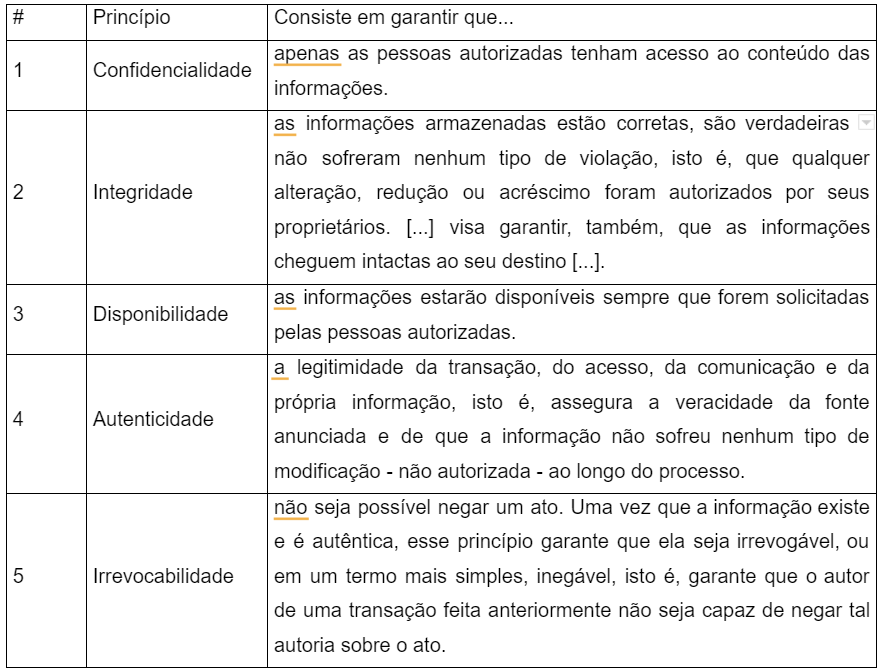

# Melhores Práticas

Nesta unidade vamos fazer com que as 4 aulas nos permitam ter uma visão melhor do que representa uma empresa online, primeiro com o conceito de CBO e como uma empresa pode ser baseada na web, uma verdadeira e-business. Sobre a dinâmica da contratação de serviços cloud vamos tratar do conceito de Nuvem Mínima Viável (MVC) e como tal conceito contribui para a otimização do que a empresa contrata online.

Por fim, vamos navegar pelos conceitos de Governança TI para compreender como este tema deve ser portado ao mundo cloud e como contratar serviços em nuvem não significa terceirizar governança. Fechando a fatura vamos compreender um pouco do que representa o termo segurança online e como é um dos pilares para o sucesso de qualquer empresa que ouse sua presença na web.

## Escritório de Negócios em Nuvem (CBO)

Para que você, estudante, tenha melhor visão de gestor, de dono de empresa, vamos agora, pensar Cloud Computing pela ótica da implementação. Vamos analisar algo vital para o sucesso de qualquer implementação corporativa: a existência de pré-requisitos, de um cenário favorável, claro que pensando na possibilidade da existência do escritório em nuvem.

A empresa que deseja usufruir de serviços cloud de forma a ter real vantagem em relação a outras formas de propriedade deve se perguntar se é capaz de existir como escritório virtual, se sua cultura permite virtualizar operações e até mesmo comportamentos. Embora a amplitude da oferta de serviços cloud signifique que, nem sempre a porção cloud da empresa será grande o suficiente para lhe conceder o status de escritório em nuvem, é fato que sua implementação será sempre disruptiva. Para compreender melhor o que representa o escritório em nuvem, PTI (2019, online) conceitua que:

> O CBO serve como ponto central na tomada de decisão e comunicação para o seu programa em computação na nuvem, seja ele interno ou externo à sua empresa. Ele atua como um órgão operacional e administrativo permanente, que orienta em todos os aspectos, desde a primeira implementação até as operações em andamento na nuvem.

Agora falando de instâncias onde a empresa praticamente se fecha para o mundo físico e parte para uma ação centralizada no universo web, o conceito de escritório em nuvem ganha outra face, outra relevância em termos de cultura, de implementação e de adaptação. Em empresas voltadas ao ambiente e-business precisam garantir uma cultura condizente cujo papel dos líderes será de acompanhar as adaptações e quebras de paradigma sempre com os objetivos em vista, não somente do negócio em si, mas também da integração da equipe com sua nuvem.

A liderança passa a ser ainda mais relevante na integração dos escritórios em nuvem, conforme defende PTI (2019, online) ao dizer que membros de tempo integral possuem responsabilidade diária pela adoção, implementação e gerenciamento da nuvem para a organização. Até mesmo líderes de tempo parcial são vitalmente importantes pois buscam dar visibilidade ao processo de implementação visando o sucesso do programa cloud.

O mundo é conectado! Esta frase já não soa mais tão inovadora e disruptiva como deveria e um número que mostra o quanto as empresas estão “subindo” para a nuvem dá conta de que entre 2019 e 2020:

> De acordo com um estudo realizado pelo SAS Brasil, 80% das empresas avaliadas têm ou terão um projeto baseado em Cloud Computing nos próximos 12 meses. A pesquisa foi feita com 286 executivos C-level das áreas de tecnologia e análise de dados de grandes empresas da América Latina, dos quais 180 brasileiros de companhias das áreas de varejo, telecom, setor público, serviços de utilidade pública, indústrias, serviços financeiros e bens de consumo. 

Mas será que estas empresas estão preparadas para serem escritórios em nuvem? Embora a web esteja entre nós a algumas boas décadas, existe muita novidade no que diz respeito da relação que as empresas têm com as tecnologias e serviços na nuvem que ainda é novidade e, embora o número seja elevado (afinal 80% é algo gigante) existe ainda muita inexperiência que precisa ser endereçada, mitigada pelos gestores.

Toda esta incerteza leva a necessidade por serviços cloud a passar por provedores destes serviços e ocorre através deles toda a estruturação, avaliação de necessidades. Talvez deixar o desenvolvimento e migração cloud na mão de terceiros, mesmo que bem intencionados, não seja recomendado a todas as empresas pois pode tirar a especificidade da empresa em detrimento de uma solução de prateleira.

## A Nuvem Mínima Viável

Qual é o menor passo que uma empresa pode dar dentro do universo cloud? Isso significa que a empresa precisa entender que as soluções em nuvem estão sempre amarradas e que deve existir um mínimo de serviço contratado para que faça sentido. Fugindo do tema um pouco, pense no seguinte: faz sentido uma pessoa contratar um serviço de assinatura para cobrança de pedágio sem saber dirigir ou possuir um veículo?

Para que você, estudante, compreenda melhor o exemplo dos pedágios, vamos ao que significa um conceito que para nós é paralelo, o conceito de produto mínimo viável, ou MVP. Para Boscarioli (2016: 64) traz os seguintes pontos principais que determinam um MVP:

- Mínimo: é o menor tamanho possível, que possa ser entregue no menor tempo possível.

- Viável: uma proposta de valor que seja importante o suficiente para que seu principal cliente alvo utilize o seu produto.

- Produto: funcionalidades que apresentem o valor da proposta final, a fim de que os usuários criem expectativas quanto à versão final do produto.

Aplicando o MVP sobre serviços cloud, mas do ponto de vista de quem contrata, formamos uma nuvem mínima viável (MVC) quando o pacote entregue vai virtualizar via web todos os serviços necessários, sem penduricalhos e excessos que apenas vão custar recursos financeiros ou tornar a aplicação dos recursos necessários onerosa e lenta. Sobre o conceito de produto mínimo viável aplicado ao universo cloud,  PTI (2019, online) defende que:

> A nuvem mínima viável (MVC) é uma das mais importantes práticas na adoção. Com base no conceito do produto mínimo viável, o MVC é o ponto inicial de sua primeira nuvem de produção e uma plataforma que você irá melhorar à medida que você migra para a nuvem. Azure, AWS e Google permitem a programação de automação, como principal meio para construir uma nova plataforma. Portanto, agora devemos pensar em nossa nuvem como um software.

O menor pacote cloud ou MVC parte de um planejamento cuidadoso dentro de um bom ciclo de governança de TI que alocará em cloud apenas o que se precisa em cloud. Embora serviços em nuvem representem uma gama muito ampla, podemos dizer que a disponibilidade de dados ilustra bem o comportamento de uma MVC pois o armazenamento na nuvem tende a ser um serviço muito popular e que mostra por onde começar neste sentido.

Quando a empresa compreende que infraestrutura robusta de TI para armazenamento de dados é uma necessidade, mas que o custo de implementação de todo o hardware, software e de pessoal competente é muito fora do que dispõe e que este fato não elimina a necessidade latente, ela busca na nuvem algo similar que lhe atenda. Mas para que o armazenamento em nuvem se torne o MVC da empresa é preciso que forme um pacote com outros serviços correlatos e que façam sentido a necessidade da empresa. Este pacote de serviços deve ser capaz de entregar valor ao cliente e atender suas expectativas.

Desta forma, podemos ter a nuvem mínima viável não como conceito bruto, mas como uma ideologia, uma forma de tratar o processo de implementação da cultura cloud em uma cultura que podemos chamar de offline. Claro que atualmente as pessoas em geral são mais conectadas e este fator acelera processos de adoção de soluções cloud, mas é preciso que a adoção seja acompanhada, monitorada de forma a não ser uma onda natural, precisa ser induzida, incentivada.

## GOVERNANÇA DE SERVIÇOS CLOUD

Não é por acaso que o termo governança vem de governo, governar, e se refletirmos sobre o que significa governar vamos compreender melhor o que representa a governança para os recursos que a empresa possui, em quais áreas precisam alocar mais e menos recursos. Conforme o governo de um país vai se desenrolando, seu governante percebe a necessidade de mudar alguns aspectos, áreas onde investia pouco e necessita investir mais, mas sempre tendo seu plano de governo como base para os parâmetros de suas decisões.

Claro que Governança de TI é, assim como o plano de governo de um país, um almanaque muito maior do que listas com indicações de onde investir e quanto, para Moraes e Gonçalves (2018: 19) a Governança teve seu termo mencionado pela primeira vez na década de 1990 e pode ser definida “como uma forma de mensurar as relações que englobavam as regras de negócios por meio de um sistema de tecnologia da informação. Atualmente, a tecnologia da informação remete aos procedimentos aplicados por alguma tecnologia, os quais visam ao direcionamento das informações.

Para Santos e Baruque (2010, p. 8 apud Moraes e Gonçalves (2018: 22), “[…] a governança de TI pode ser traduzida como a administração da Tecnologia da Informação (TI) de forma a garantir o total controle sobre os seus resultados, que devem estar alinhados aos objetivos do negócio”.

Não se deve conduzir uma empresa sem um projeto, sem um governo, por isso que as empresas buscam estabelecer seus planos de governança para seu TI, assim como para sua gestão e administração. Mas dado o nível de investimento que é muitas vezes indicado, a governança em TI gera destaque, importância e de acordo com Kalendae (2019, online) a Governança para os serviços na nuvem é importante pois:

> Atualmente, grandes empresas lidam com a concorrência de startups. Segmentos tradicionais como o bancário veem seu domínio de mercado ameaçado pelo surgimento de novas empresas baseadas na nuvem. Por isso a governança em cloud é importante. Por meio da avaliação de vários aspectos da computação em nuvem, ela garante que esses recursos sejam adequadamente contratados. Uma boa governança é essencial para a otimização das atividades. Continue a leitura para entender as particularidades da governança em cloud!

Não diferente de um governante de um país, o gestor encarregado do plano de Governança de TI está sempre cercado de indicadores para conhecer de imediato mudanças no mercado, na oferta de serviços cloud e até mesmo na legislação, na proteção de seus dados, de forma a sempre estar um passo à frente alocando de forma eficiente os recursos necessários em áreas de maior necessidade.

Serviços cloud costumam livrar o gestor de uma série de preocupações o deixando mais concentrado no objetivo de seu negócio, e sobre esta agilidade Kalendae (2019, online) afirma que a nuvem promove agilidade, livra o gestor de preocupações com infraestrutura enquanto aproveita melhor os benefícios da entrega praticamente imediata de softwares sempre atualizados

> A nuvem oferece recursos para desenvolvimento ágil. Com isso, a empresa não precisa se preocupar com infraestrutura e pode usufruir dos benefícios da entrega de sistemas em módulos. Dessa forma, novas versões dos softwares serão disponibilizadas mais rapidamente, o que traz vantagens significativas em produtividade: é possível usufruir de benefícios do software antes de sua finalização.

Partindo do pressuposto de que uma boa governança em nuvem deve manter a empresa sincronizada com os melhores produtos e serviços, produzindo uma estratégica integração contínua, e uma forma de manter sempre este conceito no radar está na aplicação do DevOps. O DevOps é uma metodologia de desenvolvimento de software que integra desenvolvedores (dev) e profissionais de infraestrutura (ops) em um ecossistema de muita eficiência, o que, no caso da governança, auxilia e muito em integrar processos e soluções efetivando os planos e ciclos previstos.

De acordo com Gartner (2017, apud Santos 2019) o DevOps é importante para a Governança de TI e Cloud por representar uma mudança de cultura profunda focando em entrega rápida dos serviços graças a adoção de práticas ágeis e enxutas e sempre com a abordagem destas entregas voltada para o sistema. Conforme se fundamenta o DevOps, seu destaque se origina das pessoas, da cultura e busca a melhor integração e colaboração.

Portanto quem busca as melhores práticas para a sua integração com serviços cloud deve olhar atentamente para metodologias ágeis como a DevOps, tendo em vista que a efetividade dos serviços cloud contratados dependerá de um desenvolvimento, mesmo que não em nível de programação, mas ao menos de uma sistemática de integração estudada, planejada e customizada para a realidade da empresa, de seu mercado e seus objetivos.

## Segurança para serviços Web

Vamos nos pautar aqui na segurança da informação, tendo em vista que ao colocar a empresa, total ou parcialmente, na internet, muitas informações sensíveis e até sigilosas estarão sendo depositadas em confiança nos servidores cloud contratados, o que é algo delicado.

Pensar em segurança online pode até ser um conceito alienígena para muitos usuários, brasileiros ou não, pois hoje em dia os dispositivos que nos permitem acesso a web provêm embarcadas muitas soluções de segurança. Mas quando caímos na esfera corporativa a coisa muda de figura e soluções embarcadas, padronizadas ou básicas já não mais garantem a tranquilidade do gestor.

Você utiliza serviços de seu banco via internet? Bem, eu utilizo frequentemente e são raras as vezes que necessito de me dirigir a uma agência ou outro local de pagamento ou até mesmo caixas eletrônicos. Se você nunca usou seu banco via internet ou aplicativo de smartphone, mas já observou alguém utilizá-lo, deve ter notado as diversas medidas de segurança que existem nestes sistemas como senhas, digitais, tokens, etc. Todas estas medidas e muitas outras que “rodam” por trás dos bastidores dos sistemas bancários (e muitos outros) estão ativas para proteger sua informação, seus dados de acesso e com isso impedir golpes e crimes virtuais.

Claro que a necessidade de segurança de muitas empresas é, na maioria das vezes, senão menos intensa, ao menos diferente das necessidades de segurança da informação de um banco. O que muda o nível de segurança que a empresa precisa está relacionado primeiro com suas necessidades, com as aplicações online que utiliza. Outro ponto que molda as necessidades de segurança da empresa é o nível de relevância de sua atividade e das informações que precisa circular pela web. 

Por fim, a segurança online da empresa pode ser moldada pela aplicação web que contrata e pelo projeto de governança de TI da empresa na qual usa seus serviços cloud. Empresas menores podem ter aplicações e medidas de segurança menos robustas que empresas maiores e isso impacta na proteção entregue ao usuário final, algo a ser considerado pelo gestor ao contratar seus serviços cloud.

De uma forma geral, o conceito de segurança da informação pode ser definido de acordo com Galvão (2015: 12) como sendo “A segurança da informação tem como meta a proteção dos sistemas de informação contra a invasão e modificação dos dados por pessoas não autorizadas. Ela deve proteger as informações armazenadas.”.

Sequestro de dados com exigência de pagamento tem sido um dos crimes de segurança virtual mais relatados nos últimos tempos. Os chamados ransomwares ocorrem, de acordo com Cardoso (2016) quando o computador é infectado por um vírus do tipo malware que “sequestra o computador da vítima e cobra um valor em dinheiro pelo resgate, geralmente usando a moeda virtual bitcoin, que torna quase impossível rastrear o criminoso que pode vir a receber o valor.”

No Brasil existem centenas de milhares de quadrilhas especializadas em crimes virtuais agindo de maneira variada roubando dados, desviando dinheiro em contas de grandes bancos e, para se ter um breve vislumbre do tamanho do problema, apenas no caso dos ransomwares, de acordo com Garrett (2019, online) as estatísticas deste crime virtual são alarmantes:

> O Brasil é o segundo colocado no mundo no número de ataques do tipo ransomware, vírus que sequestra dados do celular ou PC e exige resgate em dinheiro. É o que aponta o relatório Smart Protection Network, da Trend Micro, revelado nesta quarta-feira (13). No país acontecem 10,75% das ameaças, atrás apenas dos Estados Unidos, que representam 11,05%.

Não estamos argumentando e resgatando estatísticas apenas para mostrar que crimes virtuais ocorrem com uma frequência alarmante, mas também para dizer que o gestor que embarcar no oceano da internet deve se proteger, não com botes salva-vidas digitais, os anti-vírus, mas com uma série de medidas que vão até mesmo na esfera comportamental.

São diversas as medidas de segurança digital que não necessariamente dependem da assinatura de algum serviço, e a seguir trataremos de tais medidas. Dentre as principais medidas de segurança na web encontramos: Confidencialidade, Integridade, Disponibilidade, Autenticidade e Irrevocabilidade, conforme quadro a seguir:

Portanto, use tais princípios e medidas de segurança no ambiente da web com bastante vigor (lembre-se das estatísticas sobre o ransomware) e busque reconhecer nos fornecedores de serviços cloud qual o grau de empenho que possuem em cada um dos princípios.
