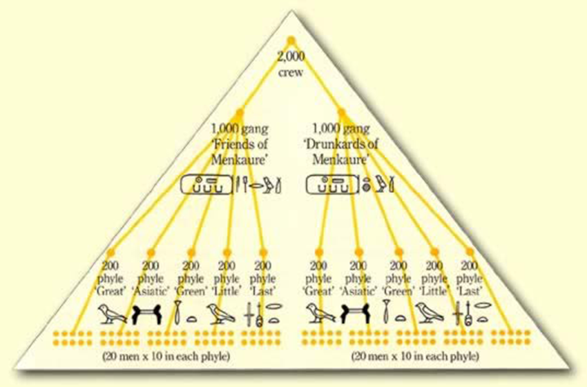

# Aurora da Gestão de Projetos

## Introdução

Por que o gerenciamento de projetos é importante? É uma pergunta interessante que os clientes às vezes fazem e em alguns casos os novatos na área.

Os clientes perguntarão:

- Não podemos apenas informar a equipe que está fazendo o trabalho e gerenciá-los nós mesmos?

- Vai ser muito mais barato!

Na verdade essa pergunta não precisa ser exteriorizada, muitas vezes vemos nos olhos deles durante uma reunião de projetos. E não importa se a área de projetos é interna representada por um PMO - Escritório de Projetos ou se é um prestador de serviços especializado em gerenciamento de projetos.

Perceba que eu estou escrevendo que os clientes se perguntam se realmente precisam de gerenciamento de projetos, porque no papel parece um imposto e sobrecarga desnecessários, já que os gerentes de projeto não entregam nada e muitas vezes atrapalham o que desejam que a equipe faça! Essa é a visão de muitos clientes e muitas consultorias nesses últimos 20 anos que participei ou trabalhei pessoalmente.

Além disso, como Kerzner (2011) expõe que, uma empresa, pelo menos a maioria delas, dispõe de seis recursos: dinheiro, mão de obra, equipamentos, instalações, materiais e dados/tecnologia. Claro, o gerente de projetos não controla nenhuma delas, porque na verdade quem controla esses recursos são os gerentes de linha ou gerentes funcionais se preferir.

De tal forma que creio que você já esteja começando a perceber porque gerenciar projetos é importante. Se o gerente de linha cuida desses 6 recursos, quem harmoniza, orquestra, controla um "monte" de gerentes de linha com interesses muitas vezes contraditórios? Então, para nossa visão que estamos na área, gestão de projetos é importante, mas e na visão do cliente, por que o gerenciamento de projetos deveria ser importante?

Por que há cada vez mais pessoas se certificando? Por que os RH estão desesperados procurando Gerentes de Projetos? Porque tantas vagas são publicadas diariamente atrás de Gerentes de Projetos?

Simples. Pessoas são adversas a regras e controles, queremos liberdade. Todavia, em projetos, liberdade custa caro e normalmente dá retrabalho. Além disso, as áreas funcionais querem controlar recursos e orçamentos colocando-os sob "seus olhos", é natural do ser humano.

Conforme Heldman (2014) escreveu, as competências gerais para administrar um projeto passam por praticamente todas as áreas da administração e, dominar tudo isso não é fácil e demanda tempo, portanto experiência.

Porém, isso tudo que estamos descrevendo sobre projetos, existe desde tempos imemoriais. Sim, os Assírios, Babilônios, Judeus, Chineses, Indianos, Egípcios, para citar alguns dos povos mais antigos, anteriores aos Romanos já planejavam e criavam suas obras, seus monumentos mortuários, religiosos, prédios públicos administrativo, praças e tantas outras coisas. E acredite, não eram "astronautas de outro mundo". Eram pessoas como eu e você que construíram essas estruturas usando a tecnologia da época. Há registros abundantes dos acampamentos de obras na construção de pirâmides entre outras.

Vejamos o exemplo do Egito:

> Os egípcios foram os primeiros gerentes de projeto registados. Vários estudiosos têm tentado identificar o custo dos projetos, no entanto, uma medida que possivelmente é mais significativa é a quantidade de esforço necessária.
>
> Os antigos egípcios se tornaram grandes organizadores do trabalho. Parte da força de trabalho que trabalhava nas pirâmides teria sido organizada como uma divisão, talvez consistida em 2.000 homens. Essa divisão foi quebrada em duas equipes de 1.000 trabalhadores, que por sua vez foram divididas em cinco células (em cada equipe), um termo que foi traduzido pelos antigos gregos como "phyloi" ou "phyle", significando tribo, grupo ou irmandade. Cada *phyle* tinha 200 homens, depois divididos por fim em turmas. 20 turmas de 10 homens cada.
>
> Como nos projetos industrializados de hoje, os recursos necessários para o desempenho das divisões incluíam o seu pagamento e as matérias-primas. A pesquisa arqueológica demonstra que um esforço significativo foi despendido, incluindo a criação de acampamentos, para fornecer o pão e a cerveja necessários para pagar os trabalhadores.
>
> Além do pão e da cerveja, a cebola era um meio crítico de pagamento para os trabalhadores da pirâmide. Os construtores da pirâmide tiveram que administrar esses recursos com cuidado ou a agitação trabalhista se seguiria. As greves devido ao não pagamento de cebolas foram documentadas no registro histórico.
>
> Estima-se que durante o século e meio que compôs a quarta Dinastia, cerca de nove milhões de metros cúbicos de alvenaria foram utilizados em projetos de construção real. Essencialmente, os egípcios se tornaram os melhores gerentes de construção do mundo, e essas habilidades os serviram bem por cerca de 2.500 anos. (ISMAIL, 2013, p.1-2)

## Conceitos e Definições Gerais

Um projeto é um conjunto de atividades acordadas com um início, meio e fim definidos. Juntas, essas atividades produzem produtos ou serviços de negócios alinhados com um caso de negócio aprovado, que é patrocinado por gerentes seniores da organização.

As organizações realizam seus planejamentos estratégicos em grande parte a partir da forma com que o risco é visualizado pelos acionistas, ou pelo dono, e a escolha de vários potenciais projetos que possam ser gerados a partir de ideias e do provável retorno sobre o investimento ser mais atraente que o risco, inerente ao seu desenvolvimento e colocação no mercado.

Aqui no Brasil a imensa maioria dos gerentes de projeto vem da área de tecnologia. Não obstante o gerente de projetos pode ser de qualquer indústria ou mercado.

O gerenciamento de projetos fornece estrutura e controle do ambiente do projeto para que as atividades acordadas produzam os produtos ou serviços certos para atender às expectativas do cliente.

Os projetos são estruturas temporárias que devem ser geridas e controladas de forma adequada para cumprir objetivos declarados. Geralmente, são entregues em um ambiente onde o financiamento e os recursos são limitados e sujeitos à competição, tanto interna quanto externa, pelos recursos financeiros, humanos, materiais e tecnológicos.

Um fator-chave que distingue o gerenciamento de projetos de apenas gerenciamento é que ele tem essa entrega final associada ao cumprimento dos objetivos declarados, e um intervalo de tempo finito, ao contrário do gerenciamento que é um processo contínuo. Por isso, um profissional de projeto precisa de uma ampla gama de habilidades; muitas vezes, habilidades técnicas e, certamente, habilidades de gestão de pessoas e boa consciência empresarial.

De acordo com o Project Management Institute, o termo projeto se refere a qualquer empreendimento temporário com início e fim definidos.

Há definições de outros institutos que cuidam de projetos, veja logo abaixo:

> Um projeto é um esforço único e transitório, realizado para atingir os objetivos planejados, que podem ser definidos em termos de produtos, resultados ou benefícios. Um projeto é geralmente considerado um sucesso se atingir os objetivos de acordo com seus critérios de aceitação, dentro de um prazo e orçamento acordados. Tempo, custo e qualidade são os blocos de construção de cada projeto.
>
> A programação é uma coleção de técnicas usadas para desenvolver e apresentar programações que mostram quando o trabalho será executado.
>
> Custo/Orçamento: como os fundos necessários são adquiridos e as finanças são administradas?
>
> Qualidade/Controle: como a adequação ao propósito dos produtos e processos de gerenciamento será garantida? (APM, 2021, p.1)

O gerenciamento de projetos tem como objetivo a produção de um produto final que efetuará alguma mudança para o benefício da organização que iniciou o projeto.

São projetos que exigem uma arquitetura formal para sua gestão, por exemplo:

- produzir algo novo ou alterado, tangível ou intangível.
- têm um intervalo de tempo finito: um início e um fim definidos.
- São provavelmente complexos em termos de trabalho ou grupos envolvidos.
- exigem a gestão da mudança.
- requere a gestão de riscos.

Se recorda que eu escrevi um pouco mais acima que os projetos têm objetivos pensados pela alta gestão?! Dou alguns exemplos:

- Saídas (uma nova fábrica de veículos);
- Resultados (contratar e alocar pessoal nessa nova fábrica);
- Benefícios (redução de custos de viagens e gerenciamento de instalações);
- Objetivos estratégicos (triplicar o preço das ações da organização em um ano);

Quando pensar em projetos entenda eu eles podem ser diversos nas formas como são implementados. Por exemplo:

- Projetos tradicionais: são executados sequencialmente em fases. Essas fases são normalmente iniciação, planejamento, execução, monitoramento e encerramento. A maioria dos projetos de infraestrutura de alto custo usa o gerenciamento de projeto tradicional.

- Projetos ágeis: são usados principalmente no desenvolvimento de software. Eles são focados nas pessoas e nos requisitos e são adaptáveis. Eles também costuma ter tempos de resposta curtos e utilizam pequenas corridas para realizar a construção de um comércio eletrônico, website ou portal, por exemplo.

- Projetos remotos: o gerenciamento de projetos remotos geralmente é usado por equipes distribuídas que raramente se reúnem pessoalmente. Lidar com colaboradores autônomos é um exemplo de projeto remoto.

- Projetos de agências: os projetos de agência são terceirizados para uma agência que provavelmente terá projetos com vários clientes. Projetos de marketing e design são comumente terceirizados para agências.

Projetos possuem restrições, que são os limites onde os projetos operam:

- Escopo do projeto (o que deve ser feito)
- Cronograma do projeto (o tempo em que deve ser feito)
- Orçamento (o dinheiro que possuímos para o que deve ser feito)
- Recursos (humanos, materiais e tecnológicos aplicados no que deve ser feito)

Todas essas restrições do projeto dependem do que o projeto pretende alcançar e quando. O resultado de um projeto resulta de entregas. Qualquer coisa produzida durante o desenvolvimento do projeto, como documentos, planos e relatórios do projeto, é considerada uma entrega. Uma entrega também pode ser o resultado do próprio projeto.

Infelizmente ainda vemos muito:

- Projetos nas empresas sendo conduzidos por amadores, colocados "na fogueira" por força das circunstâncias;
- Falta de planejamento estratégico;
- Pouca ênfase em treinamento/capacitação;
- Miopia gerencial, não desempenhando o papel de "agente de mudanças";
- Dimensionamento inadequado de sistemas de controle e de pessoal;
- Falta de apoio superior (sponsor / patrocinador)

Ter uma entrega final, bem como um intervalo de tempo finito, distingue o gerenciamento de projetos das operações normais. Como os projetos são diferentes das operações de rotina, a maioria das pessoas envolvidas são aquelas que geralmente não trabalham juntas. Às vezes, os profissionais envolvidos virão de diferentes organizações e geografias. Se o resultado desejado for alcançado no prazo e dentro do orçamento, um projeto é considerado um sucesso.

Diferença entre operações e projetos: os projetos têm caráter temporário com datas de início e fim determinadas para outros produtos, serviços ou resultados únicos. As operações, pelo contrário, são contínuas e utilizam processos repetidos que normalmente produzem o mesmo resultado.

## Gerenciamento de Projetos, Programas e Portfólio

A relação entre projeto, programa e gerenciamento de portfólio pode ser melhor descrita assim:

- Um projeto é um esforço temporário realizado por uma empresa ou organização, como a criação de um novo produto, serviço ou resultado.

- Um programa é um grupo de projetos semelhantes ou relacionados entre si, e que muitas vezes são gerenciados e coordenados como um grupo, em vez de independentemente.

- Um portfólio é um grupo de diferentes programas e/ou projetos dentro da mesma organização, que podem estar relacionados ou não entre si.

Dito de outra forma, os projetos se encaixam em programas maiores, que por sua vez se encaixam em portfólios.

Embora relacionadas, as tarefas associadas ao gerenciamento de projetos, programas e portfólio são por natureza mito diferentes.

## Tipos de Organizações, Características e Fases

A estrutura organizacional tem grande influência na execução do projeto. A estrutura organizacional decide os recursos, métodos de comunicação e outros aspectos do gerenciamento de projetos.

Diferentes tipos de estruturas organizacionais incluem:

- Funcional
- Projetizada
- Matricial
- Composta

*Vamos comentar cada uma delas*

- **Funcional:** A maioria das organizações é dividida em linhas funcionais, ou seja, cada divisão é organizada por tipo de trabalho, como engenharia, produção ou vendas. Nessa estrutura, os projetos são iniciados e executados pelos gerentes divisionais, que assumem as funções de gerente de projeto, além de suas funções regulares e funcionais. Eles geralmente recebem títulos secundários, como: coordenador do projeto XPTO. Nessa estrutura, os gerentes de projeto geralmente não têm muita autoridade para obter recursos ou gerenciar cronogramas e orçamentos. Eles devem obter aprovações para utilizar recursos de outros departamentos, o que pode ser uma tarefa complexa. Isso ocorre porque a organização funcional é projetada para focar na provisão dos serviços divisionais ao invés das entregas de projeto.

- **Projetizada:** No outro extremo da escala está a organização orientada para projetos. Essas empresas fazem a maior parte de seu trabalho com base em projetos e, portanto, são estruturadas em torno de projetos. Isso inclui empreiteiros de construção, escritórios de arquitetura e consultores. Os gerentes de projeto geralmente estão em tempo integral na função e, para projetos pequenos, eles podem gerenciar vários projetos ao mesmo tempo. Nessa estrutura, os gerentes de projeto geralmente têm grande independência e autoridade. Eles são capazes de obter recursos com pouca aprovação necessária. Na verdade, a maioria desses tipos de organizações tem alguma forma de divisão funcional que é substituta para recursos que podem ser utilizados por todos os projetos. Eles geralmente são chamados de departamentos. Por exemplo, em uma empresa de engenharia, o departamento geotécnico está disponível como um recurso especializado para todos os projetos da empresa.

- **Matricial:** Embora as estruturas funcionais e projetizadas estejam em extremidades opostas do espectro, é possível ser híbrida. Na verdade, a maioria das organizações está em algum nível do espectro, utilizando uma estrutura que dá aos gerentes de projeto um pouco mais de autoridade sem perder o foco no fornecimento de serviços funcionais. Na estrutura matricial típica, um gerente de projeto é designado de dentro de um dos departamentos funcionais em tempo parcial ou integral. Eles são designados a membros da equipe de projeto de vários departamentos, que são liberados de suas funções departamentais (pelo menos parcialmente). Assim, uma alta prioridade pode ser colocada no projeto, mantendo os serviços da divisão funcional. No entanto, o gerente de projeto e os membros da equipe ainda são pagos por seus respectivos departamentos funcionais, portanto, a responsabilidade final pelo projeto ainda está no nível funcional. Por exemplo, se um dos gerentes de departamento achar que contribuiu mais do que merece, o projeto irá paralisar rapidamente. Do ponto de vista teórico, há mais dois ajustes que podem ser feitos. Uma matricial fraca mantém o gerenciamento do projeto nas mãos dos gerentes funcionais em vez da equipe do projeto.

Por outro lado, uma matricial forte ainda é uma estrutura organizacional funcional, mas tem um braço de gerenciamento de projeto completamente separado. Todas as funções do projeto ainda são cumpridas nos departamentos funcionais, mas o gerente de projeto está no mesmo nível que os gerentes funcionais. Este braço de gerenciamento de projetos geralmente assume a forma de um Escritório de Gerenciamento de Projetos - PMO.

Apesar do nome, os termos matricial forte e matricial fraca não significam um nível de desejabilidade para a organização. Os nomes foram cunhados pela indústria de gerenciamento de projetos, que estudou o papel dos projetos dentro das organizações e, portanto, correspondem aos pontos fortes ou fracos em alcançar o sucesso do projeto. Mas se isso acontecer às custas de uma entrega mais pobre de serviços funcionais, os objetivos da organização não estão necessariamente sendo alcançados. Portanto, a estrutura organizacional correta do projeto é aquela que atinge os objetivos da organização.

- **Composta:** Organizações funcionais e organizações projetizadas estão em extremos opostos do espectro e as organizações matriciais estão em algum lugar em entre elas. Mas é possível utilizar as duas estruturas ao mesmo tempo. Portanto, há uma quarta opção que merece menção, a estrutura composta. Isso ocorre quando uma estrutura de projeto e uma estrutura funcional se reportam a um executivo central.

Por exemplo, um departamento de transporte do governo estadual tem uma divisão de manutenção que visa manter o nível de serviço das estradas e pontes do estado, e uma divisão de projetos de capital que constrói novas estradas e pontes. A divisão de manutenção e a divisão de projetos de capital estão localizadas lado a lado, reportando-se ao executivo. Esta é uma estrutura organizacional composta. Uma estrutura matricial exigiria que uma nova construção ocorresse dentro de um dos departamentos de manutenção. O gerente de projeto se reportaria a um gerente funcional em vez de ao executivo.

A maioria das organizações se inclina de uma forma ou de outra, em vez de usar ambas as estruturas, devido aos estilos de gerenciamento drasticamente diferentes necessários para desempenhar bem cada uma das funções.

### Características dos projetos:

- Controle independente
- Facilidade de medição
- Flexibilidade de emprego
- Produz motivação e eleva o moral da equipe
- Sensibilidade ao estilo de administração
- Sigilo
- Mobilidade
- Facilidade de distribuição

### Fases e Ciclo de Vida

As 5 fases básicas d processo de gerenciamento de projetos são:

- Iniciação do projeto
- Planejamento de projeto
- Projeto de execução
- Monitoramento e controle de projetos
- Fechamento de projeto

#### Iniciação do projeto

A fase de iniciação do projeto é o primeiro estágio para transformar uma ideia abstrata em uma meta significativa. Neste estágio, você precisa desenvolver um caso de negócios e definir o projeto em um nível amplo. Para fazer isso, você deve determinar a necessidade do projeto e criar um termo de abertura do projeto. O termo de abertura do projeto é um documento importante que consiste em detalhes como as restrições do projeto, metas, nomeação do gerente de projeto, orçamento, cronograma esperado, entre outras coisas.

Depois de ter os objetivos e o escopo do projeto, identificaremos os principais interessados no projeto, as pessoas que estarão envolvidas no projeto. Criamos então um registro de partes interessadas com as funções, designação, requisitos de comunicação e influência.

Embora uma meta clara do projeto seja estabelecida nesta fase, o termo de abertura do projeto - TAP, não deverá conter nenhum detalhe técnico que aconteça no estágio de planejamento.

#### Planejamento do Projeto

O estágio de planejamento do projeto requer diligência total, pois estabelece o roteiro do projeto. A menos que estejamos usando uma metodologia moderna de gerenciamento de projetos, como o gerenciamento ágil de projetos, espera-se que a segunda fase do gerenciamento de projetos leve quase metade do tempo de todo o projeto. Isso é algo importante de se escrever. Os asiáticos normalmente passam mais tempo nessa fase, mas a execução posterior beira a perfeição. Os ocidentais, principalmente latinos não dão tanta importância a essa fase e durante a execução há muito retrabalho e consequentes atrasos ou até mesmo cancelamentos, fora o excesso de custos. Claro, há um movimento das empresas que visa atender o tempo justo em planejamento para evitar sobre custos e sobre prazos, mas ainda temos um bom caminho pela frente.

Nesta fase, as tarefas principais são identificar os requisitos técnicos, desenvolver um cronograma detalhado do projeto, criar um plano de comunicação e definir metas / resultados. Existem vários métodos para definir as metas do projeto, mas o **SMART** - *Specific, Measurable, Achievable, Realistic and Timely* - e o **CLEAR** - *Colaborativo: as metas devem encorajar os funcionários a trabalharem juntos e em equipes; Limitada: as  metas devem ser limitadas no escopo e no cronograma; Emocional: as metas devem fazer uma conexão emocional com os colaboradores, explorando sua energia e paixão; Apreciável: grandes objetivos devem ser divididos em objetivos menores ara que possam ser realizados mais rápidos e facilmente, ganhando a longo prazo; Refinável: estabelecer metas com um objetivo obstinado e firme, mas conforme novas situações ou informações surjam, dê a si mesmo permissão para refinar e modificar suas metas* - são os métodos mais populares e os mais utilizados em geral.

Durante a fase de planejamento, o escopo do projeto é definido. Existe a possibilidade de mudar o escopo do projeto que assim o exige, mas o gerente de projeto deve aprovar a mudança. Os gerentes de projeto também desenvolvem uma estrutura analítica de projeto (EAP/WBS), que visualiza claramente todo o projeto em diferentes seções para o gerenciamento da equipe.

Um cronograma detalhado do projeto com cada entrega é outro elemento importante do estágio de planejamento. Usando esse cronograma, os gerentes de projeto podem desenvolver um plano de comunicação do projeto e um cronograma de comunicação com as partes interessadas.

A mitigação de riscos é outro aspecto importante do gerenciamento de projetos que faz parte do estágio de planejamento. O gerente de projetos é responsável por extrapolar dados anteriores para identificar riscos potenciais de gerenciamento de projetos e desenvolver uma estratégia para minimizá-los.

Um elemento importante que os profissionais geralmente esquecem é um plano de gerenciamento de mudança eficaz. Como gerente de projeto, você deve estar pronto para incorporar algumas mudanças no projeto para evitar gargalos e atrasos no projeto. Na ausência de um plano de gerenciamento de mudança de trabalho, o aumento do escopo acontece e causa enormes problemas para a equipe do projeto nas fases posteriores ao projeto.

#### Execução do Projeto

É onde a equipe realiza o trabalho real. Como gerente de projeto, seu trabalho é estabelecer fluxos de trabalho eficientes e monitorar cuidadosamente o progresso da sua equipe.

Outra responsabilidade do gerente de projeto durante esta fase é manter consistentemente uma colaboração eficaz entre as partes interessadas do projeto. Isso garante que todos permaneçam na mesma página e que o projeto seja executado sem problemas.

#### Monitoramento e Controle do Projeto

No processo de gerenciamento de projetos, a terceira e a quarta fases não são sequenciais por natureza. A fase de monitoramento e controle do projeto ocorre simultaneamente com a execução do projeto, garantindo assim que os objetivos e as entregas do projeto sejam atingidos. Como gerente de projeto, você pode garantir que ninguém se desvie do plano original, estabelecendo Fatores Críticos de Sucesso - FCS e os Indicadores Chave de Desempenho (ICD ou KPI). Durante a fase de monitoramento do gerenciamento de projetos, o gerente também é responsável por acompanhar quantitativamente o esforço e o custo durante o processo. Esse rastreamento não apenas garante que o projeto permaneça dentro do orçamento, mas também é importante para projetos futuros.

## Área de Gestão de Processos

Integração coordena todas estas áreas de conhecimento. Áreas de conhecimento em gestão de projetos:

