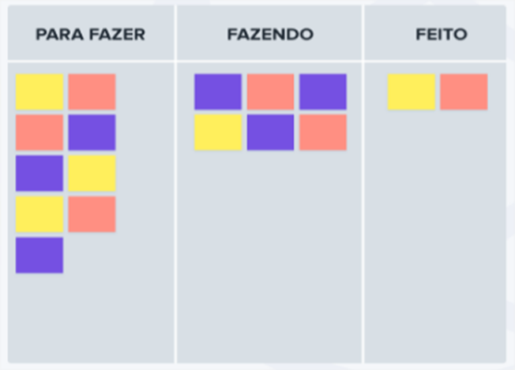

# Habilidades Técnicas e Psicossociais

## Outras Metodologias de GP

O panorama das metodologias de gerenciamento de projetos pode parecer um pouco opressor. O motivo é simples, ao redor do mundo há milhares de metodologias de gerenciamento de projeto. Claro que há as mais usadas, e é nelas que focaremos.

Portanto, compilei uma lista de diferentes metodologias de gerenciamento de projeto mais utilizadas ao redor do mundo e claro, em nosso país, para ajudá-lo a descobrir quais métodos, princípios e abordagens você pode usar para cada equipe e característica de projeto.

Como você pode ler, gestão de projetos não é baseada apenas em um corpo de boas práticas, mas em seu plural.

Coloque em mente o seguinte, uma metodologia de gerenciamento de projetos é um conjunto de princípios e práticas que o orientam na organização de seus projetos para garantir seu desempenho ideal.

Para que seja realmente eficaz, você precisa se certificar de que está mapeando corretamente sua metodologia de gerenciamento de projetos para o tipo de equipe, projeto, organização e metas, como escrevi logo acima e reforço!

O que funciona melhor para um tipo de equipe pode ser um pesadelo para outra.

Existem muitos fatores que afetarão a metodologia de gerenciamento de projetos certa para o seu projeto, equipe e organização.

- **Custo e orçamento:** em uma escala de 1 a 3 "dinheiros", com que tipo de orçamento você está trabalhando? Há espaço para que isso mude, se necessário, ou é essencial que fique dentro desses limites pré-determinados?

- **Tamanho da equipe:** quantas pessoas estão envolvidas? Quantas partes interessadas estão envolvidas? A sua equipe é relativamente compacta e auto-organizada, ou maior, com necessidade de uma delegação mais rigorosa?

- **Capacidade de Assumir Riscos:** este é um projeto grande e complexo com um significativo impacto organizacional que precisa ser gerenciado com cuidado para entregar resultados muito críticos? Ou é um projeto menor, menos complexo e com um pouco mais de espaço para testar algo novo?

- **Flexibilidade:** há espaço para que o escopo do projeto mude durante o processo? E o produto do projeto?

- **Linha do tempo:** quanto tempo é alocado para entregar o _briefing_? Você precisa de um retorno rápido ou é mais importante que você tenha um resultado bem-acabado, não importa quanto tempo leve?

- **Colaboração entre cliente e/ou parte interessada:** Quão envolvidos o cliente e a parte interessada precisa, ou deseja, estar no processo? Até que o ponto você precisa, ou deseja, que eles estejam envolvidos?

Além disso, apesar da adoção de novas tecnologias em resposta à pandemia, os gerentes de projeto continuam sobrecarregados com o impacto da mesma pandemia, sendo o mais proeminente o gerenciamento de custos, ou seja, o primeiro item dos tópicos logo acima.

Vamos conhecer as metodologias e corpos de conhecimento mais utilizados:

- **Waterfall:** modelo em cascata, é a metodologia mais antiga, desenvolvida em 1970 para abordar a crescente complexidade do desenvolvimento de software, mas também bens de produção e infraestrutura e, como tal, encontrou ampla aceitação em muitas indústrias, mais especialmente na indústria de software. Ela tem esse nome porque é sequencial e muito focada em requisitos. O importante é ter uma ideia muito clara do que o projeto exige antes de prosseguir, numa sequência de atividades, como numa esteira de produção, não há espaço para uma correção uma vez que o projeto esteja em andamento. Afinal, para fazer a próxima etapa, precisamos ter concluído a etapa anterior. Existem muitas versões desse método, mas a original incluía estas fases de alto nível.

- Especificação de requisitos
- Conceito, Design e Planejamento
- Criação de um produto
- Integração
- Validação (teste, verificação e validação)
- Instalação/Implantação
- Sustentação/Manutenção

Leve em consideração antes de utilizá-lo, o seguinte:

- **Facilidade de uso:** este modelo é fácil de entender e usar, os estágios são intuitivos de perceber e entender.

- **Estrutura:** porém a rigidez do método é uma desvantagem ou um ponto forte, vai depender da clara demarcação entre os estágios para a organização e divisão de taregas. Saber que não se pode voltar atrás torna urgente fazer certo na primeira vez em cada estágio.

- **Documentação:** o foco nítido da coleta e compreensão dos requisitos torna o modelo em cascata altamente dependente da documentação. Isso facilita a entrada de novos recursos e o trabalho no projeto quando necessário, desde que a documentação seja controlada e revisitada constantemente para a sua atualização. Há uma sensação real quando tentamos aplicar esse método em processos cujo o escopo ou requisitos sofrem atualizações constantes por pressão de mercado ou por legislação entre outas, quem sofre é a documentação e o cliente, porque todo o ciclo deverá ter sido passado para que se retorne ao início e embarquemos a mudança e, se esse ciclo todo demorar 1 ano ou mais?

- **Kanban:** é uma estrutura de gerenciamento de projeto visual. Ele se originou na linha de produção da Toyota, daí o nome japonês (significa: sinal visual). É uma metodologia útil para qualquer equipe que deseja visualizar suas taregas e obter uma melhor compreensão de seu fluxo de trabalho. É também conhecida como metodologia _just in time_ porque as tarefas são concluídas apenas quando e como são necessárias. Visualmente, as tarefas são dispostas em colunas rotuladas com uma variação de: a fazer, fazendo e feita.

**Prós:**

- Fluxo e flexibilidade aprimorados
- Gargalos são reduzidos
- Nunca se desperdiça tempo com trabalhos desnecessários que precisam ser refeitos

**Contras:**

- O foco está mais na visualização e menos no tempo real dos prazos
- Os membros da equipe devem se lembrar (sempre) de atualizar sua visão Kanban para evitar confusão

Gerenciamento de projetos Ágil: pode ser um de vários _frameworks_, incluindo Scrum e Kanban. Eles têm objetivos definidos pelo cliente, enquanto as entregas finais podem mudar. Enquanto isso, a equipe do projeto trabalha em ciclos iterativos (conhecidos como sprint), avaliando os resultados a cada ciclo e sempre colaborando com os clientes. Essas metodologias nasceram a partir do que se chama, Manifesto Ágil de Desenvolvimento e apresentou uma mentalidade inovadora na entrega de valor e colaboração com os clientes. Os quatro valores principais do Ágil são declarados como mandatórios:

- Indivíduos e interações importam mais que processos e ferramentas

- Software, produtos ou serviços que funcionem são mais importantes que uma documentação completa. Uma observação aqui, projetos ágeis possuem documentação sim.

- Colaboração do cliente na negociação do contrato

- Responder às mudanças seguindo um plano, portanto estamos falando aqui de planejamento

Em pouco tempo, a partir desse manifesto, esses conceitos foram expandidos para o gerenciamento de projetos em muitas estruturas de implementação, incluindo:

- Gerenciamento de projetos Scrum
- Gestão de projetos Kanban
- Programação extrema, conhecida como XP
- Adaptative Project Frameworka (APF) ou Estrutura Adaptativa de projetos

## Gerenciamento de projetos Scrum

É o framework de desenvolvimento ágil mais popular no mundo, sendo relativamente simples de implementar e resolve muitos problemas com os quais os desenvolvedores de software, produtos e serviços lutaram no passado, como ciclos de desenvolvimento complicados, planos de projeto inflexíveis, produção atrasada. Nesse caso, uma pequena equipe é liderada por um Scrum MAster cujo trabalho principal é eliminar todos os obstáculos para que o trabalho seja feito de forma mais eficiente. A equipe trabalha em ciclos curtos de 1 a 4 semanas chamados de sprints, embora os membros da equipe se reúnam diariamente para discutir o que foi feito e onde existem obstáculos que precisam ser eliminados. Essa metodologia permite rápido desenvolvimento e teste, especialmente em pequenas equipes. Muitos métodos e frameworks nasceram na área de software ou na produção industrial e foram adaptados para qualquer tipo de projeto. Alguns detalhes importantes são o fato de SCRUM não ter um gerente de projetos, tem um guardião chamado Scrum Master que zela para que a metodologia seja aplicada da forma correta. O time que desenvolve o projeto é chamado de time Scrum ou squad, dependendo do lugar, tem grande autonomia e senioridades, portanto possuem alta performance e automotivação baseada em suas experiências e multidisciplinaridades. Portanto, não se engane, trata-se de pessoas muita experiência. Lembre-se também que o desafio da agilidade está no fato de trabalhar-se sobre um prazo e custos fixos, porém com escopo que aceita mudanças.

Use Scrum se estiver desenvolvendo um software complexo e tiver uma equipe experiente à sua disposição.

## PRINCE2

É um sistema de metodologia de projetos completo. Em linhas gerais em tradução livre, refere-se a realizar projetos em ambientes controlados, utilizados pelo governo do Reino Unido. É baseado em 7 princípios, 7 temas e 7 processos.

**Os 7 princípios:**

- Justificativa de negócios continuara
- Aprender com a experiência
- Funções e responsabilidades definidas
- Gerenciar por etapas
- Gerencias por exceção
- Foco em produtos
- Ajustar para se adequar ao ambiente de projeto

Executar um projeto com PRINCE2 requer documentação extensa. Além disso, um dos princípios orientadores é, aprender com a experiência, o que obviamente preconiza focar na documentação e na experiência anterior para reduzir os riscos.

A documentação é útil para o planejamento de negócios, acompanhamento de desempenho e, mais uma vez, limitação de riscos.

Porém, o foco extensivo na documentação significa que as alterações podem ser difíceis de acomodar. Se os requisitos mudarem, você terá que refazer a documentação e realocar os recursos, o que pode prejudicar o ritmo do projeto.

Lembra o que vimos sobre a agilidade um pouco mais acima?! Projetos com muita mudança e inovação disruptiva embarcada se acomodam melhor nas metodologias ágeis, porém a equipe de execução deve, vou frisar aqui, DEVE ser experiente!

## Gestão de projetos LEAN (Enxuta)

É uma metodologia que tem como foco a racionalização e a redução do desperdício. A primeira etapa é criar uma divisão do processo de trabalho para identificar e eliminar gargalos, atrasos e todas as formas de desperdício. O objetivo é fazer mais com menos, ou seja, entregar valor ao cliente usando menos mão de obra, menos dinheiro e menos tempo.

Utiliza 3 princípios em palavras em japonês:

- **Muda:** Se refere a uma atividade ou processo que não agrega valor, por exemplo, transportar mercadorias de um local para outro ou esperar que uma máquina conclua uma ação. Os membros da equipe que trabalham no projeto precisam pensar em uma maneira de reduzir essa "perda de tempo" para aumentar ainda mais o valor.

- **Mura:** Se refere às variações entre as etapas, por exemplo, a equipe de montagem gastando mais tempo do que a equipe fazendo a inspeção final de um produto. Para combater isso, todos os estágios devem ter o mínimo de variação possível entre eles, para que todas as equipes tenham a mesma quantidade de tempo para concluir suas tarefas.

- **Muri:** Tem tudo a ver com se livrar de sobrecargas desnecessárias, como estresse, má organização, ferramentas incorretas ou qualquer outra coisa que impeça os funcionários de fazer seu melhor trabalho.

Quando os prazos são curtos, os recursos são escassos e os orçamentos são baixos, o Lean pode ajudar a entregar um trabalho de qualidade enquanto faz os cortes/ajustes de que precisam ser feitos. O único senão é que as decisões tomadas devem ser de forma decisiva e rápida, se demorarmos nesse quesito geralmente corromperemos o processo. Qual a conclusão?! Para usar LEAN precisamos ser experientes.

## Metodologia PMI - PMBOK

Primeiramente o PMBOK significa em português o Corpo de conhecimentos em gerenciamento de projetos. O PMI significa em português o Instituto de Gerenciamento de Projetos que nasceu nos EUA.

Ele divide, como já visto anteriormente, os projetos em:

- Iniciação
- Planejamento
- Execução
- Controle
- Fechamento

O PMBOK é uma estrutura e um padrão de fato, é orientado para o processo, além disso, ele condensa em si todo o conhecimento necessário para gerenciar o ciclo de vida de qualquer projeto, programa e portfólio por meio de seus processos.

Ele define para cada projeto as entradas, ferramentas, técnicas e saídas necessárias. Lembre-se que as saídas são as entregas. Dá segurança para quem gerencia porque define um corpo de conhecimento no qual qualquer indústria pode construir suas melhores práticas específicas para sua área de aplicação.

Mas ele não deve ser visto como uma panaceia, por exemplo, não é recomendável utilizarmos em projetos pequenos e que o escopo ou requisitos sejam constantemente mudados. Deve ser adaptado a indústria da área de aplicação, tamanho e escopo do projeto, tempo e orçamento e restrições de qualidade.

## Gerenciamento de projetos de cadeia crítica - CCPM

Sua intenção é levar o método do caminho crítico CPM, tão conhecido por quem trabalha com o PMBOK na parte de cronogramagem, um passo adiante. Embora o método do caminho crítico defina o período necessário para que cada atividade crítica seja realizada (determinístico), do início ao fim do projeto, muitas vezes pode se tornar bem irreal quando chega a hora de realmente colocá-lo em prática.

CCPM aborda esses problemas, permitindo um pouco mais de tempo para os elementos humanos de seu projeto, estou escrevendo aqui sobre atrasos e problemas de recursos humanos. Aqui, é interessante como podemos inserir alguns "amortecedores" integrados que sua cadeia crítica pode usar sem prejudicar todo o resto do cronograma, de modo que todo o projeto não precise sair dos trilhos só porque a vida real está acontecendo.

Normalmente utilizamos o CCPM quando queremos algo um pouco mais realista que as respostas dadas pelo CPM somente. Também, quando estivermos superestimando as durações das tarefas no caminho crítico para permitir um _buffer_ e desejarmos dados mais precisos sobre quanto tempo o trabalho está realmente levando em comparação com as nossa projeções.

O gerente de projeto precisa ter um conjunto de habilidades que o tornem atrativo ao mercado e seja também utilizado por ele mesmo para dar conta da situação dinâmica que é o ambiente de um projeto numa empresa que sofre todo o tipo de pressão do mercado e das próprias áreas internas que brigam por recursos financeiros, humanos e materiais para priorizarem suas metas e cumprirem com o planejamento.

Na maioria das organizações, grandes tarefas são divididas em diferentes projetos com uma meta, prazo e equipe específicos. Um gerente de projeto é responsável por coordenar e supervisionar todos os aspectos da conclusão do projeto, incluindo a comunicação com as partes interessadas, gerenciamento de membros da equipe, definição e ajuste de prazos, priorização de tarefas, motivação da equipe, planejamento e monitoramento do fluxo de trabalho, facilitação da comunicação e assim por diante.

# Hard Skills

São habilidades que podemos aprender através de cursos, treinamentos, leituras e outras técnicas, mas trata-se aqui de conhecimento formal utilizado em gerenciamento de projetos, vamos conhecer alguns:

- **Negociação:** Uma grande parte do trabalho de um gerente de projeto é a interface entre as expectativas do cliente ou das partes interessadas e a realidade do que uma equipe pode entregar. Para que todos concordem com o mesmo resultado e produto, um bom gerente de produto pode negociar tudo, desde preços e prazos até os detalhes de como/qual será o produto final.

- **Habilidades técnicas relevantes:** Embora as habilidades exatas às quais estamos nos referindo variem de projeto para projeto, um bom gerente de projeto deve ter uma formação sólida no tipo de trabalho que sua equipe está fazendo. Por exemplo, se você estiver gerenciando uma equipe de desenvolvimento que está fazendo um sistema computacional, é extremamente útil ter pelo menos algumas habilidades básicas de desenvolvimento e conhecimento prévio próprio.

- **Escrita:** Um gerente de projeto precisa fazer muita comunicação, grande parte da qual acontece por escrito. Uma das melhores maneiras de determinar se suas habilidades de escrita estão à altura é pedir a um colega de confiança ou superior que avalie um exemplo da escrita que você faz no trabalho. É claro, sem erros, fácil de entender e direto ao ponto?

- **Priorização e definição de metas:** Há um número aparentemente infinito de tarefas necessárias para a execução de qualquer projeto, mas nem todas podem acontecer ao mesmo tempo. Cabe ao gerente de projetos determinar qual é a maior prioridade e o que pode esperar até mais tarde. Ele precisa deixar as prioridades claras para os membros da equipe e conectá-las aos objetivos tangíveis da equipe.

- **Planejamento de projeto:** Um gerente de projeto começa em qualquer ponto A e deseja chegar a um ponto diferente, B, com certos objetivos atingidos e resultados alcançados. Como chegar lá é uma questão de planejamento de projeto, e um bom gerente de projetos será capaz de construir um plano realista, lógico e eficaz para ajudar a chegar ao ponto B.

- **Delegação:** Cada grande projeto tem marcos ao longo do caminho, e a questão de quando as coisas devem ser feitas e quem estará trabalhando em cada tarefa em que momento tudo cai sob a égide de delegar e agendar, algo que é responsabilidade do gerente de projeto. Um delegador forte garantirá que cada membro da equipe sempre tenha algo em que trabalhar, que as pessoas certas estejam trabalhando em uma tarefa e que ninguém fique sobrecarregado.

- **Administração de orçamento:** Cada projeto tem um orçamento e é função do gerente de projeto garantir que o projeto não ultrapasse o orçamento. É por isso que uma das habilidades de gerenciamento de projetos mais críticas é o orçamento, que requer um conhecimento sólido de matemática, planilhas e finanças. (WOOLL, 2021, p.6-9)

# Soft Skills

Muitas pessoas que são ou pretendem ser gerentes de projeto não se preocupam naquilo que muitas vezes é negligenciado, mas é vital para o sucesso do projeto, são as habilidades psicossociais.

O gerenciamento de um projeto depende da habilidade chave de comunicação, sendo que muitos livros sugerem que esse profissional invista quase 70% do seu tempo em atividades com relação direta ou indireta com a comunicação e claro, influência. Um gerente de projeto precisa se comunicar e envolver uma ampla gama de pessoas, interna e externamente. A maneira como nos comunicamos é fundamental para lidar com problemas ou barreiras para o sucesso. Com as habilidades pessoais certas, é possível remover qualquer burocracia e fazer o trabalho.

Veja aqui algumas habilidades que precisam ser desenvolvidas para um desempenho superior em gerenciamento de projetos:

- **Comunicação:** Um gerente de projeto é uma pessoa que serve como elo entre todos os envolvidos em um projeto específico e sua capacidade de comunicar informações importantes a todas as partes relevantes é absolutamente crucial para o sucesso do projeto.

- **Liderança:** Um líder forte pode conquistar a confiança das pessoas, motivar os trabalhadores, obter adesão, tomar boas decisões e assumir a responsabilidade pelos sucessos e fracassos da equipe.

- **Motivação:** Ser capaz de motivar os membros de sua equipe a fazer o melhor trabalho, mesmo quando os prazos ficam apertados e os projetos complicados, é uma habilidade muito importante para um gerente de projeto. Se os membros da sua equipe acreditam no projeto e fazem o melhor que podem para ajudá-lo a ter sucesso porque querem, em vez de temer as repercussões, você está motivando de maneira certa.

- **Gestão de conflitos:** Inevitavelmente, as pessoas que trabalham juntas terão conflitos. É natural e não é um problema, mas é algo com que um bom GP sabe lidar. Um gerente de conflitos bem-sucedido saberá como manter os ânimos sob controle e resolver os problemas à medida que surgem, para que a equipe possa seguir em frente e continuar trabalhando em direção a seus objetivos sem ferir os sentimentos ou grandes estouros.

- **Adaptabilidade:** Um GP eficaz é flexível e ágil, sabendo rolar com os punhos e fazer os ajustes necessários para seguir em frente mesmo diante de imprevistos.

- **Desenvoltura:** Nem sempre você receberá todas as ferramentas que precisa para ter sucesso em um projeto, mas isso não deve impedi-lo. Gerentes de projeto fortes sabem como ser astutos e espertos para resolver problemas.

- **Trabalho em equipe:** Um bom gerente de projeto não é apenas um líder de equipe; eles também fazem parte da equipe. Isso significa ser cooperativo, colaborativo, fácil de trabalhar e conversar e justo com os outros. Não há espaço para o ego neste trabalho.

- **Influência:** Uma última habilidade suave que um GP deve ter é a capacidade de fazer com que um grupo de pessoas, sobre as quais você não tem necessariamente qualquer autoridade, trabalhe em prol de um objetivo comum. A influência requer a habilidade de construir confiança, fomentar a cooperação e encorajar as pessoas a trabalharem juntas. Tudo começa ouvindo. (WOOLL, 2021, p.13-15)
