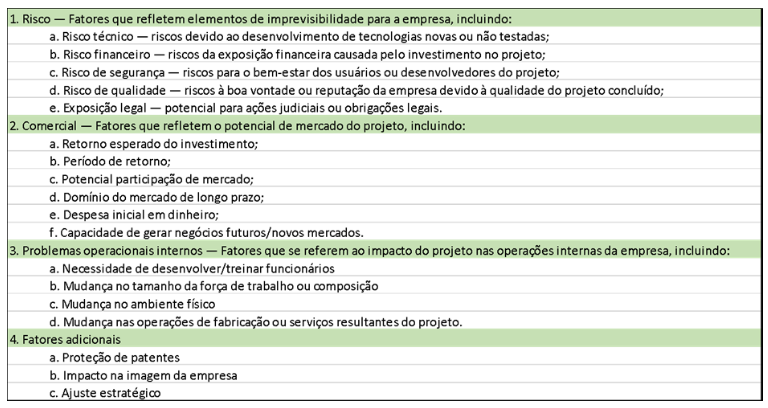

# Escopo: o trabalho a fazer

Trabalhar com gerenciamento de projetos é uma ciência social principalmente, não apenas um amontoado de processos técnicos que pretendem entregar um produto/serviços de valor às partes interessadas e ao mercado.

Inteligência emocional é algo muito importante, mesmo quando utilizamos para poder entender as necessidades empresariais que alavancam ou desaprovam um projeto.

De acordo com GOLEMAN (1995), existem cinco elementos principais na inteligência emocional que é preciso ater:

- Autoconsciência
- Autorregulação
- Motivação
- Empatia
- Habilidades sociais

A inteligência emocional, neste contexto, descreve a autoconsciência e a consciência social de um gerente de projeto e sua capacidade de formar relacionamentos com outras pessoas envolvidas em um projeto. Ao regular as emoções da maneira certa, e no momento certo, significa que você pode lidar com as situações com calma e objetividade, o que é fundamental:

- Ler as emoções dos membros da equipe para ter maior empatia;

- Encontrar um terreno comum com recursos e partes interessadas para construir confiança;

- Estar ciente do estresse pessoal e da equipe e como ele afeta a produtividade;

- Estar aberto e ser capaz de se adaptar às mudanças internas e externas;

- Motivar a equipe e inspirar positividade e confiança;

Além disso, ter integridade é uma qualidade de liderança procurada, que promove uma posição pessoal dos gerentes de projeto dentro de uma equipe de projeto e aos olhos dos clientes e gestão.

Os gerentes de projeto são o porta-voz do projeto e não apenas representam a si próprios, mas também toda a equipe do projeto.

Ao agir com integridade, eles podem inspirar confiança e respeito das partes interessadas e ajudar a motivar os recursos do projeto. Algumas maneiras de desenvolver integridade são:

- Seja responsável e cumpra os compromissos assumidos;

- Tome decisões difíceis direta e honestamente;

- Estabelecer um processo de comunicação transparente;

- Assuma a propriedade e a responsabilidade sem transferir a culpa;

- Tome decisões de forma justa e sem favoritismo ou preconceito;

Talvez você esteja se perguntando por que estou escrevendo isso se agora falaremos de onde vem os projetos, não é mesmo?

É simples, a espécie humana é política por natureza, se o gerente de projetos não conseguir influenciar ou ter empatia, isso será um problema grave durante os processos de priorização e de eletividade na seleção de projetos pela empresa a qual ele trabalha ou presta serviços. Por isso é sempre importante ter em mente a necessidade de desenvolver sempre sua inteligência emocional.

## De onde vêm os projetos

Mas afinal, de onde vêm os projetos?

E mais, quer saber: Quando as empresas vão parar de desperdiçar bilhões de dinheiro em projetos fracassados?

A grande maioria desse desperdício é completamente evitável. Simplesmente faça com que as necessidades de negócios (conhecidas como requisitos) corretas sejam compreendidas no início do processo e garanta que as técnicas de gerenciamento seja aplicadas e seguidas, e que as atividades do projeto sejam monitoradas. Não importa se o projeto é gerido via PMBOK, via Scrum, via qualquer coisa, o requisito compreendido é "rei".

Aplicar uma boa disciplina de gerenciamento de projetos é a maneira de ajudar a reduzir os riscos. Ter boas habilidades de gerenciamento de projetos não elimina completamente problemas, riscos ou surpresas. O valor de um bom gerenciamento de projetos é que você tem processos padrão em vigor para lidar com todas as contingências. Lembra?! Esses 3 parágrafos, "vira e mexe" eu faço questão de escrever, porque são fundamentos que não devem jamais serem esquecidos.

Gerenciar um projeto inclui identificar os requisitos do seu projeto e escrever o que todos precisam do projeto. Quais são os objetivos do seu projeto? Quando todos entendem o objetivo, é muito mais fácil mantê-los todos no caminho certo. Certifique-se de definir metas com as quais todos concordem para evitar conflitos de equipe mais tarde. Compreender e atender às necessidades de todos os afetados pelo projeto significa que o resultado final do seu projeto terá muito mais probabilidade de satisfazer as partes interessadas.

Você pode ter ouvido falar do termo tripla restrição, ou triângulo de ferro em algumas literaturas. Tradicionalmente, ele consistia apenas em tempo, custo e escopo. Essas são as principais restrições concorrentes do projeto, vemos o poder dessa representação gráfica quando colocamos a qualidade no meio dele. Neste triângulo, cada lado representa uma das restrições (ou restrições correlacionadas - tempo, escopo e custos) em que qualquer alteração em qualquer um dos lados causa uma alteração nos outros lados.

Quero descrever que: se aumenta o escopo, custos ou cronograma aumentação para manter a proporção desse triângulo imaginário, assim como, ao contrário, se o cronograma diminuir, provavelmente o escopo ou custos diminuirão. O importante é que você entenda que esse triângulo, nos melhores projetos sempre estará relativamente equilátero.

Claro, seu projeto pode ter restrições adicionais que você deve enfrentar e, como gerente de projeto, você deve equilibrar as necessidades dessas restrições com as necessidades das partes interessadas e os objetivos do projeto. Por exemplo, se o seu patrocinador deseja adicionar funcionalidade ao escopo original, você provavelmente precisará de mais dinheiro para terminar o projeto, ou se eles cortarem o orçamento você terá que reduzir a qualidade do seu escopo e, caso contrário, para obter recursos apropriados para trabalhar nas tarefas do projeto, você terá que estender sua programação porque os recursos de que dispõe demoram muito mais para terminar o trabalho.

Então, aquela velha máxima: Tem que ser bom, bonito e barato, por razões óbvias, não existe.

Existem muitos fatores que precisam ser compreendidos dentro do ambiente do projeto. Em um nível, você precisa pensar em termos de ambientes culturais e sociais, portanto pessoas, dados demográficos e educação. O ambiente internacional e político é onde você precisa entender sobre as influências culturais de diferentes países ou regiões em que o projeto será desenvolvido. Mesmo no Brasil, onde temos distâncias e culturas muito díspares, como se fossem literalmente vários países dentro de um país. Em seguida, passamos para o ambiente físico; aqui pensamos nos fusos horários. Pense em diferentes países e como o seu projeto será executado de forma diferente, seja apenas em seu país (aqui temos 3 fusos horários diferentes) ou se envolver uma equipe de projeto internacional que está distribuída em cinco países diferentes, por exemplo, o projeto de um avião de passageiros.

De todos os fatores, os físicos são os mais fáceis de entender, e são os fatores culturais e internacionais que muitas vezes são mal compreendidos ou ignorados. A maneira como lidamos com clientes, usuários ou membros do projeto pode ser crítica para o sucesso do projeto.

As empresas são literalmente bombardeadas com oportunidades, mas, claro, nenhuma organização desfruta de recursos infinitos para poder buscar todas as oportunidades que se apresentam. As escolhas devem ser feitas e, para garantir que selecionem os projetos mais viáveis, muitos gestores desenvolvem sistemas e diretrizes para equilibrar as oportunidades e custos implicados por cada alternativa.

A questão que atormenta todos os CEOs e Gestores estratégicos nas empresas é: será que esse modelo de triagem de projetos é útil? Bem, foram identificadas 6 questões importantes que os gestores devem considerar ao avaliar modelos de triagem de projetos, afinal, selecionar o projeto certo para ser desenvolvido pode em alguns casos ser uma questão de vida ou morte para as empresas. Quem não lembra do projeto que salvou a Disney (O rei leão), ou que salvou a LEGO (dando poder aos clientes de construírem o que quiserem sob encomenda). Que critérios foram levados em conta? Desespero? Planejamento? Tudo isso só para começar a aguçar seu "apetite". Vamos conhecer alguns dos fatores a se levar em conta num modelo de seleção de projetos:

- **Realismo:** Um modelo eficaz deve refletir objetivos organizacionais, incluindo os objetivos estratégicos e a missão de uma empresa. Os critérios também devem ser razoáveis considerando tais restrições aos recursos como dinheiro e pessoal. Por fim, o modelo deve considerar tanto os riscos comerciais quanto os riscos técnicos, incluindo desempenho, custo e tempo. Ou seja: o projeto funcionará como planejado? Podemos manter o orçamento original ou há um alto potencial para aumentar os custos? Existe um forte risco de deslocamento significativo de entregas no cronograma?

- **Capacidade:** Um modelo deve ser flexível o suficiente para responder às mudanças nas condições em que os projetos são realizados. Por exemplo, o modelo deve permitir que a empresa compare diferentes tipos de projetos (projetos de longo prazo vs projetos de curto prazo, projetos de diferentes tecnologias ou capacidades, projetos com diferentes objetivos comerciais). Deve ser robusto o suficiente para acomodar novos critérios e restrições, sugerindo que o modelo de triagem deve permitir que a empresa o use o mais amplamente possível para cobrir a maior gama possível de tipos de projetos.

- **Flexibilidade:** O modelo deve ser facilmente modificado se os aplicativos de teste exigirem alterações. Deve, por exemplo, permitir ajustes devido a mudanças nas taxas de câmbio, leis fiscais, códigos de construção e assim por diante.

- **Facilidade de Uso:** O modelo deve ser simples o suficiente para ser utilizado por pessoas em todas as áreas da organização, tanto aquelas em funções específicas de projeto quanto aquelas em posições funcionais relacionadas. Além disso, o modelo de triagem aplicado, as escolhas feitas para a seleção do projeto e as razões para essas escolhas devem ser claras e facilmente compreendidas pelos membros da organização. O modelo também deve ser oportuno: deve gerar rapidamente as informações de triagem, e as pessoas devem ser capazes de assimilar essas informações sem qualquer treinamento ou habilidades especiais.

- **Custo:** O modelo de triagem deve ser econômico. Uma abordagem de seleção que é cara de usar em termos de tempo ou dinheiro provavelmente terá o pior efeito possível: fazer com que os membros da organização evitem usá-lo devido ao custo excessivo de empregar o modelo de triagem. O custo de obtenção de informações de seleção e geração de resultados ideais deve ser baixo o suficiente para incentivar o uso dos modelos em vez de diminuir sua aplicabilidade.

- **Comparabilidade:** Deve ser ampla o suficiente para ser aplicada a vários projetos. Se um modelo é muito focado, pode ser inútil comparar projetos potenciais ou promover vieses em relação uns com os outros. Um modelo útil deve apoiar comparações gerais de alternativas de projeto. (PINTO, 2010, p.72-73)

Por fim, há ainda mais alguns fatores que devem ser levados em consideração quando vamos triar e selecionar projetos, para que eles cumpram seus objetivos empresarias estratégicos:

## Termo de Abertura, Premissas e Restrições

Um termo de abertura do projeto descreve formalmente um projeto em uma organização. Ele vobre o escopo do que o projeto alcançará, bem como as pessoas envolvidas, marcos, orçamento e possíveis riscos.

Muitas organizações consideram este documento como uma parte essencial do planejamento do projeto, embora não seja a mesma coisa que um plano do projeto, porque não entra nos detalhes das tarefas individuais dentro do projeto.

Um TAP, ou termo de abertura, de projeto eficaz pode ter os seguintes componentes:

- Descreva o escopo e os objetivos do projeto;

- Certifica de que os patrocinadores do projeto e todas as partes interessadas estejam alinhados ao projeto;

- Seja uma referência clara e única para todos os envolvidos em um projeto;

- Ajuda os patrocinadores do projeto a obter a aprovação das partes interessadas quando a adesão ainda for necessária.

- Os elementos básicos geralmente incluem o histórico do projeto, partes interessadas, orçamento, riscos e marcos.

Um termo de abertura de projeto deveria conter informações que esclarecem os seguintes pontos:

- **Justificativa para o projeto:** sequência de fatos, conclusões e opiniões que resultaram no projeto ser escolhido como um dos focos da atenção (e dos investimentos) da organização.

- **Objetivos do projeto:** os produtos que o projeto irá gerar para a organização.

- **Principais características dos produtos do projeto:** requisitos fundamentais, de alto nível, tais como capacidades a serem alcançadas, padrões a serem seguidos.

- **Riscos:** Identificar e analisar os riscos mais relevantes, os problemas já conhecidos que serão detalhados no Gerenciamento de riscos.

- **Cronograma de Marcos:** Grandes fases ou entregas do projeto, numa estimativa top-down que leve em conta os riscos já identificados.

- **Orçamento resumido:** expectativas de custo ou restrição orçamentária, caso já esteja definida no planejamento estratégico da organização.

- **Designação do gerente de projeto e identificação do patrocinador**

- **Premissas:** Itens assumidos como verdadeiros, que se não forem verdadeiros irão afetar o projeto.

- **Restrições:** fatores que limitam o projeto, como prazos, custos e qualidade.

Há ainda mais alguns itens que deveriam constar em Termo de Abertura:

- **Clientes:** pessoa ou organização responsável por receber os entregáveis quando o projeto é realizado.

- **Stakeholders:** lista das partes interessadas, com identificação de sua responsabilidade e função no projeto.

- **Estrutura:** levantamento das funções essenciais na organização para realização do projeto, com levantamento das linhas de reporte, para elaboração futura do organograma do projeto.

- **Planejamento de recursos:** Desenvolver um plano que resume os fundos incluídos na realização do projeto, listando o trabalho, equipamentos e materiais envolvidos. Base para elaboração do orçamento e identificação dos recursos financeiros necessários.

- **Dependências:** Citar algumas dependências chave e sua criticidade ao projeto. A dependência é definida como uma ação que é, provavelmente, um impacto sobre o projeto durante o seu ciclo de vida.

Podemos como adicional, identificar mais algumas informações úteis:

- **Alinhamento estratégico:** descrição do objetivo estratégico da organização ao qual o projeto está relacionado.

- **Escopo sumário:** descrição do escopo do projeto, deixando claro o que está previsto, além de identificar o escopo negativo, isto é, o que não faz parte do parte do projeto.

- **Estratégia de execução:** primeiras medidas para iniciar o planejamento e a execução do projeto, a partir de sua aprovação.

- **Critérios de sucesso:** principais métricas que indicam o atingimento dos objetivos, tais como indicadores de qualidade, marcos de realização.

- **Avaliação financeira:** Fluxo de caixa, cálculo do valor presente líquido, taxa interna de retorno e payback do projeto.

- **Impactos do projeto:** principais benefícios e possíveis impactos negativos do projeto.

- **Plano de contingência:** alternativas inicialmente identificadas para enfrentar riscos, restrições e premissas que eventualmente não forem verdadeiras.

- **Plano inicial de comunicação:** planejamento da comunicação inicial para envolvimento dos principais stakeholders no projeto. (PMKB, 2013, p.3-4)

## Requisitos

Os requisitos do projeto são uma diretriz essencial para o projeto, mas muitas pessoas os ignoram, favorecendo a opinião da equipe do projeto em termos do que eles acham que o usuário deseja e precisa. Porém, sem um entendimento do que o projeto está tentando realizar, não há chance de sucesso do projeto. Alguns requisitos do projeto que devem ser definidos são a data de início do projeto, escopo, limites do trabalho, restrições de recursos e pessoas, ambiente do projeto, entregas e orçamento. Normalmente estão minimamente presentes, portanto em nível macro, no TAP - termo de abertura do projeto.

Os requisitos são os recursos, atributos e qualidades que devem fazer parte da entrega final do projeto. Definir isso no início do ciclo de desenvolvimento do projeto é importante porque voltar para adicioná-los posteriormente. Retrabalho é ineficiente, caro e repleto de erros e riscos adicionais ao projeto.

Os requisitos não são iguais aos objetivos do projeto.

Os objetivos devem orientar os requisitos.

Objetivos são o que você deseja realizar, requisitos são a forma como você alcançará esses objetivos.

Os requisitos podem ter que ser refinados ou desenvolvidos posteriormente no processo de definição do projeto, conforme os detalhes sobre o projeto se tornam claros. No entanto, requisitos claros antes do início do trabalho do projeto são absolutamente essenciais para o sucesso do projeto. Requisitos pouco claros causam confusão, duplicação de esforços, retrabalho e desperdício de trabalho.

Os requisitos do projeto são condições ou tarefas que devem ser concluídas para garantir o sucesso ou a conclusão do projeto. Eles fornecem uma imagem clara do trabalho que precisa ser feito. Eles têm como objetivo alinhar os recursos do projeto com os objetivos da organização. Os benefícios da coleta eficaz dos requisitos do projeto incluem redução de custos, maiores taxas de sucesso do projeto, gerenciamento de mudanças mais eficaz e comunicação aprimorada entre as partes interessadas.

Os requisitos de negócios são as necessidades de alto nível dos negócios. Eles abordam o que é necessário e por que o projeto está acontecendo. Voltando ao nosso exemplo de casa, um requisito de negócios pode incluir, ‘construir uma casa ecológica com painéis solares de alta eficiência que irão reduzir as emissões de carbono e reduzir o impacto ambiental.’ Este é o ponto de partida do projeto e fornece orientação para os outros tipos de requisitos. É fundamental que esses requisitos sejam comunicados com clareza e desde o início.

Os requisitos da solução, que incluem requisitos funcionais e não funcionais, são os recursos e características específicas do produto ou serviço que atendem a todos os requisitos, tanto de negócios quanto de partes interessadas.

Os requisitos funcionais descrevem algo que um produto ou serviço deve fazer.

Os requisitos não funcionais descrevem como um sistema deve funcionar.

Bem, aqui vou ser mais direto com você. Não comece as entregas de trabalho reais, ou seja, tarefas e atividades na estrutura analítica do projeto ou seja EAP (nos aprofundaremos em breve), até que tenha os requisitos claramente definidos. A falta de requisitos claros prejudicará totalmente o seu projeto. Não faça isso!
