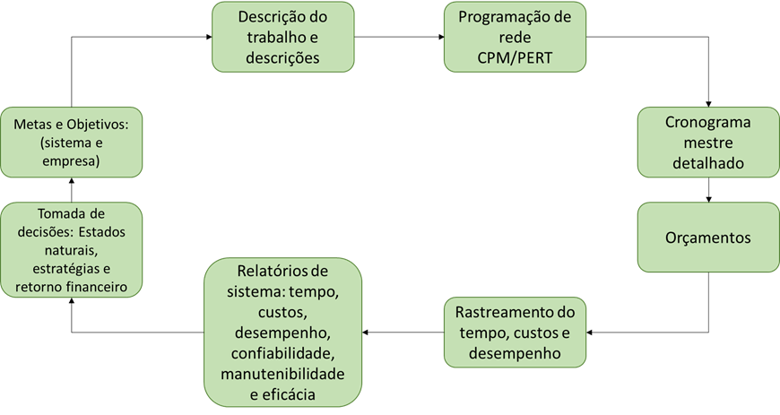
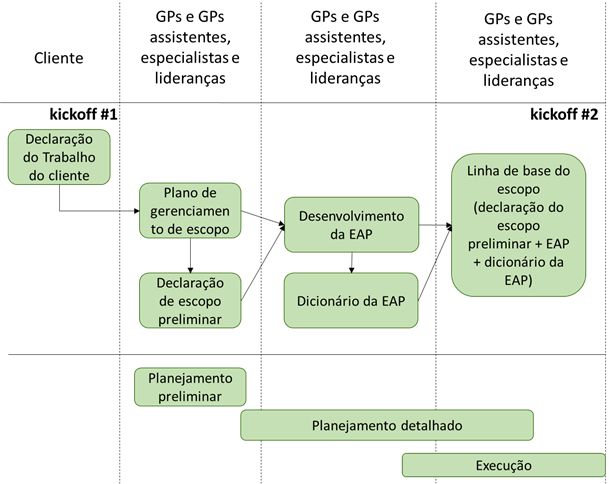
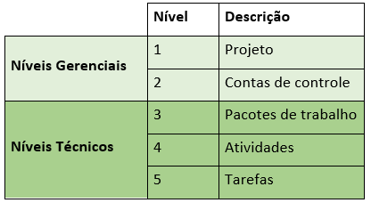
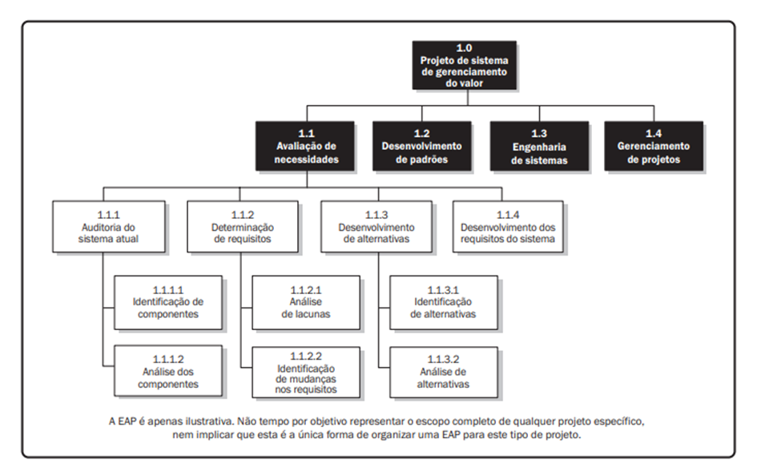
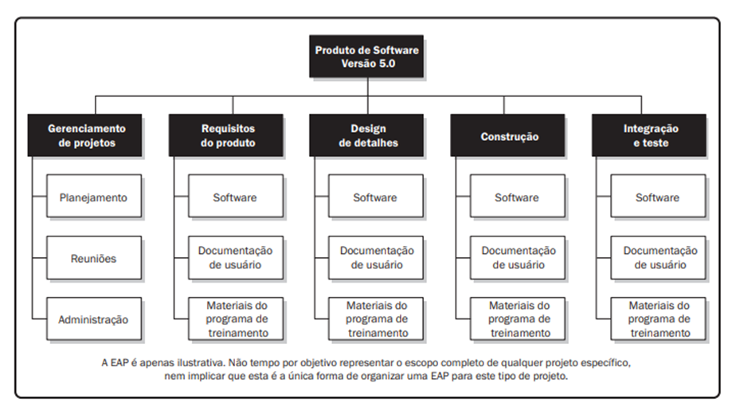
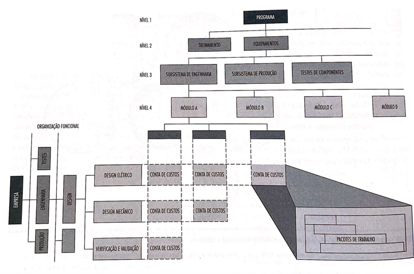

# Escopo: a estrutura

O planejamento é um processo contínuo de tomada de decisões empreendedoras que visam o futuro metódico do esforço necessário para executar essas decisões.

O lançamento típico de um projeto começa com uma reunião de *kickoff* envolvendo os principais atores responsáveis pelo planejamento, incluindo o gerente de projeto, gerentes de projetos auxiliares que pertencem a outras áreas, por exemplo (produção, engenharia, etc...), os especialistas e as lideranças funcionais (gerentes, supervisores, coordenadores e sêniores).

É importante nessa altura do planejamento que todas as grandes datas de entrega, que chamamos de Marcos de Projeto, estejam devidamente acomodadas em um cronograma de Marcos. Esses grandes Marcos contém informações como: data de início do projeto, data de finalização do projeto, outras entregas ou mudanças de fases importantes no projeto e itens de dados que nada mais são do que entregas ou relatórios.

## Estrutura Analítica do Projeto

Uma Estrutura Analítica do Projeto - EAP é um esboço hierárquico das tarefas necessárias para concluir um projeto. Ela divide a estrutura de um projeto em entregas gerenciáveis. Cada entrega (deliverable) é atribuída a uma tarefa ou série de tarefas que podem ser divididas em subtarefas para atender às necessidades do projeto. A vantagem de usar uma WBS com parte do gerenciamento do ciclo de vida do projeto é que pega projetos grande e complexos e os divide em tarefas menores e mais gerenciáveis que podem ser atribuídas a pessoas ou equipes específicas para entrega.

O objetivo principal da EAP é também planejar o cronograma do projeto, pois cada duração da tarefa é planejada em conjunto com seus predecessores necessários e as tarefas seguintes. Portanto ela fornece um plano geral para que o gerente de projeto possa ver como o projeto deve progredir e gerenciar o fluxo de trabalho de forma adequada.

A EAP pode possuir no mínimo 3 níveis, porém 5 níveis é um excelente nível de detalhamento para evitar entregas mal divididas e trabalho mal gerenciado.

Existem dois tipos principais de EAP: baseada em entregas e baseada em fases. Uma WBS baseada em entregas identifica as entregas e o escopo do projeto, enquanto a WBS baseada em fases exibe a entrega final no topo, com o nível abaixo mostrando as cinco fases de um projeto (iniciação, planejamento, execução, controle e encerramento).

Fazer uma EAP é a primeira etapa no desenvolvimento de um cronograma de projeto. Ele define todo o trabalho que precisa ser concluído (e em que ordem) para atingir as metas e objetivos do projeto.

Uma estrutura de divisão de trabalho típica é composta de vários componentes principais. Eles são os seguintes:

- **Dicionário da EAP:** Um documento que define os vários elementos da EAP. É um componente importante de uma WBS porque permite que os participantes do projeto e as partes interessadas entendam as fases, as entregas e os pacotes de trabalho com mais clareza.

- **Número e descrição da tarefa:** Atribuir um número a cada tarefa torna mais fácil identificá-las. Uma descrição ajudará a definir qual é a tarefa, o que fornecerá orientação para a equipe na hora de executá-la.

- **Proprietário da tarefa:** O proprietário é a pessoa, organização ou departamento que supervisiona a tarefa desde a atribuição até a conclusão e garante que ela foi executada corretamente.

- **Dependência de tarefa:** algumas das tarefas no caminho para a entrega final terão que esperar até que outra tarefa seja concluída ou iniciada antes de poderem começar. Isso é chamado de dependência de tarefa e requer a vinculação das duas tarefas dependentes para evitar derrapagens posteriormente no projeto.

- **Custo da tarefa:** Cada tarefa terá um custo associado a ela. Você vai querer observar isso para manter o controle de seu orçamento.

- **Início, termino e conclusão da tarefa:** Adicione as datas de início e término para cada tarefa e estime o tempo que você tem em sua programação para executá-la.

- **Status da tarefa:** O status da tarefa mostrará se ela está atribuída ou não, em andamento, atrasada ou concluída, o que ajuda no rastreamento.

### Como montar a estrutura

1) Defina as metas e objetivos do projeto. Comece com o termo de abertura do projeto - o escopo, os objetivos e quem está participando do projeto - determine o que é e descreva-o.

2) O próximo nível abaixo são as fases do projeto: divida a declaração de intenção do projeto maior em uma série de fases que levarão da concepção à conclusão.

3) Quais são os seus resultados? Liste todos eles e observe o que é necessário para que essas entregas sejam consideradas entregues com sucesso (sub-entregas, pacotes de trabalho, recursos, participantes, etc...)

4)Pegue seus resultados de cima e divida-os em cada tarefa e subtarefa necessária para entregá-los. Faça uma lista de todas essa tarefas.

5) Com as tarefas agora definidas, atribua-as à equipe. Dê a cada membro da equipe as ferramentas, recursos e autoridade de que precisam para realizar o trabalho. (PROJECT MANAGER, 2021, p.6-7)

Podemos também construir uma EAP e decompô-lo por fases.

## EAP vs EOP

Primeiramente é preciso diferenciar, pois a Estrutura Analítica da Organização - OBS - é um modelo hierárquico que descreve a estrutura organizacional estabelecida para planejamento de projetos, gerenciamento de recursos, controle de tempo e despesas, alocação de custos, relatórios de receita / lucro e gerenciamento de trabalho.

Por outro lado, apenas recordando, a EAP visa capturar todos os elementos dos projetos de maneira organizada. Dividir projetos grandes e complexos em partes menores fornece uma estrutura melhor para organizar e gerenciar projetos atuais e futuros. A WBS facilita a alocação de recursos e atribuição de tarefas, medição e controle de custos e faturamento do projeto. Ela é utilizada no início do projeto para definir o escopo, identificar centros de custo e é o ponto de partida para o desenvolvimento de plano de projeto e gráficos de Gantt.

A OBS agrupa atividades de projeto semelhantes ou pacotes de trabalho e os relaciona à estrutura da organização. Portanto, você deve perceber claramente que a OBS é usada para definir as responsabilidades de gerenciamento de projetos, relatórios de custo, faturamento, orçamento e controle de projetos. Ela fornece uma perspectiva organizacional do projeto, em vez de baseada em tarefas como a EAP faz.

A OBS também permite a agregação das informações do projeto para níveis superiores. Quando as responsabilidades do projeto são definidas e o trabalho é atribuído, tanto a OBS quanto a EAP são conectados, fornecendo a possibilidade de análises poderosas para medir o desempenho do projeto e da força de trabalho em um nível muito alto, por exemplo, por unidade de negócios ou conhecer os detalhes do trabalho de um colaborador em uma tarefa.

Para desenvolver uma estrutura analítica da organização:

- Desenhe toda a organização como uma hierarquia

- Defina todos os departamentos e equipes de projeto

- Especifique grupos funcionais: onde o custo do trabalho que o colaborador faz é alocado e aprovado, ou seja, quem aprova o trabalho que o colaborador realiza e quaisquer aprovações de licença (ferramentas, sistemas, etc...) para cada colaborador.
