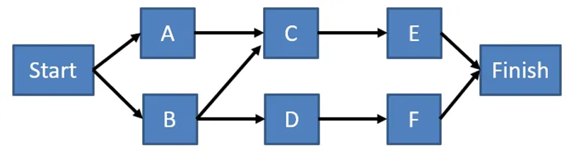

# Sequenciamento

Um dos motivos da falha do projeto é quando os gerentes de projeto podem criar a estrutura de análise do trabalho, mas não conseguem executá-la.

O sequenciamento das atividades são projetadas para se enquadrar em grupos de processos de gerenciamento de projetos e áreas de conhecimento. Usando os resultados dos procedimentos, o desenvolvimento do cronograma do projeto define as atividades da sequência, estima os recursos das atividades e estima as durações das atividades em combinação com a ferramenta de cronograma para produzir o modelo de cronograma.

O plano de gerenciamento de programação reconhece qual método de programação e dispositivo usar para a tarefa, que irá gerenciar as atividades a serem sequenciadas.

O sequenciamento pode ser executado utilizando software de gerenciamento de projetos ou utilizando procedimentos manuais ou mecanizados. O processo de sequência de atividades concentra-se na conversão das atividades do projeto de uma lista em um diagrama para atuar como uma primeira etapa para publicar a linha de base do cronograma.

O gráfico abaixo retrata o diagrama de fluxo de dados das atividades de sequência sobre como cada atividade, exceto a primeira e a última, deve se conectar a pelo menos um predecessor e pelo menos uma atividade sucessora com uma afiliação lógica apropriada.

As atividades de sequência são o processo de identificação e documentação dos relacionamentos entre as atividades do projeto. Portanto, a razão fundamental para o processo de sequência de atividades é finalizar o inter relacionamento das atividades para concluir o escopo do projeto e atingir os objetivos da tarefa.

A consequência crítica do processo de sequência de atividades é um diagrama de rede. O diagrama de rede de um projeto representa as atividades em caixas com ID de atividade e demonstra a inter-relação de atividades com parafusos.

Cada atividade excluindo a primeira e a última deve ser associada a pelo menos um predecessor e pelo menos uma atividade sucessora com um relacionamento lógico adequado. Um cronograma de projeto realista deve ser adequado para a criação de relacionamentos lógicos. Pode ser essencial utilizar o tempo de avanço ou atraso entre os exercícios para ajudar a um plano de empreendimento sensato e acessível. O sequenciamento pode ser executado usando um software desenvolvido para gerenciamento de projetos, procedimentos manuais ou computadorizados. O processo de sequência de atividades concentra-se na mudança das atividades do projeto de uma lista para um diagrama, como uma etapa inicial para distribuir a linha de base do cronograma.

No processo de sequenciamento de atividades em Gerenciamento de Projetos , o gerente de projetos identifica e registra as relações entre as várias atividades do projeto para que possa definir a melhor sequência lógica que pode produzir a maior eficiência. No final, o gerente de projetos pode desenvolver um processo sequencial de gerenciamento de projetos.

Existem ferramentas e técnicas usadas no processo de sequenciamento. São elas:

- Método de Diagrama de Precedência

- Determinação de Dependência entre tarefas

- Leads e Lags (Antecipações e Atrasos)

## Diagrama de Precedência

É uma técnica de representação visual que descreve as atividades envolvidas em um projeto. Permite a construção de um diagrama de rede do cronograma do projeto que usa caixas (chamadas de nós) para representar atividades e os conecta com setas que mostras as dependências. Foi desenvolvido após as técnicas PERT / CPM e sua função é permitir uma descrição mais precisa das relações entre as várias atividades.

Em tempo, CPM é a técnica para sabermos qual o caminho crítico. Ele é aquele cujas atividades numa sequência mostram qual o caminho mais longo e com menor folga, quando analisamos cada caminho das tarefas no processo de sequenciamento. Mas vamos entender primeiramente quais os tipos de dependências possíveis para as tarefas e suas sucessoras.

Uma seta conecta dois nós para representar um relacionamento ativo. Também é chamado de diagrama nodal ou diagrama de rede.

O PDM possui quatro maneiras de desenvolver o diagrama. Esses métodos são:

