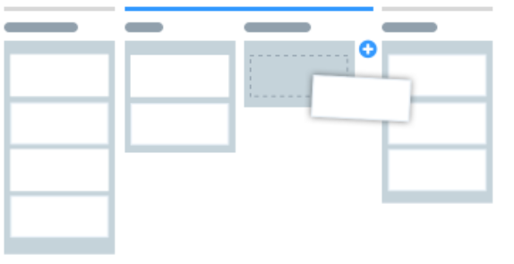

# Scrum e Kanban

Serão apresentados a seguir os conceitos dos métodos ágeis como scrum e kanban, como entender e diferenciar scrum de kanban e como saber aplicar scrum e kanban de forma associativa.

## Scrum

O Scrum é uma ferramenta muito utilizada na metodologia ágil e é utilizada na gestão de projetos em qualquer área ou setor e é utilizada também para o desenvolvimento de software com muitos bons resultados, lembrando sempre que o objetivo é entregar o que o cliente espera para resolver suas necessidades.

O Scrum é uma ferramenta utilizada no método ágil que traz agilidade e aumenta a produtividade quando é utilizada como uma ferramenta da metodologia ágil, trazendo transparência na gestão da produção do software.

Quando o Scrum é utilizado como ferramenta no método ágil para a produção de software, todos os envolvidos no projeto sabem exatamente o que está sendo feito. As atividades de cada ciclo são mostradas para toda a equipe de forma visual.

Com o Scrum, ocorre a divisão do projeto em pequenos e diversos ciclos de atividades, com reuniões frequentes para o alinhamento da equipe diante do projeto de software que está sendo desenvolvido e de forma a pensar formas de melhorar o processo com agilidade.

O Scrum é uma ferramenta do método ágil que permite mudanças de planejamento o tempo todo, em qualquer etapa do processo de fabricação do software, de forma livre e bem pouco engessada para a entrega de software funcional com qualidade.

É importante saber que o Produto Backlog é o conjunto de objetivo do projeto ou pacotes de funcionalidades a serem desenvolvidas no software quando a gestão do projeto está utilizando o Scrum como ferramenta do método ágil.

O Sprint backlog são as tarefas específicas realizadas e desenvolvidas em cada ciclo ou sprint, que deve ser uma parte diário, uma parte semanal e uma parte mensal, quando o Scrum está sendo considerado.

O Sprint é o ciclo de cada projeto e o working increment of the software é o desenvolvimento de trabalho em equipe. São nomenclaturas muito utilizadas e conhecidas quando se desenvolve com o Scrum.

Os principais pontos considerados quando se trata do desenvolvimento de software por meio de métodos ágeis que usam o Scrum como ferramenta são as reuniões diárias, mostrar o trabalho de forma visual, equipes enxutas, nada de títulos de função, priorização e heroísmo não é um bom sinal.

## Kanban

O Kanban é uma ferramenta muito utilizada na metodologia ágil e é utilizada gestão de projetos em qualquer área ou setor e é utilizada também para o desenvolvimento de software com muitos bons resultados, lembrando sempre que o objetivo é entregar o que o cliente espera para resolver suas necessidades.

O Kanban foi criado pela montadora de carros Toyota na década de 1960, pois ela precisava criar um método de montagem que fosse mais eficiente e eficaz. Foi então que surgiu o Kanban como uma metodologia JIT (Just In Time), ou seja, fazer apenas o que é necessário.

Com o Kanban, a Toyota passou a ter uma gestão de fabricação de seus veículos por resultados, com fácil visualização, uma melhoria constante da comunicação, com padronização e focado na redução de desperdícios.

A forma como a ferramenta Kanban é utilizada na metodologia ágil mantém os principais itens de controle bem ao alcance de toda  a equipe. Dessa forma, toda a equipe sabe exatamente como está o andamento do projeto como um todo.

Com o Kanban, as atividades passam de cada etapa até serem entregues, faz parte de um metodologia ágil e o Kanban é utilizado na gestão de projetos. E passou a ser muito bem utilizado e aceito no desenvolvimento de projetos de software.

A seguir, temos exemplo de como o Kanban é utilizado e de uma forma visual de forma que todos da equipe consigam ter o entendimento de todo o projeto.

Como uma ferramenta para a gestão de projetos no desenvolvimento da criação de software, o Kanban possui como benefícios a visão do todo, a simplicidade, a facilidade do fluxo de trabalho, o incentivo à comunicação, as prioridades e metas claras e menos a microgestão.

## Scrum x Kanban

Numa comparação entre as duas ferramentas mais utilizadas quando se adota a metodologia ágil para o desenvolvimento de software, temos na sequência algumas comparações entre o Scrum e o Kanban.

Em reação ao fluxo, o Kanban possui um fluxo mais contínuo e o Scrum possui sprints regulares bem definidos.

Em relação às funções de cada membro da equipe, o Kanban não possui funções existentes e o Scrum possui funções bem definidas, como o Scrum Master e a equipe de desenvolvimento.

Em relação às entregas, o Kanban possui entregas contínuas ou a critério da equipe. O Scrum possui entregas ao final de cada sprint e devem ser aprovadas. Caso não seja, a mesma tarefa volta para a próxima sprint.

Em relação às mudanças, o Kanban permite a ocorrência de mudanças a qualquer momento e no Scrum, as equipes devem se esforçar para que não aconteçam alterações, para manter a estimativa.

## Aplicando Scrum e Kanban

Tanto Scrum quanto o Kanban podem ser aplicados juntos ou separados como ferramentas das metodologias ágeis para o desenvolvimento e criação de software de qualidade que satisfazem as necessidades do cliente.

Quando se aplica o Scrum e o Kanban, é importante garantir a motivação e o engajamento da equipe, por isso, a escolha da equipe precisa ser muito bem pensada.

Aplicando o Scrum e o Kanban, é preciso determinar as tarefas e além disso, determinar e estimar o esforço de cada tarefa, considerando a produtividade e a velocidade de desenvolvimento de cada tarefa inerente ao projeto de produção do software.

É importante determinar os sprints quando se aplica o Scrum e o Kanban, com reuniões diárias com o que foi feito no dia anterior, com o que se pretende fazer no dia atual e quais os problemas encontrados e a forma como foram solucionados.

Normalmente, além das reuniões diárias, acontecem reuniões semanais para revisar os sprints. Dessa forma, garante-se que ao final, o software está sendo produzido de acordo com as necessidades do cliente.

Utilizando o Kanban e o Scrum, é importante que todas as informações sejam visuais e de acesso a todos da equipe, utilizando quadros com post-it ou meio digital que esteja disponível e de fácil acesso por todos da equipe.

O desenvolvimento deve ser organizado e separado pelo menos três partes, o "to do" que é o que precisa ser feito, o "doing" que é o que está sendo feito e o "done" que é o que já foi feito no projeto de desenvolvimento do software.
