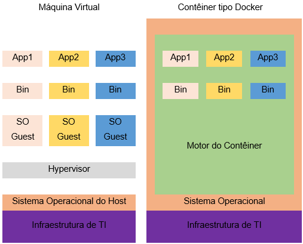

# Sistema de mensagens e enfileiramento

Antes de entrar nos detalhes da computação sem servidor, vamos compreender um dos elementos que fazem do seu funcionamento dentro da infraestrutura da AWS uma realidade, o Amazon Simple Queue Service, ou simplesmente SQS. Para que um serviço serverless (sem servidor) seja acionado, e para que receba a fila de requisições que deve processar, um mecanismo de mensagem deve transportar e organizar estas requisições, aqui entra o SQS, que pode ser definido como:

O Amazon Simple Queue Service (SQS) é um serviço de filas de mensagens gerenciado que permite o desacoplamento e a escalabilidade de microserviços, sistemas distribuídos e aplicações sem servidor. O SQS elimina a complexidade e a sobrecarga associadas ao gerenciamento e à operação de middleware orientado a mensagens, além de permitir que os desenvolvedores se dediquem a criar diferenciais(AWS 2022, Documento Online).

Desta forma, o SQS dve ser utilizado no envio, no armazenamento e no recebimento das mensagens que trafegam entre os microserviços e componentes de uma aplicação e possui como atributos de destaque a sua capacidade de atuar com qualquer volume de mensagens sem qualquer perda. A configuração do SQS é rápida e pode ser realizada tanto no console de gerenciamento quanto por um SDK ou via CLI (Command Line Interface).

Dentre os tipos de filas de mensagens oferecidos pelo SQS, temos filas padrão e as filas FIFO. Filas padrão oferecem o melhor desempenho de saída, com melhor classificação e ao menos uma entrega garantida. Para o modelo FIFO, temos a garantia de que as mensagens serão processadas exatamente por uma vez e na mesma ordem de envio. A seguir temos os benefícios do SQS:

Existe intensa integração entre os diversos serviços AWS e, no caso do SQS e do serviço sem servidor Lambda, não é diferente. Desta forma, o SQS pode ser configurado para enviar filas de serviços para o AWS Lambda até mesmo de forma assíncrona. Filas de mensagens síncronas também são processadas entre o SQS e o Lambda.

## Computação sem servidor

Antes de adentrar no tema da computação sem servidor, ou serverless, vale ressaltar que a ausência do servidor é muito mais uma abstração promovida para o cliente do serviço, ou seja, quem cria microsserviços que usam esta tecnologia não mais terão que configurar ou gerenciar o servidor que o hospeda. Desta forma, do lado da infraestrutura sempre existirá um servidor, embora para o consumidor, desenvolvedor, ele deixa de existir. Silva et al. (2020, p. 243) nos apresenta o seguinte conceito de computação serverless:

A computação sem servidor (serverless) permite que os usuários escrevam e implantem código sem se preocupar com a infraestrutura subjacente. Uma empresa que obtém serviços de back-end de um fornecedor sem servidor é cobrada com base em seus cálculos e não precisa reservar e pagar por uma quantidade fixa de largura de banda ou por determinado número de servidores, pois o serviço é dimensionado automaticamente (por meio dos recursos da computação em nuvem). Embora essa computação seja chamada de “sem servidor”, servidores físicos ainda são usados, mas os desenvolvedores não precisam estar cientes deles. (SILVA ET AL 2020. p.243).

Vale ressaltar que os serviços serverless demandam outros serviços costumeiramente oferecidos pelos provedores de computação em nuvem, onde podemos elencar banco de dados e o armazenamento. Desta forma podemos ter em uso o FaaS ou função como serviço onde as plataformas podem executar códigos sem ter que armazenar arquivos.

## AWS Lambda

Dentro dos serviços oferecidos pela AWS, o Lambda é um dos mais requisitados por desenvolvedores de aplicações que são construídas com microsserviços, portanto é um serviço consolidado e robusto. De acordo com AWS (2022a, p.01), com o lambda o desenvolvedor pode executar códigos sem provisionar ou gerenciar servidores.

O Lambda executa seu código em uma infraestrutura de computação de alta disponibilidade e executa toda a administração dos recursos computacionais, inclusive a manutenção do servidor e do sistema operacional, o provisionamento e a escalabilidade automática da capacidade e o monitoramento e o registro em log do código.

No AWS Lambda, o desenvolvedor não tem restrições quanto ao tipo de aplicação ou serviço back-end que pode executar, pois basta fornecer seu código em uma das diversas linguagens que o lambda é compatível. Uma vez que o desenvolvedor oferece o código, isso significa que o AWS Lambda apenas o executa, o que faz deste serviço um excelente exemplo de FaaS (Function as a Service).

A respeito do custo, o serviço do lambda possui uma forma de composição de cobrança distinta se comparado com o EC2 e sua relação com o tipo da instância e tempo de execução, pois aqui o tempo é de execução da função específica tratada pelo lambda.

Como o desenvolvedor não precisa gerenciar servidor, sua única tarefa é a de inserir o código, pois o próprio lambda vai executar e escalonar o código dentro de uma infraestrutura de alta disponibilidade. Se existe outra função do desenvolvedor no lambda esta tem relação com seu acionamento, ou seja, o desenvolvedor pode configurar para que o código seja automaticamente acionado por um gatilho específico.

## Containers

A estrutura sem servidor criada pelo Lambda possui uma simplificação se comparada com uma máquina virtual tradicional, pois abstrai o servidor e por consequência o sistema operacional, sobrando uma espécie de contêiner, e por se assemelhar com este objeto retangular metálico usado no transporte de mercadorias entre continentes, recebe o mesmo nome, contêiner.

Desta forma, os contêineres são ambientes isolados contidos em algum servidor e se diferem das máquinas virtuais por usarem um host em comum para seu controle. Assim como os contêineres de transporte dependem de um navio que os conduz, no lambda os contêineres dependem de um host que os controlam, conduzem.

Existe uma outra vantagem, além da simplificação da implementação de funções, relativo a economia de capacidade computacional, pois os contêineres dependem de um kernel, um núcleo de sistema operacional comum, o que faz com que recursos como processador, memória RAM e capacidade de armazenamento sejam demandados em proporções menores.

- **Elimine a sobrecarga administrativa**: A AWS gerencia todas as operações e a infraestrutura subjacente necessárias para oferecer um serviço de filas de mensagens altamente disponível e escalável.

- **Proteja dados sigilosos**: Você pode usar o Amazon SQS para trocar dados confidenciais entre aplicativos usando a Server-Side Encryption (SSE - Criptografia no lado do servidor) para criptografar cada corpo de mensagem.

- **Entregue mensagens com confiabilidade**: Use o Amazon SQS para transmitir qualquer volume de dados, em qualquer nível de throughput, sem perder mensagens ou exigir que outros serviços estejam disponíveis.

- **Ajuste a escala de forma elástica e com bom custo-benefício**: O Amazon SQS utiliza a AWS para ajustar a escala de modo dinâmico conforme a demanda.  (AWS 2022, Documento Online).

Como pode ser observado na figura, a estrutura de um contêiner é muito mais enxuta do que a apresentada pelas máquinas virtuais, desta forma podemos assumir que tais contêineres demandam menos capacidade computacional para seu funcionamento e sua gestão centralizada é muito mais ágil e descomplicada.

## AWS Elastic Beanstalk

O EBS ou AWS Elastic Beanstalk é um sistema completo destinado a implantação e monitoramento de aplicações na nuvem mantendo a infraestrutura que sustenta a aplicação totalmente abstraída. Desta forma, ao utilizar o AWS EBS o gestor tem facilitado seu processo de monitoramento, que não é simplificado, ou seja, ainda mantém um elevado controle na mão do gestor.

Assim como outros serviços AWS, o EBS pode ser utilizado via console ou ainda pelo CLI e sua capacidade de configurar escalabilidade pode ser utilizada com aplicações ou serviços criados em Java, .NET, PHP, Node.js, Python, Ruby, Go, Docker, além de servidores Apache, Nginx, Passenger e IIS.

Em seu funcionamento, o EBS necessita apenas que lhe seja inserido o código da aplicação para que automaticamente a implemente, começando pelo provisionamento da sua capacidade, do balanceamento de carga e da escalabilidade, tema desta aula.

Mas o fato de que o EBS abstrai tantos processos importantes não significa que o desenvolvedor perde controle sobre sua aplicação. Desta forma o desenvolvedor ganha uma poderosa ferramenta que acelera seu fluxo de produção, automaticamente lida com a escalabilidade ao melhor estilo serverless e não apresenta qualquer aumento no custo do projeto, pois as funções executadas pelo EBS não impactam financeiramente,

Sobre este benefício financeiro, vale ressaltar que embora o EBS não realize qualquer cobrança, seu uso requer serviços que são consumidos em outros sistemas, como o armazenamento e banco de dados, que apresentam sua própria estrutura de custo e cobrança. Dentre os benefícios do EBS, podemos citar:

Com o AWS Elastic Beanstalk o desenvolvedor passa a ter a implementação de sua aplicação garantida com uma automação que vai da escalabilidade ao provisionamento de recursos, mas mantém o controle total destes recursos, pois pode escolher o tipo de instâncias a implementar, bem como qualquer outro recurso que alimenta sua aplicação, dentro da infraestrutura da AWS.

- **Setup inicial ágil e simplificado**: O EBS gerenciará automaticamente os detalhes de implementação do provisionamento de capacidade, balanceamento de carga, escalabilidade automática e monitoramento da saúde do aplicativo.

- **Controle avançado da escalabilidade**: O Elastic Beanstalk aumenta e diminui automaticamente a escala de acordo com as necessidades específicas da aplicação, usando configurações de Auto Scaling de fácil ajuste.

- **Produtividade do desenvolvedor**: O Elastic Beanstalk provisiona e opera a infraestrutura, além de gerenciar a pilha de aplicativos (plataforma), para que você não precise gastar seu tempo ou desenvolver conhecimentos específicos para isso. Isso também manterá a plataforma subjacente executando seu aplicativo atualizado com os patches e as atualizações mais recentes. (Adaptado de AWS 2022b, p. documento online)
