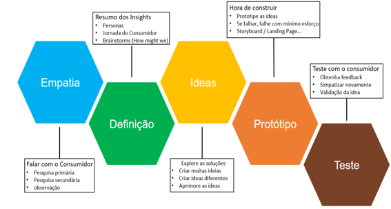

# Fundamentos sobre design thinking

Sempre que começamos qualquer trabalho envolvendo situações de design, será necessário muita reflexão e uma criatividade, aplicada em resultados de expressão do pensamento. Seguindo essa linha de raciocínio, sabemos que quando desempenhamos qualquer situação de criatividade, busca sempre aflorar no ser humano a capacidade criativa na busca de soluções de problemas.

E assim o Design Thinking surge para realmente encontrar as melhores soluções de gerenciamento de projetos e dar uma praticidade maior em desenvolver resultados. Mas então como podemos conceituar o Design Thinking?

Segundo Denning (2013), o design é um processo destinado à criação de artefatos para solucionar um problema. A partir do entendimento inicial de um problema, os designers expressam suas ideias por meio de técnicas onde consideram aspectos como modularidade, abstração, estratificação, integridade, utilidade e beleza, aliando-os à uma proposta de projeto atemporal.

A partir da observação dos processos executados por designers, o Design Thinking estimula a busca de soluções por meio da criação de um ambiente colaborativo, tendo como premissa o conhecimento dos interesses e valores dos usuários finais. A discussão do tema iniciou-se na década de 90 com o designer David Kelley, na empresa IDEO, a partir da concepção de produtos industriais (DENNING, 2013).

O design thinking, segundo Brown (2008), pode ser entendido como um método que permeia as atividades de inovação com foco no ser humano, através de um processo de compreensão detalhado (por meio de observações diretas), para extrair os desejos e necessidades das pessoas não descritos em pesquisas tradicionais, tais como a entrevista.

Já na visão de Bonini e Sbragia (2011) o design thinking consiste em uma abordagem colaborativa de resolução de problemas, centrada no usuário, que gera inovação através de interação e práticas criativas.

Com todas as discussões, chegou-se à conclusão que o design thinking poderia ser classificado como uma abordagem metodológica de projetos que busca soluções de problemas de forma criativa, coletiva e colaborativa. Sendo assim, pode ser aplicada em várias áreas, como desenvolvimento de sites com o intuito de atender a necessidade e os desejos do público alvo, ou mesmo nas aplicações de projetos sustentáveis ou mesmo em soluções que precisam identificar falhas e com isso aperfeiçoar o processo, pois a tendência é sempre sugerirmos a mesma solução para novos desafios, e na maioria das vezes isso não é efetivo, por isso que o design thinking vem com uma proposta de mudar de certa forma o jeito como os problemas são resolvidos e assim inovar.

## Fases do Design Thinking

Para se construir um design thinking temos que passar por 5 fases bem estruturadas dentro desse processo, são elas:

1) Empatia

Nesta fase a principal proposta é fazer a adoção da simpatia do cliente. Para isso precisamos nos colocar na posição dos clientes para entender melhor quais são as suas necessidades e saber exatamente quais são os problemas que precisamos resolver.

Portanto, antes mesmo de começar a desenvolver o seu website, defina um comportamento centrado no seu cliente/usuário.

2) Análise e Síntese

É durante essa fase que vamos analisar e sintetizar as informações que foram levantadas através de nossos clientes, tendo assim uma organização desses dados, buscando sempre novas oportunidades e desafios.

Embora pareça uma etapa simples, mas nesta fase você terá que analisar todas as informações coletadas e a partir disso, traçar uma visão mais específica sobre o público alvo do seu projeto.

3) Ideação

Para Brown (2009), a ideação é o processo no qual as ideias e conceitos são gerados com o objetivo de gerar inovações sobre os problemas identificados na etapa de inspiração.

Nesta etapa é o momento de fazer o brainstorming, ou seja, reunir uma equipe bem diversificada, pois assim haverá grande possibilidade de atender necessidades distintas, como por exemplo, na criação de um website, você pode reunir participantes de setores diferentes, com formações diferentes, etc, pois quanto mais diverso for o grupo, mais inovadora será a sua elaboração.

Para Brown (2009) afirma que a prototipagem é mais um dos estágios da criação e concepção da ideia: nos estágios iniciais ela é importante para gerar ideias, invertendo o pensamento tradicional de imaginar para criar, por trazer à tona a lógica de criar para visualizar e imaginar novas alternativas e soluções.

4) Prototipação

É a fase de tirar as ideias do papel para que se tornem aplicáveis. Os benefícios dessas soluções são observados para se construir protótipos básicos para aprender como fazer ideias melhores.

Em se tratando de um site, pode ser utilizado um mockup, que os designers comumente utilizam para apresentar uma ideia, que se fosse explicada em palavras, por exemplo, não apresentaria, com clareza, o produto ou resultado final. Para mostrar como o conteúdo seria distribuído para que seja avaliado se atende às expectativas do público.

Um MVP (Minimum Viable Product), seria um bom exemplo do que se fazer nessa fase. Ele é a versão mais simplificada de um produto, que podemos lançar em períodos de teste, para determinar se realmente a ideia que foi levantada atinge as necessidades do cliente/usuário.

5) Validação e Implementação

Nesta etapa, as pessoas interessadas ou possíveis clientes validam as ideias do empreendedor. Ele busca captar a percepção e encontrar possíveis ajustes necessários e gerar um conhecimento contínuo durante o processo de implementação.

Quando falamos de um website, este é o momento de colocá-lo no ar e verificar a sua usabilidade.

Uma situação muito importante nessa etapa é receber os feedbacks dos clientes, pois assim será possível cada vez mais lapidar a ideia do cliente/usuário, tendo uma excelente experiência de uso.

## Método Duplo Diamante do Design Thinking

Este método foi criado pelo Conselho de Design do Reino Unido, em 2005, que a princípio só era utilizado por designers.

Para a sua estruturação, os pilares do Design Thinking de empatia, colaboração e experimentação são mantidos de forma que em todas as etapas e no processo como um todo, eles se tornam obrigatórios.

O duplo diamante é um diagrama que é formado por quatro triângulos, que são conectados, assim retratando as quatro etapas do processo levando a inovação.

O modelo de processo de design duplo diamante (Double Diamond Design Process Model) é um dos mais conhecidos `[Design Council 2012]`.

As etapas do modelo podemos dividir em: Descobrir, Definir, Desenvolver e Entregar, organizadas em estágios divergentes e convergentes do processo de design.

Colocando em prática temos:

1) **Primeira etapa:** Primeiro diamante, representa a parte inicial divergente do projeto: a etapa de descoberta, na qual o designer procura novas oportunidades, mercados informações tendências e insights (Tschimmel 2012). Também chamada de imersão preliminar, pois objetiva o entendimento inicial do problema.

2) **Segunda etapa:** Primeiro Diamante, marca o estágio de definição, um tipo de filtro no qual os primeiros insights são revisados e selecionados (Tschimmel 2012). Também chamada de imersão em profundidade, pois irá identificar as necessidades e oportunidades para a geração de soluções nas próximas etapas.

3) **Terceira etapa:** Segundo diamante, representa o período de desenvolvimento de potenciais soluções para a etapa anterior (Tschimmel 2012). Também chamada de análise e síntese, pois os envolvidos usam todos os dados obtidos, agrupando os que são em comum. Isto faz com que os problemas mais recorrentes sejam identificados.

4) **Quarta etapa:** Segundo diamante, visa a convergência da solução e marca a entrega, que por sua vez centra todas as etapas com a validação do que foi produzido (Tschimmel 2012).

## Design Thinking no Desenvolvimento Web

É muito importante deixar objetivo aqui que essa metodologia não irá fazer com que você mude a linguagem de programação ou mesmo o modo de planejar e organizar o desenvolvimento web, e sim usar toda essa mudança vem para fazer uma aplicação dos seus conhecimentos, entendendo que o foco será sempre atender as necessidades das pessoas envolvidas.

Uma outra coisa muito importante quando utilizamos o design thinking na web é em relação a usabilidade, que é uma capacidade de um usuário qualquer entrar em um website qualquer, acessá-lo e conseguir cumprir com sua tarefa facilmente.

Com a implementação das práticas de Design Thinking, é muito natural que novas descobertas e também outras oportunidades iriam surgir, pois ele transforma a experiência do cliente, deixando-a mais acessível e personalizada, se encaixando perfeitamente a todos os tipos de usuários.

Se alguém visita seu site e acha ele ruim, o que a pessoa faz? Abandona o site. Dessa forma, são grandes as chances de você ter perdido um potencial cliente.

A união de todas as práticas e elementos do Design Thinking garante a intuitividade e uma melhor compreensão de qualquer ambiente digital.
