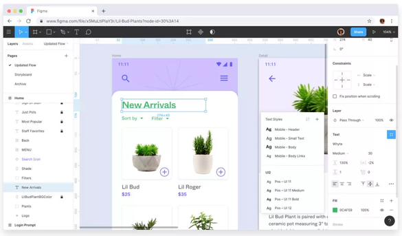
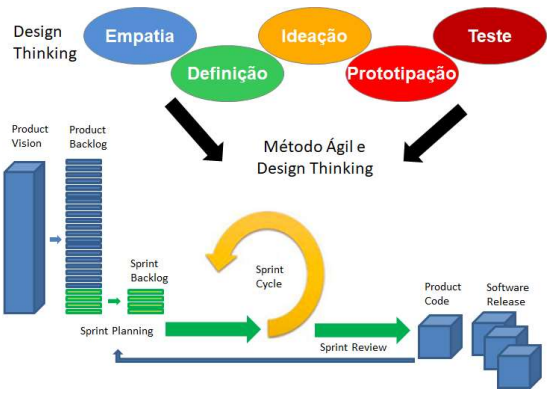

# Técnicas para o Design Thinking

## Descobrindo o Design Thinking

Podemos dizer que o Design Thinking (DT) é muito mais do que simplesmente uma metodologia ou mesmo uma abordagem, ela trata uma maneira totalmente criativa de enxergar o mundo.

Por esse motivo ele está cada vez mais inserido nos negócios, por isso é essencial cada vez mais nos aprofundarmos nessas aplicações e com certeza, entendendo melhor esse processo, poderemos aplicar de uma forma bem mais assertiva em nossos empreendimentos.

Diante disto, DT pode ser visto como ferramenta de auxílio na construção dos requisitos, auxiliando no entendimento das necessidades dos clientes (Vetterli et al. 2013). O uso de DT pode fazer com que organizações atendam a satisfação dos clientes antes de iniciarem o processo de concepção de um novo produto ou serviço (Barbosa 2016).

## Definindo o Design Thinking

Quando começamos a utilizar a metodologia do Design Thinking, passamos a entender profundamente sobre as possibilidades de solução. Colocando tudo isso em prática, cria-se na maioria das vezes, um ambiente propulsor da inovação. A partir desse ponto vai surgindo e se modelando uma nova cultura, que é desenvolvida e aprimorada em cada implementação. Dessa forma, entendemos que a empresa se torna mais ágil e precisa, tanto na declaração quanto na sugestão de soluções, focando sempre nos clientes/usuários; oferecendo propostas mais humanas de novas abordagens, produtos e serviços, portanto, propostas mais desejáveis.

Por outro lado, as empresas já não têm mais como se sustentarem apenas com a ideia de que a lucratividade é o principal fator na tomada de decisões. Acreditamos que ter uma visão mais específica, mais objetividade com clientes finais e pessoas, é realmente o caminho mais provável para obter respostas assertivas sobre os próximos passos. Já se sabe que entregar valor e experiências incríveis, sem sombra de dúvidas, é um critério essencial para o sucesso de qualquer marca, serviço ou produto que se colocam à disposição para serem criados através dessa metodologia.

## Desenvolvendo o Design Thinking

Quando falamos de desenvolvimento em torno do Design Thinking, ficamos com a impressão que este método nos trará muitos benefícios, não só econômicos mas também em relação a criatividade do desenvolvimento de vários produtos de design e nas diversas tecnologias como por exemplo na web e mobile. Este método possui algumas etapas de processo, nas quais o tornam e caracterizam como cíclico e que de uma forma ou outra está diretamente ligado as estratégias das organizações. Conforme Barbosa (2016), é possível definir uma correlação entre os conceitos de Inteligência Estratégica e Design Thinking para o desenvolvimento de estratégias inovativas. A abordagem possui um conjunto de ferramentas que auxilia e facilita a geração de ideias e a inovação de produtos (Marina, 2017). Essas ferramentas compreendem (Marina, 2017):

- **Brainstorming:** Técnica para estimular a geração de um grande número de ideias em um curto espaço de tempo. Geralmente realizado em grupo, é um processo criativo conduzido por um moderador, responsável por deixar os participantes à vontade e estimular a criatividade sem deixar que o grupo perca o foco;

- **Workshop de Cocriação:** Encontro organizado na forma de uma série de atividades em grupo com o objetivo de estimular a criatividade e a colaboração, fomentando a criação de soluções inovadoras. Geralmente são convidadas as pessoas que podem ter envolvimento direto ou indireto com as soluções que estão sendo desenvolvidas, ou seja, o usuário final, os funcionários da empresa que demanda o projeto e a equipe que atua como facilitadora da dinâmica;

- **Cardápio de Ideias:** Catálogo apresentando a síntese de todas as ideias geradas no projeto. Pode incluir comentários relativos às ideias, eventuais desdobramentos e oportunidades de negócio;

- **Matriz de Posicionamento:** Ferramenta de análise estratégica de ideias geradas, utilizada na avaliação destas em relação aos critérios norteadores, bem como às necessidades das Personas criadas no projeto. O objetivo deste recurso é apoiar o processo de decisão, a partir da comunicação eficiente dos benefícios e desafios de cada solução, de modo que as ideias mais estratégicas sejam selecionadas para serem prototipadas.

Além dessa ferramentas citadas, podemos destacar também o uso da ferramenta Figma.

O Figma por característica básica, tem o potencial de apoiar todo o processo de design desde o seu início até o seu fim. Traçando um passo a passo, teremos:

- Primeiros Esboços;
- Coleta de Feedback;
- Colaboração;
- Protótipos prontos para teste;
- E entrega do desenvolvedor;

Esses passos estão dentro das capacidades que ele tem para fazer toda a elaboração de uma elaboração/produto.

O Figma também simplifica todo o processo de desenvolvimento praticado pelos gerentes de produtos e também pelos líderes de design, assim como, todas as outras partes que tem interesse em relação a este desenvolvimento.

Fora isso também temos uma forma muito interessante de entregar os procedimentos do Design Thinking, existem várias variações que podemos entregá-lo.

Uma dessas variações é o uso com metodologias ágeis aplicadas ao gerenciamento de aplicações de desenvolvimento de software. O uso do modelo de gestão de projetos que integra o Design Thinking e métodos ágeis pode ocorrer ao longo do ciclo de desenvolvimento do software, segundo Góes e Russo (2018):

- Como ondas entre as fases de desenvolvimento, sem nenhum sincronismo;

- Durante a etapa de concepção sincronizada com a etapa de desenvolvimento, ou;

- Com a integração do design e a construção do software em todas as etapas do desenvolvimento do software;

Isso tudo só é possível devido ao fato que: uma aplicação do modelo que faz a integração do design thinking com os métodos ágeis, está totalmente relacionada com as etapas do ciclo de desenvolvimento de software, que passam a ter uma interatividade muito maior com os clientes e usuários, principalmente, para que se tenha desenho cada vez melhor de uma possível solução.

A partir das informações advindas de (Pereira e Russo, 2018), embora o modelo possa ser aplicado em diferentes estágios do ciclo de vida do desenvolvimento de um software, é possível identificar aspectos relevantes no uso dos modelos que integram a abordagem design thinking e seus métodos.

## Avaliando o Design Thinking

Depois de todas as informações que passamos sobre o design thinking, como poderíamos avaliar se realmente será ou não interessante utilizá-lo em uma boa resolução para as empresas?

Essa resposta se dá quando entendemos primeiramente que não só as grandes empresas podem ter essa experiência com o design thinking, cada vez mais, as pequenas e médias empresas estão utilizando desses conceitos colaborativos, da prática da criação de soluções e na questão de ser multidisciplinar na transição dos desafios de seu negócio.

E se tratando de um mundo com constantes mudanças, às vezes imprevisíveis, a necessidade de se propor melhores soluções, com mais criatividade e melhorando sempre a experiência com o cliente, são fatores que não são mais opcionais, são prioritários nas empresas para poder ter sempre uma vantagem competitiva no mercado. Seja para solucionar dilemas pessoais ou profissionais, a forma de pensar deve ser colaborativa, empática, flexível e criativa. Para todas essas situações o Design Thinking nos projetos dispões desses recursos.

## Design Thinking no Projeto Prático de Aplicativo

Durante nossa disciplina de tentamos criar um aplicativo de preços de posto de gasolina, então vamos pensar um pouco sobre esse projeto usando o modelo Design Thinking.

- **Personas:** donos dos postos de gasolina, motoristas e público em geral.

- **O problema:** conseguir gasolina de qualidade pelo melhor preço.

Pensando num aplicativo com um mapa com os preços de gasolina, tente criar um modelo de projeto de Design Thinking para este aplicativo. Durante as vídeo aulas vamos criar as etapas do Design Thinking e do desenvolvimento ágil para iniciar o protótipo desse projeto antes do desenvolvimento.
