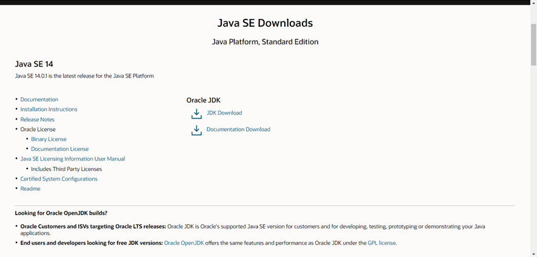
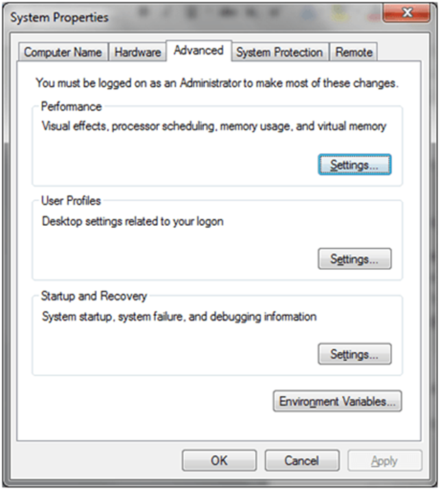

# Ambiente Java

Para desenvolver e executar qualquer programa Java, você precisa instalar o JDK no seu sistema. Você pode fazer o download da versão mais recente do Java [aqui](https://www.oracle.com/java/technologies/javase-downloads.html). Depois de abrir o link, você poderá ver algo como a figura abaixo. Clique na caixa vermelha para fazer o download do JDK.



Depois que o download for concluído, você poderá iniciar a instalação. É muito semelhante à instalação de outro software no Windows. Após alguns minutos do processo de instalação, você verá uma janela pop-up perguntando onde instalar o JRE. Assumirei que você aceitou o diretório padrão, mas você pode selecionar outro. Em breve, você verá uma mensagem informando que a instalação foi bem-sucedida.

Você pode verificar novamente a instalação usando o prompt de comando. Use o comando “java -version” para verificar a versão do JRE instalada.

Se você não conseguir ver a versão Java como acima no prompt de comando, precisará definir o caminho da classe na variável do sistema. Para definir o PATH permanentemente:

Escolha Iniciar, Configurações, Painel de controle e clique duas vezes no Sistema, selecione a guia Avançado e clique em Variáveis de ambiente. Procure por “Caminho” nas Variáveis de Usuário e Variáveis de Sistema. Se você não tiver certeza de onde adicionar o caminho, adicione-o à extremidade direita do “Caminho” nas Variáveis do usuário. O valor deve ser o diretório de instalação.



O novo caminho entra em vigor em cada nova janela do Prompt de Comando que você abre após definir a variável PATH.

O programa Java pode ser escrito usando um editor de texto simples e compilado usando a terminal. Esta não é uma maneira produtiva de programação. Programadores profissionais usam um dos IDEs (Integrated Development Environments), que inclui um editor, um compilador, ajuda de digitação antecipada, um depurador e muito mais. Existem vários IDEs Java populares.

## Executando o programa Java no Windows

Vamos tentar executar o primeiro programa Java. Para começar a escrever um programa Java, você pode usar qualquer editor de texto sem formatação. O arquivo que contém o código Java hello world deve ser da extensão .java. Crie um diretório dentro da unidade C como `C:/javadevelopment/`. Agora salve o código abaixo como HelloWorld.java. (Se você estiver usando o Bloco de notas, selecione Todos os arquivos no menu suspenso Salvar como tipo, para evitar o anexo automático do sufixo .txt.)

### Criar HelloWorld.java

Digite o seguinte código no editor de texto

```java
public class HelloWorld {

  public static void main(String[] args) {
    System.out.println("Hello World!");
  }
}
```

### Compilar HelloWorld.java

No seu terminal, digite `javac HelloWorld.java` dentro do diretório criado `javadevelopment` e pressione enter.

### Executando

Após compilar o arquivo .java, você pode ver o arquivo .class criado. Este é o código do nosso programa java que pode ser executado em qualquer plataforma. Podemos tentar rodar em nosso JRE usando o comando `java HelloWorld` no terminal.

Lembre-se de que Java é uma linguagem que diferencia maiúsculas de minúsculas, o que significa que, se você nomeou o programa HelloWorld com H maiúsculo e W maiúsculo, não deve tentar iniciar o programa com helloworld.

## Executando o programa Java no Linux

### Crie um arquivo de origem

Você pode usar qualquer editor de texto para criar e editar arquivos de origem. Crie o diretório usando os seguintes comandos no terminal.

`cd /tmp`

`mkdir /javadevelopment`

`cd javadevelopment`

Crie o arquivo de origem Java usando um editor de texto e digite as seguintes linhas ou copie as seguintes linhas no arquivo.

```java
public class HelloWorld {

  public static void main(String[] args) {
    System.out.println("Hello World!");
  }
}
```

### Compilar o arquivo Java

Para compilar seu arquivo de origem, altere seu diretório atual para o diretório em que seu arquivo está salvo. Digite o comando `javac HelloWorld.java` e pressione enter. Após o termino do processo de compilação, você poderá ver o arquivo HelloWorld.class criado na mesma pasta.

### Executando o programa Java

Digite o comando `java HelloWorld` e pressione enter para ver a saída na tela.
