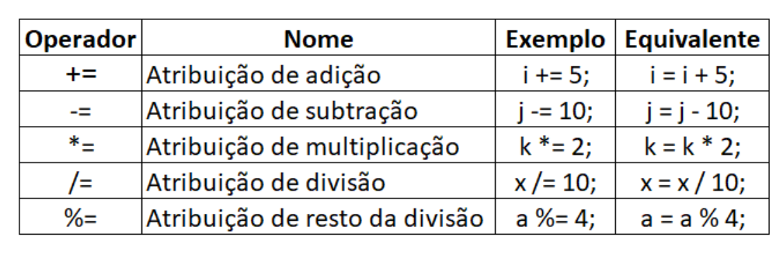
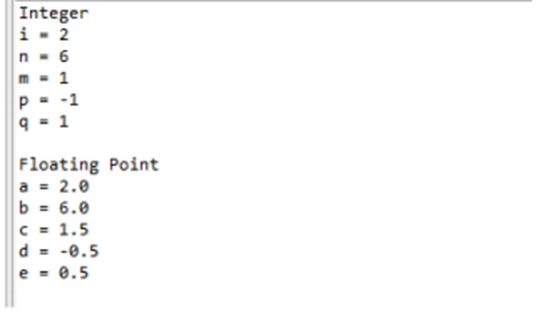
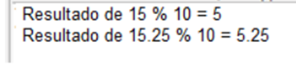

# Operadores

## Operador de Atribuição

Atribuir um valor a uma variável parece bastante direto; você simplesmente atribui o material no lado direito do `=` à variável à esquerda. Abaixo, a instrução 1 que atribui o valor 10 à variável x; e a instrução 2 está criando um objeto String chamado name e atribuindo o valor "Abel" a ele.

- **Instrução 1:** - `x = 10;`
- **Instrução 2:** - `String name = new String("Abel");`

A atribuição pode ser de vários tipos, vamos discutir cada um em detalhes.

## Atribuição Primitiva

O sinal de igual `=` é usado para atribuir um valor a uma variável. Podemos atribuir uma variável primitiva usando um literal ou o resultado de uma expressão.

- `int x = 7; // atribuição literal`

- `int y = x + 2; // atribuição com uma expressão e um literal`

- `int z = x * y; // atribuição com uma expressão`

## Casting de tipos primitivos (Primitive Casting)

A conversão permite converte valores primitivos de um tipo para outro. Precisamos fornecer conversão quando estamos tentando atribuir primitiva de maior precisão a primitiva de menor precisão, por exemplo. Se tentarmos atribuir variável int (que está no intervalo da variável de bytes) à variável de bytes, o compilador lançará uma exceção chamada `possível perda de precisão`. Para evitar esse problema, devemos usar conversão de tipo que instruirá o compilador para a conversão de tipo.

```java
int a = 120;
byte b = (byte)a;
```

Nos casos em que tentamos atribuir variáveis de containers menores a variáveis de containers maiores, não precisamos de conversão explícita. O compilador cuidará dessas conversões de tipo. Por exemplo, podemos atribuir variável de bytes ou variável short a um int sem nenhuma conversão explícita. Exemplo:

```java
package br.com.java.aula;

public class OperadorAtribuicaoDemo {

  public static void main(String[] args) {
    byte b = 10;
    byte c = b;
    int a = 23;
    short s = 45;

    int x = b;
    int y = s;
  }
}
```

## Atribuindo literais muito grandes para uma variável

Quando tentamos atribuir um valor de variável muito grande (ou fora do intervalo) para uma variável primitiva, o compilador lançará a exceção `possível perda de precisão` se tentarmos fornecer conversão explícita, em seguida, o compilador o aceitará, mas diminuiu o valor usando o método de complemento de dois. Vamos dar um exemplo do byte que possui espaço de armazenamento de 8 bits e intervalo -128 a 127 (inclusive). No programa abaixo, estamos tentando atribuir 129 de valor literal ao tipo primitivo de byte, que está fora do intervalo de bytes, para que o compilador converta em -127 usando o método de complemento de dois.

**Resultado:**

- Valor de b: -127

## Atribuição de variável de referência

Podemos atribuir um objeto recém-criado à variável de referência do objeto, como abaixo:

`String s = new String("Abel");`

`Funcionario f = new Funcionario();`

A primeira linha fará as seguintes coisas:

- Cria uma variável de referência denominada s do tipo String

- Cria um novo objeto do tipo String na memória heap

- Atribui o objeto String recém criado à variável de referência

Você também pode atribuir nulo a uma variável de referência do objeto, o que significa simplesmente que a variável não está se referindo a nenhum objeto. A instrução abaixo cria espaço para a variável de referência Funcionario, mas não cria um objeto Funcionario real:

`Funcionario f = null;`

## Operadores de atribuição composta

Em algum momento, precisamos modificar o mesmo valor da variável e atribuí-la novamente à mesma variável de referência. Java permite combinar operadores de atribuição e adição usando um operador abreviado. Por exemplo, a seguinte instrução pode ser escrita como:

`i += 8; // é o mesmo que i = i + 8;`

O `+=` é chamado de operador de atribuição de adição. Outros operadores de atribuição são mostrados na seguinte tabela:



## Operadores aritméticos no Java

Podemos usar operadores aritméticos para realizar cálculos com valores em programas. Operadores aritméticos são usados em expressões matemáticas da mesma maneira que são usados em álgebra. Um valor usado em ambos os lados de um operador é chamado de operando. Por exemplo, na declaração da expressão 47 + 3, os números 47 e 3 são operandos. Os operadores aritméticos são exemplos de operadores binários porque requerem dois operandos. Os operandos dos operadores aritméticos devem ser do tipo numérico. Você não pode usá-los em tipos booleanos, pode usá-los em tipos de caracteres, pois o tipo de caracteres em Java é, essencialmente, um subconjunto de int.

`int a = 47 + 3;`

Em Java, você precisa estar ciente do tipo de resultado de um operador aritmético binário (dois argumentos).

Se um dos operandos for do tipo double, o outro será convertido em double. Caso contrário, se um operando for do tipo float, o outro será convertido em float. E se for do tipo long, o outro será convertido em long. Caso contrário, os dois operandos são convertidos para o tipo int. Para operadores aritméticos unários (argumento único): Se o operando for do tipo byte, short ou char, o resultado será um valor do tipo int. Caso contrário, um operando numérico unário permanece como está e não é convertido.

As operações aritméticas básicas - adição, subtração, multiplicação e divisão - se comportam como seria de se esperar para todos os tipos numéricos. O operador menos também possui uma forma unária que nega seu único operando. Lembre-se de que quando o operador de divisão é aplicado a um tipo inteiro, não haverá componente fracionário anexado ao resultado.

O programa simples a seguir demonstra os operadores aritméticos. Também ilustra a diferença entre a divisão de ponto flutuante e a divisão inteira.

```java
public class OperadorAtribuicaoDemo {

  public static void main(String[] args) {
    // aritmética usando inteiros
    int i = 1 + 1;
    int n = i + 3;
    int m = n / 4;
    int p = m - i;
    int q = -n;

    System.out.println("i = " + i);
    System.out.println("n = " + n);
    System.out.println("m = " + m);
    System.out.println("p = " + p);
    System.out.println("q = " + q);

    // aritmética usando reais
    double b = a * 3;
    double c = b / 4;
    double d = c - a;
    double e = -d;

    System.out.println("b = " + b);
    System.out.println("c = " + c);
    System.out.println("d = " + d);
    System.out.println("e = " + e);
  }
}
```

**Resultado:**



## Operador do módulo

O operador do módulo, `%`, retorna o resto de uma operação de divisão. Pode ser aplicado a tipos de ponto flutuante e a números inteiros. O programa de exemplo a seguir demonstra o `%`:

```java
public class RestoDemo {

  public static void main(String[] args) {
    int x = 15;
    int intResto = x % 10;
    System.out.println("Resultado de 15 % 10 = " + intResto);

    double d = 15.25;
    double doubleResto = d % 10;
    System.out.println("Resultado de 15.25 % 10 = " + doubleResto);
  }
}
```

**Resultado:**



Além disso, há algumas peculiaridades a serem lembradas em relação à divisão por 0:

Um valor inteiro diferente de zero dividido pelo número 0 resultará em ArithmeticException no tempo de execução.

## Operadores aritméticos de atalho (operador de incremento e decremento)

O operador de incremento aumenta seu operando em um. O operador de decremento diminui o seu operando em um. Por exemplo:

`x = x + 1; // equivale a expressão abaixo`

`x++;`

O operador de decremento funciona da mesma maneira:

`x = x - 1; // equivale a expressão abaixo`

`x--;`
