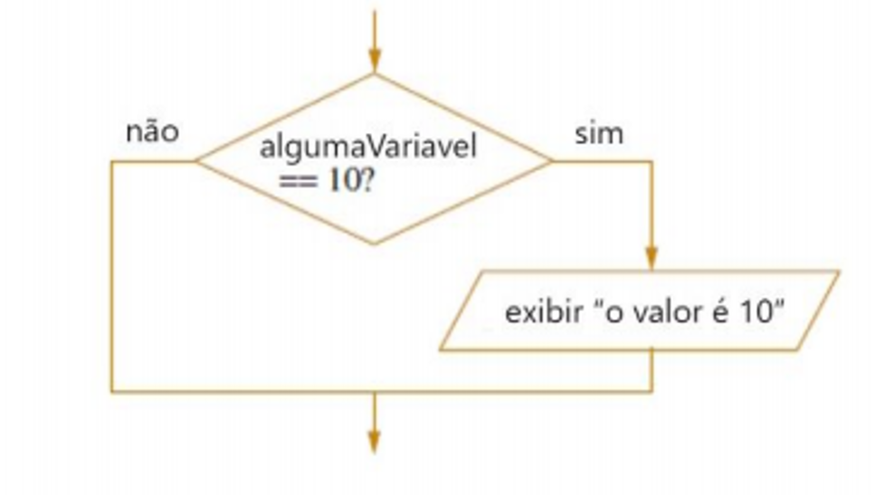
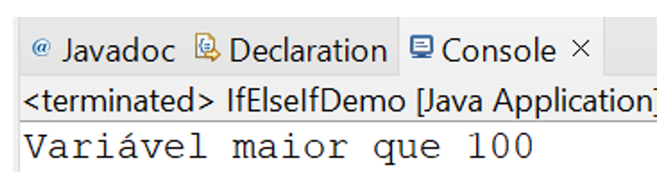
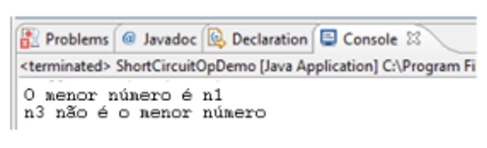
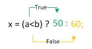
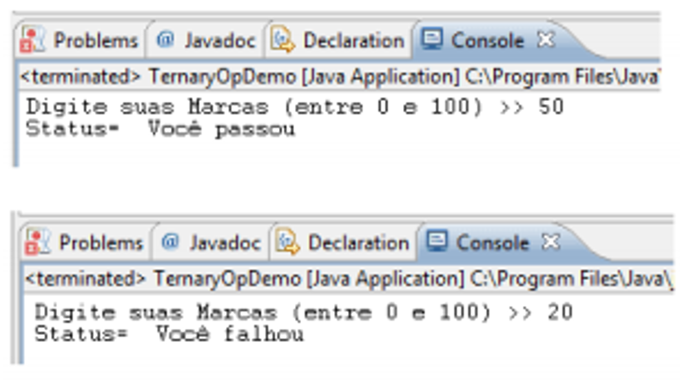

# Instrução Java

## Operadores condicionais ou relacionais de Java

Se você precisar alterar a execução do programa com base em uma determinada condição, poderá usar as instruções `if`:. Os operadores relacionais determinam o relacionamento que um operando tem com o outro. Especificamente, eles determinam a condição de igualdade. Java fornece seis operandos relacionais, listados na tabela abaixo.

| Column1 | Column2        | Column3 | Column4 |
| ------- | -------------- | ------- | ------- |
| ==      | Igual          | a == b  | false   |
| !=      | Diferente      | a != b  | true    |
| >       | Maior que      | a > b   | false   |
| >=      | Maior ou igual | a >= b  | false   |
| <       | Menor que      | a < b   | true    |
| <=      | Maior ou igual | a <= b  | true    |

O resultado dessas operações é um valor booleano. Os operadores relacionais são usados com mais frequência nas expressões que controlam a instrução `if` e as várias instruções de loop. Qualquer tipo em Java, incluindo números inteiros, números de ponto flutuante, caracteres e booleanos, pode ser comparado usando o teste de igualdade, `==`, e o teste de desigualdade, `!=`. Observe que em Java a igualdade é denotada com dois sinais de igual (==), não um (=).

Em Java, a instrução mais simples que você pode usar para tomar uma decisão é a isntrução `if`. Sua forma mais simples é mostrada aqui:

```java
if(condition) {
  instrucao;
}

// ou

if(condition) {
  instrucao1;
} else {
  instrucao2
}
```

Aqui, a condição é uma expressão booleana. Se a condição for verdadeira, a instrução será executada. Se a condição for falsa, a instrução será ignorada. Por exemplo, suponha que você tenha declarado uma variável inteira chamada algumaVariavel e deseje imprimir uma mensagem quando o valor de algumaVariavel for 10. O fluxograma e o código Java da operação são como abaixo:



```java
if(algumaVariavel == 10) {
  System.out.println("O valor é 10.");
}
```

Podemos ter diferentes tipos de declarações de `if`.

## Blocos aninhados

Uma declaração `if` aninhada é uma instrução `if` que é o destino de outra `if` ou `else`. Em outros termos, podemos considerar uma ouvárias instruções `if` dentro de um bloco `if` para verificar várias condições. Por exemplo, temos duas variáveis e queremos verificar uma condição específica para ambas, podemos usar blocos `if` aninhados.

```java
public class IfAninhadoDemo {
  public static void main(String[] args) {
    int a = 10;
    int b = 5;

    if (a == 10) {
      if (b == 5) {
        System.out.println("Loop aninhado interno");
      }
    }
  }
}
```

## if-else-if

Podemos ter uma situação em que precisamos verificar o valor várias vezes para encontrar a condição exata de correspondência. O programa abaixo explica a mesma coisa. Vamos ver que temos um requisito para verificar se o valor da variável é menor que 100, igual a 100 ou maior do que 100. O código abaixo exploca a mesma lógica usando a escada if-else-if:

```java
public class IfElseIfDemo {
  public static void main(String[] args) {
    int a = 120;

    if (a < 100) {
      System.out.println("Variável menor que 100");
    } else if (a == 100) {
      System.out.println("Variável igual a 100");
    } else {
      System.out.println("Variável meior que 100");
    }
  }
}
```

**Resultado:**



## Operadores lógicos de curto-circuito

O Java fornece dois operadores booleanos interessantes, não encontrados em muitas outras linguagens de computados. Essas são versões secundárias dos operadores booleanos AND e OR e são conhecidas como operadores lógicos de curto-circuito. Dois operadores lógicos de curto-circuito são os seguintes:

- `&&` - curto-circuito E

- `||` - curto-circuito OU

Eles são usados para vincular pequenas expressões booleanas para formar expressões booleanas maiores. Os operadores `&&` e `||` avaliam apenas valores booleanos. Para que uma expressão AND (&&) seja verdadeira, ambos os operandos devem ser verdadeiros. Por exemplo, a instrução abaixo é avaliada como verdadeira porque o operando um (2 < 3) e o operando dois (3 < 4) são avaliados como verdadeiros.

```java
if ((2 < 3) && (3 < 4)) {

}
```

O recurso de curto-circuito do operador `&&` é assim chamado porque não perde tempo com avaliações inúteis. Um curto-circuito `&&` avalia primeiro o lado esquerdo da operação (operando um) e, se for falso, o operador `&&` não se preocupa em olhar para o lado direito da expressão (operando dois), pois o operador `&&` já sabe que a expressão completa não pode ser verdadeira.

O operador `||` é semelhante ao operador `&&`, exceto que ele é avaliado como verdadeiro se QUALQUER dos operandos for verdadeiro. Se o primeiro operando em uma operação OR for verdadeiro, o resultado será verdadeiro, portanto, o curto-circuito `||` não perde tempo olhando para o lado direito da equação. Se o primeiro operando for falso, no entanto, o curto-circuito `||` precisa avaliar o segundo operando para ver se o resultado da operação OR será verdadeiro ou falso.

```java
public class CurtoCircuitoDemo {
  public static void main(String[] args) {
    float n1 = 120.345f;
    float n2 = 345.21f;
    float n3 = 234.21f;

    if (n1 < n2 && n1 < n3) {
      System.out.println("O menor número é n1");
    }

    if (n3 > n2 || n3 > n1) {
      System.out.println("n3 não é o menor número");
    }
  }
}
```

**Resultado:**



## Operador condicional ternário

O operador condicional é um operador ternário (possui três operandos) e é usado para avaliar expressões booleanas, como uma instrução `if`, exceto em vez de executar um bloco de código se o teste for verdadeiro, um operador condicional atribuirá um valor a uma variável. Um operador condicional começa com uma operação booleana, seguida por dois valores possíveis para a variável à esquerda do operador de atribuição (=). O primeiro valor (aquele à esquerda dos dois pontos `:`) é atribuído se o teste condicional for verdadeiro e o segundo valor é atribuído se o teste condicional for falso. No exemplo abaixo, se a variável a for menor que b, o valor da variável x seria 50 ou se for maior, x = 60.



No exemplo abaixo, estamos decidindo o status com base na entrada do usuário, se foi aprovada ou se falhou.

```java
import java.util.Scanner;

public class OpTernarioDemo {
  public static void main(String[] args) {
    String status;
    int marcas;

    System.out.println("Digite suas Marcas (entre 0 e 100 >> ");
    Scanner inputDevice = new Scanner(System.in);

    marcas = inputDevice.nextInt();
    status = marcas >= 35 ? "Você passou" : "Você falhou";

    System.out.println("Digite suas Marcas (entre 0 e 100 >> ");
  }
}
```

Saídas baseadas na entrada do usuário:



## O operador NOT

Também chamado de complemento bit a bit, o operador NOT unário, `~`, inverte todos os bits do seu operando. Se aplicado no operando inteiro, ele reverterá todos os bits da mesma forma. Se aplicado ao literal booleano, ele será revertido.

```java
int a = 23; // é representado em binário como 10111
int b = ~a; // isso reverte os bits 01000, que é 8 em decimal

boolean x = true;
boolean y = ~x; // isso atribuirá o valor false a y, pois x é verdadeiro
```

## O operador AND

O operador AND `&` produz 1 bit se ambos os operandos forem 1 caso contrário 0 bit. Da mesma forma, para os operandos booleanos resultará em true se ambos os operandos forem verdadeiros, caso contrário, o resultado será false.

```java
int var1 = 23; // valor binário seria 010111
int var2 = 33; // valor binário seria 100001
int var3 = var1 & var2; // resulta no binário 000001 e no decimal #

boolean b1 = true;
boolean b2 = false;
boolean b3 = b1 & b2; // b3 seria false
```

## O operador OR

O operador OR `|` produz um bit 0 se ambos os operandos forem 0, caso contrário, 1 bit. Da mesma forma, para operandos booleanos, resultará em false se ambos os operandos forem falsos ou o resultado será true.

```java
int var1 = 23; // valor binário seria 010111
int var2 = 33 // valor binário seria 100001
int var3 = var1 | var2; // resulta no binário 110111 e no decimal 55

boolean b1 = true;
boolean b2 = false;
boolean b3 = b1 | b2; // seria verdadeiro
```

## O operador XOR (OU exclusivo)

O operador XOR `^` produz um bit 0 se ambos os operandos forem iguais (ambos 0 ou ambos 1) caso contrário, 1 bit. Da mesma forma, para operandos booleanos, resultará em false se os dois operandos forem iguais (ambos são falsos ou ambos verdadeiros) ou o resultado será true.

```java
int var1 = 23; // valor binário seria 010111
int var2 = 33 // valor binário seria 100001
int var3 = var1 ^ var2; // resulta no binário 110110 e no decimal 54

boolean b1 = true;
boolean b2 = false;
boolean b3 = b1 ^ b2; // seria verdadeiro

```

Vejamos o programa abaixo, que demonstra os operadores acima para operações booleanas e inteiras.

```java
public class XorOpDemo {
  public static void main(String[] args) {
    int a = 23; // representação binária 100001
    int var2 = 33 // valor binário seria 100001
    System.out.println("a & b: " + (a & b));
    System.out.println("a | b: " + (a | b));
    System.out.println("a ^ b: " + (a ^ b));
    System.out.println("~a: " + ~a;

    boolean bool1 = true;
    boolean bool2 = true;
    boolean bool3 = false;

    System.out.println("bool1 & bool2: " + (bool1 & bool2));
    System.out.println("bool2 & bool3: " + (bool2 | bool3));
    System.out.println("bool2 | bool3: " + (bool2 | bool3));
    System.out.println("bool1 ^ bool2: " + (bool1 ^ bool2));
    System.out.println("!bool1: " + !bool1);
  }
}
```

## Switch

Uma linguagem de programação usa instruções de controle para fazer com que o fluxo de execução avance e se ramifique com base nas alterações no estado de um programa. Java suporta duas instruções de controle de fluxo: `if` e `switch`. Estas instruções permitem controlar o fluxo da execução do seu programa com base nas condições conhecidas apenas durante o tempo de execução.

A instrução `switch` é a instrução de ramificação múltipla do Java. Ele fornece uma maneira fácil de despachar a execução para diferentes partes do seu código com base no valor de uma expressão. Aqui está a forma geral de uma instrução switch:

```java
switch(expressao) {
  case value1:
    // sequência de instruções
    break;
  case value2:
    // sequência de instruções
    break;
  case value3:
    // sequência de instruções
    break;
  default:
    // sequência de instruções
}
```

A expressão deve ser do tipo byte, short, int ou char, cada um dos valores especificados nas instruções de caso deve ser um tipo compatível com a expressão. Um valor de enumeração também pode ser usado para controlar uma instrução de opção. A partir do Java 7, a String também é permitida como expressão de case. Cada valor de case deve ser um literal exclusivo (ou seja, deve ser uma constante, não uma variável). Valores se case duplicados não são permitidos.

## Como a instrução switch funciona

O valor da expressão é comparado com cada um dos valores literais nas instruções de case. Se uma correspondência for encontrada, a sequência de códigos após a instrução case é executada. Se nenhuma das constantes corresponder ao valor da expressão, a instrução padrão será executada. No entanto, a instrução padrão é opcional. Se nenhum caso corresponder e nenhum padrão estiver presente, nenhuma outra ação será tomada.

A instrução break é usada dentro do switch para finalizar uma sequência de instruções. Quando uma instrução break é encontrada, a execução ramifica para a primeira linha de código que segue toda a instrução switch.

Vamos entender o conceito do programa. No programa abaixo, imprima o valor do bônus com base no grau de funcionário. Um funcionário pode ser do tipo A B C ou padrão (qualquer coisa que não seja A B & C):

```java
public class SwitchDemo {
  public static void main(String[] args) {
    char Grade = "B";

    switch(Grade) {
      case "A":
        System.out.println("Você é funcionário da categoria A. Bônus: " + 2000);
        break;
      case "B":
        System.out.println("Você é funcionário da categoria B. Bônus: " + 1000);
        break;
      case "C":
        System.out.println("Você é funcionário da categoria C. Bônus: " + 500);
        break;
      default:
    }
  }
}
```

## Instruções do switch aninhado

Você pode usar um switch como parte da sequência de instruções de um comutador externo. Isso é chamado de switch aninhado. Como uma instrução switch define seu próprio bloco, não surgem conflitos entre as constantes de maiúsculas e minúsculas no switch interno e as constantes no switch externo.

### Pontos importantes relacionados a instrução switch-case

- A opção só pode verificar a igualdade. Isso significa que os outros operadores relacionais como maior que, são inutilizados em um caso.

- As constantes de caso são avaliadas de cima para baixo, e a primeira constante de caso que corresponde à expressão do switch é o ponto de entrada da execução. Se nenhuma instrução de interrupção for usada, todo o caso após o ponto de entrada será executado.

- Nenhuma constante de dois casos no mesmo switch pode ter valores idênticos. Obviamente, uma declaração de chave e uma chave externa anexa podem ter constantes de maiúsculas e minúsculas em comum.

- O caso padrão pode estar localizado no final, meio ou parte superior. Geralmente o padrão aparece no final de todos os casos.

## Declarações break

A instrução break, ou instrução de quebra, incluída em cada seção do caso determina quando parar de executar as instruções em resposta a um caso correspondente. Sem uma declaração de interrupção em uma seção de caso, depois que uma correspondência é feita, as instruções para essa correspondência e todas as declarações mais abaixo na central são executadas até que uma interrupção ou final da central seja encontrada. Em algumas situações, isso pode ser exatamente o que você deseja fazer. Caso contrário, você deve incluir instruções de interrupção para garantir que apenas o código correto seja executado. Às vezes, é desejável ter vários casos sem quebras entre eles. Por exemplo, aqui o programa imprime o mesmo valor até que atinja alguma condição:

```java
import java.util.Scanner;

public class SwitchBreakDemo {
  public static void main(String[] args) {
    int age;
    Scanner inputDevice = new Scanner(System.in);
    age = inputDevice.nextInt();

    switch(age) {
      case 10:
      case 15:
      case 17:
        System.out.println("Você não pode votar.");
        break;
      case 18;
        System.out.println("Você pode votar");
    }
  }
}
```
