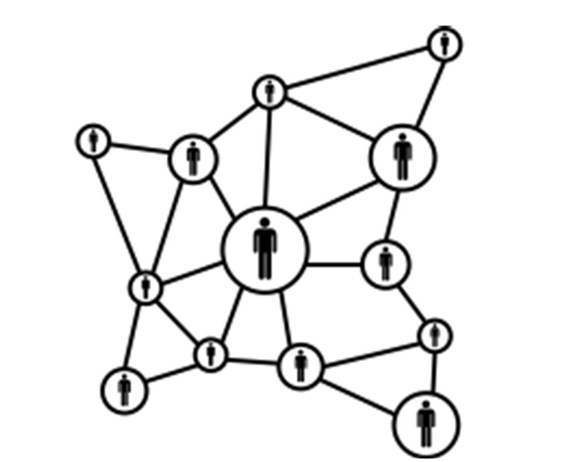
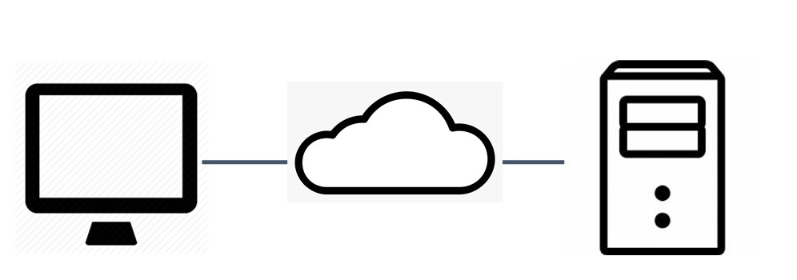
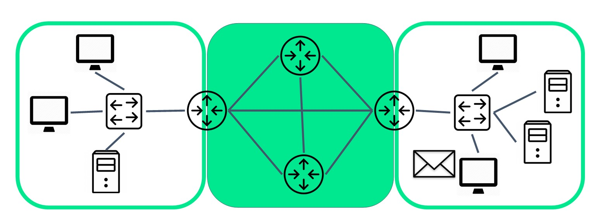
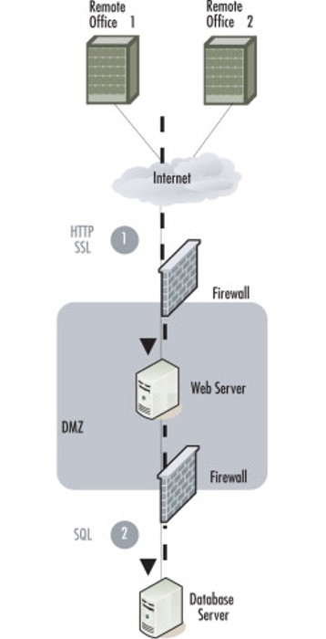
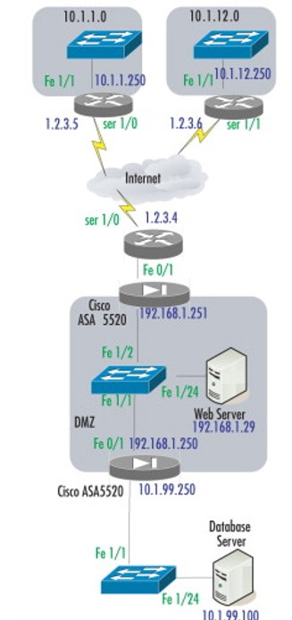
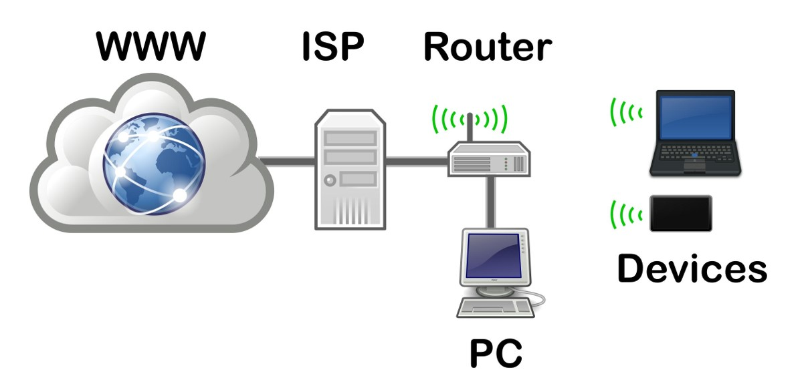
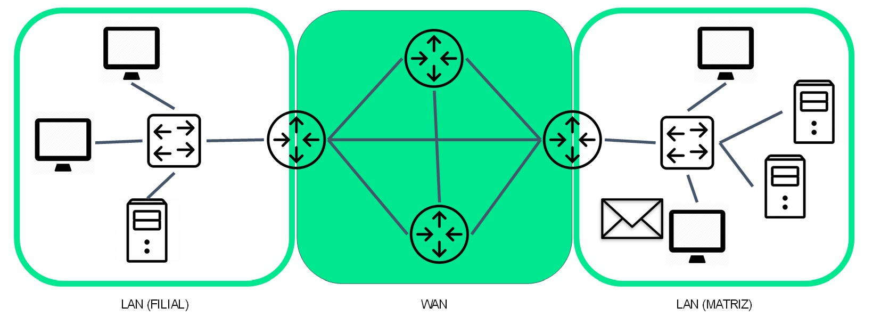
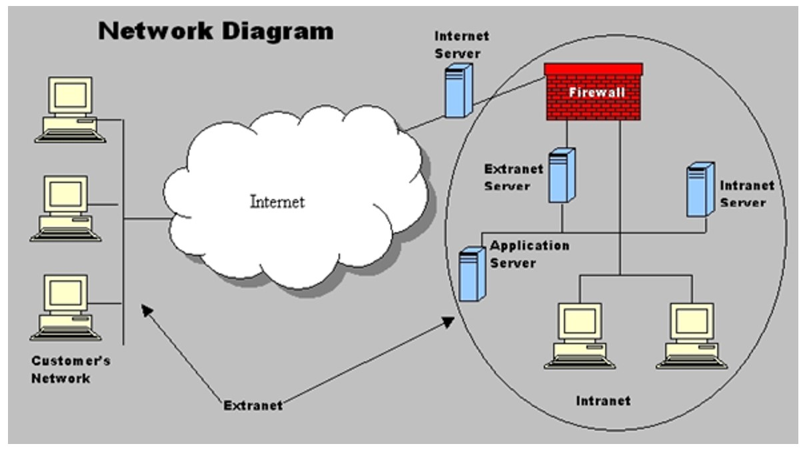

# Introdução à Redes

## Introdução

Bem-vindo ao nosso estudo de Introdução à Redes. Este estudo ajudará você a compreender melhor as redes. Mesmo que não esteja envolvido diretamente na área de redes, conhecer os conceitos de redes já lhe dará uma percepção melhor do que significam as redes que utilizamos através de inúmeras aplicações. Vamos começar a estudar as redes no nosso cotidiano e observar alguns aspectos do dia-a-dia.

## Redes no nosso cotidiano

Sabemos a necessidade e a importância de estar conectados e isso é cada vez mais evidente. Existem múltiplas razões para isso. Os acessos à rede e interações virtuais que realizamos sustentam nossa percepção. As redes estão no nosso cotidiano: seja para navegar na Internet ou mesmo para trabalhar ou estudar. O que fazemos nesse momento é um bom exemplo.

A seguir, a Figura 1 ilustra de forma simplificada uma rede que conecta diversos nós (ou equipamentos) através de enlaces (links) e possibilita a comunicação entre pessoas, pessoa-máquina ou máquina-máquina, por exemplo.

Compreendemos que temos necessidades que são atendidas e facilitadas pelas soluções tecnológicas implementadas. Precisamos agora entender melhor como isso tudo funciona.

## Componentes de rede

Para realizar uma comunicação e compreender as formas que as redes aparecem em nosso cotidiano, precisamos entender quais são os recursos e a infraestrutura que são utilizados. Ao identificar os componentes de rede, iniciamos o aprendizado dos conceitos e soluções relacionados à rede.

Começamos com a definição de _host_. Os computadores conectados a uma rede são denominados hosts (hospedeiros) porque se hospedam (isto é, executam) programas de aplicação. Os hosts podem ser chamados de dispositivos finais (end devices) ou sistemas finais ou também de clientes (KUROSE e ROSS, 2013)

Os _hosts_ referem-se a dispositivos que tem um número de IP necessário para a comunicação entre si. Os servidores são computadores que fornecem informações (serviços) para os dispositivos finais. Um computador pode executar múltiplos tipos de software cliente. Email, Web e Arquivos são tipos comuns de serviços oferecidos por servidores específicos para tais tarefas. A seguir, a Figura 2 mostra a comunicação típica entre um computador (cliente) e um servidor através de uma rede.

Cliente e servidor normalmente rodam em computadores separados, mas é possível que um computador realize os dois papéis ao mesmo tempo. Esse tipo de arquitetura de rede é chamado de peer-to-peer (par-a-par).

Além disso, alguns conceitos que aparecem ao longo dos nossos encontros: dispositivos intermediários e meios de comunicação. Os dispositivos finais são conectados entre si por enlaces (links) de comunicação e comutadores (switches) de pacotes. Assim, esses componentes formam a infraestrutura necessária para realizar as comunicações em rede e as interações que estão vinculadas ao uso das redes.

Um dispositivo intermediário interconecta dispositivos finais. Os exemplos incluem switches (comutadores), pontos de acesso sem fio, roteadores e firewalls. Algumas funções dos dispositivos intermediários:

- Regenerar e retransmitir sinais de dados
- Manter informações sobre quais caminhos existem na rede
- Notificar outros dispositivos sobre erros e falhas de comunicação
- Direcionar dados pelos caminhos na rede quando falhar algum link
- Classificar e direcionar mensagens de acordo com prioridades
- Permitir ou negar fluxo de dados baseado em configurações de segurança

A comunicação envolve os componentes e enlaces de uma rede e os bits da mensagem são transmitidos por um meio físico. Desta forma, permite que a mensagem caminhe da origem até o destino (Figura 3). Exemplos de meios físicos:

- Cabos com fios metálicos
- Fibra ótica
- Aéreo - transmissão sem fio (wireless)

## Representações

Assim como vimos os componentes presentes nas redes e suas soluções tecnológicas, também é necessário estabelecer formas de representar os componentes, dispositivos e conexões. Para isso, utilizam-se os diagramas de topologias. Os diagramas representam exatamente como é a organização das redes. As topologias podem ser de dois tipos: lógica e física. A topologia lógica mostra os endereçamentos, portas e disposições que compreende a parte lógica da rede. Já a topologia física mostra a disposição física dos equipamentos para que seja possível administrar as localizações e distribuições dos equipamentos.

Os diagramas de rede, também chamados de diagramas de topologia, usam símbolos para representar os dispositivos na rede. Englobam, por exemplo, placa de rede, porta física e interface. Os diagramas de topologia física ilustram a localização física de dispositivos intermediários e a instalação de cabos (Figura 4).

Os diagramas de topologia lógica ilustram dispositivos, portas e o esquema de endereçamento da rede (Figura 5)

## Tipos de rede

As redes representadas através das topologias e seus componentes são de diversos tipos. Os tipos de rede são de acordo com as necessidades e objetivos. Alguns tipos de rede: Redes domésticas, SOHO (Small Office-Home Office), Médias e Grandes e a World Wide Web.

Redes domésticas permitem o compartilhamento de recursos, como impressoras documentos, imagens e música, entre alguns dispositivos finais locais (Figura 6).

As redes SOHO permitem que as pessoas trabalhem em casa ou em um escritório remoto. Muitos trabalhadores autônomos usam este tipo de rede para anunciar e vender produtos, solicitar suprimentos e se comunicar com os clientes.

Empresas e grandes organizações usam redes (denominadas corporativas) para fornecer consolidação, armazenamento e acesso a informações em servidores de rede - fornecem e-mail, mensagens instantâneas e colaboração entre os funcionários. Muitas organizações conectam sua rede com a Internet para fornecer produtos e serviços aos clientes.

A internet é a maior rede existente. O termo internet significa uma "rede de redes". É uma coleção de redes públicas e privadas interconectadas.

As infraestruturas de rede variam de acordo com:

- Tamanho da área de cobertura
- Número de usuários conectados
- Número e tipos de serviços disponíveis
- Área de responsabilidade

Nesse sentido, temos dois tipos mais comuns de infraestruturas de rede: redes locais (LAN - Local Area Network) e redes remotas (WAN - Wide Area Network). As WANs são implementadas pelos provedores de serviço de comunicação - CSP (operadoras tradicionais).

Uma LAN é uma infraestrutura de rede que fornece acesso a usuários e dispositivos finais em uma pequena área geográfica. Tem características específicas:

- Interconectam dispositivos finais em uma área limitada (casa, escola, prédio comercial).
- Geralmente é administrada por uma única organização ou indivíduo.
- O controle administrativo é aplicado no nível da rede e governa as políticas de segurança e o controle de acesso.
- Fornecem banda de alta velocidade para dispositivos finais internos e dispositivos intermediários.

Uma WAN é uma infraestrutura de rede que fornece acesso a outras redes em uma ampla área geográfica, e são normalmente gerenciadas por provedores de serviço de comunicação (CSPs) ou provedores de serviço de Internet (ISPs).

Tem características específicas:

- Interconectam LANs em amplas áreas geográficas, como cidades estados, países ou continentes.
- Geralmente são administradas por vários provedores de serviços.
- Geralmente fornecem links de menor velocidade (taxa de bits) entre as LANs.

As LANs de uma empresa são conectadas entre si através de enlaces alugados de um provedor de WAN e desta maneira forma a rede corporativa. As WANs podem ser conectadas umas as outras.

A internet é uma coleção mundial de redes interconectadas. A internet não é propriedade de nenhum indivíduo ou grupo. Garantir uma comunicação eficaz por meio dessa infraestrutura diversificada requer a aplicação de tecnologias e padrões consistentes de muitas agências de administração de rede. Existem organizações para ajudar a manter a estrutura e padronização dos protocolos e processos da Internet como a IETF (Internet Engineering Task Force), a ICANN (Internet Corporation for Assigned Names and Numbers), o IAB (Internet Architecture Board), LACNIC (Latin America and Caribbean Network Information Center) e outros.

Outras denominações de rede que podemos encontrar são extranet e intranet. A extranet é uma rede de computadores que permite acesso externo controlado, para negócios e demandas específicas. A intranet é um termo usado para se referir a uma conexão privada de LANs e WANs que pertence a uma organização (Figura 8).

