# Tecnologias e Protocolos

## Introdução

Bem-vindo ao nosso estudo de Tecnologias e Protocolos. Este estudo permitirá a você entender as tecnologias e protocolos utilizados nas redes. Compreender as tecnologias e protocolos desenvolvidos e implementados nas redes ampliam nossa visão de como as redes funcionam. Vamos começar a estudar as formas de conexão com a Internet.

## Conexões com a Internet

No encontro anterior tratamos o uso e os tipos de redes. Mencionamos muitas vezes a Internet. Nesse encontro iniciamos mostrando como usuários e organizações se conectam com a Internet numa abordagem mais técnica nos tipos de redes anteriormente discutidos. Veremos cada um dos possíveis meios de conexão entre dispositivos e ISPs (Internet Service Providers).

A Figura 1 a seguir ilustra diversos meios de acesso à Internet para ambientes residencial e Small Office.

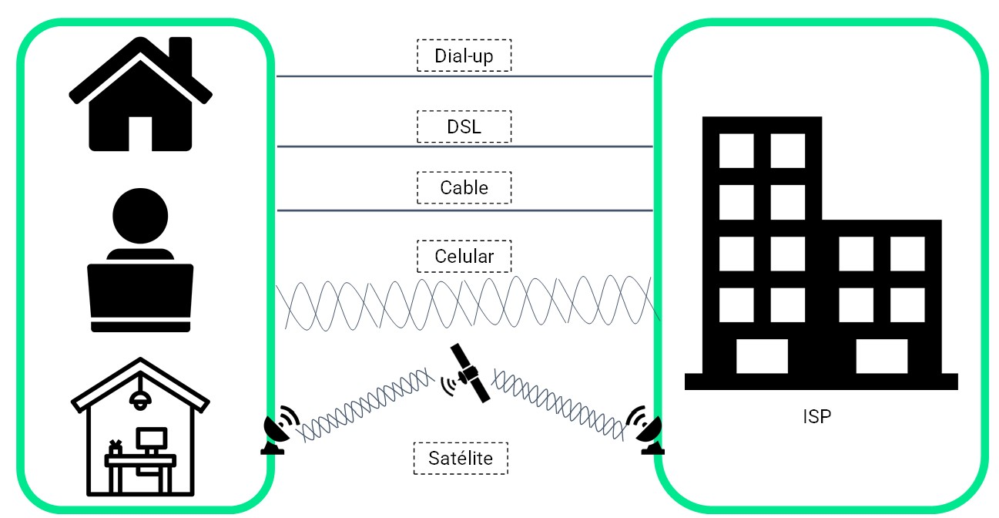

### Dial-up (Acesso discado)

Uma opção econômica que usa uma linha telefônica e um modem. A largura de banda fornecida por uma conexão dial-up é pequena (da ordem de kbits/s).

### DSL (Digital Subscriber Lines)

Fornecem maior largura de banda, maior disponibilidade e uma conexão sempre ativa com a Internet. A tecnologia DSL também utiliza uma linha telefônica. Em geral, os usuários residenciais ou de pequenos escritórios usam DSL assimétrico (ADSL - Asymmetric DSL), com taca de download maior que a taxa de upload)

### Cable Modem

Oferecido por provedores de serviços de TV a cabo, o sinal de dados da Internet é transmitido no mesmo cabo que fornece a televisão. Oferece também maior largura de banda e maior disponibilidade.

### Celular

Usa uma rede de telefonia celular para se conectar. O desempenho é limitado pela capacidade da tecnologia da rede celular à qual o celular está conectado.

### Satélite

A disponibilidade de acesso à Internet via satélite é um benefício para áreas de difícil implantação das tecnologias mencionadas anteriormente e que, de outra forma, não teriam conectividade com a Internet. As antenas parabólicas requerem uma linha de visão desimpedida (visada direta) para o satélite.

A figura 2 mostra soluções típicas para acesso à Internet em ambientes de negócios e organizações (empresas).

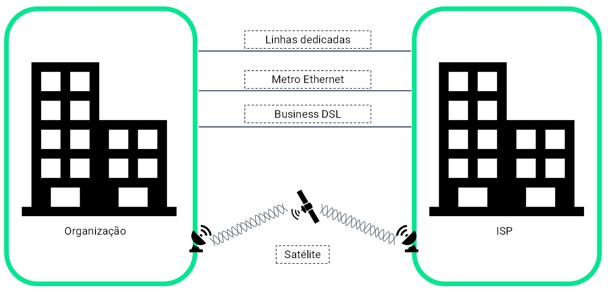

### Linhas Dedicadas

São circuitos reservados dentro da rede do provedor de serviços e que conectam escritórios separados geograficamente para redes privadas de voz e/ou dados. Os circuitos são alugados a um valor mensal ou anual.

### Metro Ethernet

Conhecido como Ethernet MAN. Estendem a tecnologia de acesso LAN para MAN (ou WAN). Desenvolvido pelo Metro Ethernet Forum.

### Business DSL

O Business DSL está disponível em vários formatos, como o Symmetric Digital Subscriber Line (SDSL) que fornece uploads e downloads nas mesmas taxas de bits.

### Satélite

O serviço de satélite pode fornecer uma conexão quando uma solução com fio ou via rede móvel celular não estiver disponível.

A Figura 3 mostra exemplos de redes tradicionais dedicadas a um determinado serviço. A rede de computadores (ou de dados) para o serviço de dados. A rede de telefonia para o serviço de voz e uma rede transmissão para o serviço de TV broadcast (aberta).

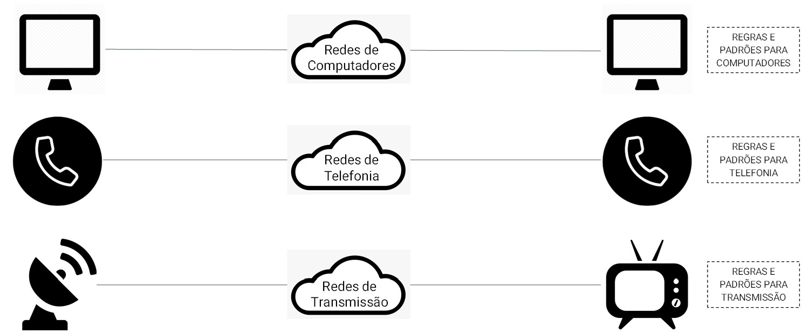

A Figura 4 ilustra uma rede convergente em que uma mesma infraestrutura oferece os serviços de voz, dados e vídeo. As tecnologias IP/MPLS (IP/Multiprotocol Label Switching) e SDN-WAN (Software Defined Network WAN) têm sido utilizadas pelos provedores de serviço de comunicação para implementar as redes convergentes.

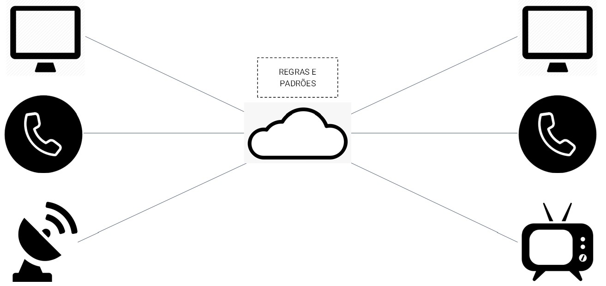

## Redes Confiáveis

Sejam os tipos, as conexões ou até mesmo os dispositivos envolvidos, quando falamos do estabelecimento de comunicações no contexto de redes precisamos considerar critérios e requisitos que determinem como essas comunicações possam ocorrer de uma forma confiável. Nesse sentido, redes confiáveis são redes que detém preocupações para todo o processo de comunicação. Por exemplo, critérios de escalabilidade, tolerância a falhas, segurança e qualidade de serviço. Tais critérios são muito importantes e são base para nossas discussões ao longo dos nossos encontros.

### Arquitetura

As redes oferecem suporte a uma ampla variedade de aplicações e serviços. A arquitetura de rede refere-se às tecnologias que suportam a infraestrutura e os serviços e regras programados (ou protocolos). Em outras palavras, quais camadas do modelo de referência OSI são implementadas na solução tecnológica da rede.

A confiabilidade significa considerar vários aspectos da rede:

### Tolerância a falhas

Uma rede tolerante a falhas é aquela que limita o número de dispositivos afetados durante uma falha. Permite uma recuperação rápida quando ocorrer uma falha desse tipo. Se um caminho falhar, as mensagem serão enviadas instantaneamente por um outro link diferente (redundância). A implementação de uma rede comutada por pacotes e com roteamento dinâmico é uma maneira pela qual redes confiáveis fornecem redundância (Figura 5)

- Tolerância a falhas
- Escalabilidade
- Qualidade de serviço (QoS)
- Segurança

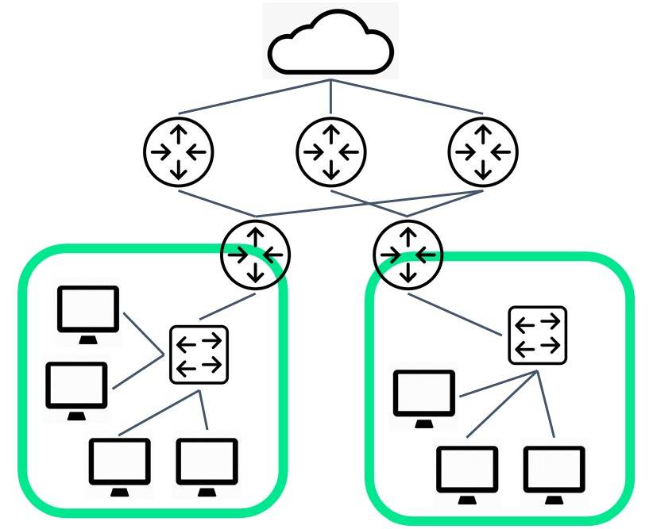

Caso um dos roteadores falhe, o tráfego é desviado, automaticamente, para outro caminho (enlaces) para manter o acesso à Internet (Figura 6)

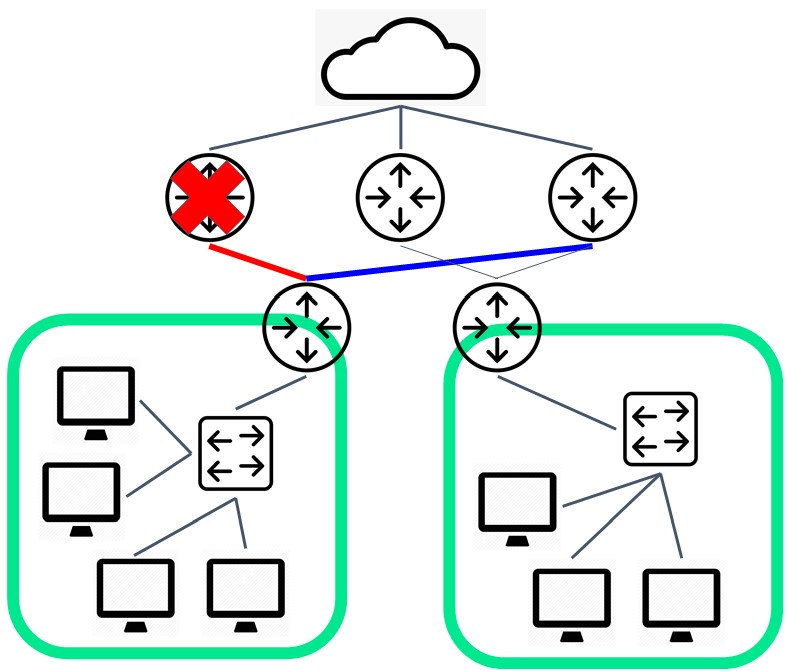

### Escalabilidade

Uma rede escalável permite oferecer suporte a novos usuários e aplicativos sem degradar o desempenho dos serviços. Uma nova rede pode ser adicionada a uma rede existente. As redes são escalonáveis porque os projetistas seguem padrões e protocolos aceitos (Figura 7)

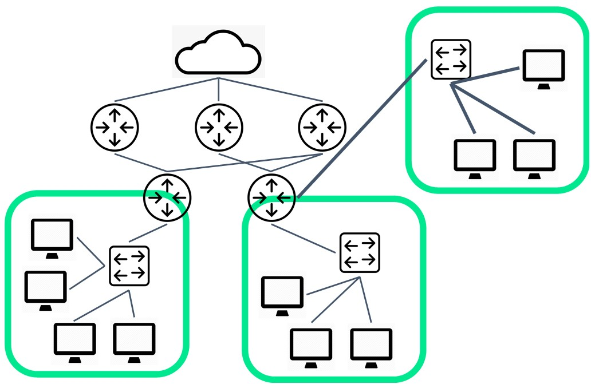

### Qualidade do Serviço (QoS)

É o mecanismo principal para gerenciar o congestionamento e garantir a entrega confiável do conteúdo a todos os usuários. O congestionamento ocorre quando a demanda do tráfego aumenta e excede a largura de banda disponível. O foco da QoS é priorizar o tráfego sensível ao atraso. O tipo de tráfego, não o conteúdo do tráfego, é o que importa (Figura 8).

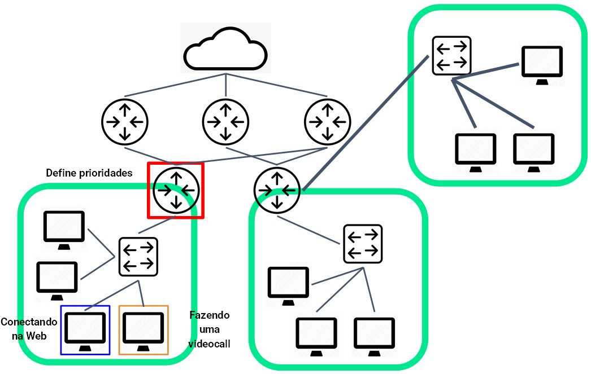

### Segurança

A proteção da infraestrutura de rede inclui a proteção física de dispositivos que fornecem conectividade de rede e a prevenção de acesso não autorizado a rede e aos recursos. A tríade CIA (Confidentiality, Integrity, Availability) e outros requisitos são fundamentais (TANENBAUM e WETHERALL, 2011).

## Regras de Comunicação

Tratamos a comunicação e o básico das redes, bem como de sua importância. Para que ocorra uma comunicação adequadamente é necessário seguir um conjunto de regras denominado de protocolo de comunicação. Podemos fazer uma analogia ao diálogo entre pessoas. Quando falamos, há sempre um emissor e um receptor. Há também um idioma em comum. Há uma ordenação de palavras para que a nossa ideia faça sentido. Há uma velocidade para emissão dos sons. Há uma quantidade de sons que o receptor consegue processar para entender a mensagem que recebe. Tudo isso diz respeito a regras de comunicação: codificação, formatação e encapsulamento, tamanho da mensagem, aspectos temporais e opções de entrega. Quando associamos esses conceitos à nossa temática de redes e soluções tecnológicas, precisamos delimitar quem são os responsáveis por controlar, exercer e gerenciar essas regras de comunicação (KUROSE e ROSS, 2016).

### Fundamentos

As redes variam em tamanho, forma e função. Para que a comunicação ocorra, os dispositivos devem saber como se comunicar. Em uma comunicação há três elementos básicos:

- Fonte da mensagem (remetente): são pessoas ou dispositivos eletrônicos que precisam enviar uma mensagem para outras pessoas ou dispositivos.

- Destino da mensagem (receptor): recebe a mensagem e a interpreta.

- Canal: consiste no meio físico de transmissão que fornece o caminho pelo qual a mensagem trafega da origem até o destino.

### Protocolos de Comunicação

A Figura 9 a seguir ilustra os elementos básicos de uma comunicação.

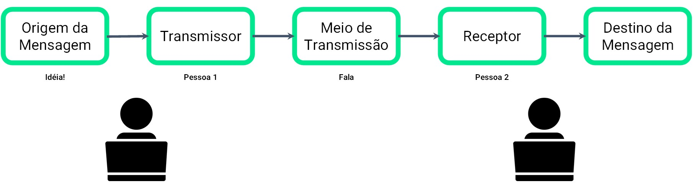

### Regras e Requisitos

Os protocolos em suas regras e requisitos incluem:

- Remetente e destinatário identificados
- Linguagem comum e gramática
- Velocidade e tempo de entrega
- Requisitos de confirmação ou reconhecimento

A Figura 10 a seguir ilustra tais necessidades em uma comunicação.

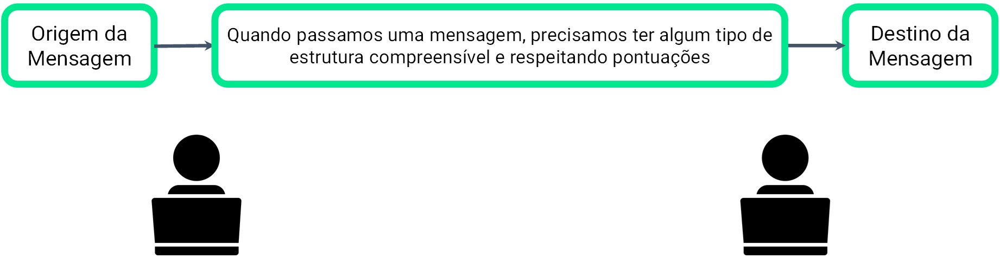

Os protocolos usados em uma rede são fundamentais para garantir a comunicação. Além de identificar a origem e o destino, os protocolos e rede definem os detalhes de como uma mensagem é transmitida pela rede.

As regras de comunicação envolvem codificação, formatação e encapsulamento, tamanho, tempo e opções de entrega. (Figura 11)

### Codificação

A primeira etapa para enviar uma mensagem é a codificação. É o processo de conversão de informações em outra forma adequada para a transmissão. A decodificação reverte esse processo para interpretar as informações.

#### Analogias:

- Uma pessoa converte seus pensamentos em uma linguagem combinada e fala palavras usando os sons e inflexões.

- As mensagens enviadas pela rede são primeiro convertidas em bits pelo host de transmissão. Cada bit é codificado em um padrão que pode ser níveis de tensões em fios de cobre, níveis de potência de luz infravermelha em fibras ópticas ou frequências para sistemas sem fio.

### Formatação e Encapsulamento

Quando uma mensagem é enviada da origem ao destino deve usar um formato ou restrutura específica. Os formatos de mensagem dependem do tipo de mensagem e do canal usado para entregar.

#### Analogias:

- O processo de colocar a mensagem (a carta) dentro do envelope (com o endereço) é chamado de encapsulamento.

- IP = envelope

### Tamanho da mensagem

#### Analogias:

- Quando pessoas se comunicam, as mensagens que enviam costumam ser divididas em partes ou frases menores. Essas frases são limitadas em tamanho para que a pessoa receptora possa processar e compreender.

- O host divide uma mensagem longa em pedaços que atendam aos requisitos de tamanho mínimo e máximo. A mensagem longa será enviada em frames (quadros) separados, com cada frame contendo uma parte da mensagem original.

### Aspectos do Tempo

- Controle de Fluxo: é o processo de gerenciamento da taxa de transmissão de dados. O controle de fluxo define quanta informação pode ser enviada e a velocidade em que pode ser entregue. Por exemplo, se uma pessoa fala muito rápido, pode ser difícil para o receptor ouvir e entender a mensagem.

- Tempo limite de resposta: se uma pessoa fizer uma pergunta e não ouvir uma resposta dentro de uma tempo aceitável, presumirá que não haverá resposta e reagirá de acordo. A pessoa pode repetir a pergunta ou, em vez disso, prosseguir com a conversa.

- Método de acesso: determina quando alguém pode enviar uma mensagem.

### Opções de entrega

- As comunicações são direcionadas: a um destinatário ou a um grupo ou a todos

- Unicast, Multicast e Broadcast

As Figuras 12 a 14 mostram as formas de comunicação.

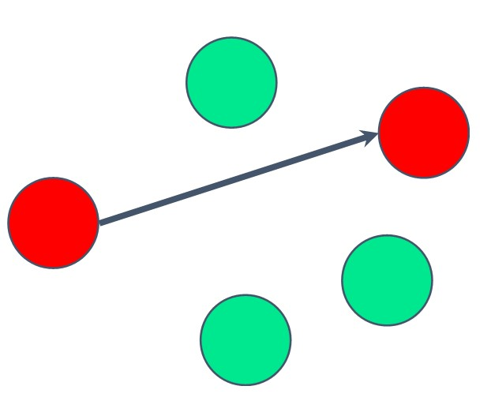

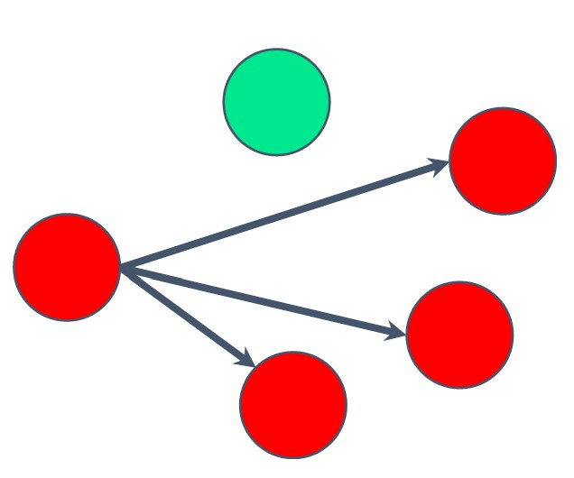

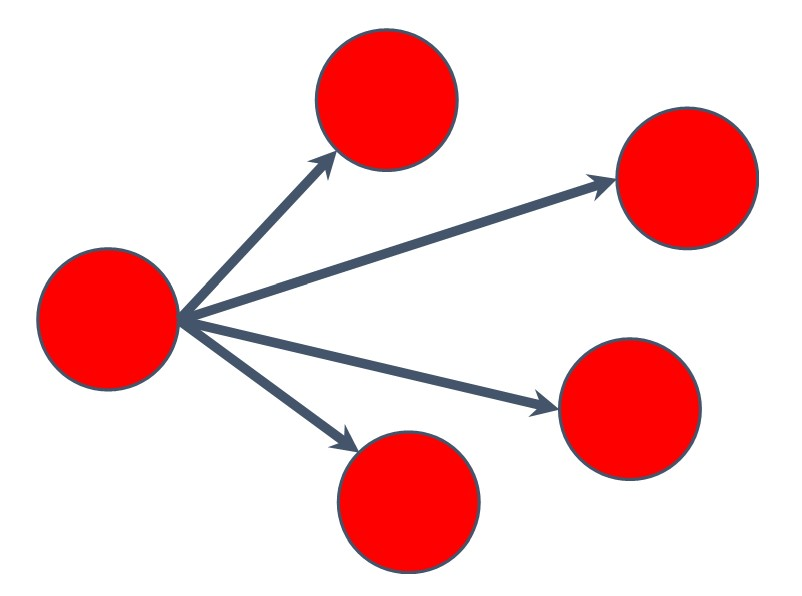

