# Principais Modelos

## Introdução

Bem-vindo ao nosso estudo dos principais modelos de referência de rede. Este estudo possibilitará a você compreender os dois principais modelos de referência, OSI e TCP/IP. Entender os modelos e os protocolos desenvolvidos e implementados para cada camada dos modelos ajudam a visualizar a rede como um todo. Vamos começar a estudar os protocolos e suas características gerais.

## Protocolos e suas características gerais

No encontro anterior, conversamos sobre regras de comunicação. Os protocolos de rede definem um formato comum e um conjunto de regras para a troca de mensagens entre dispositivos intermediários em software, hardware ou ambos. Cada protocolo, em sua respectiva camada, tem sua própria função, formato e regras de comunicação.

## Tipos de Protocolo

Os principais tipos de protocolos necessários para o funcionamento da rede e dos serviços são:

- Protocolos de comunicação

Exemplos: IP (Internet Protocol), TCP (Transmission Control Protocol) e HTTP (Hypertext Transfer Protocol)

- Protocolos de Segurança

Exemplos: SSH (Secure Shell), SSL (Secure Socket Layer) e TLS (Transport Layer Security)

- Protocolos de Roteamento

Exemplos: RIP (Routing Information Protocol), OSPF (Open Shortest Path First) e BGP (Border Gateway Protocol)

- Protocolos de Descoberta de Serviço

Exemplos: DHCP (Dynamic Host Configuration Protocol) e DNS (Domain Name System)

## Funções dos Protocolos

As principais funções dos protocolos necessários para o desempenho adequado da rede e dos serviços são:

- Endereçamento: identifica o emissor e receptor
- Confiabilidade: fornece mecanismos de garantia de entrega
- Controle de Fluxo: garante o fluxo de dados com uma taxa eficiente
- Sequenciamento: enumera (etiqueta) cada segmento transmitido para ordenação
- Detecção de erros: determina se os dados foram corrompidos
- Interface da aplicação: informações do processo entre aplicações

## Interação

Uma mensagem enviada por uma rede de computadores normalmente requer o uso de vários protocolos, cada um em sua respectiva camada, com suas próprias funções e formato. Em uma comunicação web:

- HTTP: governa a interação entre cliente e servidor web
- TCP: gerencia as conversas individuais e é responsável por garantir uma entrega confiável e gerenciar o fluxo entre os dispositivos.
- IP: responsável por entregar as mensagens entre os envolvidos, e é usado por roteadores para encaminhar as mensagens.
- Ethernet: responsável por entregar mensagens de um NIC para outro.

## Suítes

Um conjunto de protocolos é um grupo de protocolos inter-relacionados necessários para realizar uma função de comunicação. Uma maneira de visualizar como os protocolos interagem em um pacote, é ver como uma pilha. Uma pilha de protocolos mostra como os protocolos individuais em um conjunto são implementados (e se complementam). Os protocolos são vistos em termos de camadas e cada serviço de nível superior depende da funcionalidade definida pelos protocolos dos níveis inferiores. As camadas inferiores da pilha estão relacionadas à movimentação de dados pela rede e ao fornecimento de serviços às camadas superiores que se concentram no conteúdo da mensagem enviada. As Figuras 1 e 2 ilustram tais relacionamentos.

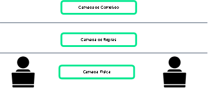

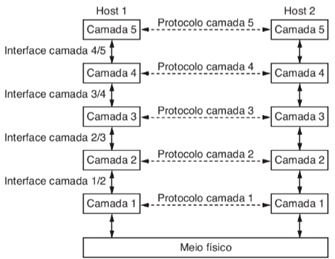

## História

- Internet Protocol Suite ou TCP/IP: é uma suíte de protocolo com padrão aberto mantida pela IETF (Internet Engineering Task Force)

- Open Systems Interconnection (OSI): Família de protocolos desenvolvidos em 1977 pela ISO (International Organization for Standardization) e ITU (International Telecommunication Union). O protocolo OSI inclui um modelo de sete camadas chamado de OSI Reference Model.

- AppleTalk: Suíte de protocolos proprietária criada pela Apple em 1985 e que foi trocada em 1995 pelo TCP/IP.

- Novell NetWare: Suíte de protocolos proprietária criada pela Novell em 1983 usando o protocolo de rede IPX - foi trocada em 1995 pelo TCP/IP (KUROSE e ROSS, 2016).

## Exemplo do TCP/IP

Os protocolos TCP/IP estão disponíveis para as camadas de aplicação, transporte e Internet. Os protocolos de LAN da camada de acesso à rede mais comuns são os protocolos Ethernet e WLAN (LAN sem fio). Os protocolos da camada de acesso à rede são responsáveis por entregar o pacote IP pelo meio físico. A Figura 3 mostra um exemplo de acesso a um servidor web, a pilha TCP/IP e os protocolos utilizados nas camadas.

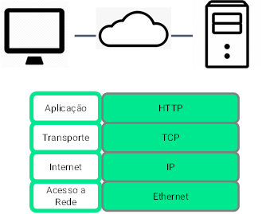

## Processo do TCP/IP

A partir da requisição de uma página de um site, via navegador, de um PC a um servidor, por exemplo, a cada camada da pilha TCP/IP é acrescentado um cabeçalho de controle. O dado do usuário (informação + controle) é, então, passado para a camada inferior que, por sua vez, acrescenta outro cabeçalho de controle da camada de transporte e forma um segmento TCP. O segmento é passado para a camada de rede e, da mesma maneira, acrescenta o cabeçalho de controle e cria um pacote IP que é entregue a camada de acesso a rede que acrescenta os controles para formar o quadro Ethernet. O próximo passo é transmitir os bits do quadro através de um meio físico (Figura 4).

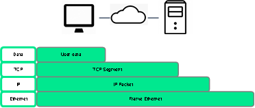

O servidor ao receber os bits realiza o processo inverso na pilha TCP/IP. Ou seja, a partir da camada de acesso à rede até chegar a camada da aplicação e processar a requisição. Para isso, retira os cabeçalhos de controle de cada camada (Figura 5).

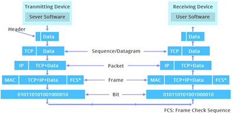

## Modelo TCP/IP

A Figura 6 ilustra as camadas da pilha TCP/IP e os principais protocolos de cada camada.

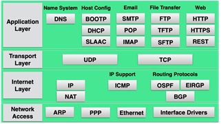

## Organizações e Padrões

Para estabelecer o funcionamento dos protocolos e das regras envolvidas nas comunicações, existem as organizações responsáveis pelo desenvolvimento de padronizações.

### Padrões Abertos

Os padrões abertos favorecem a interoperabilidade, a competição e a inovação. Também garantem que produtos de uma empresa não monopolizem o mercado ou tenha uma vantagem injusta sobre a concorrência. Uma organização de padrões pode elaborar um conjunto de regras ou, em alguns casos pode aproveitar um protocolo proprietário existente como base para o padrão.

Exemplos de organizações de padrões: IEEE (Institute of Electrical and Electronics Engineers), ITU (International Telecommunication Union), TIA (Telecommunications Industry Association)

### Padrões da Internet

Focada em pesquisas relacionadas a internet e as tecnologias TCP/IP. Exemplos: IANA (Internet Assigned Numbers Authority), IETF (Internet Engineering Task Force), ICANN (Internet Corporation for Assigned Names and Numbers), ASRG (Anti-Spam Research Group).

A organização da Internet é tratada a seguir:

- ISOC (Internet Society): responsável por promover o desenvolvimento aberto e evolução do uso da internet pelo mundo.

- IAB (Internet Architecture Board): responsável por todo gerenciamento e desenvolvimento dos padrões para internet.

- IETF (Internet Engineering Task Force): desenvolve, atualiza e mantém a internet e as tecnologias TCP/IP, incluindo documentos e processos para novos protocolos via RFC (Request for Comments).

- IRTF (Internet Research Task Force): promove pesquisas importantes para a evolução dos protocolos, aplicações, arquitetura e tecnologia da Internet.

- IESG (Internet Engineering Steering Group): é responsável pelo gerenciamento técnico das atividades da IETF e do processo de padrões da Internet.

A Figura 7 mostra a organização da Internet:

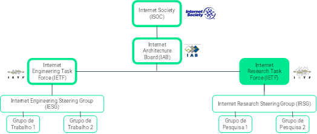

Localizada nos EUA, a ICANN (Internet Corporation for Assigned Names and Numbers) coordena a alocação de endereço IP, bem como o gerenciamento de nomes de domínio e outras informações.

A IANA (Internet Assigned Numbers Authority) é responsável por supervisionar e gerenciar a alocação de IPs, nomes de domínio e protocolos identificados pela ICANN. A Figura 8 a seguir ilustra a hierarquia do ICANN.

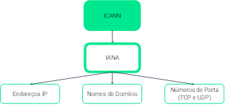

### Padrões de Comunicação

Exemplos de organizações de desenvolvimento de padrões:

- IEEE (Institute of Electrical and Electronics Engineers): atua no avanço da inovação tecnológica e à criação de padrões de indústrias, incluindo energia e energia, saúde, telecomunicações e redes. Os padrões de rede IEEE incluem o 802.3 (Ethernet) e 802.11 (WLAN).

- EIA (Electronic Industries Alliance): A organização é mais conhecida por seus padrões relacionados à fiação elétrica, conectores e racks

- TIA (Telecommunications Industry Association): organização responsável pelo desenvolvimento de padrões de comunicação em uma variedade de áreas, incluindo equipamentos de rádio, torres de celular, dispositivos de voz sobre IP (VoIP), comunicações por satélite e outros.

- ITU-T (International Telecommunications Union-Telecommunication Standardization Sector): define padrões para compressão de vídeo, Internet Protocol Television (IPTV) e comunicações de banda larga, como o DSL (Linha de Assinante Digital), GPON (Gigabit Passive Optical Network) e DWDM (Dense Wavelength Division Multiplexing).

## Modelos

As organizações estabelecem padrões e protocolos que são responsáveis por exercer determinadas funções na comunicação. As regras são essenciais para o processo de comunicação e para isso modelos foram desenvolvidos para definir as interações. Os dois modelos de referência são o OSI e o TCP/IP. Cada um deles é estruturado em camadas. Discutimos nesse encontro a equivalência entre os modelos, que mesmo com um número diferente de camadas, conseguem "conversar". Cada camada possui uma função para o processo de comunicação. Vamos, ao longo dos nossos encontros, discutir sobre cada uma delas.

Como compreender o processo de comunicação? Há modelos para isso.

O modelo define as operações de uma rede em camadas gerenciáveis. Benefícios:

- Auxiliar no projeto dos protocolos porque operam em uma camada específica e têm informações definidas sobre as quais atuam e uma interface definida para as camadas superior e inferior.

- Fomentam a competição entre fornecedores de produtos diferentes.

- Impedir que mudanças de tecnologia ou capacidade em uma camada afetem outras camadas acima e abaixo.

- Fornecer uma linguagem comum para descrever funções e capacidades de rede.

### Modelo de Referência OSI

O modelo OSI tem 7 camadas: física, enlace, rede, transporte, sessão, apresentação e aplicação (Figura 9).

- A camada de aplicação contém protocolos usados para comunicações processo a processo.

- A camada de apresentação fornece uma representação comum dos dados transferidos entre os serviços da camada de aplicação.

- A camada de sessão fornece serviços à camada de apresentação para organizar seu diálogo e gerenciar a troca de dados.

- A camada de transporte define serviços para segmentar, transferir e remontar os dados para comunicações individuais entre os dispositivos finais.

- A camada de rede fornece serviços para trocar as partes individuais de dados pela rede entre os dispositivos finais identificados.

- Os protocolos da camada de enlace descrevem métodos para a troca de quadros (frames) de dados entre dispositivos em uma mídia comum.

- A camada física descreve os meios mecânicos, eletrônicos, funcionais e procedimentais para ativar, manter e desativar conexões físicas para uma transmissão de bits de um dispositivo de rede de origem para um de destino.

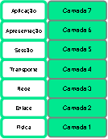

### Modelo TCP/IP

O TCP/IP possui 4 camadas: acesso à rede, Internet, transporte e aplicação (Figura 10)

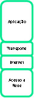

- A camada de aplicação representa dados para o usuário, além de codificação e controle de diálogo.

- A camada de transporte suporta comunicação entre vários dispositivos em diversas redes.

- A camada Internet determina o melhor caminho pela rede.

- A camada de acesso à rede controla os dispositivos de hardware e mídia que compõem a rede.

### Relação entre os modelos OSI e TCP/IP

As camadas de apresentação e sessão não estão presentes no modelo TCP/IP (Figura 11).

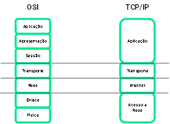

A Figura 12 mostra os modelos OSI e TCP/IP e exemplos de protocolos de cada camada.

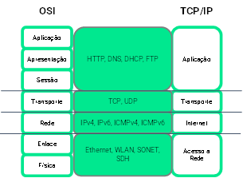

O modelo OSI é conceitual e caracterizado por padronizar a forma como diferentes componentes de software e hardware envolvidos em uma comunicação de rede dividem o trabalho e interagem uns com os outros (Figura 13).

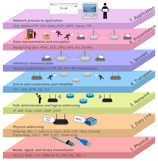

