# Comunicação e Camada Física

## Introdução

Bem-vindo ao nosso estudo de comunicação e camada física. Este estudo ajudará você entender como a camada física é importante na comunicação. Compreender os meios de transmissão utilizados na camada física auxilia a perceber os limites inerentes aos meios. Vamos começar a estudar o encapsulamento.

## Encapsulamento

Existem nomes diferentes para as unidades de dados dos protocolos (PDU) em cada camada do modelo OSI: Data, segmento (quando TCP) ou datagrama (quando UDP), pacote e quadro (frame). Referem-se à uma "ligação" entre as camadas que promove a comunicação de forma estruturada. Tal ligação é o encapsulamento. Nesse processo do encapsulamento, à medida que os dados do aplicativo passam pela pilha de protocolo, várias informações de controle são adicionadas em cada camada. Isso é o processo de encapsulamento. A forma que os dados assumem em qualquer camada é chamada de Unidade de Dados de Protocolo (PDU). Durante o encapsulamento cada camada subsequente (inferior) encapsula a PDU que recebe da camada superior.

## Segmentação

Grandes fluxos de dados enviados pela rede resultam em atrasos. Se qualquer enlace (link) da rede falhar durante a transmissão, resulta na perda completa da mensagem.

A segmentação é o processo de dividir um fluxo de dados em unidades menores para transmissão pela rede. A segmentação é necessária porque as redes usam protocolos da pilha TCP/IP para enviar dados em pacotes IP  individuais. Cada pacote é enviado separadamente e os pacotes que contém segmentos para o mesmo destino podem ser enviados por caminhos diferentes. A Figura 1 ilustra a segmentação.

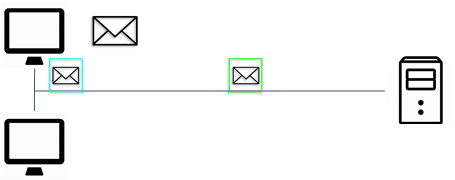

## Vantagens da Segmentação

Aumenta a velocidade de entrega: como um grande fluxo de dados é segmentado em pacotes, mais dados podem ser enviados pela rede sem ocupar toda a banda de um enlace (link) de comunicação. Isso permite muitas conversas diferentes, sejam intercaladas na rede (técnica de multiplexação, Figura 2).

Aumenta a eficiência: se um único segmento não consegue chegar ao seu destino, apenas esse segmento precisa ser retransmitido em vez de reenviar todo o fluxo de dados (KUROSE e ROSS, 2016).

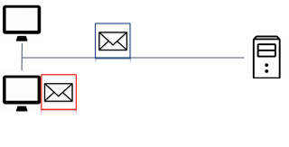

## Sequenciamento

Ao transmitir mensagens usando segmentação e multiplexação, existe a possibilidade de os dados chegarem ao destino fora de ordem. Cada segmento da mensagem deve passar por um processo de sequenciamento (enumeração) para garantir que chegue ao destino correto e possa ser remontado na ordem correta e ficar igual ao conteúdo da mensagem original. O TCP é o protocolo responsável por sequenciar os segmentos individuais. A Figura 3 mostra o sequenciamento (enumeração) dos segmentos.

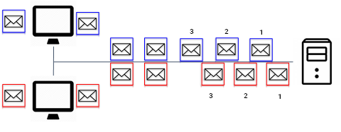

## Unidade de Dados do Protocolo (PDU)

À medida que os dados do aplicativo passam pela pilha de protocolos, várias informações de controle são adicionadas em cada camada. Isso é conhecido como processo de encapsulamento. A forma que os dados assumem em qualquer camada é chamada de Unidade de Dados de Protocolo (PDU). Durante o encapsulamento, cada camada subsequente (inferior) encapsula a PDU que recebe da camada superior. Em cada camada a PDU tem um nome diferente para refletir suas funções. A Figura 4 ilustra os nomes das PDUs em cada camada, no sentido cliente-servidor.

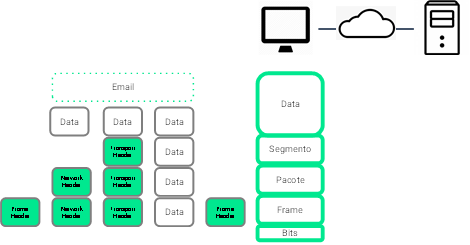

## Endereços

Os protocolos de rede requerem que endereços sejam usados para a comunicação. As camadas de transporte, rede e enlace usam o endereçamento de alguma forma.

- A camada de transporte usa números de porta para identificar os aplicativos.

- A camada de rede utiliza endereços lógicos que identificam as redes às quais os clientes e servidores estão conectados.

- A camada de enlace especifica os dispositivos na LAN que tratam os quadros (frames) através do endereço físico MAC (Media Access Control) presente nas placas de rede (NIC - Network Interface Card) dos computadores.

## Processos

O processo de encapsulamento, no sentido da transmissão, adiciona cabeçalho de controle ao dado a cada camada e passa a camada inferior o dado e o cabeçado. A camada inferior recebe a informação e, por sua vez, adiciona seu cabeçalho de controle. O processo se repete até a camada de enlace e na camada física os bits de cada quadro são transmitidos até o destino em um determinado meio de transmissão. No destino (recepção) ocorre um processo inverso. A partir dos bits percorre-se a pilha de protocolos até a camada de aplicação, entregando a mensagem à máquina de destino. As Figuras 5 a 10 mostram o processo.

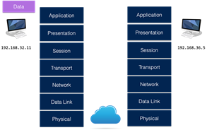
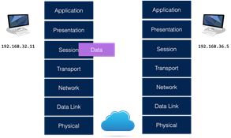
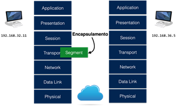
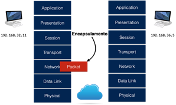
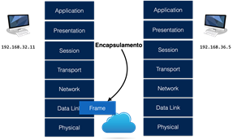
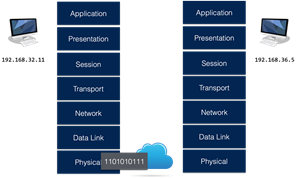

## Acesso aos Dados

Para que seja possível a comunicação entre emissor e receptor, existem os endereçamentos.

### Endereços

As camadas de rede e enlace são responsáveis por entregar os dados do dispositivo de origem ao dispositivo de destino. Seus endereços têm finalidades diferentes:

- Endereços de origem e destino da camada de rede: responsáveis por entregar o pacote IP da origem ao destino, que pode estar na mesma rede ou em uma rede remota.

- Endereços de origem e destino da camada de enlace: responsáveis por entregar o quadro de uma placa de interface de rede (NIC) para outra NIC na mesma rede.

Na camada física há os bits do quadro, sincronização e tempo. Na camada de transporte encontram-se as portas de origem e destino. Nas camadas superiores aparecem os dados codificados da aplicação. A Figura 11 ilustra as camadas envolvidas na comunicação.

### Endereço Lógico - Camada 3

Os endereços IP indicam o endereço IP de origem e de destino, se a origem e o destino estão na mesma rede IP ou em redes IP diferentes. Um endereço IP contém duas partes:

- Porção da rede (IPv4) ou Prefixo (IPv6): a parte mais à esquerda do endereço que indica a rede da qual o endereço IP é membro. Todos os dispositivos na mesma rede têm a mesma porção re rede do endereço.

- Porção do host (IPv4) ou ID da interface (IPv6): a parte restante do endereço que identifica um dispositivo específico na rede. Esta parte é exclusiva para cada dispositivo ou interface na rede.

A Figura 12 a seguir, mostra um pacote IP com endereços de origem e destino em redes distintas.

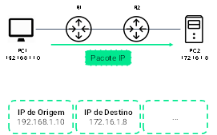

A Figura 13 a seguir ilustra um exemplo de pacote IP com endereços IP na mesma rede.

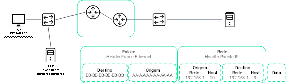

A Figura 14 a seguir mostra um exemplo de pacote IP com endereços IP em redes diferentes

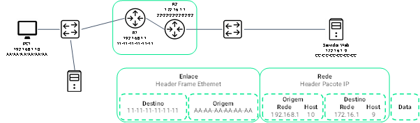

### Endereços no Enlace

A Figura 15 a seguir ilustra os endereços MAC de origem e destino das placas de rede (NIC) envolvidas no enlace.

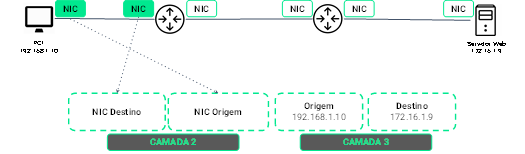

A Figura 16 a seguir mostra que à medida que o pacote caminha pela rede através dos enlaces, os endereços MAC de origem e destino das placas de rede (NIC) são atualizados de acordo com os dispositivos envolvidos no enlace.

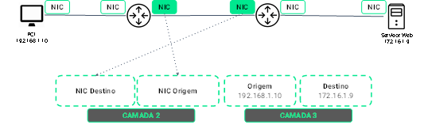

## Características da Camada Física

A camada física envolve o nível mais baixo do processo de comunicação. Fornece as condições para transportar os bits do quadro (frame) da camada de enlace através de um meio de transmissão (metálico, fibra ou aéreo). No destino, os bits codificados referentes ao quadro (frame) são recebidos por um dispositivo final ou um dispositivo intermediário. A camada física codifica os frames e transforma os bits em sinais elétricos, ópticos ou ondas de radiofrequência, dependendo do meio de transmissão.

A conectividade sem fio é comum à medida que indivíduos e empresas descobrem suas vantagens. Os dispositivos em uma rede sem fio devem ser conectados a um ponto de acesso sem fio (AP - Access Point) ou roteador sem fio, como mostrado na Figura 17 a seguir.

## NIC (Network Interface Card)

As placas de interface de rede (NICs) conectam um dispositivo à rede. As NICs Ethernet são usadas para uma conexão com fio e as NICs de rede local sem fio (WLAN) são usadas para conexão sem fio. Um dispositivo de usuário final pode incluir um ou ambos os tipos de NICs. Uma impressora de rede, por exemplo, pode ter apenas uma NIC Ethernet e, portanto, deve se conectar à rede usando um cabo Ethernet. Outros dispositivos, como tablets e smartphones, podem conter apenas uma NIC WLAN e devem usar uma conexão sem fio.

## No modelo OSI

A camada física no modelo OSI fornece os recursos para transportar os bits do quadro da camada de enlace por um determinado meio de transmissão. Aceita um frame completo da camada de enlace e o codifica como uma série de sinais que são transmitidos em um meio físico. Os bits codificados transmitidos que compreendem um frame, são recebidos por um dispositivo final ou um dispositivo intermediário. Codifica os bits dos frames e transforma os bits em sinais elétricos, ópticos ou de ondas de radiofrequência. Esses sinais são então enviados através de um determinado meio de transmissão. A camada física do nó de destino recupera esses sinais, restaura-os em suas representações de bits e passa os bits organizados em um frame completo para a camada de enlace.

## Padrões

A camada física consiste em circuitos eletrônicos, mídia (meios de transmissão) e conectores. Portanto, é apropriado que os padrões que regem o hardware sejam definidos por organizações de engenharia elétrica e de comunicações relevantes. Os padrões de hardware, mídia, codificação e sinalização da camada física são definidos por organizações, tais como:

- Organização Internacional de Padronização (ISO)

- Telecommunications Industry Association/Electronic Industries Association (TIA/EIA)

- União Internacional de Telecomunicações (ITU)

- American National Standards Institute (ANSI)

- Instituto de Engenheiros Elétricos e Eletrônicos (IEEE)

- Autoridades regulatórias nacionais de telecomunicações, incluindo a Federal Communication Commission (FCC) nos EUA e o European Telecommunications Standards Institute (ETSI)

Os padrões TCP/IP são implementados em software e governados pela IETF. Os padrões de camada física são implementados em hardware e governados pelas organizações ISO, EIA/TIA, ITU-T, ANSI e IEEE. A Figura 18 a seguir destaca a camada física do modelo de referência OSI.

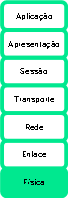

## Áreas Funcionais

Os componentes físicos são os dispositivos eletrônicos de hardware, mídia e conectores que transmitem os sinais que representam os bits. Os componentes de hardware, como NICs, interfaces e conectores, materiais e designs de cabos, são todos especificados em padrões associados à camada física. A Figura 19 mostra as áreas funcionais referentes a camada física.

Codificação, ou codificação de linha, é um método de converter um fluxo de bits em um "código" predefinido. Os códigos são agrupamentos de bits usados para fornecer um padrão previsível que facilite o tratamento e reconhecimento pelo circuito eletrônico do receptor. Em outras palavras, a codificação é o método ou padrão usado para melhorar a representação das informações digitais para fins de transmissão e recepção. Por exemplo, a codificação Manchester representa um bit 0 por uma transição de nível alto para baixo (em volts) e um bit 1 é representado como uma transição de nível baixo para alto (Figura 20). Este tipo de codificação é usado em Ethernet de 10 Mbps.

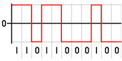

A camada física deve gerar os sinais elétricos, ópticos ou sem fio que representam o 1 ou o 0 no meio de transmissão (mídia). A maneira como os bits são representados é denominada método de sinalização. Os padrões da camada física devem definir que tipo de sinal representa 1 e que tipo de sinal representa 0.

## Largura de Banda

Diferentes meios físicos suportam diferentes tacas de transferência de bits. A transferência de dados geralmente é tratada em termos de largura de banda. A largura de banda é a capacidade de um meio em transportar dados. A largura de banda digital mede a quantidade de dados que pode transmitir de um ponto para outro em um determinado tempo. Uma combinação de fatores determina a largura de banda prática de uma rede. Por exemplo:

- As propriedades do meio físico

- As tecnologias escolhidas para sinalizar e detectar sinais de rede (tipo de código de linha e tipo de modulação)

A tabela 1 a seguir mostra as unidades de medida usadas para largura de banda.

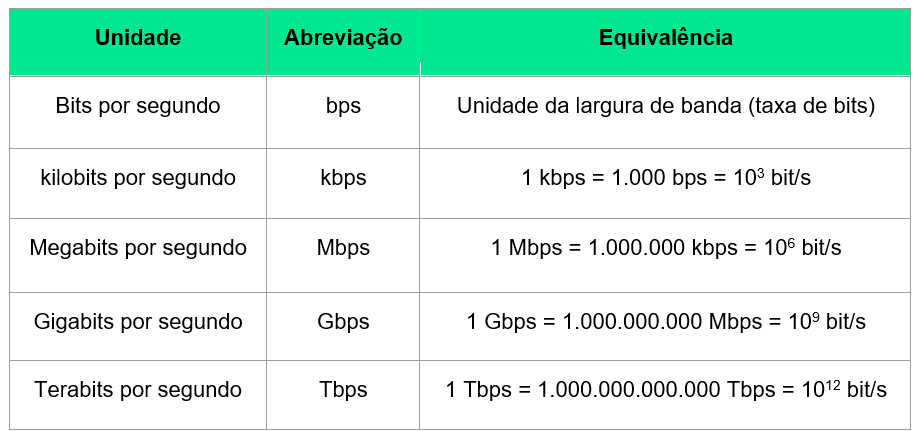

### Largura de Banda - Terminologia

Latência refere-se à quantidade de tempo, incluindo atrasos, para os dados viajarem de um ponto a outro. Em uma internetwork ou em uma rede com vários segmentos, a taxa de transferência (throughput) não pode ser mais rápida do que o link de menor banda no caminho da origem ao destino. Mesmo se todos, ou a maioria dos segmentos tiverem alta largura de banda, basta apenas um segmento no caminho com baixa taxa de transferência para criar um gargalo na taxa de transferência de toda a rede.

A taxa de transferência é a medida da transferência de bits em um meio (mídia) em um determinado tempo. A taxa de transferência é geralmente menor que a largura de banda - geralmente não corresponde à largura de banda especificada em implementações da camada física. Existem muitos fatores que influenciam.

- A quantidade de tráfego

- O tipo de tráfego

- A latência devido à quantidade de dispositivos de rede em que passam os pacotes entre a origem e o destino.

O termo *goodput* é a medida dos dados utilizáveis transferidos durante um determinado tempo. A *goodput* é a taxa de transferência menos a sobrecarga de tráfego para estabelecer sessões, confirmações, encapsulamento e bits retransmitidos. A *goodput* é sempre inferior ao *throughput*, que geralmente é inferior à largura de banda. A Figura 21 a seguir mostra os parâmetros associados à largura de banda

