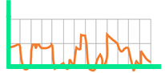

# Cabeamentos e Conexões

## Introdução

Bem-vindo ao nosso estudo de cabeamentos e conexões. Este estudo auxiliará você a compreender como os cabeamentos e conexões físicas são imprescindíveis na comunicação. Conhecer os cabeamentos e conexões utilizados nas redes facilita o entendimento para a construção de uma rede. Vamos começar a estudar os tipos de cabeamentos.

## Tipos de Cabeamentos

A camada física inclui o cabeamento. Este pode ser de cobre (em par trançado ou coaxial) ou de fibra óptica. Nos cabos de cobre os dados são transmitidos como pulsos elétricos. O circuito receptor da interface de rede de um dispositivo de destino deve receber um sinal que possa ser processado com sucesso para compreender os dados enviados. Em fibra óptica os dados são transmitidos como pulsos de luz (infravermelho) e na recepção um fotodetector do circuito receptor da interface de rede deve receber um sinal em condições de identificar os bits 0s e 1s transmitidos.

### Cabeamento de Cobre

O cabeamento de cobre é comum nas redes locais. Existem três tipos diferentes de cabeamento de cobre usados em situações específicas. As redes usam cabos de fios de cobre porque é barato e fácil de instalar. Nos cabos de cobre os dados são transmitidos como pulsos elétricos. O circuito receptor da interface de rede de um dispositivo de destino deve receber um sinal que possa ser processado em condições de identificar os dados enviados. No entanto, quanto maior a distância que o sinal percorre no cabo metálico maior é a atenuação do sinal. Por esse motivo os cabos de cobre devem seguir as limitações de distância, conforme especificado pelos padrões.

Os pulsos elétricos também são suscetíveis à interferência de duas fontes:

- Interferência eletromagnética (EMI) ou interferência de radiofrequência (RFI): a EMI e a RFI podem distorcer e corromper os sinais dos dados transportados pelos fios de cobre. Fontes potenciais de EMI e RFI incluem ondas de rádio e dispositivos eletromagnéticos, como lâmpadas fluorescentes ou motores elétricos.

- Crosstalk (diafonia): é causado pelo campo magnético de um sinal em um fio que induz um pequeno sinal no fio adjacente. Em circuitos telefônicos a diafonia pode resultar em ouvir parte de outra conversa de voz de um circuito adjacente. Quando uma corrente elétrica flui em um fio cria um campo magnético circular ao redor do fio que pode ser captado por um fio adjacente.

A Figura 1 a seguir mostra um sinal digital original (sem interferência):

A Figura 2 a seguir ilustra um exemplo de sinal interferente:

A Figura 3 a seguir mostra o sinal digital original somado ao sinal interferente:

A Figura 4 a seguir ilustra como um bit 0 é interpretado (erroneamente) pelo circuito de recepção como bit 1 devido ao efeito da interferência. Tal exemplo mostra como surge um erro e afeta a Taxa de Erro de Bit (BER) do sistema:

A blindagem metálica e conexões de aterramento adequadas ajudam a combater os efeitos de EMI e RFI. Para combater os efeitos do crosstalk alguns tipos de cabos de cobre têm pares de fios de circuito trançados, o que minimiza o crosstalk. A suscetibilidade ao ruído eletrônico também pode ser minimizada por:

#### Cabeamento de Cobre - Tipos

O cabeamento de par trançado não blindado (UTP – Unshielded Twisted Pair) é o meio de conexão física mais comum. O cabeamento UTP com conectores RJ-45 é usado para interconectar hosts de rede com dispositivos de rede intermediários.

Em LANs, o cabo UTP tem quatro pares de fios identificados por cores que são trançados juntos e envolvidos em uma capa de plástico flexível para proteção mecânica. O entrançamento dos fios minimiza a interferência de sinal de outros fios. A Figura 5 a seguir ilustra os detalhes de um cabo UTP.

- Seleção do tipo ou categoria de cabo mais adequado para um determinado ambiente de rede

- Projeto da infraestrutura de cabos para evitar fontes conhecidas e potenciais de interferência na estrutura do edifício

- Uso de técnicas de cabeamento que incluem o manuseio adequado e terminação dos cabos

O par trançado blindado (STP – Shielded Twisted Pair) oferece melhor proteção contra ruídos interferentes que o cabeamento UTP. O STP em comparação com o cabo UTP é mais caro. Os cabos STP combinam as técnicas de blindagem para combater EMI e RFI e entrelaçamento de fios para minimizar o crosstalk. Para obter o benefício total da blindagem, os cabos STP usam conectores STP blindados especiais. Se o cabo estiver aterrado incorretamente, a blindagem pode funcionar como uma antena e captar sinais indesejados. A Figura 6 a seguir mostra os detalhes de um cabo STP.

Outro tipo de cabo que pode ser utilizado é o coaxial. Recebe este nome porque há dois condutores concêntricos no mesmo eixo. Consiste em:

- Um fio de cobre central

- O fio central é envolto por um isolante plástico flexível

- O material isolante é envolvido por uma malha de cobre, ou folha metálica, que é o segundo fio no circuito e, também, blinda o condutor interno. Esta camada de malha metálica também reduz a interferência eletromagnética.

- Todo o cabo é revestido de uma capa plástica isolante para proteção elétrica e mecânica.

A Figura 7 a seguir ilustra os detalhes do cabo coaxial.

Embora o cabo UTP tenha substituído o cabo coaxial em instalações Ethernet ainda é usado em:

- Instalações sem fio: cabos coaxiais conectam antenas a dispositivos sem fio, pois transporta radiofrequência (RF).

- Instalações de TV/Internet a cabo: os provedores de serviços de TV/Internet a cabo utilizam a tecnologia HFC (Híbrido Fibra-Coaxial) e fornecem a fiação interna com cabo coaxial nas instalações do cliente (KUROSE e ROSS, 2016).

- Interconexão de placas de equipamentos de rádio ou satélite.

### UTP

Dentre os tipos de cabeamento há o UTP. O cabeamento UTP está em conformidade com os padrões estabelecidos em conjunto pela TIA/EIA. A TIA/EIA-568 estabelece os padrões de cabeamento comercial para instalações de LAN e é o padrão mais usado. As características elétricas do cabeamento de cobre são definidas pelo Instituto de Engenheiros Elétricos e Eletrônicos (IEEE). O IEEE avalia o cabeamento UTP de acordo com o desempenho. Os cabos são colocados em categorias com base em sua capacidade de transmissão em termos de taxa de bit (ou largura de banda).

O cabo UTP não usa blindagem para os efeitos de EMI e RFI. Em vez disso, os projetistas de cabos descobriram outras maneiras de limitar o efeito do crosstalk:

- Cancelamento: os projetistas colocam os fios aos pares em um circuito. Quando dois fios em um circuito elétrico são colocados próximos um do outro, seus campos magnéticos são opostos um ao outro. Portanto, os dois campos magnéticos se cancelam e, também, minimizam sinais externos de EMI e RFI.

- Variar o número de torções por par de fios: para aumentar o efeito de cancelamento dos pares de fios de circuito, os projetistas variam o número de tranças de cada par de fios em um cabo. O cabo UTP tem especificações de quantas torções ou tranças são permitidas por metro de cabo.

O cabo UTP depende exclusivamente do efeito de cancelamento produzido pelos pares de fios trançados para limitar a degradação do sinal e fornecer proteção para pares de fios dentro do cabo.

#### Padrões e Conectores

O cabeamento UTP está em conformidade com os padrões definidos em conjunto pela TIA/EIA. A norma TIA/EIA-568 estabelece os padrões de cabeamento comercial para instalações de LAN e é o padrão mais usado. Alguns dos parâmetros definidos são: tipos, comprimentos, conectores, terminação e métodos de teste do cabo. As características elétricas do cabeamento de cobre são definidas pelo Instituto de Engenheiros Elétricos e Eletrônicos (IEEE). O IEEE avalia o cabeamento UTP de acordo com seu desempenho. Os cabos são colocados em categorias de acordo com a capacidade de transmissão em termos de taxa de bit (ou largura de banda).

Cabos em categorias superiores são projetados e construídos para suportar taxas maiores à medida que tecnologia Ethernet evolui. As Categorias 5E até a 6A são os tipos de cabo bem conhecidos, mas as categorias 7 e 7A e 8 são mais recentes.

A categoria 3 foi originalmente usada para comunicação de voz, mas posteriormente usada para transmissão de dados. As categorias 5 e 5E são usadas para transmissão de dados. A categoria 5 suporta 100 Mbit/s e a categoria 5E suporta 1000 Mbit/s (1 Gbit/s). A categoria 6 tem um separador adicionado entre cada par de fios para suportar velocidades mais altas. A Categoria 6 suporta até 10 Gbit/s. A categoria 7 também oferece suporte a 10 Gbit/s. A categoria 8 oferece suporte a 40 Gbit/s. A Figura 8 a seguir mostra as categorias 3, 5 e 6 de cabos UTP. A Figura 9 a seguir ilustra conectores RJ-45 (macho). A Figura 10 a seguir mostra conectores RJ-45 (fêmea).

#### Convenções

Diferentes situações podem exigir que os cabos UTP sejam interconectados de acordo com diferentes convenções de fiação. Isso significa que os fios individuais no cabo devem ser conectados em ordens diferentes a diferentes conjuntos de pinos nos conectores RJ-45:

- Ethernet direto (Straight-through): o tipo comum de cabo de rede. É usado para interconectar um host a um switch e um switch a um roteador, por exemplo.

- Ethernet cruzado (Crossover): Um cabo usado para interconectar dispositivos de mesmo tipo. Por exemplo, para conectar um switch a um switch, um host a um host ou um roteador a um roteador. No entanto, os cabos cruzados são considerados legados, pois a funcionalidade auto MDIX (Automatic Medium-Dependent Interface Crossover) permite aos equipamentos descobrirem qual o tipo de cabo (cross ou reto) conectado e automaticamente configurar sua interface para aceitá-lo.

Usar um cabo cruzado ou direto incorretamente entre os dispositivos pode não danificar os dispositivos, mas a conectividade e a comunicação entre os dispositivos não ocorrem. Este é um erro comum e verificar se as conexões do dispositivo estão corretas deve ser a primeira ação de solução de problemas se a conectividade não for alcançada. A Figura 11 a seguir ilustra a identificação dos pares do cabo UTP por cor. A Figura 12 a seguir mostra o padrão dos pares para o cabo UTP - T568A. A Figura 13 a seguir mostra o padrão dos pares para o cabo UTP - T568B.

A Tabela 1 a seguir mostra os tipos de cabo e padrões.

### Fibra Óptica

Com a evolução das tecnologias de acesso houve uma disseminação do uso de fibra óptica no contexto doméstico com a tecnologia FTTH - Fiber To The Home (KUROSE e ROSS, 2016). Nas redes WANs a fibra óptica transmite dados a longas distâncias em taxas de bits incomparavelmente maiores que qualquer outro meio físico. Ao contrário do fio de cobre a fibra óptica transmite sinais com baixa atenuação óptica e é imune a EMI e RFI. A fibra óptica é usada para interconectar dispositivos de rede WAN. Também é usada em redes LAN e doméstica. A fibra óptica é flexível, extremamente fina e feita de material vítreo (silício muito puro). Os bits são transmitidos na fibra como pulsos de luz (infravermelha). A fibra óptica atua como um guia de ondas para transmitir luz com baixa perda (atenuação) por quilômetro percorrido.

#### Cabeamento de Fibra Ótica – Tipos

##### Fibra óptica monomodo (Single-Mode Fiber - SMF)

A fibra SMF tem um núcleo muito pequeno (da ordem de 10 micrometros) onde o feixe de luz é confinado e usa o laser como fonte óptica para transmitir os bits em um único modo de luz. É usada para longas distâncias (centenas de quilômetros) em enlaces de redes WANs, por exemplo. É comum utilizar amplificadores ópticos para atingir longas distâncias. A Figura 14 a seguir ilustra a fibra monomodo.

##### Fibra Óptica Multimodo (Multimode Fiber - MMF)

A fibra MMF tem um núcleo maior (da ordem de 50 ou 60 micrometros) e usa LED ou laser como fonte óptica para transmitir pulsos de luz. A luz do LED ou laser entra na fibra multimodo em ângulos diferentes (vários modos).

As fibras MMF são utilizadas nos equipamentos das redes LANs nas NICs com interfaces ópticas a LED de baixo custo. A taxa de bit é até 10 Gbit/s em cabos (com um par de fibra) de até 550 m. A Figura 15 a seguir ilustra a fibra multimodo (a diferença entre os índices de refração do núcleo e da casca da fibra que provoca a reflexão da luz).

Uma das diferenças entre MMF e SMF é a quantidade de dispersão. A dispersão se refere ao alargamento do pulso de luz (bit) no tempo à medida que caminha ao longo da fibra. Quanto maior a dispersão significa maior interferência entre os bits. Isto provoca erros no circuito de recepção ao considerar um bit como 1 que foi na origem transmitido 0, mas a dispersão foi grande a ponto de interferir na detecção. A MMF tem uma dispersão maior do que a SMF. É por isso que a MMF é limitada até 500 metros na rede LAN (para garantir que o sinal não seja alargado (dispersado) a ponto de provocar erros).

#### Cabeamento de Fibra Óptica – Uso

O cabeamento de fibra óptica é tipicamente utilizado em:

- Redes corporativas: para o cabeamento do backbone e na infraestrutura para interconexão de dispositivos

- Fiber-to-the-Home (FTTH): para fornecer serviços de banda larga (voz, dados e vídeo) para residências e pequenas empresas

- Redes de longa distância (WAN): por provedores de serviços para conectar LANs de empresas e organizações entre cidades e países

- Redes submarinas: para fornecer soluções de conexões confiáveis e de alta capacidade de transmissão a distâncias transoceânicas. Pesquise na Internet por “Submarine Cable Map” para visualizar vários cabos submarinos online

#### Cabeamento de Fibra Ótica – Conectores

Para realizar a conexão entre interfaces ópticas são necessários cordões de fibra óptica com conectores ópticos nas extremidades. São vários tipos disponíveis no mercado. A seguir alguns exemplos:

##### Straight-Tip (ST)

Os conectores ST foram um dos primeiros tipos de conectores usados. O conector trava com segurança com um mecanismo tipo baioneta “Twist-on/twist-off”. A Figura 16 a seguir mostra o conector óptico ST (macho).

##### Subscriber Connector (SC)

Chamados, também, de conector quadrado ou conector padrão. São conectores para equipamentos LAN e WAN amplamente adotados que usam um mecanismo push-pull (empurra-puxa) para garantir uma fácil inserção e remoção. Este tipo de conector é usado tanto com fibra multimodo quanto monomodo. A Figura 17 a seguir ilustra o conector SC (macho).

##### Lucent Connector (LC)

Os conectores LC são uma versão menor do conector SC. São chamados de conectores pequenos e são muito utilizados devido ao seu tamanho menor. A Figura 18 a seguir mostra o conector LC (macho).

##### Duplex Multimode LC

Um conector LC multimodo duplex (duplo) é semelhante a um conector simplex LC, mas é em uma mecânica de duplo conector que facilita a utilização em equipamentos com interfaces ópticas com transmissão (LED ou laser) e recepção (fotodetector), bastante comuns, que necessita de um cordão óptico para um sentido de transmissão e outro para o sentido contrário. A Figura 19 a seguir ilustra o conector LC duplo (macho).

#### Cabeamento de Fibra Ótica - Patch Cords

Há também os cordões de fibra óptica para interconexões, manobras e adaptações (patch cords). São vários tipos e combinações disponíveis no mercado.

##### SC-SC Multimode

São cordões ópticos com fibra multimodo e conectores SC nas duas extremidades. A Figura 20 a seguir mostra os cordões multimodo SC-SC.

##### LC-LC Single-mode

São cordões ópticos com fibra monomodo e conectores LC nas duas extremidades. A Figura 21 a seguir mostra os cordões monomodo LC-LC.

##### ST-LC Mutimode

São cordões ópticos com fibra multimodo e um conector ST em uma extremidade e outro LC em outra extremidade. A Figura 22 a seguir mostra os cordões multimodo ST-LC.

##### SC-ST Single-mode

São cordões ópticos com fibra monomodo e um conector SC em uma extremidade e outro ST em outra extremidade. A Figura 23 a seguir ilustra os cordões monomodo SC-ST.

### Fibra x Cobre

A comparação entre fibra óptica e fio de cobre é muito difícil uma vez que a fibra óptica tem uma capacidade de transmissão muito superior ao fio cobre. Para fins didáticos seguem alguns parâmetros comparativos na Tabela 2.

### Wireless

Além do cabeamento metálico ou com fibra óptica há as conexões sem fio. As conexões wireless transportam sinais eletromagnéticos que representam os dígitos binários nas frequências de rádio e tem a vantagem da mobilidade - mesmo que possua algumas das limitações.

#### Propriedades

Transporta sinais eletromagnéticos que representam os dígitos binários em frequências de rádio e fornece a vantagem da mobilidade - com algumas limitações:

- Área de cobertura: as tecnologias de comunicação sem fio funcionam bem em ambientes abertos. No entanto, certos materiais de construção usados em edifícios e estruturas podem limitar a cobertura.

- Interferência: a rede sem fio é susceptível a interferências e pode ser afetada por dispositivos comuns.

- Segurança: na comunicação sem fio dispositivos e usuários não autorizados, podem obter acesso à rede.

- Meio compartilhado: as WLANs operam em half-duplex que significa que apenas um dispositivo pode enviar ou receber por vez. Com isso muitos acessos resultam em taxa de bit reduzida para cada usuário.

- Cabeamentos em cobre e fibra são meios físicos necessários para implantação de dispositivos de rede intermediários como roteadores e switches.

#### Tipos

As especificações da camada física dos padrões para comunicações sem fio são aplicadas a áreas que incluem: dados para codificação de sinal de rádio, frequência e potência de transmissão, requisitos de recepção e decodificação de sinal e projeto e construção da antena.

#### Padrões Wireless

- Wi-Fi (IEEE 802.11): Tecnologia de LAN sem fio (WLAN) que usa um protocolo baseado em contenção conhecido como Carrier Sense Multiple Access/Collision Avoidance (CSMA/CA). A NIC sem fio deve primeiro ouvir para saber se o canal está livre, do contrário, deve esperar até que o canal esteja livre. O Wi-Fi é usado com dispositivos WLAN com base nos padrões IEEE 802.11 (TANENBAUM e WETHERALL, 2011).

- Bluetooth (IEEE 802.15): é um padrão de rede pessoal sem fio (WPAN) que usa um processo de comunicação em pares para distâncias de 1 a 100 metros.

- WiMAX (IEEE 802:16): conhecido como Worldwide Interoperability for Microware Access, usa uma topologia ponto-a-multiponto para fornecer acesso de banda larga sem fio.

- Zigbee (IEEE 802.15.4): é uma especificação usada para comunicações de baixa taxa de dados e baixa potência. Destina-se a aplicações que requerem curto alcance e longa duração da bateria. Geralmente usado para ambientes industriais e de Internet das Coisas (IoT).

#### LAN

Uma implementação comum é permitir que os dispositivos se conectem (sem fio) por meio de uma LAN. Em geral, uma WLAN requer os seguintes dispositivos de rede (TANENBAUM e WETHERALL, 2011):

Ponto de acesso sem fio (AP – Access Point): concentram os sinais sem fio dos usuários e se conectam à infraestrutura de rede existente cabeada, como Ethernet. Os roteadores sem fio domésticos e de pequenas empresas integram as funções de um roteador, switch e ponto de acesso em um dispositivo, conforme mostrado na Figura 24 a seguir.

- Adaptadores NIC sem fio: fornecem capacidade de comunicação sem fio para hosts de rede.

Os benefícios das tecnologias sem fio são economia na fiação das instalações e a conveniência da mobilidade dos hosts. Os administradores de rede devem desenvolver e aplicar políticas e processos de segurança rigorosos para proteger as WLANs de acesso não autorizado e danos as informações.
