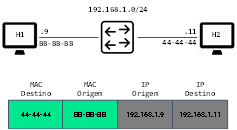

# Resolução de Endereços e Estrutura IPv

## Introdução

Bem-vindo ao nosso estudo de resolução de endereços e estrutura IP. Este estudo ajudará você a entender o endereçamento dos pacotes IP na rede. Compreender os conceitos de resolução de endereços e a estrutura ajudará a raciocinar de forma mais prática. Vamos começar a estudar o endereço MAC e o IP em cenários típicos.

## MAC e IP

### Na mesma rede

Muitas vezes um host precisa enviar uma mensagem, mas só conhece o endereço IP do dispositivo de destino e necessita, também, do endereço MAC. Para isso há a resolução de endereços. Existem dois endereços principais atribuídos a um dispositivo em uma LAN Ethernet: MAC e IP (físico e lógico, respectivamente). Os endereços físicos são usados para entregar o quadro do enlace com o pacote IP encapsulado de uma NIC para outra NIC que está na mesma rede. Se o endereço IP de destino estiver na mesma rede, o endereço MAC de destino será o do dispositivo de destino. A Figura 1 a seguir ilustra um exemplo de um quadro com destino na mesma rede.

### Rede remota

Se o endereço IP (v4 ou v6) de destino está em uma rede remota, o endereço MAC de destino será o endereço do gateway padrão do host (ou seja, a interface do roteador). A Figura 2 a seguir mostra um exemplo de um quadro com destino em rede remota.

Os roteadores examinam o endereço IPv4 de destino para determinar o melhor caminho para encaminhar o pacote IPv4. Quando o roteador recebe o quadro Ethernet, desencapsula as informações da camada 2. Usa o endereço IPv4 de destino para determinar o dispositivo de próximo salto e encapsula o pacote IPv4 em um novo frame do enlace (data link) para a interface de saída. O novo endereço MAC de destino é da interface R2 G0/0/1 e o novo endereço MAC de origem é da interface R1 G0/0/1 (Figura 3 a seguir).

Ao longo de cada link do caminho, um pacote IP é encapsulado em um frame específico associado à tecnologia do link, por exemplo, Ethernet. Se o dispositivo de próximo salto for o destino final, o endereço MAC de destino é o placa de rede Ethernet dele. (Figura 4).

Como os endereços IP dos pacotes são, em um fluxo de dados, associados aos endereços MAC em cada link ao durante o caminho até o destino?

- Para pacotes IPv4 é feito por meio do Protocolo de Resolução de Endereço (ARP - Address Resolution Protocol).

- Para pacotes IPv6 o processo é ICMPv6 (Internet Control Message Protocol Version 6) Neighbour Discovery(ND).

## ARP

- Resolver endereços IPv4 para endereços MAC

- Manter uma tabela de mapeamentos de endereços IPv4 para MAC
