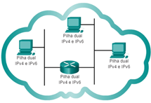
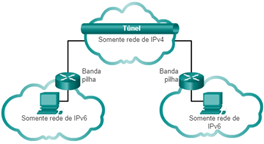
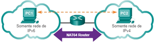
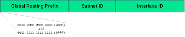
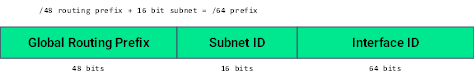
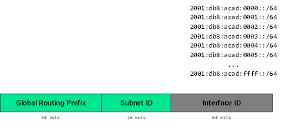
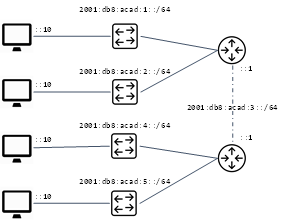

# Endereçamento IPv6

## Introdução

Bem-vindo ao nosso estudo de endereçamento IPv6. Este estudo ajudará você a entender a necessidade do IPv6. Compreender o endereço IPv6 facilitará planejar uma rede IP com muito mais dispositivos conectados. Vamos começar a estudar a relação IPv4 e IPv6.

## Relação IPv4 e IPv6

### A relação

O IPv4 e o IPv6 devem coexistir até que uma transição ocorra (TANENBAUM e WETHERALL, 2011). O IETF criou vários protocolos e ferramentas para ajudar os administradores de rede a migrar suas redes para o IPv6.

As técnicas de migração podem ser divididas em três categorias (KUROSE e ROSS, 2016).

- Dual Stack: permite que IPv4 e IPv6 coexistam no mesmo segmento de rede. Os dispositivos de pilha dupla executam pilhas de protocolo IPv4 e IPv6 simultaneamente (Figura 1). Conhecido como IPv6 nativo, isso significa que a rede do cliente tem uma conexão IPv6 com seu ISP e pode acessar o conteúdo encontrado na Internet através do IPv6.

- Tunneling: o tunelamento é um método de transporte de um pacote IPv6 em uma rede IPv4. O pacote IPv6 é encapsulado dentro de um pacote IPv4, semelhante a outros tipos de dados (Figura 2)

- NAT: o Network Address Translation 64 (NAT64) permite que dispositivos habilitados para IPv6 se comuniquem com dispositivos habilitados para IPv4 usando uma técnica de tradição semelhante ao NAT para IPv4 (Figura 3)

## Representação e tipos de endereço IPv6

### Representação

Para aprender sobre IPv6 é importante entender como um endereço IPv6 é representado e formatado. Relembrar que os endereços IPv6 têm 128 bits de comprimento e são escritos como valores hexadecimais. A cada quatro bits é representado por um único dígito hexadecimal que totaliza de 32 valores hexadecimais. O IPv6 não diferencia maiúsculas de minúsculas. No IPv6, um hexteto é usado para se referir a um segmento de 16 bits, ou quatro valores hexadecimais.

O preferred format significa escrever o endereço IPv6 usando todos os 32 dígitos hexadecimais, mas não significa que seja o método ideal para representar o IPv6.

Duas regras podem ser consideradas para reduzir a notação: (1) omitir os zeros à esquerda e (2) usar dois pontos duplo (::) (TANENBAUM e WETHERALL, 2011).

A primeira regra é omitir quaisquer 0s iniciais em qualquer hexteto. Alguns exemplos:

- 01ab representa-se 1ab

- 09f0 representa-se 9f0

- 0a00 representa-se a00

- 00ab representa-se ab

Esta regra se aplica apenas aos 0s iniciais, caso contrário, o endereço seria ambíguo. Por exemplo, o hexteto “abc” pode ser “0abc” ou “abc0”, mas não representam o mesmo valor. Exemplo (sem e com omissão de zeros à esquerda):

2001 : 0db8 : 0000 : 00a3 : ab00 : 0ab0 : 00ab : 1234

2001 :   db8 :    0    :     a3 : ab00 :   ab0 :     ab : 1234

Na segunda regra dois pontos duplo (::) podem substituir qualquer string única e contínua de um ou mais hextetos de 16 bits de apenas zeros. Os dois pontos duplo só podem ser usados ​​uma vez em um endereço, pois haveria mais de um endereço resultante possível. Exemplo de uso incorreto de dois pontos duplos:

2001: db8 :: abcd :: 1234

As possíveis expansões deste endereço compactado incorretamente são:

2001: db8 :: abcd: 0000: 0000: 1234

2001: db8 :: abcd: 0000: 0000: 0000: 1234

2001: db8: 0000: abcd :: 1234

2001: db8: 0000: 0000: abcd :: 1234

Se um endereço tem mais de uma string contínua todos-0, recomenda-se usar (::) na string mais longa. Se as strings forem iguais, a primeira string deve usar (::). Exemplo:

fe80 : 0000 : 0000 : 0000 : 0123 : 4567 : 89ab : cdef

fe80 :                                :   123 : 4567 : 89ab : cdef

fe80::123:4567:89ab:cdef

Tipos

 

Unicast: um endereço unicast IPv6 identifica exclusivamente uma interface em um dispositivo habilitado para IPv6.

Multicast: um endereço IPv6 multicast é usado para enviar um único pacote IPv6 para vários destinos.

Anycast: um endereço anycast IPv6 é qualquer endereço unicast IPv6 que pode ser atribuído a vários dispositivos. Um pacote enviado para um endereço anycast é roteado para o dispositivo mais próximo com esse endereço. Endereços anycast estão além do escopo deste estudo.

Ao contrário do IPv4, o IPv6 não possui um endereço de broadcast. No entanto, há um endereço multicast de todos os nós IPv6 que basicamente fornece o mesmo resultado.

O prefixo, ou parte da rede, de um endereço IPv4 pode ser identificado por uma máscara de sub-rede decimal com pontos ou comprimento do prefixo (notação de barra). Por exemplo, 192.168.1.10 com máscara de sub-rede decimal pontuada 255.255.255.0 é equivalente a 192.168.1.10/24. No IPv6, é apenas chamado de comprimento do prefixo. O IPv6 não usa a notação de máscara de sub-rede decimal com pontos. O comprimento do prefixo pode variar de 0 a 128.  O comprimento do prefixo IPv6 recomendado para LANs e a maioria dos outros tipos de redes é /64. É altamente recomendável usar um ID de interface de 64 bits para a maioria das redes. Isso ocorre porque a autoconfiguração de endereço sem estado (SLAAC) usa 64 bits para a ID da interface. Também torna mais fácil criar e gerenciar sub-redes.

Tipos – Unicast

Um endereço unicast IPv6 identifica exclusivamente uma interface em um dispositivo habilitado para IPv6. Um pacote enviado a um endereço unicast é recebido pela interface à qual esse endereço é atribuído. O endereço IPv6 de destino pode ser um endereço unicast ou multicast.

Ao contrário dos dispositivos IPv4 que têm apenas um único endereço, os endereços IPv6 geralmente têm dois endereços unicast:

Global Unicast Address (GUA) - é semelhante a um endereço IPv4 público. São endereços globalmente únicos e roteáveis pela Internet. Podem ser configurados estaticamente ou dinamicamente.
Local link Address (LLA) - necessário para cada dispositivo habilitado para IPv6. LLAs são usados para se comunicar com outros dispositivos no mesmo link local. Com o IPv6, o termo link se refere a uma sub-rede. Os LLAs estão confinados a um único link. Sua exclusividade só deve ser confirmada nesse link, pois não são roteáveis além do link.
 

Tipos - Unicast - Unique Local Address

Endereços locais exclusivos (intervalo fc00:/7 a fdff::/7) ainda não são comumente implementados. Endereços locais exclusivos podem eventualmente ser usados ​​para endereçar dispositivos que não devem ser acessíveis de fora, como servidores internos e impressoras. Os endereços locais exclusivos IPv6 têm semelhanças com os endereços privados RFC 1918 para IPv4, mas existem diferenças significativas:

São usados ​​para endereçamento local dentro de um site ou entre um número limitado de sites.
Podem ser usados ​​para dispositivos que nunca precisarão acessar outra rede.
Não são roteados globalmente ou traduzidos para um endereço IPv6 global.
Configurações e Endereçamento GUAs e LLAs

 

GUA

Os endereços globais unicast (GUAs) IPv6 são globalmente únicos e roteáveis na Internet IPv6. Esses endereços são equivalentes aos endereços IPv4 públicos.

Atualmente, apenas GUAs com os três primeiros bits de 001 ou 2000::/ 3 são atribuídos. Para o primeiro hexteto, o primeiro dígito hexadecimal para GUAs atualmente disponíveis começa com 2 ou 3. Significa apenas um oitavo do espaço de endereços IPv6 disponível total, excluindo uma parte muito pequena para outros tipos de endereços unicast e multicast. A Figura 4 a seguir ilustra a estrutura e o alcance de um endereço global unicast.

Global Routing Prefix: é parte do endereço que é atribuído pelo provedor, como um ISP, a um cliente ou site. Por exemplo, é comum que os ISPs atribuam um prefixo de roteamento global /48 a seus clientes. Por exemplo, o endereço 2001:db8:acad::/48 tem um prefixo de roteamento global que indica que os primeiros 48 bits (3 hextetos) (2001: db8: acad) é como o ISP conhece esse prefixo (rede). O tamanho do prefixo de roteamento global determina o tamanho do ID da sub-rede. A Figura 5 mostra a estrutura de um endereço unicast global com prefixo global de roteamento de /48.

Subnet ID: o IPv6 foi projetado com sub-redes. O ID de sub-rede é usado por uma organização para identificar sub-redes em seu site. Quanto maior o ID da sub-rede, mais sub-redes disponíveis. Com o prefixo /64, tem-se um ID de sub-rede de 32 bits. Isso significa que uma organização com um prefixo de roteamento global /32 e uma ID de sub-rede de 32 bits terá 4,3 bilhões de sub-redes, cada uma com 18 quintilhões de dispositivos por sub-rede. Com o comprimento de prefixo /64 típico, os primeiros quatro hextetos são para a parte da rede do endereço, o quarto hexteto indica o ID da sub-rede (Figura 6). Os quatro hextetos restantes são para o ID da interface.

Interface ID: o ID da interface IPv6 é equivalente à parte do host de um endereço IPv4. O termo ID de interface é usado porque um único host pode ter várias interfaces, cada uma com um ou mais endereços IPv6.  Um ID de interface de 64 bits (Figura 7) permite 18 quintilhões de dispositivos ou hosts por sub-rede. Uma sub-rede ou prefixo /64 (prefixo de roteamento global + ID da sub-rede) deixa 64 bits para a ID da interface. Isso é recomendado para permitir que dispositivos habilitados criem seus próprios IDs de interface de 64 bits. No IPv6 os endereços de host all-0s (tudo 0) e all-1s (tudo 1) podem ser atribuídos a um dispositivo. O endereço all-1s pode ser usado porque os endereços de broadcast não são usados no IPv6. O endereço all-0s também pode ser usado, mas é reservado como um endereço anycast de roteador de sub-rede.

LLA

Um endereço de link local IPv6 (LLA) permite que um dispositivo se comunique diretamente com outros dispositivos habilitados para IPv6 no mesmo link e apenas nesse link (sub-rede). Os pacotes com uma origem ou destino LLA não podem ser roteados além do link do qual o pacote se originou. O GUA não é um requisito. No entanto, toda interface de rede habilitada para IPv6 deve ter um LLA. Se um LLA não for configurado manualmente em uma interface, o dispositivo cria automaticamente o seu próprio sem se comunicar com um servidor DHCP. Os hosts habilitados para IPv6 criam um LLA IPv6 mesmo se o dispositivo não tenha recebido um endereço IPv6 unicast global. Isso permite que dispositivos habilitados para IPv6 se comuniquem com outros dispositivos habilitados para IPv6 na mesma sub-rede. Isso inclui a comunicação com o gateway padrão (roteador).

 

Sub-redes e Endereços Multicast

 

Endereços Atribuídos

Os endereços multicast IPv6 são semelhantes aos endereços multicast IPv4. Lembrar que um endereço multicast é usado para enviar um único pacote a um ou mais destinos (grupo multicast). Os endereços multicast IPv6 têm o prefixo ff00::/8. Os endereços multicast só podem ser endereços de destino e não endereços de origem.

Existem dois tipos de endereços multicast IPv6:

Endereços multicast conhecidos
Endereços de multicast de nó solicitados
Endereços Multicast Conhecidos

Os endereços multicast atribuídos são endereços multicast reservados para grupos predefinidos de dispositivos. Estes são dois grupos multicast atribuídos a IPv6 comuns:

ff02::1 Grupo multicast de todos os nós: este é um grupo multicast ao qual todos os dispositivos habilitados para IPv6 ingressam. Um pacote enviado a este grupo é recebido e processado por todas as interfaces IPv6 no link ou rede. Isso tem o mesmo efeito que um endereço de broadcast no IPv4.
ff02 :: 2 Grupo multicast de todos os roteadores: este é um grupo multicast ao qual todos os roteadores IPv6 ingressam. Um roteador torna-se membro deste grupo quando é habilitado como um roteador IPv6 com o comando de configuração global ipv6 unicast-routing. Um pacote enviado a este grupo é recebido e processado por todos os roteadores IPv6 no link ou rede.
 

Endereços Multicast Solicitados

Um endereço multicast de nó solicitado é semelhante ao endereço multicast de todos os nós. A vantagem de um endereço multicast de nó solicitado é que é mapeado para um endereço multicast Ethernet especial. Isso permite que a placa de rede Ethernet filtre o quadro ao examinar o endereço MAC de destino sem enviá-lo ao processo IPv6 para ver se o dispositivo é o destino pretendido do pacote IPv6.

 

Subredes usando Subnet ID

A vantagem de um endereço de 128 bits é que pode suportar mais do que o suficiente de sub-redes e hosts por sub-rede, para cada rede. Por exemplo, se o prefixo de roteamento global for /48 e usando 64 bits típicos para o ID da interface, isso cria um ID de sub-rede de 16 bits:

ID de sub-rede de 16 bits - Cria até 65.536 sub-redes.
ID de interface de 64 bits - suporta até 18 quintilhões de endereços IPv6 de host por sub-rede (ou seja, 18.000.000.000.000.000.000).

Por exemplo, uma organização recebe o prefixo de roteamento global 2001: db8: acad ::/48 com um ID de sub-rede de 16 bits. Isso permite à organização criar 65.536 subredes /64 (Figura 9). O prefixo de roteamento global fica o mesmo para todas as sub-redes; apenas o hexteto de ID da sub-rede é incrementado em hexadecimal para cada sub-rede.

Alocação de Sub-redes

Com 65.536 sub-redes para escolher, o trabalho do administrador da rede é projetar um esquema lógico para o endereçamento da rede. A topologia do exemplo (Figura 10) requer cinco sub-redes, uma para cada LAN e para o link serial entre R1 e R2.  Diferente do IPv4, no IPv6 a sub-rede do link serial tem o mesmo comprimento de prefixo que as LANs.  Embora isso possa parecer um “desperdício” de endereços, a conservação de endereços não é uma preocupação ao usar o IPv6. Cinco sub-redes IPv6 são alocadas, com o campo ID de sub-rede 0001 a 0005 no exemplo. Cada sub-rede /64 fornece muito mais endereços que o necessário.

