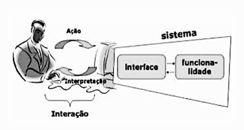
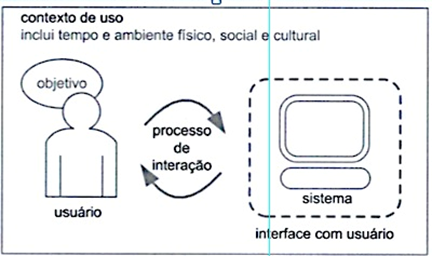
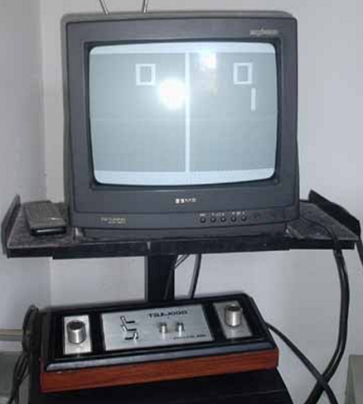
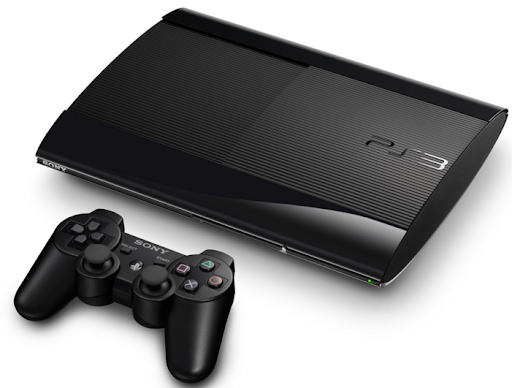
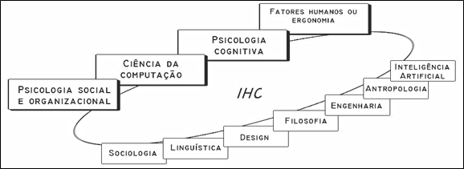

# Conceitos fundamentais de IHC, DI e UX

Bem-vindo ao nosso estudo de interfaces e Interação Humano-Computador(IHC) e User-Experience(UX) com foco em Design de Interação. Este estudo ajudará você a projetar sistemas interativos mais interessantes e com mais qualidade. Mesmo que não esteja lidando com ferramentas de programação ou desenvolvimento, conhecer as diretrizes, padrões e conceitos de IHC já lhe dará uma percepção muito avançada do que significam as interações das pessoas com sistemas de computador e isso tem inúmeras aplicações. Vamos começar a estudar interfaces observando alguns objetos comuns do dia-a-dia. Uma justificativa é que discussões contemporâneas de design de interfaces nascem dos textos de Donald Norman que escreveu sobre design relacionados a utensílios do dia a dia com ênfase na valorização dos fatores humanos.

Em casa estamos cercados de objetos e utensílios com diferentes formas e tamanhos e que possuem seus próprios mecanismos de funcionamento: uma torneira, um liquidificador, uma calculadora. No bolso carregamos nosso celular.

Às vezes sabemos como operar um aparelho só de olhar para ele porque temos experiências com aparelhos parecidos, às vezes temos dúvidas básicas na operação de um novo produto que acabamos de adquirir e precisamos recorrer ao manual de instruções. O problema é que o manual nem sempre está acessível (mesmo na internet) ou então os desenhos e as explicações não são satisfatórias: regular a altura e encosto de uma cadeira de escritório, por exemplo, pode ser complicado para algumas pessoas mesmo que tenham o manual em mãos.

Pode acontecer também do objeto ser um utensílio banal com uma maçaneta de porta e mesmo assim termos problemas para abrir.

Pense no formato de uma maçaneta: se for muito lisa ou pequena demais (isso depende do tamanho da mão do usuário) pode escorregar das mãos e nos fazer pensar que fechamos a porta de casa quando saímos mas não a fechamos.

Um forno de microondas, uma geladeira moderna ou uma máquina de lavar roupas, possuem painéis e botões nem sempre fáceis de operar. Note que os botões possuem formas, cores e posições que já podem dar uma ideia de como o sistema funciona. Esta compreensão vai depender das experiências anteriores do usuário, se ele já possuiu ou lidou com o aparelho antes, por exemplo.

O mesmo vale para um controle remoto de uma TV: não importa a marca do aparelho, a maioria das pessoas tem uma ideia de como ligar, de como mudar os canais e de como aumentar ou diminuir o volume. Por exemplo, o botão de liga/desliga geralmente está na parte de cima e é vermelho... Será isto uma regra?

Podemos seguir outros inúmeros exemplos de interação com interfaces.

Ao adentrarmos pela primeira vez na cabine de um novo modelo de carro, o tempo que levamos para descobrir onde ligamos os faróis, o som, virar a chave, tem também relação com o projeto das interfaces da cabine.

Neste caso, em uma situação de emergência que demande uma manobra repentina do veículo, o esforço necessário para movimentar o volante, ligar o alerta ou acionar o pedal dos freios pode salvar vidas, o que torna o tempo de reação também assunto relevante na área de interfaces.

Ultimamente vemos na mídia, reportagens sobre veículos autônomos... mais uma vez as interfaces com ênfase, assim como numerosos acidentes de trânsito que acontecem com pessoas que estão falando ao celular enquanto dirigem.

Quando operamos um computador, lidamos o tempo todo com questões de interface. Às vezes nos damos conta disso, mas nem sempre. Pense em como a entrada USB (Universal Serial Bus) é um recurso comum em computadores. O problema é saber qual o lado correto que o plug deve ser inserido na porta USB, principalmente se ele estiver na vertical atrás da máquina. Como saber qual o lado certo de inserir o plug USB quando a porta está atrás do computador? O lado certo de inserir o plug na entrada USB é um problema de interface comum.

Outro exemplo relacionado a área de tecnologia (existem infinitas situações) ocorre quando você envia um documento para a impressora e o processo demora mais do que o habitual... alguns segundos e nada acontece. Como saber se ele foi enviado mesmo? E se a impressora estiver em outra sala?

Grandes empresas de tecnologia da década de 1980 (Microsoft, Apple...) têm dificuldade em competir com empresas mais novas (Facebook, Google...) quando o assunto é internet. Por que isso acontece?

Uma das explicações é que as empresas de tecnologia mais novas nasceram com o tema interface e interação com os usuários no centro das atenções de seus produtos!

**Uma ideia importante: quem projeta o sistema interativo precisa pensar em quem vai utilizar o sistema!**

## Algumas definições iniciais

Para seguir nos estudos de IHC/UX/DI precisamos conhecer uma série de conceitos muito importantes:

- **UX:** User Experience é onde residem os estudos relacionados à experiência do usuário.

- **Aplicação ou sistema interativo:** Corresponde ao ambiente no qual as soluções de Interface Homem-Computador (IHC) são implementadas.

- **Sistema interativo:** refere-se não somente ao hardware (equipamentos) e o software (programas de computador) mas a todo o ambiente que usa ou é afetado pelo uso da tecnologia computacional.

- **Protótipo:** Aplicação ou sistema ainda em fase de testes e desenvolvimento. **Produto** é a evolução de um protótipo já ao alcance do usuário.

- **Design:** É o projeto do sistema interativo: aparência, funcionalidades, menus, navegação, facilidade de operação, de aprendizado... Porém, o design tem uma infinidade de outros significados. Na indústria, por exemplo, o design está em uma fronteira entre a aparência e a funcionalidade dos objetos.

Donald Norman, importante pesquisador da área de design, usa o exemplo de uma maçaneta de porta. Uma maçaneta bem projetada comunica aos seus usuários se a porta deve ser puxada ou empurrada. Já uma maçaneta mal projetada, não dá nenhuma dica@

Graças ao design diferenciado, os produtos da Apple são aceitos mundialmente, embora sejam mais caros e não necessariamente melhores do que os produtos dos concorrentes. Desenhando produtos atraentes, Steve Jobs, da Apple, se beneficiou de um aspecto da alma humana que se sente seduzida por coisas belas, e exatamente por causar prazer e admiração, parecem funcionar melhor.

Chamamos de designer, o profissional envolvido diretamente com o desenvolvimento da interface do sistema. Ele pode ser um especialista em programação ou da área de Tecnologia da Informação (TI), mas pode ser também um profissional com domínio em outras áreas como comunicação, artes, psicologia, antropologia...

Chamamos de requisitos, as necessidades dos usuários em relação ao sistema que está sendo desenvolvido. A extração de requisitos é uma das taregas mais desafiadoras na área de desenvolvimento de um sistema interativo e por isso é um tema estudado à parte e com muito foco neste curso.

Exemplos: um caixa eletrônico para pessoas com baixa visão; o painel de controle de um reator nuclear; um simples editor de textos. Para extrair requisitos do cliente, é necessário um grande esforço, conforme veremos mais adiante nesta disciplina.

**Interação** é um processo por meio do qual, o usuário formula uma intenção, planeja suas ações, atua sobre a interface, percebe e interpreta a resposta do sistema e avalia se o seu objetivo foi alcançado.

Portanto, a interação é um processo de comunicação e troca entre pessoas e sistemas ou entre pessoas via sistemas. Interação é também a ponte entre o usuário e o sistema, isto é, a forma como o usuário se comunica com o sistema. **Interface** é toda a porção do sistema com a qual o usuário mantém contato físico ou perceptivo durante a interação. É o meio de contato entre o usuário e o sistema.

**Affordance** é o termo definido para se referir às propriedades percebidas reais de um objeto, que deveriam determinar como ele pode ser usado.

Exemplos: uma cadeira é para sentar e também pode ser facilmente deslocada de lugar. Vidro é um material para dar transparência e dá uma ideia de fragilidade. Botões são para girar, enquanto teclas para pressionar; tesouras para cortar, etc... Quando se tem a predominância da affordance, o usuário sabe o que fazer somente olhando, não necessita de figuras, rótulos ou instruções. Quando os elementos necessitam rótulos ou instruções é porque o design tem problemas e peca em termos de affordance.

## O processo de Interação Humano-Computador (IHC)

Elementos envolvidos em um processo de interação humano-computador (IHC) podem ser sintetizados na figura seguinte. Observe que em um dado contexto, o usuário tem um objetivo e para atingi-lo necessita interagir com o sistema por meio da interface.

Elementos envolvidos em um processo de interação:

Vale a pena insistir que, de uma forma ou outra, quase tudo à nossa volta possui interfaces, algumas funcionam bem, outras nem tanto. Dependendo da situação e das pessoas, as necessidades de interface podem variar muito.

> IHC é a disciplina voltada pa o design, avaliação e implementação de sistemas computacionais interativos para serem usados por humanos.

### O paradoxo da tecnologia

A tecnologia oferece potencial pra tornar nossa vida mais simples e agradável e cada nova tecnologia traz mais benefícios.

Mas ao mesmo tempo adiciona tamanha complexidade na operação dos novos aparelhos que faz aumentar nossa dificuldade e frustração em usar a própria tecnologia.

Esse é o paradoxo da tecnologia, que justifica porque precisamos estudar IHC/UX e seguir diretrizes e padrões em nossos desenvolvimentos.

Quantos botões deveriam operar ter os celulares para torná-los fáceis de aprender a operar? O problema é que sempre que o número de funções excede o número de controles, aí o design torna-se arbitrário, deixa de ser natural e fica ainda mais complicado.

Em outras palavras, a mesma tecnologia que simplifica a vida provendo um maior número de funcionalidade a um objeto, também a complica tornando tudo muito mais difícil de aprender e de usar.

### O que é IHC e Sistema interativo?

Vamos aprofundar algumas ideias fundamentais.

A área de IHC ocorre em um contexto de uso que inclui tempo, ambiente físico e cultural e diz respeito ao processo de interação entre o usuário e um sistema no qual o usuário tem um objetivo definido a cumprir. O usuário interage com o sistema por meio da interface do sistema (por isso, o sistema é também chamado de sistema interativo).

Interação usuário-sistema:

A evolução dos vídeo-games e de como operamos tais sistemas reflete bem a evolução da área de IHC ao longo do tempo.

Observe as figuras abaixo pensando no que a figura acima representa procurando localizar: contexto, como o usuário interage, quais as características da interface, etc...

Telejogo - década 1980

Playstation - década 2010

O que há de mais importante na compreensão de IHC/UX é que é uma área multidisciplinar.

Isso significa que muitas disciplinas estão envolvidas nas pesquisas e desenvolvimentos nesta área: psicologia, ciência da computação, ergonomia, engenharia, design, linguística, sociologia e até filosofia.

A figura abaixo sintetiza a ideia de que diferentes áreas do conhecimento compõem a área de IHC.

Disciplinas que contribuem em IHC

Por esse motivo, estudar IHC passa por estudar, de alguma maneira, todos esses campos, dependendo do tema e alcance do projeto que será desenvolvido.
