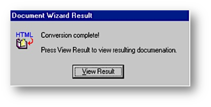
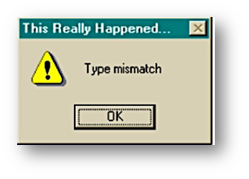
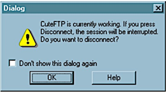
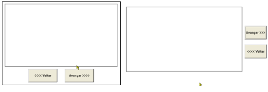
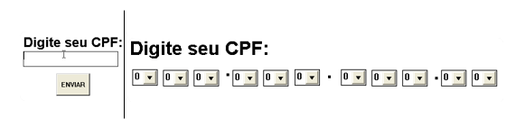
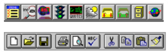
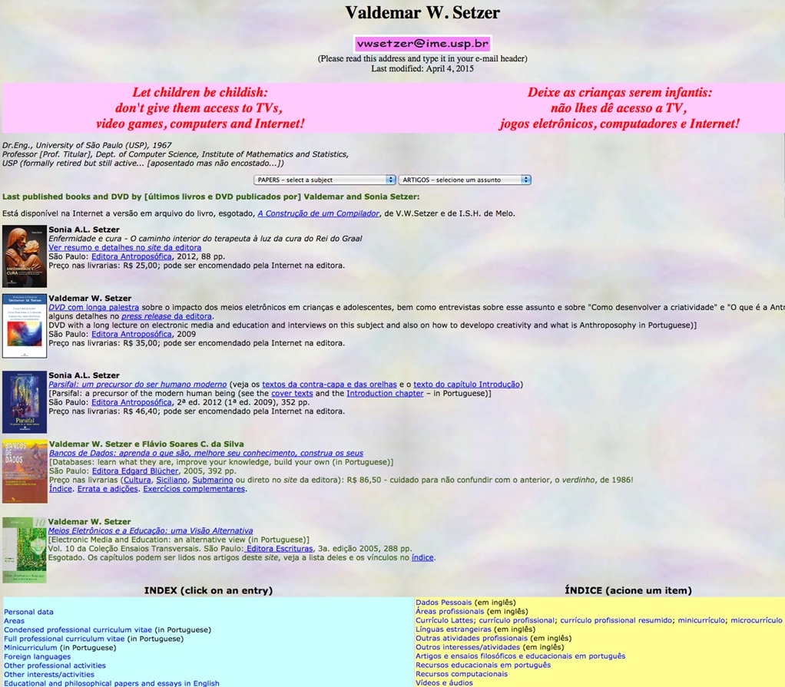

# Centralidade no usuário: Usabilidade

Facebook, Google e LinkedIn são sistemas de grande aceitação na sociedade, em parte, devido à excelente usabilidade que possuem.

Usabilidade é o aspecto mais importante de IHC, Interação Homem-Computador, estando ligada a fatores humanos e tecnológicos. Estudamos o conceito de usabilidade sob diferentes pontos de vista. Toda a discussão de usabilidade gira em torno da ideia de que o usuário e as tarefas que ele deseja realizar, devem estar no centro das atenções de quem desenvolve o sistema interativo. Se o usuário está preocupado em ser eficiente e eficaz nas tarefas que realiza, devemos buscar essa satisfação quando produzimos o novo sistema.

Mas para começar, devemos entender claramente o que significa eficiência e o que significa eficácia. Eficácia está ligada a resultado, eficiência está ligada a economia de recursos.

Vamos a um exemplo simples de eficiência e eficácia.

Duas empresas, A e B, pretendem elevar em 15% o faturamento em três meses. Passado esse período, ambas conseguem alcançar o objetivo, mas a empresa A gastou em marketing metade do valor que a empresa B gastou. Assim, ambas foram eficazes, mas a empresa A foi mais eficiente do que a empresa B, assim a empresa A leva vantagem em relação à empresa B.

Investir esforços ao projetar e implementar um sistema de informação é uma opção que busca ser eficaz. Em contrapartida, seria pouco eficiente acrescentar funcionalidades a um sistema desenvolvido por outra equipe depois que ele já foi instalado, por conta da necessidade de compreender o sistema existente e ainda de ter de analisar o impacto das mudanças no sistema.

O conceito de normas está vinculado à qualidade e a toda a discussão até aqui.

Normas são acordos que contêm especificações técnicas ou outros critérios precisos, para serem usados como regras, guias, procedimentos ou definições de características, de forma a assegurar que matérias-primas, produtos, processos e serviços estejam em conformidade com o seu propósito de uso. Frequentemente quando se fala de normas, menciona-se a sigla ISO.

ISO (International Organization for Standardization) é uma sigla geralmente associada a normas de qualidade. É uma federação mundial de organismos de normalização nacionais que congrega cerca de 120 países. Sua missão é promover o desenvolvimento da normalização e atividades correlatas no mundo, com o objetivo de facilitar as trocas internacionais de bens e serviços e desenvolver a cooperação nos campos da atividade intelectual, científica, tecnológica e ergonômica.

A ABNT, Associação Brasileira de Normas Técnicas, é a representante oficial da ISO no Brasil desde a sua criação em 1947.

> A norma ISO/IEC 9126 (1991) define usabilidade como sendo: Um conjunto de atributos relacionados com o esforço necessário para o uso de um sistema interativo, e relacionados com a avaliação individual de tal uso, por um conjunto específico de usuários.

Outra norma, desta vez relacionada a Ergonomia ISO 9241-11 (1998), define usabilidade como:

> O grau em que um produto é usado por usuários específicos para atingir objetivos específicos com eficácia, eficiência e satisfação de uso específico.

## Outras visões sobre usabilidade

A usabilidade é uma das principais características de um software porque influencia a qualidade percebida pelo usuário em relação ao sistema.

Há inúmeros casos de softwares ou sistemas interativos que são abandonados por seus usuários por serem difíceis demais para aprender, ou ainda, de tão pouco estimulantes, frustram o usuário, o que diminui a produtividade. Neste sentido, haveria problemas de usabilidade, certo?!

Vale lembrar que a usabilidade está sempre relacionada a pessoas e a tarefas que as pessoas desejam realizar com seus sistemas.

O uso de um editor de textos nos fornece um exemplo interessante sobre usabilidade. Se o usuário é uma criança e deseja escrever um bilhete para seus pais, a expectativa de usabilidade é uma, se o usuário é adulto e quer escrever um documento completo com índice, fórmulas, figuras e design sofisticado, a percepção de usabilidade será completamente diferente.

A usabilidade a ser desenvolvida depende de análises de tarefas realizadas pelos usuários (sempre o usuário está no centro das atenções nos trabalhos de sistemas interativos com apoio da IHC).

Não é simples acompanhar os usuários na solução de suas necessidades. Pense que tarefas mais comuns dos usuários são fáceis de determinar (imprimir um relatório por exemplo), enquanto as tarefas ocasionais ou excepcionais são bastante difíceis de descobrir (gerar um relatório específico, por exemplo).

**O pesquisador Jakob Nielsen define usabilidade como um conjunto de fatores que qualificam quão bem uma pessoa pode interagir com um sistema interativo segundo sua capacidade cognitiva, perceptiva e motora.**

Nielsen é um dos mais conhecidos especialistas em usabilidade no mundo. Atualmente mantém um [site](https://www.nngroup.com/) dedicado a discussões avançadas sobre usabilidade que vale muito a pena visitar.

De modo bem geral, para sintetizar as ideias principais vistas até aqui, podemos afirmar também:

> Usabilidade é a capacidade de um sistema interativo de software de oferecer a seus usuários, em um contexto específico de operação, a realização de tarefas que ele deseja realizar, de maneira eficaz, eficiente e agradável.

## Questões essenciais de usabilidade

A usabilidade depende das seguintes perguntas cujas respostas buscamos alcançar:

- Quem é o usuário?
- O que o usuário quer fazer?
- O que o usuário necessita?
- Como podemos ajudá-lo?

Confiabilidade, Contexto, Visibilidade, Correspondência entre o sistema e o mundo real, Liberdade para o usuário, Consistência e padrões, Diagnóstico e prevenção de erros, Organização e Clareza, são algumas das diretrizes comuns aos diferentes autores de IHC sobre desenvolvimento de melhores práticas em usabilidade em projetos de sistemas.

Vamos esclarecer alguns desses conceitos mais de perto:

1) Usabilidade: Confiabilidade

As ações devem funcionar conforme especificado.

Dados apresentados devem refletir conteúdos de bases de dados e devem ser atualizados corretamente. Pense em um sistema de GPS que forneça a localização geográfica de um endereço que o usuário escolhe. Se o usuário for orientado de forma errada sobre o endereço e for parar em uma localidade diferente da que necessitava, isso abala a confiabilidade do usuário em relação ao sistema utilizado.

2) Usabilidade: Dependência do Contexto

Para um usuário, a usabilidade de um programa pode ser boa, enquanto para outro usuário pode ser deficiente.

Depende do perfil do usuário, do contexto de uso, da cultura local e de características da própria interface usuário-sistema.

Imagine uma caixa de banco experiente e um estagiário estreante consultando a mesma base de dados. A percepção sobre usabilidade será completamente diferente porque estão em contexto de uso diferentes.

3) Usabilidade: Visibilidade do sistema

É necessário manter o usuário informado do que acontece no sistema por meio de feedback correto com mensagens curtas e diretas.

Um erro comum são interações exageradas.

Na figura abaixo, por exemplo, ocorre um exagero com informações repetidas:

4) Usabilidade: Correspondência entre o sistema e o mundo real

É recomendável utilizar expressões e vocabulários que sejam familiares ao usuário, evitando termos técnicos.

Há um erro de usabilidade aqui. A mensagem que deveria esclarecer o que aconteceu, nada explica, apenas indica que houve um erro e ainda pede para o usuário clicar OK.

5) Usabilidade: Liberdade para o usuário

O usuário deve ser capaz de se livrar de situações inesperadas. Para isso, forneça a opção desfazer (undo) ou permita que operações arriscadas possam ser canceladas.

A caixa de diálogo pede para o usuário se certificar de que realmente deseja se desconectar. Exemplo de falha de comunicação e usabilidade.

6) Usabilidade: Consistência e padrões

A ideia aqui é fazer com que a execução de tarefas similares sejam sempre executadas de forma similar.

Há um erro de usabilidade aqui. Quando o usuário clica no botão avançar para mudar de tela, o próprio botão muda de lugar. Inconsistência é um erro bastante frequente:

7) Usabilidade: Diagnóstico e prevenção de erros

Linguagem educada e simples deve informar o usuário de que ele cometeu ou está para cometer um possível erro. Este item tem relação também com a prevenção de erros.

A forma de introduzir o CPF de um usuário é muito mais segura na figura da esquerda. Na figura da direita o excesso de botões quase convida a que o usuário selecione o algarismo errado.

8) Usabilidade: Organização e clareza

Informação demais pode ser irrelevante ou gerar confusão.

Há erros na barra superior. As barras de comandos demonstram más práticas (barra superior) e boas práticas de agrupamento de botões (barra inferior)

## Outras visões sobre usabilidade

A discussão de usabilidade na web tem muitos pontos em comum com sistemas de propósito geral, embota seja possível dizer que as pessoas usam a web sobretudo para buscar informação, enquanto para sistemas de em geral, as razões de uso são as mais variadas (pagar taxas, consultar extratos, chamar o Uber, escolher produtos, etc).
]
Neste momento tratamos de usabilidade relacionada a website.

### Usabilidade na internet: Clareza

Uma regra geral é de que os usuários devem dizer num relance do que se trata a página, isto é, deve ser bem claro o que faz a página ou que ela proporciona.

Veja os exemplos abaixo

O recado é claro, trata-se de um portal de notícias sobre ciências:

Portal com artigos acadêmicos de um professor: afinal do que ele está falando?

### Usabilidade na internet: Facilidade de navegação

Prover um bom arranjo da informação é essencial para que o usuário consiga discernir o que é prioritário e o que é secundário no site.

Fornecer uma ideia rápida de como a informação está estruturada e localizada.

Ex. Mapa do site

Ainda sobre usabilidade em websites, é importante considerar:

- O usuário deveria conseguir a informação em poucos cliques.
- Os links devem ter no máximo quatro palavras.
- Incluir texto adicional que explique o link.
- Utilizar cores diferentes entre links visitados e não visitados.
- Evitar textos longos, é melhor fragmentá-los em partes menores.

Problema desta interface: para onde vai o usuário?

### Usabilidade na internet: Diferentes suportes

É uma prática gerar duas versões de todos os documentos longos na web.

Uma deve ser otimizada para visão on-line ao ser dividida apropriadamente em vários arquivos usando muitos links de hipertexto.

A outra versão deve manter o documento completo em um arquivo com um layout otimizado para impressão. Usuários odeiam barras de rolagem.

### Usabilidade na internet: Simplicidade

Quanto mais simples a interface melhor tende a ser a usabilidade, desde que respeitadas as funcionalidades do sistema. Exemplo claro é o site do Google.

A interface do Google é extremamente simples, o contribui para que seja um padrão de qualidade em termos de usabilidade em sites de busca para a web.

Outras ideias complementares e uma síntese sobre usabilidade:

- Usabilidade deve ter o foco nos usuários: quem são e o que querem fazer.
- Usabilidade tem a ver com permitir que o usuário execute as tarefas que deseja com eficácia, eficiência e satisfação.
- O excesso de funcionalidades em uma mesma tela de um sistema costuma ser o erro mais comum em usabilidade.
- Usabilidade na web tem características diferentes da usabilidade em sistemas de informação de forma geral, mas também muitas características comuns.
- Jornais e portais de notícias online são verdadeiros laboratórios de usabilidade.
