# Estilos de Interação

Observe a figura abaixo que retrata a interação usuário-computador:

O usuário age sobre o sistema e o sistema age sobre o usuário:

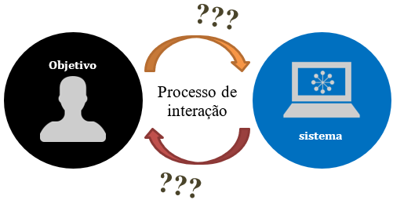

No processo de interação usuário-sistema cabem duas perguntas importantes:

- Como a informação vinda do usuário deve ser tratada pelo sistema?
- Como a informação vinda do sistema deve ser apresentada ao usuário?

Existem estilos gerais de interação usuário-sistema que nos ajudam a responder essas perguntas.

Vamos conhecer cinco estilos básicos de interação usuário-sistema:

- manipulação direta
- seleção de menu
- formulários
- linhas de comando
- linguagem natural

1) Estilos de interação: Manipulação Direta

A ideia mais importante aqui é aproximar a interação da manipulação de objetos do mundo real.

O objeto do mundo real deve ter uma metáfora visual no mundo virtual e cada manipulação sobre o objeto deve ser mapeada para operações do mouse ou teclado, como clique simples, duplo clique, arrasto, etc... Veja na figura abaixo a tela que representa o movimento de um ícone de um ponto da tela até a aproximação com a lixeira.

Observe a metáfora visual presente: jogar o documento na lixeira equivale a arrastar o documento até onde está o ícone com aparência de lixeira.

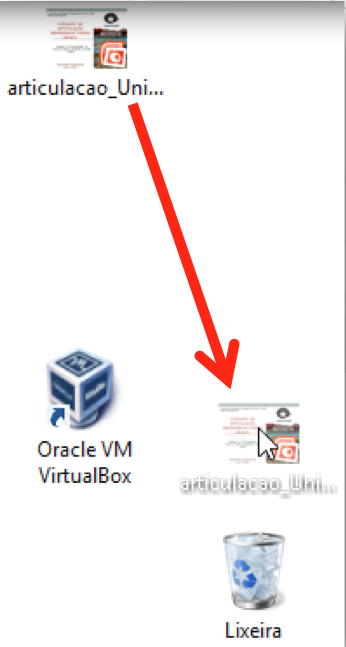

Os games de computador representam bem a evolução dos sistemas de interação do tipo manipulação direta.

Um bom exemplo de manipulação é dirigir um automóvel em um game. Observe a figura abaixo.

Por uma janela que lembra um para-brisas, você tem uma visão do que está à frente do veículo. Para virar à direita, você gira um pouco o desenho do volante, para trocar a marcha você aciona um desenho de uma alavanca para acelerar ou frear, basta acionar o desenho do pedal com o mouse, e assim por diante.

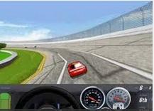

Exemplos de outros jogos clássicos na figura seguinte são representativos da evolução das interfaces interativas.

Telejogo: jogo para ser jogado que era instalado nos antigos televisores da década de 1970.

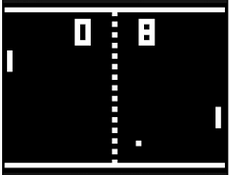

PacMan: um dos jogos mais importantes da história dos jogos eletrônicos.

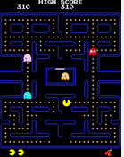

Com a evolução das plataformas e sistemas, é difícil enxergar limites para o poder de interatividade dos jogos.

Mas o estilo de interação do tipo manipulação direta é útil apenas para consoles de games? Na verdade, não Há exemplos em inúmeras outras áreas como engenharia, projetos diversos e simuladores de todo tipo.

Ferramenta de projetos AutoCAD

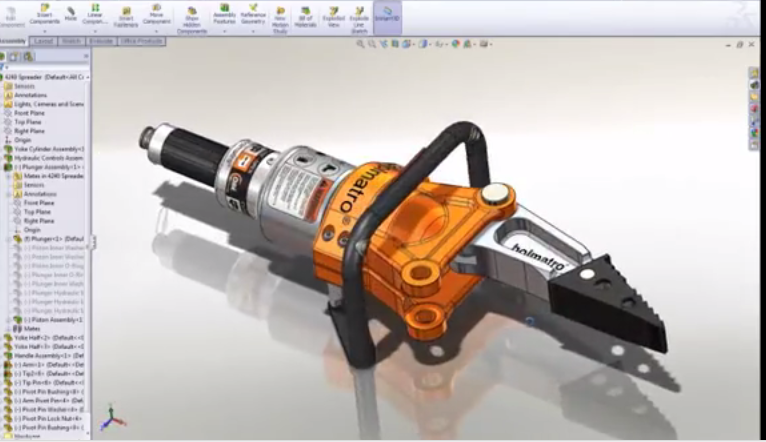

Ferramenta de criação de cenários e maquetes Bryce

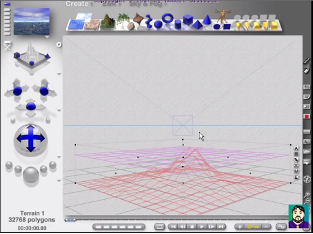

Simulador de prática de direção

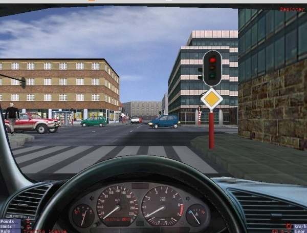

Conforme vimos, a manipulação direta prioriza representações visuais que podem ser bastante sofisticadas, em lugar de representações numéricas ou textuais.

## Vantagens da modalidade de interação usuário computador - Manipulação Direta

- Ações físicas são mais fáceis de aprender do que uma sintaxe complexa.
- Resultados das ações geram efeito imediato.
- Redução de taxas de erro.
- Aumento do engajamento e motivação do usuário.
- Requer menor experiência anterior do usuário.

## Desvantagens da modalidade de interação usuário computador - Manipulação Direta

- Requer aparato de equipamento mais sofisticados.
- Consome muito espaço da tela.
- O usuário deve entender as metáforas visuais.
- Não há metáforas visuais para tudo!
- Programação/design pode ser trabalhosa e excessivamente sofisticada.

2) Estilo de interação: Preenchimento de formulários

É um estilo muito comum de interação em que o sistema solicita dados do usuário através de campos que precisam ser preenchidos em campos fixos na tela.

Os formulários comumente encontrados em websites se encaixam nesse estilo de interação (cadastro de produtos, clientes, pedidos, etc...). Veja a figura abaixo que representa um formulário típico.

O usuário precisa preencher todos os campos e fazer escolhas de uma relação de opções.

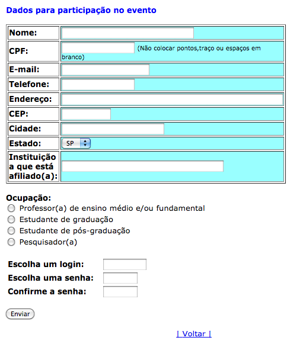

A construção de um formulário requer criar itens relacionados e ordenados de forma lógica, requer ainda que se use terminologias de forma consistente, fornecer atalhos para localizar ou selecionar um item, etc...

Deve-se pensar também nos tipos de botões de acordo com cada tipo de dados até no movimento que o usuário deve fazer com o cursor quando vai de um item a outro do formulário.

## Vantagens do estilo de interação - Formulário

- Fácil de utilizar.
- Fácil de programar (geralmente associada a um banco de dados).
- Apesar da aparente simplicidade, apresenta desafios interessantes para prevenção e recuperação de erros de preenchimento do usuário.

## Desvantagens do estilo de interação - Formulário

- Ocupa muito espaço na tela.
- Uso um tanto restrito a sistemas de cadastro.

Um bom formulário deve respeitar regras básicas de diagramação, típicas da produção gráfica tradicional. Apresentamos a seguir algumas regras simples mas diretamente aplicáveis à construção de formulários. Existem outras regras.

## Regras de layout que podem ser aproveitadas na construção de formulários

Vamos ver apenas duas regras: Alinhamento e Proximidade.

A regra do Alinhamento diz que os elementos de uma página devem estar alinhados uns com os outros, alinhados à esquerda, centralizados ou à direita.

Exemplo de mau alinhamento em um formulário: observe como isso dificulta a leitura e preenchimento.

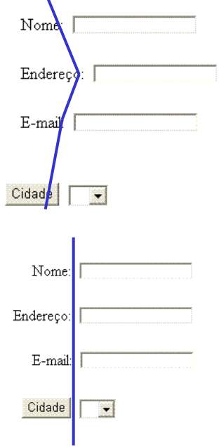

A regra da Proximidade diz que os elementos que têm significados próximos devem estar juntos. Deve-se agrupar itens que se subordinam a outros ou que tenham fortes conexões de sentido.

Observe isso nos exemplos apresentados na figura abaixo.

Problema de proximidade: qual bloco de texto se refere a qual título?

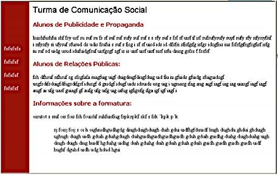

Sabe-se claramente qual bloco de texto tem a ver com qual título.

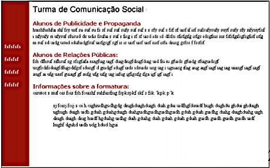

3) Estilos de interação - Sistema de menus

O sistema de menus é o modelo de interação mais genérico e comum.

Incorpora barras de menu, barras de navegação, botões de seleção e de opção.

Um bom sistema de menus deve apresentar uma organização razoável para facilitar as tarefas dos usuários e devem ser organizados em uma estrutura hierárquica.

Pense em como os sistemas de menus podem ser sofisticados com múltiplas entradas e saídas, é o que encontramos em alguns websites de revistas online e sites de vendas, por exemplo. Veja na figura a seguir o sistema de hierarquia de menus.

Note a hierarquia de comandos presente neste sistema de menus.

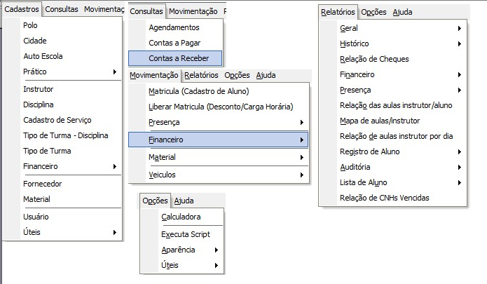

Um sistema de menus, embora pareça muito limitador da criatividade do designer da interface, pode ser apresentado de outras formas, com componentes gráficos e lúdicos. Veja a figura abaixo.

Esta tela exemplifica um sistema de menus diferenciado. Ao acionar um botão, troca a imagem no alto da tela.

## Entre as vantagens e desvantagens do estilo de interação sistema de menu, podemos apontar:

- Pode ser lento para usuários mais experientes (acostumados a digitar comandos rapidamente).
- Minimiza o esforço de digitação.
- Conduz as ações do usuário o que limita as possibilidades de erro e pode ser mais produtivo.
- Se o menu for mal projetado, extenso ou complexo demais, pode confundir o usuário.

4) Estilo de interação - Linha de Comando

Neste estilo de interação, o usuário deve digitar os comandos que realizam as ações no aplicativo. Veja a figura a seguir.

DOS: precursor do Windows

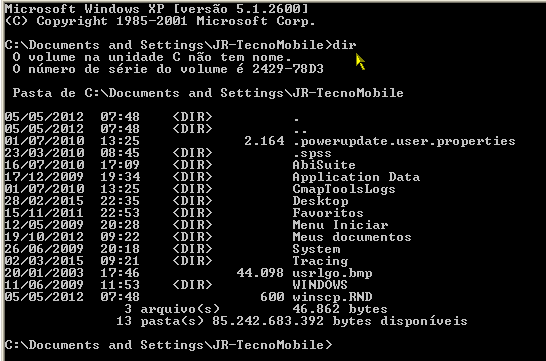

Tela com exemplo de programa escrito em linguagem COBOL: linguagem de programação de mainframes

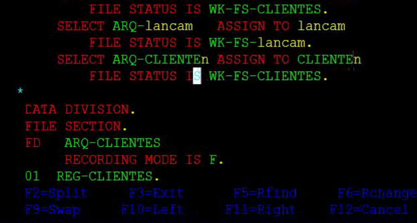

Como se pode observar, o usuário deve digitar os comandos que realizam as ações no aplicativo e para isso, obviamente, tem que conhecer os comandos que irá utilizar. Isso torna o estilo de interação Linha de Comando mais difícil de aprender.

De todo o modo, é um caminho mais técnico para a interação do usuário com o sistema, o que proporciona enorme flexibilidade para o usuário, além de restringir a possibilidade de erros, uma vez que exige conhecimento prévio sobre o sistema.

Toda essa expressividade nas mãos do usuário serve para encorajar a criatividade.

5) Estilo de interação - Linguagem Natural

Visa permitir que o usuário se expresse usando seu próprio idioma, como se estivesse conversando com outra pessoa.

É um antigo sonho dos designers de interação de sistemas interativos. A figura abaixo mostra um dos programas pioneiros que faziam com que o computador mantivesse uma conversa com uma pessoa sem que esta suspeitasse que se tratava de um computador.

Eliza é o programa de computador que representa uma tentativa pioneira de conversar com uma pessoa, fazendo-se passar por um psicoterapeuta.

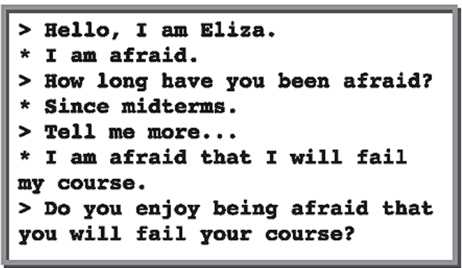

## Vantagens e desvantagens do estilo de interação Linguagem Natural

- Acessível a usuários casuais.
- É um antigo sonho dos designers de interação de sistemas interativos.
- Se estiver no formato escrito, requer mais tempo de digitação do que outros estilos de interação.
- Se estiver no formato oral, também pode tomar mais tempo ou ser pouco prático.
- É considerado não confiável com a tecnologia hoje disponível.

### Observações importantes sobre estilos de interação

- Para alguns autores, o uso de planilhas de cálculo e editores de texto são exemplos de estilo de interação do tipo de manipulação direta.
- Muitos ambientes combinam diferentes estilos de interação (Por exemplo, a ferramenta de projetos CAD, é uma mistura de menus e ambiente gráfico).
- A área de videogames é um grande laboratório para o desenvolvimento de novos estilos de interação.
- A manipulação direta é exemplo de como a IHC pode ser controversa: muito se discute sobre os efeitos psicológicos de se submeter crianças a jogos agitados e violentos.
- Alguns modelos de interação combinam melhor com certas aplicações (Exemplo: Jogos -> Manipulação direta, Sistemas comerciais -> Menus e formulários, etc...).
- Tanto o sistema de menu, quando o preenchimento de formulários são tentativas de tornar a interação mais simples, organizada e fácil de memorizar, tornando as ações dos usuários mais confiáveis. São estilos próximos.
- Sistema de menus bem semelhantes ajudam a explicar o porquê dos produtos Microsoft fazerem tanto sucesso comercial, enquanto outros atraem menos interesse (Sistema Linux depende de linha de comando)

### Quadro síntese dos estilos de interação usuário-sistema vistos nesta aula:

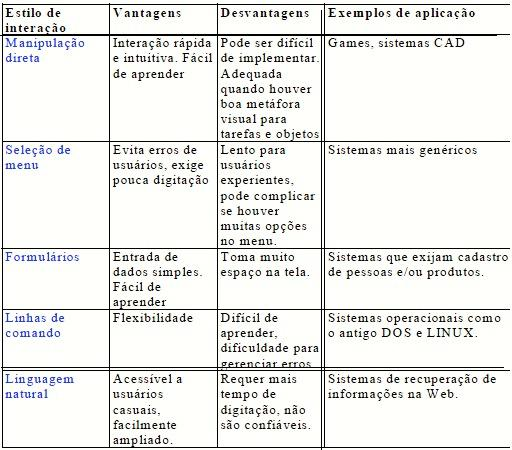

