# Fundamentos teóricos do design de interação

Os mecanismos de IHC envolvem uma série de aspectos do comportamento humano tais como capacidade de compreensão (cognição), atenção e hábito das pessoas.

A Cognição lida com processos essenciais de nosso dia a dia como prestar atenção, pensar, lembrar, aprender, tomar decisões, ler planejar, racionar, ver, escrever e falar. Tais processos afetam e são afetados pelo IHC.

Por exemplo, prestar atenção está relacionado com a apresentação da informação e com elementos que envolvem cor, tamanho de fontes, clareza, etc... Assim, a clareza com que uma informação é apresentada está relacionada diretamente a sua compreensão.

O mesmo pode-se dizer da cognição escrever...

Existem diversos exercícios populares que brincam com a ideia de percepção e que são úteis para pensarmos os mecanismos de IHC e os fatores humanos associados a ela.

Vamos lembrar de alguns deles. Na figura abaixo você consegue enxergar o músico e a moça no mesmo desenho a esquerda? Consegue enxergar um cachorro na figura mais clara à direita?

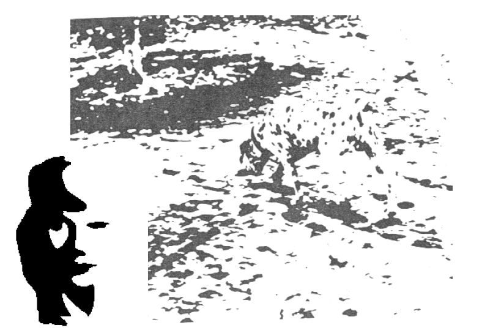

Note que para ver o cachorro ou a moça, adicionamos informações que não estão presentes nas imagens originais. Isso ocorre porque as imagens originais estão degradadas.

Note que se alguém pede a você que encontre o cachorro ou a moça, fica mais fácil de vê-los. Além disso, uma vez que veja o cachorro ou a moça, é muito difícil não vê-los mais. Isso explica um fenômeno presente até no nosso dia a dia, e que não se restringe à percepção de imagens visuais: quando se olha para o que se quer ver é mais fácil ver.

A famosa grade de Hering também nos convida a pensar sobre a percepção das imagens.

Grade de Hering

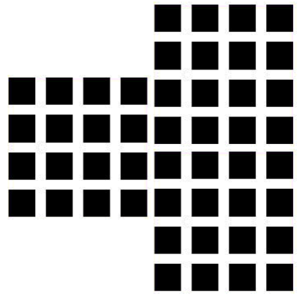

Pontos cinza são enxergados na interseção dos quadrados escuros, mesmo não estando presentes, exceto naquele em que você fixa o olhar.

Esse fenômeno é explicado pelo princípio da análise sensorial: células neurais interagem umas com as outras. Assim, receptores de uma parte da imagem cisual são afetados pela operação de receptores para partes vizinhas.

No único ponto do olho onde os receptores não interagem muito com os outros, área onde o olho está focando, o escurecimento da interseção não acontece.

Um famoso artigo de 1956 (do psicólogo George Miller) relatou que a mente humana é capaz de lidar com apenas sete focos de atenção de uma vez só, por isso informações na interface devem ser relevantes e não depender muito da memória do usuário.

Todas essas questões (existem outras) nos remetem a estudos mais progundos sobre as interações humano-computador e serviram de inspiração para diversos estudos de IHC.

## Modelo (MHP) Processador Humano de Informação

Segundo a abordagem de estudos para IHC denominada ação planejada, a ação humana pode ser completamente caracterizada em termos de seus objetivos, intenções e planos. Nesse sentido, para entender com as pessoa agem, bastaria entender como elas seguem um plano predefinido.

Um plano é uma sequência de ações projetadas para alcançar algum objetivo.

Dado um objetivo e uma situação inicial, uma pessoa constrói um plano e então realiza as ações definidas neste plano... Antecipar as ações desse plano daria todas as indicações de como desenvolver a interface do sistema interativo.

Nessa visão, as condições para a execução são definidas a priori, e a atividade humana é considerada uma forma de resolver o problema, na qual o ator deve encontrar um caminho de algum estado inicial para algum estado final desejado, dadas as condições iniciais colocadas.

Entre os modelos de ação planejada mais conhecidos estão o modelo de processador humano de informação (MHP) e o modelo de engenharia cognitiva, mas existem outros.

Nas figuras seguintes apresentamos a ideia de que as ações humanas resultam do processamento de informações de uma espécie de homem-computador.

Observe como o modelo humano de processamento de informação (MHP) lembra muito a arquitetura de um computador uma vez que possui unidades de armazenamento, sistemas para processar o racionício e movimento. Representa-se o fluxo de informação desde a entrada da informação no sistema pelos sentidos até a saída representada pela ação do usuário.

Segundo o modelo MHP, a mente humana é um sistema de processamento de informação e com base nesse sistema é possível fazer predições aproximadas de parte do comportamento humano.

O modelo MHP interpreta as ações humanas como resultado de uma máquina-humana. O usuário vê processa e, finalmente, decide agir ou não, neste caso apertando o botão.

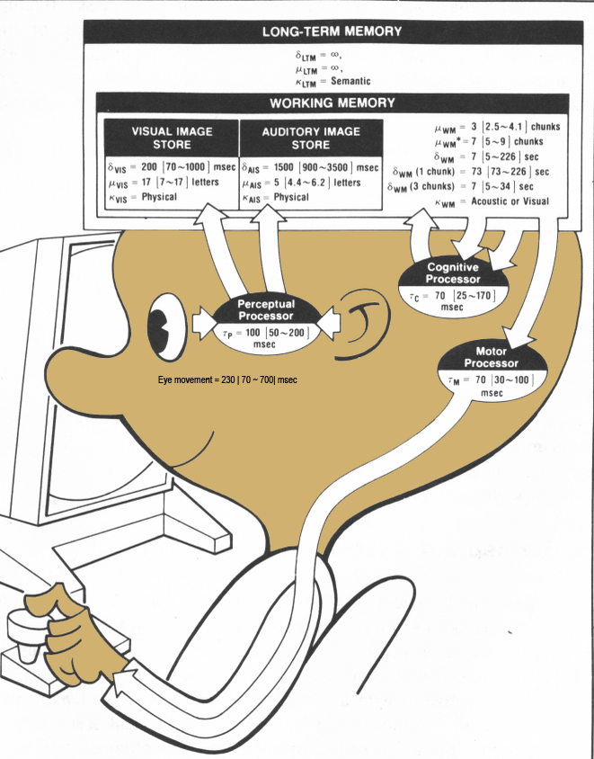

O sistema perceptivo transmite as sensações do mundo físico detectadas pelos sistemas sensoriais do corpo (visão, audição, tato, olfato, paladar) para representações mentais internas. Essas sensações são armazenadas temporariamente em áreas de memória sensorial (visual e auditiva) com um tempo de decaimento (esquecimento) rápido, conforme a intensidade dos estímulos. Em seguida, algumas dessas sensações são codificadas e armazenadas. O processador cognitivo decide se a informação irá até o processador motor para que o indivíduo aja sobre o ambiente ou não. A figura abaixo destaca os elementos do processo MHP e o fluxo das informações desde a entrada até a saída.

Representação do modelo MHP: observe os fluxos de informação.

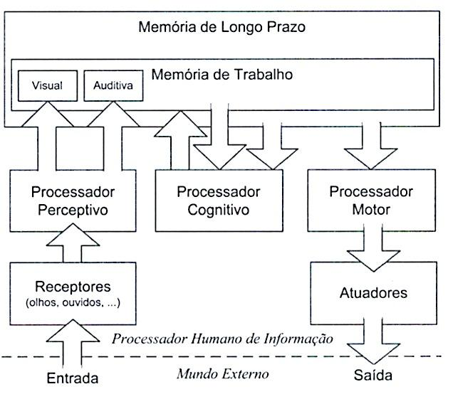

Observe as grandezas físicas (basicamente tempo) associadas aos sistemas do modelo.

Os autores do modelo calcularam o intervalo de tempo para diversas tarefas cotidianas e relacionadas ao uso de um computador. Por exemplo, calcularam a taxa de quadros em uma animação necessária para criar a ilusão de movimento e o tempo para ler um texto, por exemplo.

## Críticas ao Modelo Processador Humano de Informação (MHP)

É muito importante ressaltar que como qualquer modelo, ele é redutor da realidade. Inúmeras questões não estão previstas neste modelo homem-máquina:

- É um modelo razoável para as tarefas relacionadas à avaliação e predição da performance humana na interação.
- Considera apenas o que acontece dentro da cabeça do indivíduo.
- Não considera como as pessoas interagem entre si ou como a interação pode variar dependendo do contexto.

## Modelo GOMS (Goals, Operators, Methods and Selection Rules)

O modelo GOMS é, na verdade, uma família de modelos psicológicos que representam uma extensão do modelo MHP. Está intimamente ligado como as características humanas desempenham papéis na área de projeto de IHC.

GOMS é um método para descrever uma tarefa e o conhecimento do usuário sobre como realizá-la em termos de objetivos (goals), operadores (operators), métodos (methods) e regras de seleção (selection rules). Normalmente o usuário já sabe desempenhar a tarefa e o modelo traduz a realização dessa tarefa para que os passos possam ser estudados, avaliados e modificados.

Visto de outro modo, GOMS é uma metodologia que permite que as ações de um humano usando uma interface sejam analisadas como sequências de passos elementares (tais como pressionar uma tecla, mover o mouse, tomar uma decisão).

O desempenho de cada passo elementar recebe um período de tempo preciso e, então, ao adicionar os tempos atribuídos para os passos em uma tarefa, o GOMS fornece um meio de comparar diferentes interfaces em termos do tempo que cada uma delas requereria para realizar tarefas similares.

Barbosa (2010) sintetiza as aplicações do modelo GOMS explicando que GOMS pode ser utilizado tanto quantitativamente, de modo a fornecer previsões sobre o tempo necessário para realizar tarefas, como qualitativamente, no sentido de auxiliar na elaboração de programas de treinamento, sistemas de ajuda e sistemas tutores inteligentes, pois um modelo GOMS contém uma descrição detalhada do conhecimento necessário para realizar cada tarefa.

Também pode ser utilizado para projetar sistemas podendo revelar um objetivo frequente apoiado por um método muito ineficiente, podendo mostrar ainda que alguns objetivos não são apoiados por nenhum método e pode revelar onde os objetivos semelhantes são apoiados por métodos inconsistentes.

Há inúmeras aplicações do modelo GOMS. Vamos a um exemplo.

Consideremos o movimento da mão de um usuário em direção a determinado alvo, como normalmente se faz, por exemplo, para alcançar o mouse a partir do teclado.

Uma pergunta importante para quem projeta uma interface, poderia ser:

Quão rápido pode ser esse movimento?

Este estudo revelou alguns princípios, como o apresentado na figura abaixo.

Tais pesquisas convergem para um conjunto de leis e princípios, elencarmos apenas um deles, o Princípio de número 5.

Princípio n.5

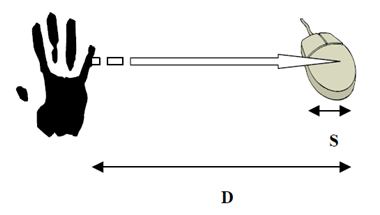

**Fitt's Law**

O tempo necessário para mover a mão para um alvo depende somente da precisão relativa requerida, isto é, a razão entre a distância ao alvo e seu tamanho.

Esse princípio pode ser empregado, por exemplo, para determinar a melhor posição para determinadas teclas de função em interfaces, medindo o tempo que seria gasto nos movimentos da mão.

## Fundamentação teórica do design de interação: engenharia cognitiva e cognição distribuída

### Modelo de engenharia cognitiva

Dando continuidade a teorias e modelos que fundamentam a área de IHC, vamos conhecer superficialmente a base do modelo denominado engenharia cognitiva. A engenharia cognitiva trata de projetar sistemas que harmonizem com as habilidades mentais dos humanos, ao passo que a ergonomia está mais relacionada com as habilidades físicas dos humanos.

Concebido por Donald Norman em 1986, objetivava aplicar conhecimentos da ciência cognitiva, psicologia cognitiva e fatores humanos ao design e construção de sistemas computacionais.

Parte da ideia de que existem discrepâncias entre objetivos expressos psicologicamente e os controles físicos para realizar uma determinada tarefa.

Trabalha com variáveis psicológicas e variáveis físicas, assim como com controles físicos que precisam interagir entre si.

A representação mais elementar do modelo possui dois golfos: de avaliação e de execução.

As figuras seguintes representam os principais elementos do modelo básico de engenharia cognitiva.

O usuário tem um objetivo que deseja realizar

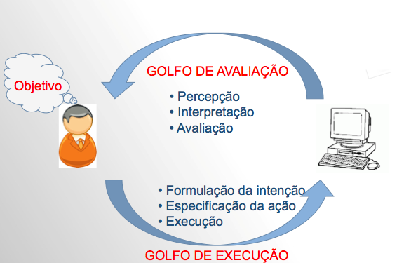

Elementos psicológicos e físicos estão envolvidos.

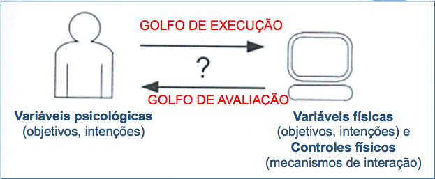

Outra visão geral da engenharia cognitiva;

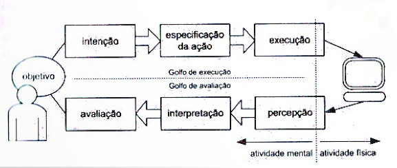

#### Exemplos de aplicação

Como regular a temperatura e o fluxo de água e a temperatura de uma torneira em que eu não conheço o funcionamento?

Isso envolve problemas de mapeamento, dificuldades de controle e dificuldades de avaliação.

O uso de uma torneira de duplo comando exemplifica as variáveis básicas da engenharia cognitiva.

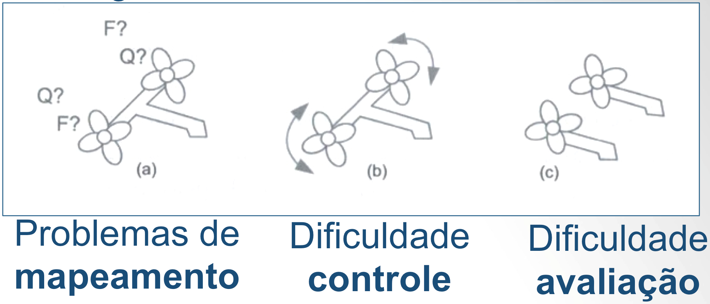

Em uma torneira simples do tipo monocomando, as variáveis físicas estão mais parecidas com as variáveis de interesse.

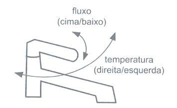

### Cognição distribuída

A cognição distribuída abrange as interações entre as pessoas, recursos e materiais no ambiente.

Estuda-se os fenômenos cognitivos entre os indivíduos, artefatos e representações internas e externas.

Um bom exemplo é o que acontece na cabine de um avião:

- Piloto, comandante e controlador de tráfego aéreo interagem uns com os outros.
- Piloto e o comandante interagem com os instrumentos do cockpit.
- Piloto e o comandante interagem com o ambiente em que o avião está voando.
- A informação é propagada por diferentes meios entre o avião e a torre de controle.

Cabine de avião: exemplo de ambiente em que ocorre processo de cognição distribuída.

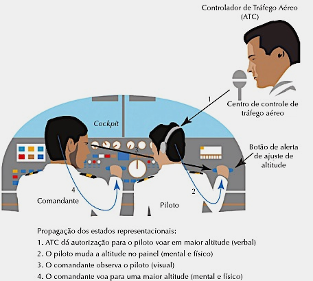

Uma importante parte da cognição distribuída é identificar onde estão os problemas, conflitos e processos paralelos de resolução que emergem com eles. Essa análise pode ser usada para predizer o que aconteceria na forma com que a informação é propagada por um sistema cognitivo usando um arranjo diferente de tecnologias e artefatos.

A abordagem de cognição distribuída é especialmente útil quando do design e avaliação de novas tecnologias colaborativas:

- Solução distribuída do problema incluindo o modo como as pessoas trabalham juntas para resolver um problema.
- Papel do comportamento verbal e não verbal.
- Os vários mecanismos de coordenação que são utilizados (regras procedimentos).
- As várias maneiras de comunicação que ocorrem à medida que as atividades colaborativas avançam.
- Como o conhecimento é compartilhado e acessado.
- O modelo de Cognição distribuída considera interações entre pessoas e entre equipamentos para avaliar o fluxo de informações para a execução de um objetivo.

Importante ressaltar que estas abordagens teóricas são importantes na área de pesquisa IHC mais que o desenvolvimento.
