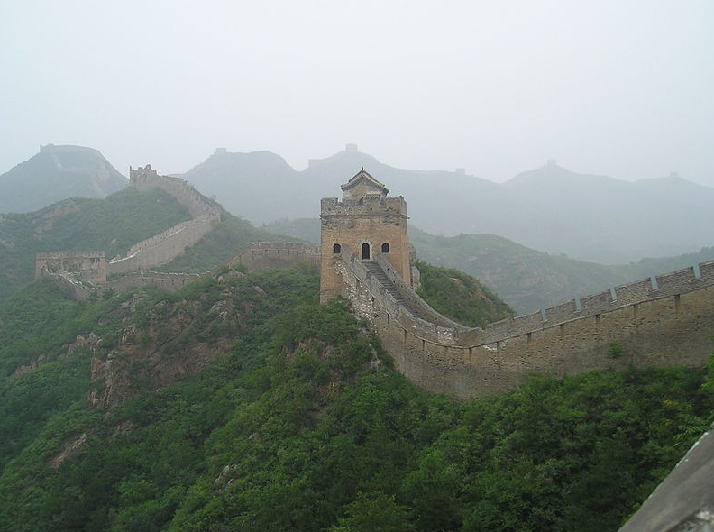
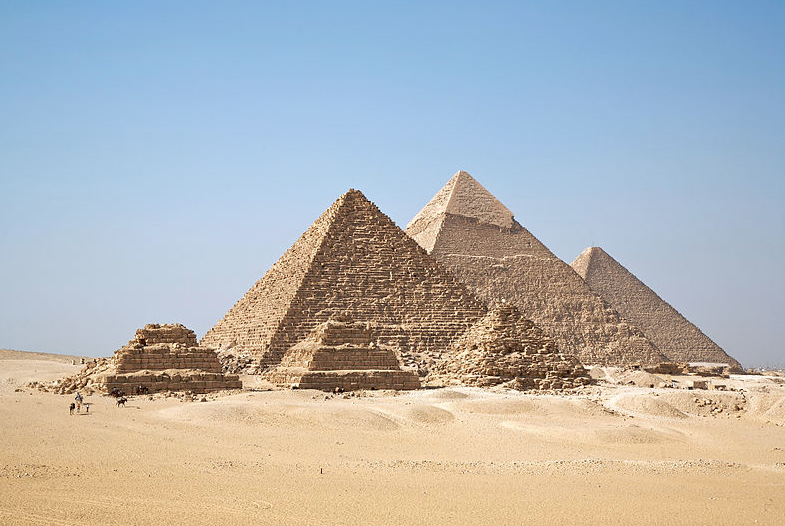
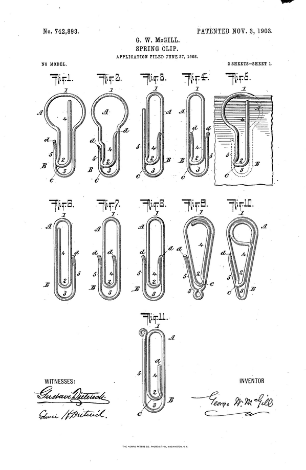
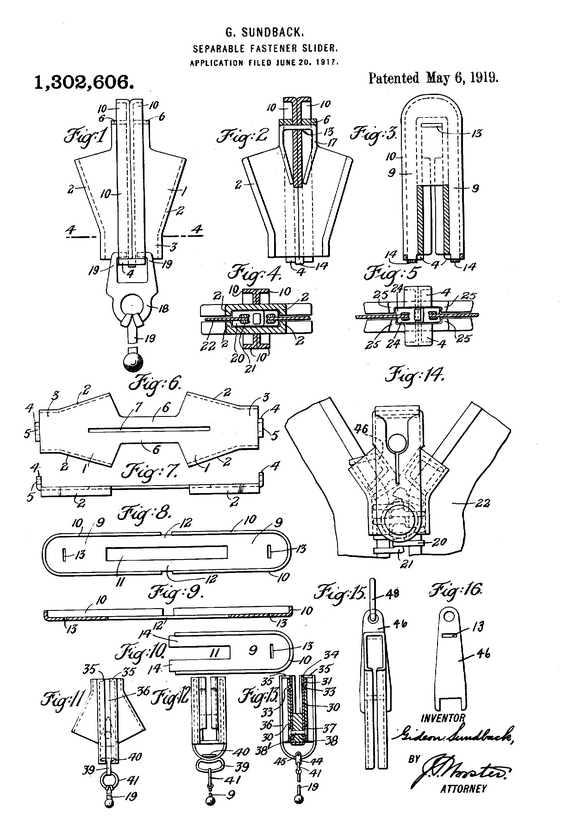
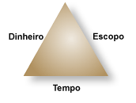
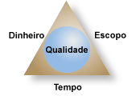
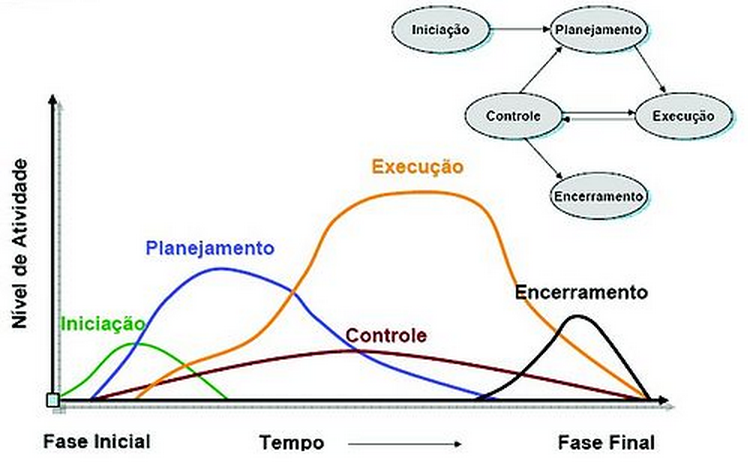

# Fundamentos de Gerenciamento de Projetos

A história da humanidade e das civilizações é marcada pela construção de obras grandiosas tais como a Muralha da China, o Taj Mahal, as pirâmides do Egito, os aquedutos de Roma, entre inúmeros outros projetos.

Muralha da China: 1500 anos para ser construída.

Taj Mahal na India: 15.000 homens trabalharam durante 15 anos para construí-lo.

Pirâmides do Egito: ainda hoje se discute as técnicas utilizadas em sua construção.

Mas grandes realizações às vezes estão embutidas também em objetos corriqueiros do nosso dia a dia, em utensílios banais tais como a ponta de uma lapiseira, um lápis, o velcro, o zíper, ou até um simples clips. Por exemplo, muitos anos foram gastos para desenvolver as melhores soluções entre forma e função para clips e fechos de zíper, na tentativa de alcançar um equilíbrio entre material, custo, usabilidade, fabricação e preço de venda compatível. Parte disso está documentado em registros de patentes de antigos projetos.

Patente obtida por George McGrill em 1903 com variações no desenho do clips. Petroski (2008).

Patente e fecho de zíper obtida por Gideon Sundback em 1917, que ele descrevia como `elementos aninhados encaixando-se nas peças em forma de taças`. Petroski (2008).

Projetos nem sempre estão associados a construções e a produtos. Um projeto pode ser a despoluição de um tio ou a construção de uma praça, a reforma de uma casa, uma viagem de fim de semana ou o aprendizado de um idioma estrangeiro.

Nas organizações, muitas atividades firam em torno de projetos, desde a criação de produtos e serviços até o desenvolvimento da própria organização. Tudo isso faz com que a área de gerenciamento de projetos seja uma das mais desafiadoras e prestigiadas de toda a Administração.

Começamos com algumas definições essenciais. Um projeto é um empreendimento temporário conduzido para criar um produto ou serviço único com data para começar e terminar e que estará concluído quando suas metas e objetivos forem alcançados e aprovados pelo stakeholders. Stakeholders são as pessoas ou organizações que têm algum interesse envolvido - aquelas que têm algo a ganhar ou perder como consequência de um projeto (HELDMAN, 2006). Protótipos antecedem produtos porque os protótipos estão em fase de testes. Depois que o protótipo foi testado e chegou aos consumidores, temos os produtos. Portanto, um projeto passa pelo protótipo antes de virar um produto.

Dito de outro modo, um projeto é um conjunto de ações, executadas de forma coordenada por uma organização transitória, ao qual são alocados os recursos necessários para, em um dado prazo, alcançar um objetivo determinado (VALERIANO, 2005). Apesar da definição parecer clara, confunde-se frequentemente um projeto com atividades rotineiras. Enquanto um projeto tem a finalidade de criar algo novo, uma atividade rotineira tem a finalidade de executar tarefas repetitivas para obter resultados parecidos. Assim, por exemplo, o trabalho de preparação de um time de futebol visando vence uma Copa do Mundo é um projeto, enquanto a operação de uma linha de montagem de veículos é uma atividade rotineira. O sapato que calçamos é resultado de uma atividade rotineira de produção, mas foi um projeto no passado.

Substituir um sistema ERP (Enterprise Resource Planning) por outro sistema pode ser um projeto, mas manter o novo sistema funcionando adequadamente e atendendo às expectativas é uma operação contínua, não um projeto cuja mobilização é, como dissemos, algo temporário e único. Projetos têm como restrições: tempo, custo e escopo. Escopo é o que define os limites dos projetos, o que deverá ser entregue e o que não deverá ser entregue (por exemplo, um sistema contábil deverá operar na Internet ou fora da Internet?).

As restrições de um projeto geralmente são apresentadas por meio dos triângulos contendo triplas restrições: o triângulo do projeto e o triângulo da qualidade em um projeto.

Triângulo de ferro de um projeto. Não é possível alterar o escopo, custo ou cronograma sem alterar uma das outras três partes.

Qualidade em um projeto. Qualidade apresentada como quarta parte do triângulo, pois é afetada por mudanças em qualquer lado.

Observe que se você tiver que entregar o projeto antes do prazo, provavelmente aumentará os custos (tendo que contratar terceiros, por exemplo) ou então terá que mudar o escopo. Se você pretender aumentar a qualidade, é provável que terá que aumentar os custos e o prazo de conclusão. Se você estiver adiantado com seu projeto, poderá dedicar mais tempo às tarefas existentes, obtendo um produto melhor. Na maioria dos projetos, uma das restrições é sempre fixa (o início da venda do produto não pode ser adiado, o orçamento é fixo, etc)

Guarde bem as características de um projeto:

- Projetos são únicos.
- Projetos têm natureza temporária com datas definidas para começar e acabar.
- Projetos estarão concluídos quando as metas forem alcançadas ou quando for decidido que o projeto não é mais viável.
- Um projeto bem sucedido é aquele que atende ou excede às expectativas dos stakeholders.
- Um projeto tem restrições de tempo, custo e escopo e a qualidade do projeto é o balanço entre eles.

O gerenciamento de projetos abrange uma série de ferramentas e técnicas utilizadas por pessoas para descrever, organizar e monitorar o andamento das atividades do projeto.

Um projeto real envolve muitas tarefas e recursos (pessoas, equipamentos e materiais) que precisam ser considerados tanto separadamente quanto em conjunto.

O gerenciamento de projetos busca respostas para perguntas essenciais, tais como:

> O que eu preciso fazer para conseguir diminuir o prazo de entrega gastando o mínimo de recursos adicionais?
>
> Se houver um imprevisto, quais ações de gerenciamento são mais importantes? Devo contratar mais pessoas para trabalhar ou pagar horas extras? Alugar ou comprar um novo equipamento?

Podemos dizer que a função do ferente de projetos é impedir que o triângulo tempo, custo e escopo se desfaça.

## Abordagem PMI e grupos de processos em um projeto

O PMI (Project Management Institute) é uma instituição que define padrões reconhecidos internacionalmente para as melhores práticas de gerenciamento de projetos. Conduzir projetos de forma disciplinada permite que se reaja melhor a riscos e ameaças de qualquer natureza. O PMBOK (Project Management Body of Knowledge), é um documento que contém os padrões e as linhas mestras das práticas utilizadas. Na concepção do PMI/PMBOK, um projeto se constitui de cinco grupos de processos bem definidos: Iniciação, Planejamento, Execução, Controle e Encerramento. As cinco fases aparecem no diagrama da figura 6. Repare que o eixo Y representa o nível de atividade (conjunto de recursos alocados, pessoas, equipamentos...), já o eixo X representa a passagem do tempo.

Cinco principais grupos de processos segundo o PMBOK/PMI:

No grupo de processos de Iniciação ocorrem processos que compreendem o estímulo à autorização do projeto, à autorização de que os recursos para o projeto estarão disponíveis. No grupo de processos de Planejamento, estabelece-se o que fazer, como, quando, por quem, por quanto, em que condições, etc... No grupo de processos de Execução, realiza-se o que foi planejado. No grupo de processos de Controle, monitora-se a execução para verificar se o projeto está sendo executado conforme planejado.

No grupo de processos de Encerramento, o projeto é formalmente concluído.

Observe que os grupos de processos Execução e Controle acontecem em grande parte paralelamente e que o grupo de Execução consome um nível maior de atividade do que os demais grupos (VALERIANO, 2005).
