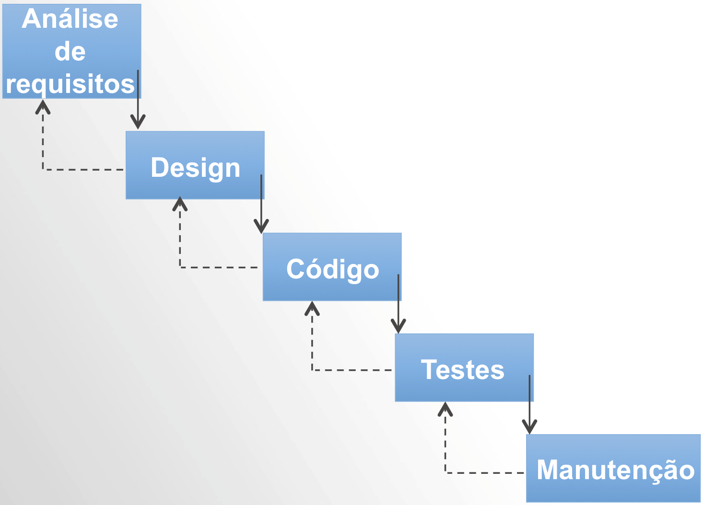
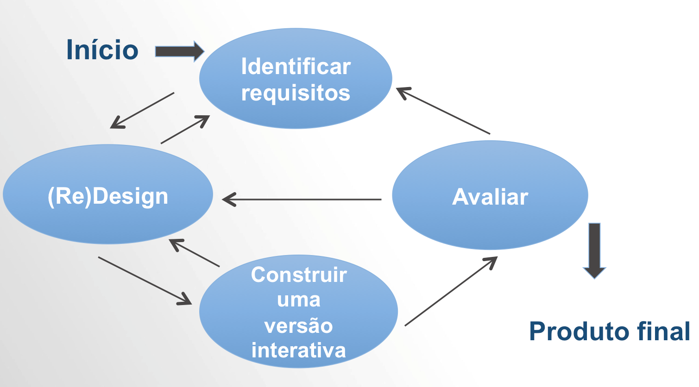

# Modelos de Prototipação

Entre as estratégias mais comuns relacionadas ao desenvolvimento de interfaces está a ideia de que a interface depende da compreensão dos requisitos do cliente e é desenvolvida por meio de protótipos ao longo do ciclo de vida do desenvolvimento. Vamos conhecer os significados desses conceitos.

- Protótipo é uma aplicação ou sistema em fase de testes.
- Ciclo de vida é o conjunto de etapas para o desenvolvimento da aplicação desde o levantamento das necessidades do usuário até a entrega do produto e mesmo após a entrega o ciclo pode continuar enquanto o desenvolvedor estiver trabalhando no sistema.
- Requisitos é o conjunto de necessidades do usuário em relação ao sistema. Requisitos podem ser funcionais (essenciais para o funcionamento do sistema) e não funcionais (não essenciais).

Exemplo: um processador de texto deve admitir diferentes formatações (requisito funcional) e deve rodar em PCs e Macs (requisito não funcional).

Como já vimos e é bom repetir, Usabilidade de um sistema é a capacidade de um sistema interativo de software de oferecer a seus usuários, em um contexto específico de operação, a realização de tarefas que ele deseja realizar, de maneira eficaz, eficiente e agradável.

Portanto, Usabilidade está relacionada à facilidade de aprendizado; facilidade de memorização; eficiência; segurança no uso; satisfação do usuário.

> Em projetos de IHC o importante sempre é envolver ao máximo o usuário.

É preciso saber quem são os usuários e quais as suas necessidades, isso forma a base dos requisitos e do desenvolvimento do sistema.

O modelo clássico de desenvolvimento de sistemas de informação pode ser representado na figura a seguir. Nessa representação já se conhece quais são as necessidades do usuário e existe certa linearidade entre o que ele necessita e o fluxo de desenvolvimento (ciclo de vida).

Modelo em cascata comum na área de engenharia de software. Quando se desenvolve uma nova interface, este modelo não é adequado porque raramente o cliente externaliza todas as suas necessidades em relação à nova interface.

Em lugar do modelo clássico em cascata da engenharia de software, necessitamos de modelos que apoiem a extração de requisitos e que aproximem o desenvolvedor do futuro usuário.

## Estratégias de Prototipação

Podemos sintetizar que as quatro atividades básicas do desenvolvimento do design de interação incluem:

- Identificar necessidades e requisitos do usuário.
- Desenvolver designs alternativos.
- Construir versões interativas dos designs.
- Avaliar designs.

Vamos a uma breve descrição sobre cada uma destas quatro atividades:

1) Identificar necessidades e requisitos do usuário

É preciso saber quem são os usuários e quais as suas necessidades, isso forma a base dos requisitos e do desenvolvimento do sistema. O problema é que quando se trata de interfaces, muitas necessidades não são facilmente comunicáveis. Pense, por exemplo, em consultar uma pessoa com deficiência física sobre o que ela precisa exatamente para conseguir operar um computador ou dirigir um automóvel. As especificidades podem complicar muito a obtenção de requisitos.

2) Desenvolver designs alternativos

Diversas ideias devem convergir para atender aos requisitos (necessidades dos usuários). Essa atividade se desdobra em duas outras atividades: o modelo conceitual e o modelo físico do sistema. O modelo conceitual descreve o que o produto deveria ser. Já o modelo físico inclui cores, menus, ícones…

Alternativas são consideradas a cada nova versão do protótipo e o cliente envolve-se com o desenvolvimento da interface indicando o que satisfaz as suas necessidades e o que não satisfaz.

3) Construir versões interativas dos designs

Diferentes protótipos são apresentados aos usuários futuros - protótipos podem ser em papel ou apenas as telas do sistema, sem a implementação (codificação).

Isso inclui avaliar a usabilidade do sistema em uma variedade de critérios: adequação aos requisitos, número de erros detectados e outros quesitos de qualidade que permitam ao sistema atender as expectativas dos usuários.

4) Avaliar designs

Inclui avaliar a usabilidade do sistema em uma variedade de critérios: adequação aos requisitos, número de erros detectados e outros quesitos de qualidade que permitam ao sistema atender as expectativas dos usuários. Lembre-se sempre que o desenvolvimento de interfaces em projetos de IHC devem ser centrados no usuário.

A figura abaixo representa o processo de desenvolver a interface por meio de prototipação. Ciclos contínuos de avaliação do protótipo levam a um produto que se aproxima da satisfação das reais necessidades do usuário.

Cliente participa do ciclo de desenvolvimento avaliando cada nova versão do protótipo da interface até se chegar a um produto.

## Design Thinking

Desenvolvimento de soluções estéticas com novas funcionalidades, novas experiências, valor, e principalmente, significado para os consumidores.

Para isso, o processo de inovação envolve o consumidor obtendo suas impressões sobre produtos, serviços e processos, decifrando em conjunto os “futuros desejados”, na forma de soluções.

O método utiliza-se de prototipagens dos conceito gerados e testes com o usuário final, mesmo em fases prematuras de desenvolvimento. Os protótipos evoluem até que algo se torne viável.
