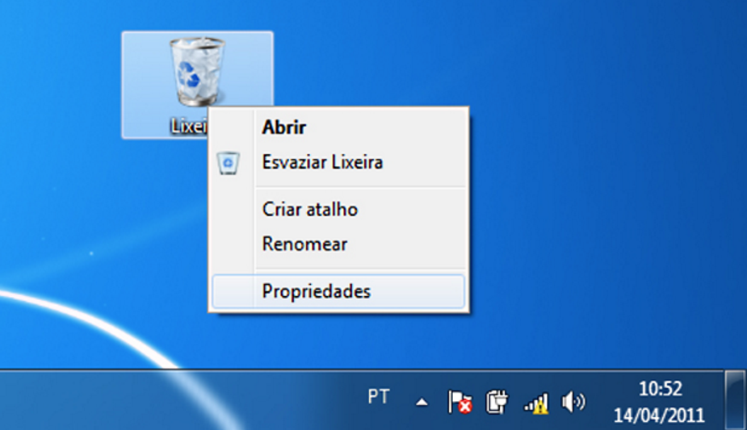
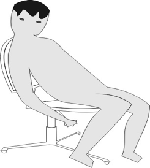

# Princípios de Design de Interfaces

## Princípio da Familiaridade com o usuário

A ideia aqui é lembrar sempre que os usuários não devem ser forçados a se adaptar a uma interface. Em lugar disso, a interface sim é que deve se adaptar ao usuário, por exemplo, utilizando termos familiares ao usuário nas mensagens que o usuário recebe.

Além disso, as camadas mais técnicas da implementação básica da interface, quando envolvem arquivos  e estrutura de dados, devem estar completamente ocultas do usuário final.

Dito de outro modo, a interface deve respeitar aquilo que o usuário já tem de experiência e não forçá-lo a aprender algo que poderia ser feito de forma mais “intuitiva”.   Este princípio é sempre muito presente em sistemas mais populares. Um exemplo é o ato de descartar arquivos usando a lixeira.

O ato de jogar papel na lixeira é uma boa metáfora para o descarte de arquivos digitais.

O movimento de arrastar documentos até a lixeira para apagar arquivos é exemplo de aplicação do princípio da experiência do usuário. Assim, o ícone da lixeira ter a aparência de uma lixeira não tem nada “por acaso

## Princípio da Consistência

Comandos e menus do sistema devem ter o mesmo formato entre sistemas diferentes que realizam funções parecidas, isto é, os parâmetros devem ser fornecidos da mesma maneira.

Pense em como este princípio torna as interfaces mais fáceis de aprender, afinal, um conhecimento adquirido em uma parte do sistema vale em outras partes ou até entre sistemas diferentes. Observe na figura abaixo como os menus de ferramentas diferentes de um mesmo conjunto (pacote Office, que inclui processador de texto Word e ferramenta de apresentação Power Point, entre outras) tem muitas funcionalidades idênticas, por isso os menus são praticamente iguais, facilitando o aprendizado por parte do usuário.

As ferramentas do MS-Office tem muitos pontos em comum. Se você sabe como abrir e gravar um arquivo ou imprimir um documento no Word, você sabe fazer também no Power Point pois o processo é basicamente o mesmo.

## Princípio do Mínimo de surpresa

A ideia aqui é que à medida que um sistema é utilizado, os usuários constroem um modelo mental de como o sistema trabalha e esperam que esse modelo sempre funcione da mesma forma.

Pense em sua própria experiência: você não fica irritado(a) quando o sistema se comporta de maneira inesperada, por exemplo, quando o computador trava?

Se uma ação em um contexto gerar um efeito, em outro contexto a mesma ação deve causar efeito semelhante, do contrário a “surpresa” torna-se ruim.

Pense, por exemplo, em um botão de aumentar o tamanho da letra em um editor de textos. Para esse efeito poderia ser apresentada uma lupa na tela que, ao ser clicada, faria com que a fonte de letras aumentasse. Agora, se em uma nova versão do programa ou sistema, a lupa significar a busca de uma palavra em um texto maior, isso certamente irá gerar surpresa e consequente irritação, sobretudo por parte dos usuários da antiga versão.

## Princípio da Facilidade de recuperação

O projeto da interface deve minimizar os erros que os usuários cometem, embora a eliminação completa de erros seja impossível.

Interfaces devem conter recursos que permitam aos usuários a recuperação a partir dos erros cometidos. Dito de outro modo, se algo der errado na operação do sistema, o usuário deve ser capaz de voltar atrás e desfazer o que deu errado. Pense, por exemplo, que esteja inserindo uma figura em um texto. Se você inserir a figura na posição errada ou inserir a figura errada, você deve ser capaz de desfazer tudo o que foi feito, com um mínimo de perda de trabalho e esforço até ali.

## Princípio da Orientação do usuário

O sistema deve ter recursos de ajuda e recursos de assistência ao usuário.

Os recursos devem conter diferentes níveis de ajuda e orientação, mas sem exageros, pois se houver excesso de explicações, isso poderá dar a impressão aos usuários novatos de que o sistema é muito difícil de operar. Mais adiante neste curso, teremos uma discussão à parte sobre projetos de sistemas de ajuda, o fato é que alguma forma de sistema de ajuda deve sempre existir. Não é nada bom achar que os usuários já sabem algo importante ou que eles são capazes de “se virar” em qualquer situação.

## Princípio da Diversidade de usuários

O projeto da interface deve considerar usuários ocasionais ou frequentes, e também usuários técnicos e não técnicos, usuários mais lentos e mais velozes, mais velhos e mais novos, mais ou menos instruídos, que demandam mais e que demandam menos orientação.

O projeto de interface deve, inevitavelmente, fazer algumas conciliações, dependendo dos usuários reais do sistema. Esse princípio será retomado mais adiante também quando trataremos de usuários com dificuldades especiais no escopo de tecnologias assistivas.

## Conceito de Ergonomia

Muitas pessoas consideram ergonomia quase sinônimo de estudo de IHC, afinal de contas, ergonomia é definida como:

> Ergonomia ( do Grego ergon, trabalho + nomos, lei)
É o conjunto de conhecimentos científicos relativos ao homem e necessários à concepção de instrumentos, máquinas e dispositivos que possam ser utilizados com o máximo de conforto e eficácia (Wisner - 1972). A ergonomia tem por objetivo adaptar o trabalho ao homem, bem como melhorar as condições de trabalho e as relações homem-máquina. A [Ergonomia](http://www.areaseg.com/ergonomia/ergonomia.html)  pode ser construtiva, corretiva e cognitiva.

Encontramos abaixo uma descrição de ergonomia relacionada à regulagem de uma cadeira de escritório. Note como ajustar a altura da cadeira tem papel importante sobre a produtividade e saúde dos usuários.

Uma forma mais adequada de regulagem da sua cadeira é quando você consegue adequar os seus cotovelos na mesma altura do tampo da mesa. Caso os pés fiquem suspensos, é importante colocar um apoio. Ajuste a altura do ponto lombar da cadeira de uma forma que não force nenhum ponto da coluna ao se sentar. Quando estiver digitando, usando o mouse ou mesmo lendo, ajuste sua cadeira de forma que seu tronco e suas coxas formem um ângulo de aproximadamente 100 a 110 graus, conforme a imagem. Vale lembrar que sua coluna deve ficar reta em relação à mesa e ao monitor de vídeo.

Artigo: [Saiba como ajustar corretamente sua cadeira e adequar a postura](https://www.fiepr.org.br/nossosistema/News12480content177091.shtml)

