# Visualização de Informações e Cores

Representar informações de forma gráfica exige um domínio de linguagem visual que não é imediato dominar. Nesta aula iremos estudar alguns exemplos de representação de informações e de como isso pode influenciar a percepção do usuário em relação às informações. Benyon (2011) faz uma interessante introdução ao assunto: segundo ele, ao desenvolver um esquema de design de informação em um determinado contexto, designers devem entender que estão desenvolvendo “linguagens visuais”. Os designers irão utilizar cores, formas e layouts com significados para que as pessoas possam entender rapidamente. O design de informações é uma disciplina de design.

## Apresentação de Informações

A apresentação de informações é cada vez mais importante na medida em que temos um volume imenso de novas informações cuja totalidade é impossível acessar.

Repare na figura abaixo, que contém uma representação da transformação de dados brutos para informações de interesse gerencial.

Com desenhos em formas simples e cores, o fluxo transmite a ideia de que informações úteis são originadas a partir da organização e seleção de dados brutos. Robbins (2005).

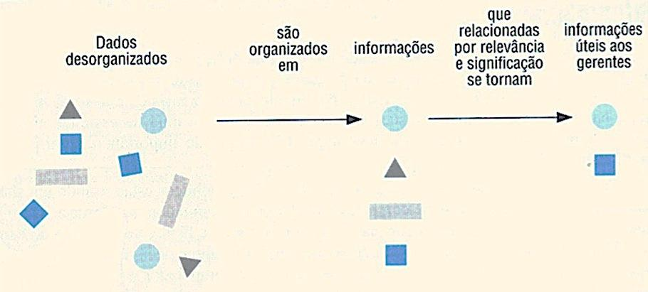

As figuras abaixo representam as mesmas informações de forma diferente. Ambas apresentam dados de clientes: cidade, hotel, código de área, telefone, valores de diária para solteiros e casais.

A figura da esquerda apresenta os dados misturados, o que dificulta a visualização, enquanto a figura da direita mostra os dados organizados o que possibilita fácil entendimento e localização de informações.

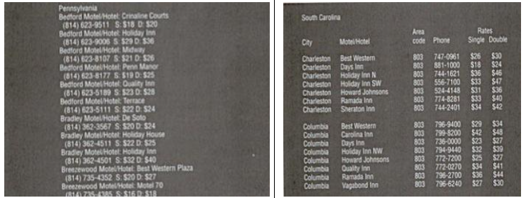

Softwares de apresentação são voltados exatamente para facilitar a apresentação de informações. No caso da ferramenta PowerPoint, existem diferentes formas de visualização como funcionalidade da própria ferramenta, o que visa facilitar a elaboração de apresentações por parte do usuário, conforme figura abaixo.

Diferentes formas de visualização facilitam o trabalho de edição de apresentações em ferramentas como o Power Point. A figura na parte superior facilita a checagem da sequência e troca de ordem de apresentação dos slides, por exemplo. Na parte inferior, a visualização para edição de um único slide.

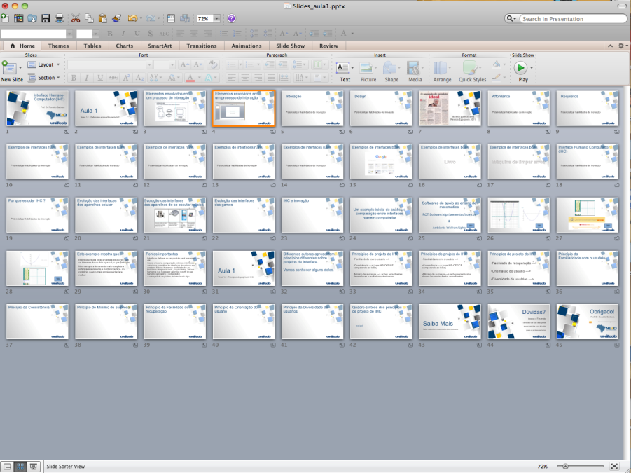

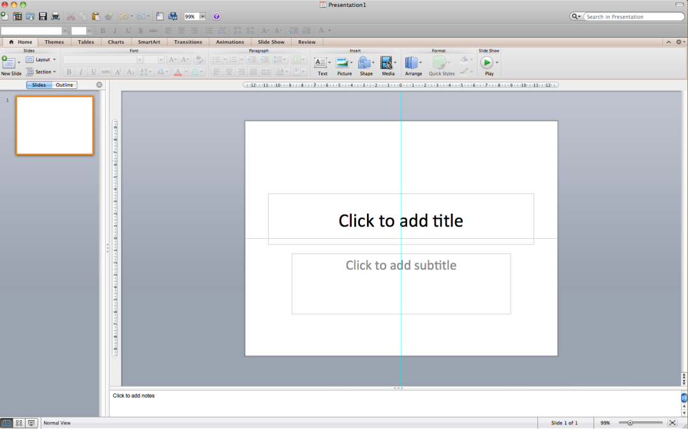

Apresentadas de forma diferente, a mesma informação pode levar a discussão de resultados completamente diferentes. As figuras abaixo apresentam os mesmos pontos, embora as ligações entre esses pontos apresentem outras redes.

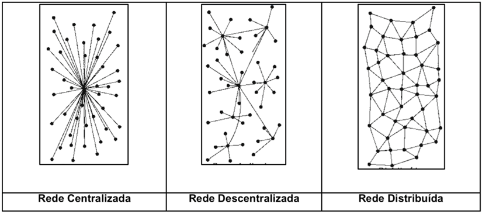

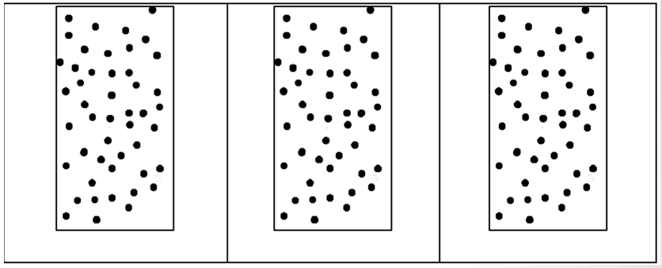

## Significado das Cores na Comunicação

Uma das ideias mais importantes sobre o estudo das cores, é que elas transmitem informações por si mesmas.

Por esse motivo, a escolha correta de cores é um dos passos fundamentais para acertar a interface.

Na tela do computador as cores são combinações de três tipos básicos: verde, vermelho e azul,  conforme a figura a seguir.

Combinação de vermelho, azul e verde possibilita obtenção de outras cores.

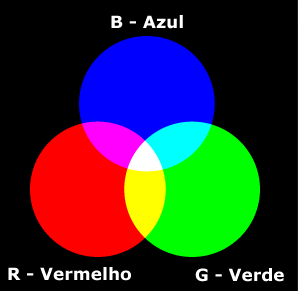

Todas as cores na tela do computador resultam da combinação desses três componentes de cores.

As cores na tela do computador são combinações dos componentes básicos: verde, azul e vermelho com intensidades individuais codificadas que variam de 0 a 255. Ferramentas de programação permitem a escolha de cores segundo caixas de diálogo como a apresentada à direita. Repare que o tom de verde obtido resulta da mistura de vermelho 25 com verde 178 e azul 115.

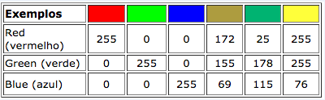

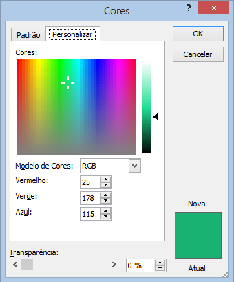

As marcas de produtos exploram muito bem o significado das cores. Isso também pode ser considerado relevante em projetos de uma nova interface.

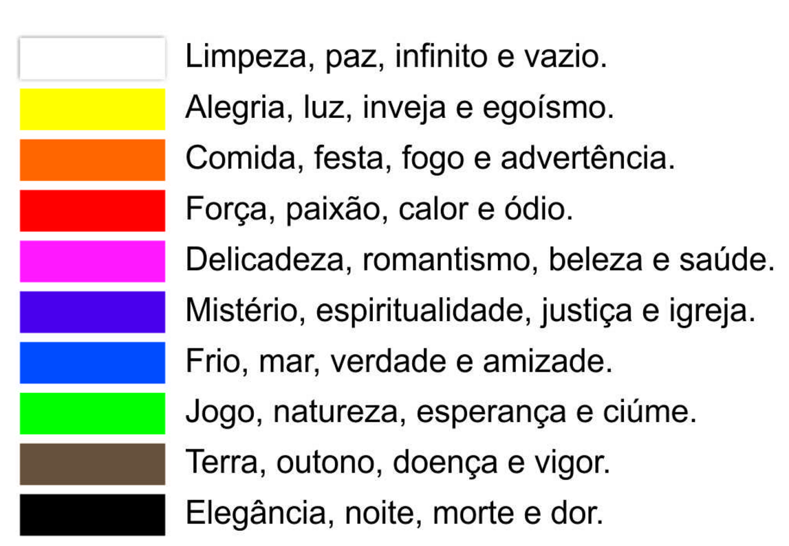

A figura abaixo mostra como as marcas se apropriam das cores em seus logotipos.

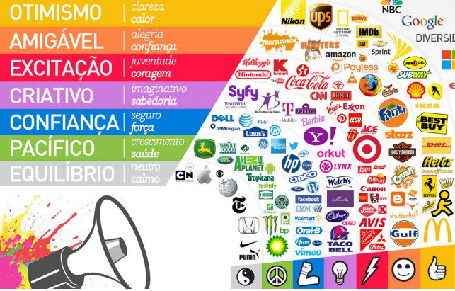

## Botões

O formato de botões em uma ferramenta de desenvolvimento já traz consigo uma ideia do tipo de aplicação com a qual ela estará associada.

Os botões básicos comuns a quase todas as ferramentas de programação visual servem para o usuário selecionar uma opção (escolher uma impressora, por exemplo) ou disparar um evento (enviar um documento para a impressora). 

Na figura abaixo são apresentados os formatos tradicionais de botões presentes na maior parte das ferramentas de programação. Ao criar a interface do sistema, escolhas adequadas deverão ser feitas em termos de quais botões se ajustam a cada situação, qual a cor, tamanho e posição dos botões.

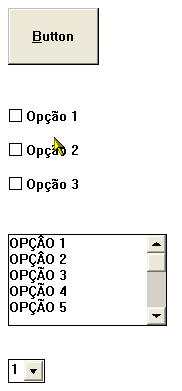

A possibilidade de programar botões com diferentes formatos, está presente em praticamente todas as ferramentas de desenvolvimento. Escolhas equivocadas de tamanho, cor ou posição de botões podem aumentar as chances de erro do usuário.

A escolha do formato de botão conforme figura abaixo configura um grave erro de interface porque  a chance do usuário errar a digitação aumentará na medida em que terá que clicar muitas vezes até completar o número de seu CPF.

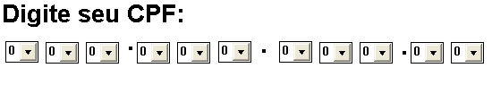

Botões com aparência menos tradicional podem deixar a interface mais interessante, conforme a figura abaixo.

Botões disponíveis na ferramenta de programação Multimedia Toolbook, da SumTotal.

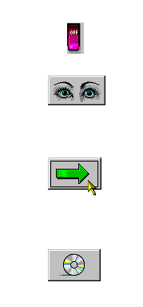

Outro exemplo de como botões interferem na usabilidade é mostrado na figura abaixo. O que parecem ser botões na verdade são apenas rótulos (“Assinante” e "Contato”). O usuário provavelmente iria se confundir com esta interface.

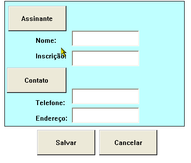

Assinante e Contato não são botões mas foram representados em retângulos como botões. Isso certamente iria confundir os usuários.

## Tipografia

Algumas recomendações gerais sobre tipografia:

- Não use fontes muito pequenas e faça com que o texto fique imóvel (não mover, piscar ou dar zoom).
- Se puder escolher entre espaço ou fio espesso para separar dois segmentos de texto, escolha espaço em branco que deixa a página mais clara e acelere o download.
- O texto sempre que possível deve ser justificado à esquerda.
- EVITAR O USO DE MAIÚSCULAS PARA TEXTO. OS USUÁRIOS LÊEM TEXTO COMO ESTE PARÁGRAFO CERCA DE 10% MAIS DEVAGAR, POIS É MAIS DIFÍCIL PARA O OLHO RECONHECER A FORMA DAS PALAVRAS E OS CARACTERES NA APARÊNCIA MAIS UNIFORME E DE BLOCO.

Abaixo são apresentadas diferentes versões da palavra Google.

Repare como o formato das letras tem forte aderência com o tipo de homenagem que o Google queria transmitir naquela data.

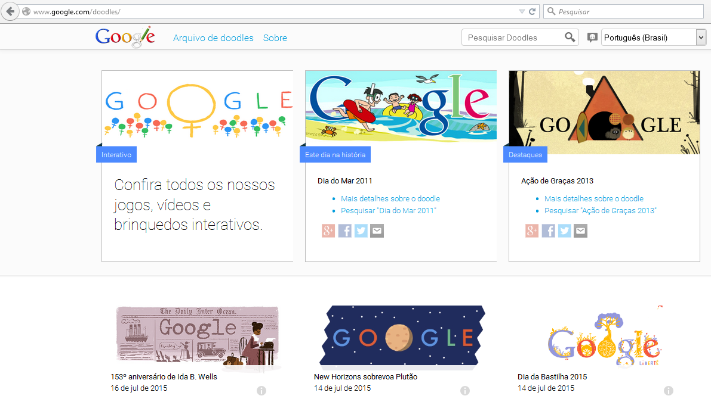

### Pontos gerais a destacar

- É muito importante destacar a informação mais importante e ao mesmo tempo evitar o excesso de informação na interface (seja em cor, som e gráficos).
- Seja tão simples quanto possível.
- Ferramentas simples de animação podem apoiar o desenvolvimento de interfaces mas devem ser usadas com cautela para não distrair o usuário.
- Cores transmitem informação por si mesmas.
