# Ferramentas para organização da informação

A arquitetura da informação é a categorização da informação em uma estrutura coerente, aquela que a maioria das pessoas possa compreender rapidamente.

Geralmente a arquitetura da informação é organizada de forma hierárquica, mas pode ter outras estruturas, como concêntrica ou até mesmo caótica.

No contexto do projeto de sistemas de informação, a arquitetura da informação refere-se à análise e ao design dos dados armazenados pelos sistemas de informação, concentrando sua atenção sobre as entidades, seus atributos e relacionamentos.

A figura abaixo representa uma interface em que as informações mais importantes que o computador provê estão apresentadas ao mesmo tempo na tela. Note que há uma única janela.

Tela do sistema Star da Xerox (1981), na filosofia do WYSIWYG (WHAT YOU SEE IS WHAT YOU GET), integrava gráficos, textos e outros recursos. Copiado depois pela Apple e Microsoft. A ideia era fazer o computador ficar invisível ao usuário.

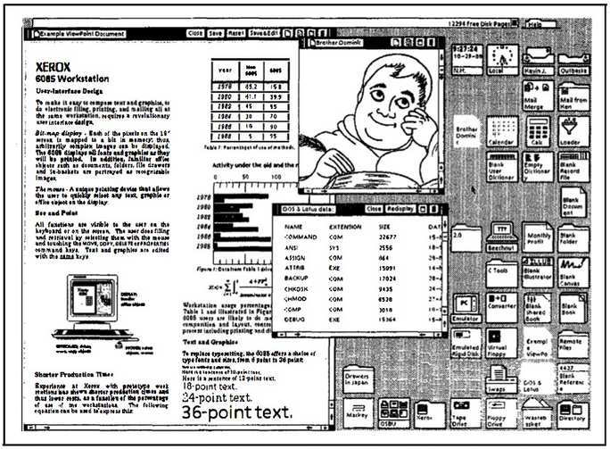

## Diferentes interfaces de organização da informação

Os mapas de navegação orientam como as pessoas se movimentam pelo site ou pelo sistema. O objetivo é facilitar a experiência que as pessoas terão com o sistema. Uma navegação simplificada auxilia todos os usuários, mas para algumas pessoas isso é determinante.

Pessoas que têm dificuldade em visualizar uma estrutura de informação serão ajudadas se o designer do sistema produzir tal visualização na forma de um mapa de navegação; iria ainda mais longe se o navegador atualizasse o display do mapa com o caminho da navegação e a localização da página corrente.

Existem formas mais simples ou mais simplificadas de representar informações.

Veja nas figuras abaixo a interface de entrada de um website e na figura de baixo uma referência ao "mapa do site".

Website Corredor das Onças

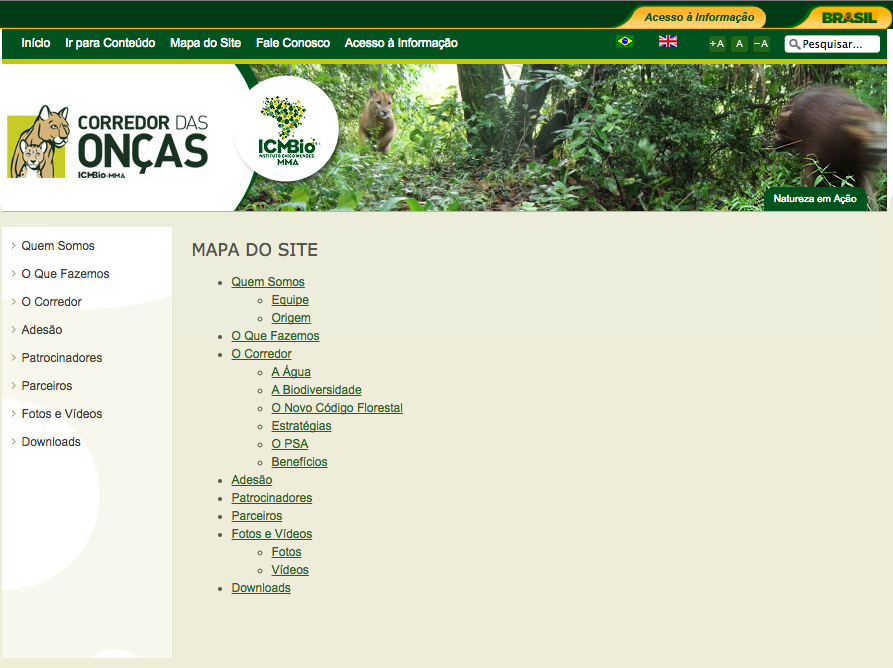

Na figura abaixo está representada uma interface em que o mapa do site é a própria interface. São apresentadas as linguagens de programação e suas relações. Vale muito a pena conferir!

Exploring Data: Languages Network

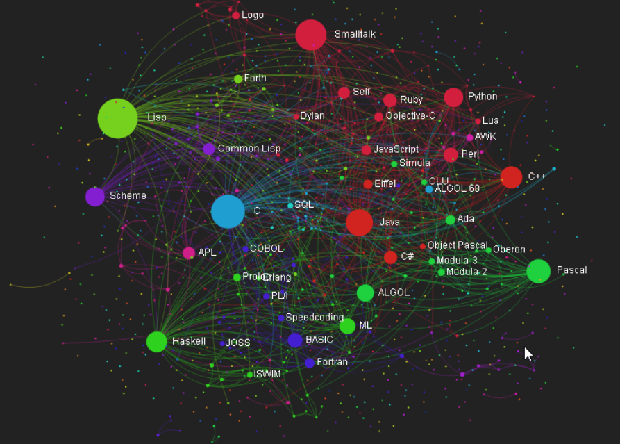

Podemos organizar informação sem usar o computador. Veja na figura abaixo um painel com papéis colantes (post-its) que mostram uma hierarquia de informações, talvez para planejar a implementação de um sistema no computador.

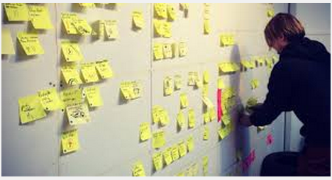

Nas figuras abaixo são representadas estruturas hierárquicas em diferentes formatos.

Representações hierárquicas de blocos de informações

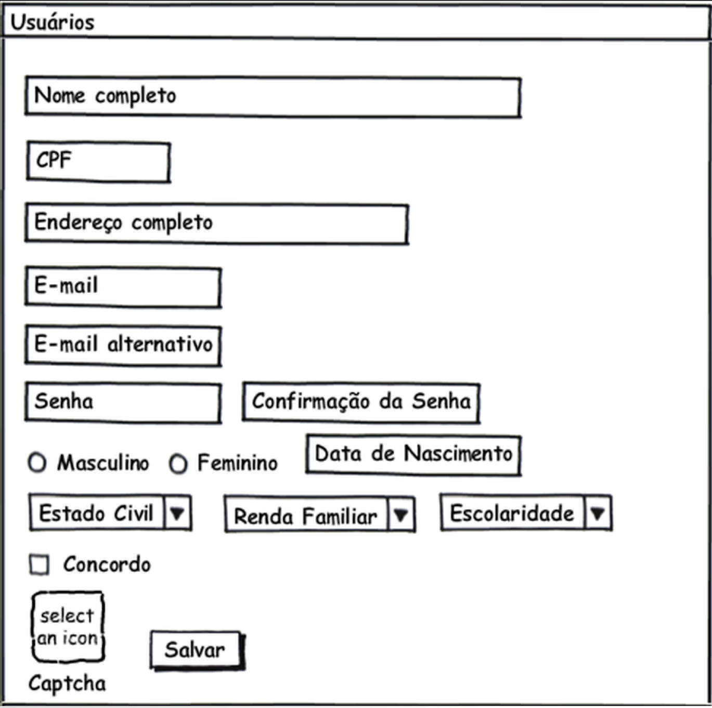

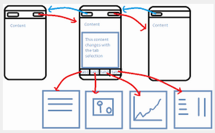

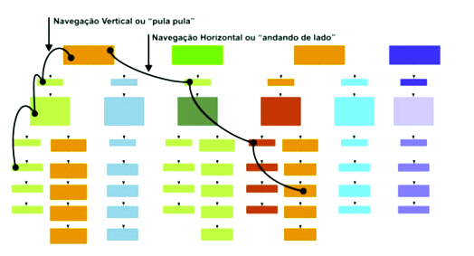

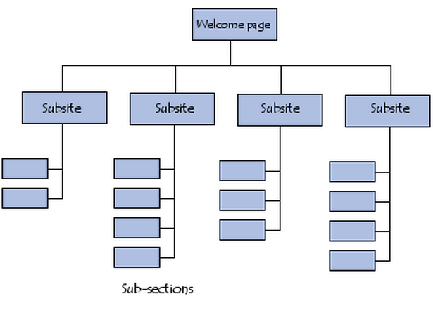

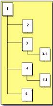

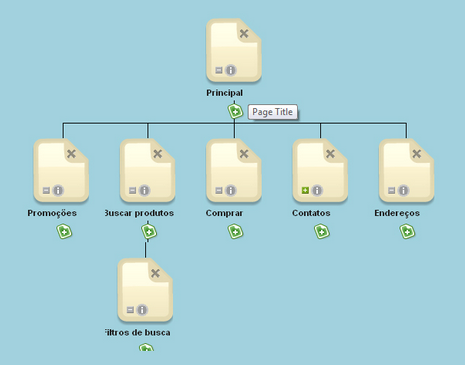

## Ferramentas de organização de informação e linguagens de programação

Algumas ferramentas que representam a forma como podemos pensar sobre algum assunto são muito interessantes também para serem analisadas do ponto de vista da interface.

Veja abaixo uma figura da interface da ferramenta X-Mind. Vale muito a pena baixar e instalar o sistema para compreender melhor tudo o que estamos discutindo.

Ferramenta X-Mind

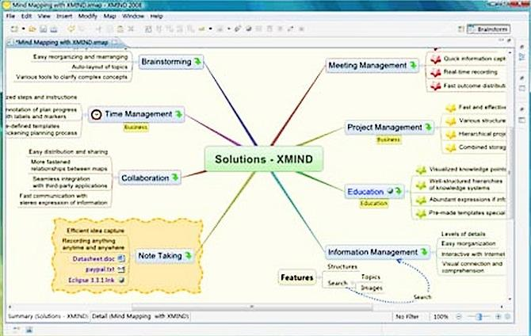

A ferramenta SmartDraw representa muito bem qualquer fluxo de informação, representada na figura abaixo.

Ferramenta SmarDraw

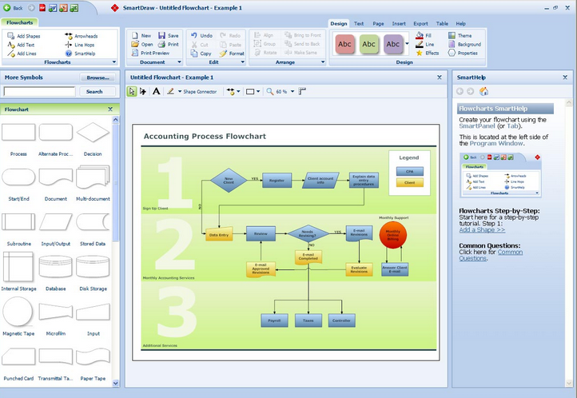

Ferramentas de programação de computadores e construção de aplicativos ou sistemas são também ferramentas de construção de interfaces, na verdade, as mais poderosas.

Algumas linguagens de programação são mais próximas do controle de interfaces, normalmente aquelas linguagens voltadas para o desenvolvimento de jogos (mais controle sobre recursos gráficos) ou websites interativos. Observe a figura abaixo que representa uma linguagem de programação voltada à realidade virtual: Linguagem de Programação VRML escrita com um editor de códigos que admite diferentes linguagens de programação, o editor NotePad ++. Importante baixar e instalar em seu computador desde já!

À esquerda aparece o código da linguagem VRML e à direita o resultado da programação em VRML.

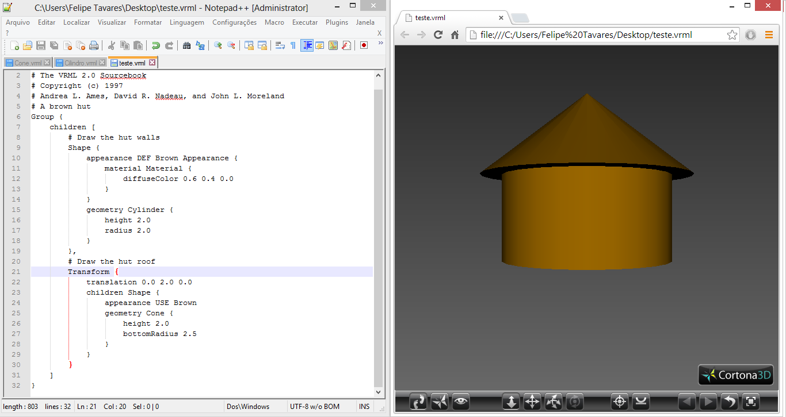

## Ferramentas para criação de websites

A criação de um website é um exemplo do processo de criação de uma interface.

A ideia mais antiga e geral é de que deve haver um menu e uma área principal, assim como representado na figura abaixo.

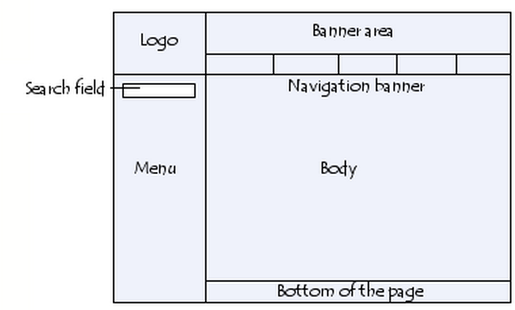

A edição detalhada da interface permite todo tipo de organização da informação e de solução. Por isso, ferramentas que editam código são as mais poderosas.
O problema é que exigem grande domínio de programação em linguagens como HTML e JAVASCRIPT.

Uma das inúmeras ferramentas voltadas para criação de interfaces a partir de código (ou editores de código) é a ferramenta AMAYA, gratuita.

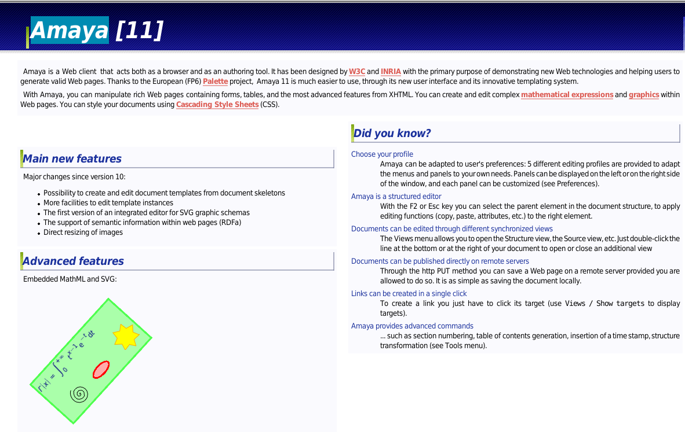

Entretanto, existem ferramentas geradoras de websites que já oferecem layouts interessantes para produção de interfaces. Evidentemente são modelos prontos que podem não atender demandas mais complexas e sofisticadas.

Um exemplo de ferramenta bastante popular é a WIX, representada na figura abaixo.

Ferramenta geradora automática de websites. Aproveite para experimentar essa ferramenta!

### Alguns pontos importantes a salientar:

* Uma das áreas-chave do design e de interfaces é a organização da informação.
* Lápis e papel são ferramentas importantes para o design, mas existem ferramentas que facilitam o trabalho tanto na organização da informação, seja na hierarquia, no  mapa de navegação, na combinação de ambos, etc.
* Ferramentas automáticas facilitam a criação de websites, algumas oferecem designs prontos.
* Ferramentas de edição de códigos são as mais poderosas e desafiadoras na área de desenvolvimento de interfaces.

